# Pipeline PRD → Backlog → Jira
## Flujo de Trabajo Spec-Driven

---

## 1. Visión General del Pipeline

Tres comandos agente transforman una idea de producto en tickets de Jira listos para desarrollo. Cada comando produce artefactos que el siguiente consume, asegurando trazabilidad y consistencia.

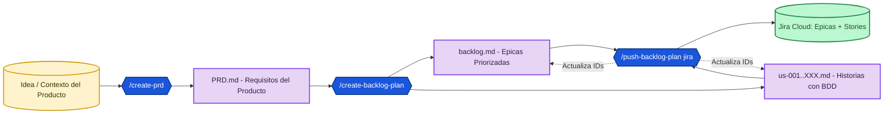

---

## 2. Roles y Agentes

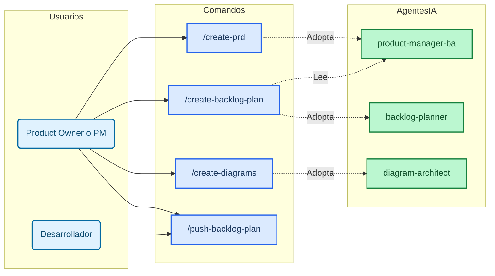

---

## 3. Mapa de Artefactos y Dependencias

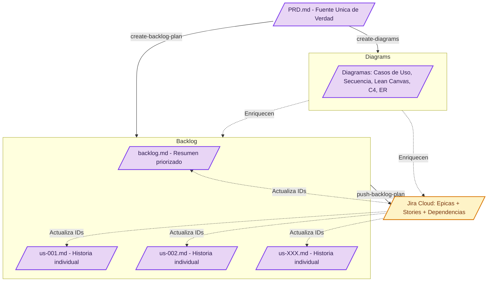

---

## 4. Flujo Detallado por Comando

### 4.1 `/create-prd` — De la Idea al Documento


**Entrada**: Archivo con descripción del producto, objetivos y usuarios.
**Agente**: `product-manager-ba.md`
**Salida**: `ai-specs/specs/PRD.md`
**Idioma**: Español

**Secciones del PRD:**
- Executive Summary & Problem Statement
- Product Vision & Business Objectives
- Target Users & Personas
- Use Cases & User Stories
- Key Features & Functional Requirements
- Data Model & Entity Relationships
- System Architecture (High-Level)
- API Specification
- Non-Functional Requirements
- UX/UI Guidelines
- Risks & Assumptions
- Glossary

---

### 4.2 `/create-backlog-plan` — Del PRD al Backlog

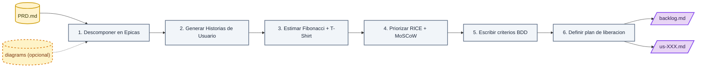

**Entrada**: `PRD.md` (obligatorio) + `diagrams/*.md` (opcional)
**Agente**: `backlog-planner.md`
**Salida**: `backlog/backlog.md` + `backlog/us-XXX.md`

**Cada Historia de Usuario incluye:**

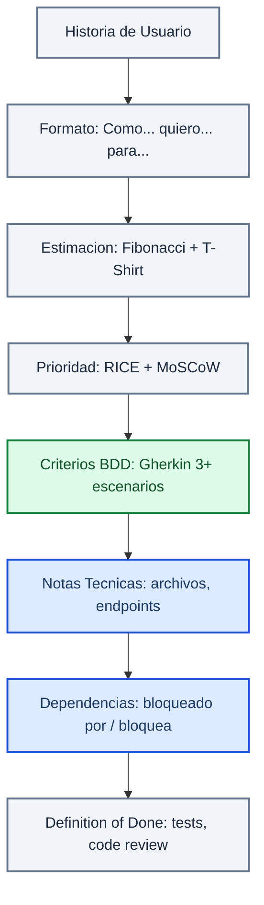

---

## 5. Metodologias de Estimacion y Priorizacion

Cada Historia de Usuario se estima y prioriza usando tres metodologias complementarias que trabajan en conjunto:

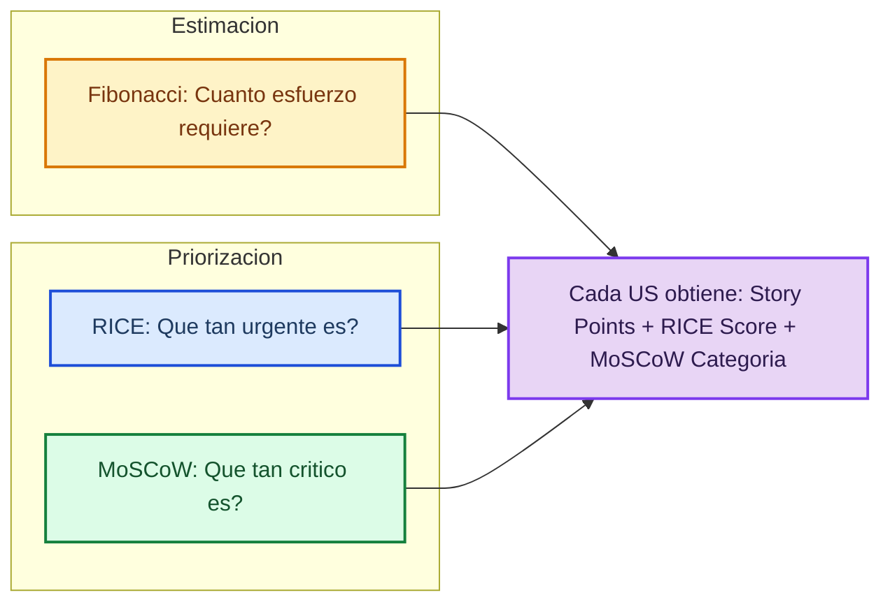

### 5.1 Fibonacci — Estimacion de Esfuerzo

La secuencia de Fibonacci (1, 2, 3, 5, 8, 13, 21) se usa para asignar Story Points a cada historia. La secuencia fuerza al equipo a tomar decisiones: la diferencia entre 1 y 2 es pequena, pero entre 13 y 21 es grande. Esto evita analisis de precision falsa.


**Reglas de la estimacion Fibonacci:**

| Puntos | Significado | Ejemplo | Accion si se asigna |
|---|---|---|---|
| 1 | Ajuste trivial: cambiar texto, color | Cambiar label de un boton | Adelante |
| 2 | Tarea simple: un archivo, sin riesgo | Agregar campo a un formulario existente | Adelante |
| 3 | Tarea media: 2-3 archivos, riesgo bajo | Nuevo endpoint GET simple | Adelante |
| 5 | Historia mediana: nuevo componente o servicio | CRUD completo de una entidad pequena | Adelante |
| 8 | Historia compleja: multiples componentes | Filtro recursivo en arbol jerarquico | Considerar dividir |
| 13 | Historia muy grande: riesgo alto | Integracion con API externa compleja | Debe dividirse en 2+ historias |
| 21 | Demasiado grande: epica, no historia | Modulo completo de autenticacion | Dividir obligatoriamente |

**Analogia para la demo:** Asi como en la naturaleza las caracolas siguen la secuencia Fibonacci para crecer, nosotros la usamos para que el equipo no finja tener una precision que no tiene. No sabemos si una historia es "exactamente 4" o "exactamente 6", pero si sabemos si es "mas como un 3" o "mas como un 8". La brecha entre numeros se agranda intencionalmente para aceptar la incertidumbre.

### 5.2 RICE — Priorizacion por Impacto

RICE es un sistema de scoring que asigna un numero a cada historia. Mientras mas alto el score, mas prioritaria es la historia. Se calcula como:

```
RICE Score = (Reach x Impact x Confidence) / Effort
```

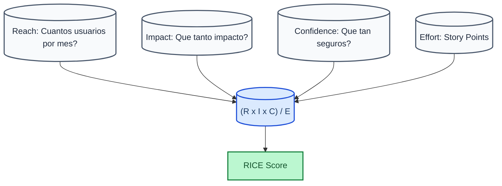

**Desglose de cada componente:**

| Componente | Que mide | Escala | Como se asigna |
|---|---|---|---|
| **Reach** | Cuantos usuarios impacta en un periodo | Numero de usuarios/mes | 1 = muy pocos, 10 = algunos, 100 = muchos, 1000 = todos |
| **Impact** | Que tan profundo es el impacto | 0.25x a 3x | 0.25 = minimo, 0.5 = bajo, 1 = medio, 2 = alto, 3 = masivo |
| **Confidence** | Que tan seguros estamos de las cifras | Porcentaje (20% a 100%) | 20% = suposicion, 50% = estimacion con datos parciales, 80% = datos solidos, 100% = dato comprobado |
| **Effort** | Cuanto esfuerzo requiere | Story Points (Fibonacci) | Mismo valor de la estimacion Fibonacci |

**Ejemplo practico:**

| Historia | Reach | Impact | Confidence | Effort | RICE Score | Orden |
|---|---|---|---|---|---|---|
| Filtro por columna | 500 | 2x | 80% | 5 | (500x2x0.8)/5 = 160 | 1ro |
| Badge de restricciones | 300 | 1x | 50% | 3 | (300x1x0.5)/3 = 50 | 2do |
| Expandir todo | 100 | 0.5x | 50% | 1 | (100x0.5x0.5)/1 = 25 | 3ro |
| Carga masiva Excel | 50 | 3x | 20% | 13 | (50x3x0.2)/13 = 2.3 | 4to |

### 5.3 MoSCoW — Categorizacion de Prioridad

MoSCoW clasifica cada historia en cuatro categorias. Se usa como filtro final despues de RICE para definir que entra en cada fase de liberacion.


| Categoria | Significado | Sin esto... | Que entra | Mapeo a Jira |
|---|---|---|---|---|
| **Must Have** | Esencial para el lanzamiento. Sin esto el producto no tiene sentido. | El producto falla o no se puede lanzar | Funcionalidad core, flujos criticos, bugs bloqueantes | Highest Priority |
| **Should Have** | Importante pero se puede lanzar sin esto. Se incluye si el tiempo lo permite. | El producto funciona pero pierde valor significativo | Mejoras importantes, features de retention | High Priority |
| **Could Have** | Deseable pero no necesario. Se incluye solo si sobra tiempo. | El producto funciona igual, solo pierde "cosas lindas" | Mejoras cosmeticas, features nice-to-have | Medium Priority |
| **Won't Have** | Explicitamente acordado que no se hara en esta version. | Nada, nunca se prometio | Features para futuras versiones, ideas descartadas | No se crea en Jira |

**Regla 60/20/20 para MVP:**
- **60%** Must Have (funcionalidad core del MVP)
- **20%** Should Have (mejoras importantes post-MVP inmediato)
- **20%** Could Have (deseables para versiones futuras)
- Won't Have queda fuera del calculo

### 5.4 Las Tres Metodologias en Conjunto

Las tres metodologias se aplican en secuencia durante `/create-backlog-plan`:

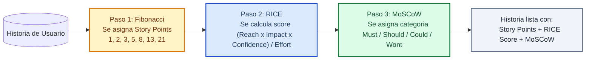

**Ejemplo completo de una historia priorizada:**

```
US-001: Filtrar arbol por columna

  Fibonacci: 5 puntos (historia mediana: nuevo algoritmo recursivo)
  RICE:      (500 x 2 x 0.8) / 5 = 160 (score mas alto del backlog)
  MoSCoW:    Must Have (sin filtros el arbol es inusable)
  Posicion:  #1 en el backlog priorizado
  Fase:      MVP
```

### 5.5 Mapeo a Jira

Cuando se ejecuta `/push-backlog-plan jira`, los valores se mapean directamente:

| Metodologia | Valor Local | Destino en Jira |
|---|---|---|
| Fibonacci | Story Points (ej: 5) | Campo `Story Points` en la Story |
| RICE | Score (ej: 160) | Se incluye en la descripcion ADF como referencia |
| MoSCoW | Must / Should / Could | Se mapea a Priority: Highest / High / Medium |

---

### 4.3 `/push-backlog-plan jira` — Del Backlog a Jira

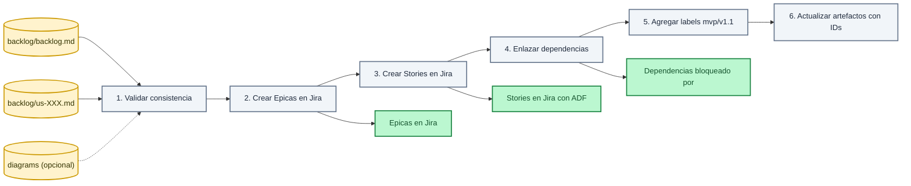

**Entrada**: `backlog/backlog.md` + `backlog/us-XXX.md` + `diagrams/*.md` (opcional)
**Salida**: Issues en Jira (Épicas + Stories con dependencias)
**Post-ejecución**: `backlog.md` y `us-XXX.md` se actualizan con los IDs de Jira

**Formato de descripción en Jira (ADF):**

| Campo | Valor | Notas |
|---|---|---|
| Issue Type | `Epic` para épicas, `Story` para US | Mapeo 1:1 |
| Summary | Título de la épica o historia | De `us-XXX.md` |
| Description | ADF JSON (nunca markdown plano) | Evita doble escape de `\n` |
| Story Points | Valor Fibonacci | De la estimación |
| Priority | Highest/High/Medium | Mapeo de MoSCoW |
| Epic Link | ID de la épica padre | Creada primero |
| Labels | `mvp`, `v1.1`, `v1.2` | Según plan de liberación |

---

## 6. Timeline del Pipeline

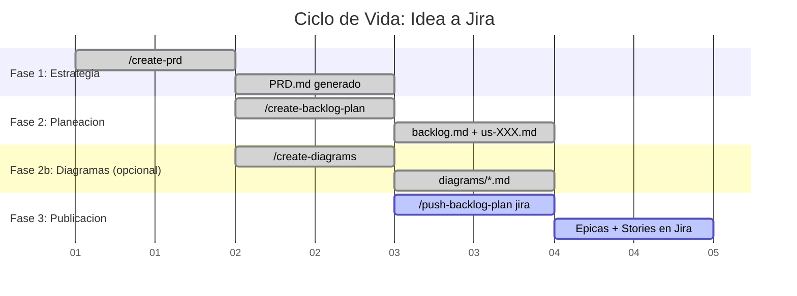

---

## 7. Reglas de Consistencia

| Componente | Regla |
|---|---|
| **Épicas** | Nombres y descripciones deben coincidir entre `backlog.md` y Jira |
| **Historias** | Cada `us-XXX.md` se mapea 1:1 con una Story en Jira |
| **Story Points** | El valor en el archivo local debe coincidir con Jira |
| **Prioridad** | MoSCoW a Jira Priority: Must=Highest, Should=High, Could=Medium |
| **Dependencias** | Relaciones "bloqueado por" en Jira reflejan el mapa en `backlog.md` |
| **Labels** | `mvp`, `v1.1`, `v1.2` según plan de liberación |
| **Post-sync** | `backlog.md` y `us-XXX.md` se actualizan automáticamente con IDs de Jira |

---

## 8. Beneficios del Flujo Spec-Driven

### 8.1 Tiempos

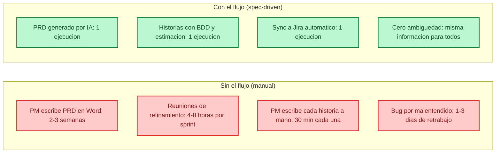

| Actividad | Sin el flujo | Con el flujo | Ahorro |
|---|---|---|---|
| Crear PRD | 2-3 semanas de ida y vuelta | 1 ejecucion del comando | ~15 dias |
| Refinar backlog para un sprint | 4-8 horas de reunion | 1 ejecucion del comando | ~6 horas |
| Escribir una historia de usuario | 30 min manual + correcciones | 0 min (se genera automaticamente) | 30 min por historia |
| Sincronizar backlog a Jira | 2-3 horas copiando y pegando | 1 ejecucion del comando | ~2.5 horas |
| Resolver ambiguedades en desarrollo | 1-3 dias de retrabajo | 0 (BDD elimina ambiguedad) | 1-3 dias |
| Total estimado por sprint de 2 semanas | 3-5 dias administrativos | 3 ejecuciones de comando (~10 min) | ~85% menos tiempo administrativo |

**Impacto en el equipo:** El PM recupera ~15 horas semanales que puede invertir en estrategia, investigacion de usuarios y alineacion con stakeholders. El desarrollador nunca se bloquea esperando aclaraciones.

### 8.2 Personal

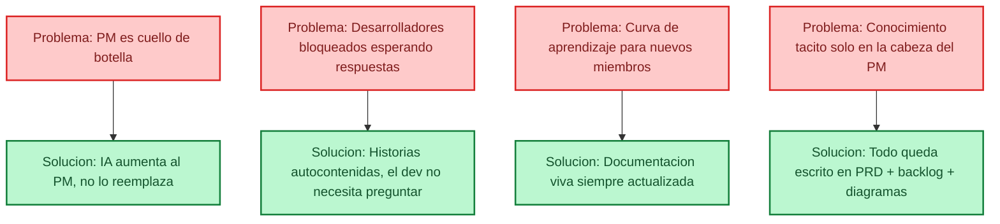

**Como impacta a cada rol:**

| Rol | Sin el flujo | Con el flujo |
|---|---|---|
| **Product Manager** | Escribe documentos manualmente, asiste a reuniones de refinamiento, responde preguntas uno a uno | Define la vision, ejecuta comandos, valida resultados, se enfoca en estrategia |
| **Desarrollador Backend** | Recibe historias Vagas, espera aclaraciones del PM, asume comportamientos | Recibe historias con BDD, endpoints definidos, plan DDD paso a paso |
| **Desarrollador Frontend** | Adivina diseno, corrige malentendidos en code review | Recibe criterios BDD, plan de componentes, routing definido |
| **Nuevo Integrante** | Lee documentacion dispersa, pregunta a companeros, comete errores | Lee PRD + backlog + diagramas + planes, todo coherente y actualizado |
| **QA / Tester** | Crea casos basados en suposicion | Usa escenarios Gherkin ya escritos en las historias |

### 8.3 Reiteracion (Iteraciones y Consistencia)

El flujo produce el mismo nivel de calidad en cada iteracion. No hay "sprints buenos" y "sprints malos" dependiendo de que tan cansado este el PM.

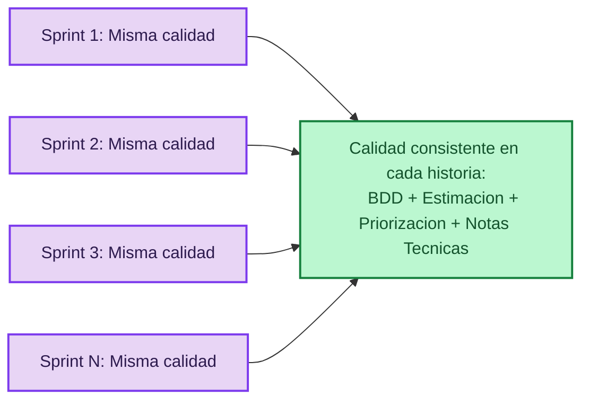

| Aspecto | Sin el flujo (cada sprint es diferente) | Con el flujo (cada sprint es consistente) |
|---|---|---|
| Formato de historias | Cambia segun quien las escribe y su humor | Identico siempre: BDD, estimacion, prioridad, notas tecnicas |
| Profundidad del detalle | Depende del tiempo disponible del PM | Siempre completa: 3+ escenarios Gherkin, dependencias, DoD |
| Criterios de aceptacion | "El usuario deberia poder..." (ambiguo) | Given / When / Then (ejecutable por QA) |
| Estimacion | Adivinanza sin contexto | Fibonacci + RICE con rationale documentado |
| Documentacion | Se desactualiza y nadie la actualiza | Se actualiza automaticamente en cada implementacion |
| Curva de aprendizaje | Cada sprint el equipo aprende de nuevo el proceso | El proceso es siempre el mismo, predecible |

### 8.4 Otros Puntos Clave

| Beneficio | Descripcion | Impacto |
|---|---|---|
| **Trazabilidad Total** | Cada linea de codigo se rastrea hasta un requisito del PRD pasando por una historia de usuario. | Auditoria, compliance, onboarding |
| **Fuente Unica de Verdad** | El PRD es el documento maestro. Cualquier cambio en requisitos se refleja automaticamente en backlog y diagramas. | Equipo siempre alineado |
| **Reduccion de Riesgos** | Validacion en cada paso: el PRD se valida antes del backlog, el backlog antes de Jira, el plan antes del codigo. | Errores tempranos cuestan menos |
| **Calidad Incorporada** | 90% de cobertura de tests, BDD escrito antes del codigo, DoD explicito en cada historia. | Menos bugs en produccion |
| **Paralelismo Backend + Frontend** | Planes separados para BE y FE permiten que dos developers trabajen el mismo ticket simultaneamente. | Hasta 50% mas rapido por ticket |
| **Onboarding Acelerado** | Un nuevo desarrollador puede leer PRD + backlog + diagramas + planes y entender el producto completo en horas, no semanas. | Nuevos miembros productivos el dia 1 |
| **Conocimiento Persistente** | Todo queda documentado: decisiones, estimaciones, dependencias. No hay conocimiento tacito que se vaya cuando alguien renuncia. | El equipo es resiliente a rotacion |
| **Estandarizacion** | Todos los proyectos siguen el mismo proceso. Un dev puede moverse entre proyectos sin reaprender el flujo. | Escalabilidad del equipo |

### 8.5 Antes vs. Despues: El Cambio Radical

```mermaid
flowchart TD
    classDef bad fill:#fecaca,stroke:#dc2626,stroke-width:2px,color:#7f1d1d
    classDef good fill:#bbf7d0,stroke:#15803d,stroke-width:2px,color:#14532d

    subgraph Antes2["Flujo Tradicional (sin comandos)"]
        B1["PM escribe spec en Word"]:::bad
        B2["PM envia por email al equipo"]:::bad
        B3["Dev lee e interpreta"]:::bad
        B4["Dev pregunta: 'Que pasa con X?'"]:::bad
        B5["PM responde 2 dias despues"]:::bad
        B6["Dev implementa lo que entendio"]:::bad
        B7["QA rechaza: no coincide con lo pedido"]:::bad
        B8["Retrabajo: 2-3 dias perdidos"]:::bad
    end

    subgraph Despues2["Flujo Spec-Driven (con comandos)"]
        G1["PM ejecuta /create-prd"]:::good
        G2["PRD generado automaticamente"]:::good
        G3["PM ejecuta /create-backlog-plan"]:::good
        G4["Backlog con BDD + estimacion + prioridad"]:::good
        G5["PM ejecuta /push-backlog-plan jira"]:::good
        G6["Epicas y Stories creadas en Jira"]:::good
        G7["Dev implementa con plan detallado"]:::good
        G8["QA valida contra BDD: pasa o no pasa"]:::good
    end

    B1 --> B2 --> B3 --> B4 --> B5 --> B6 --> B7 --> B8
    G1 --> G2 --> G3 --> G4 --> G5 --> G6 --> G7 --> G8
```

**Impacto en numeros (estimado para un equipo de 5 personas en un sprint de 2 semanas):**

| Metrica | Flujo Tradicional | Flujo Spec-Driven | Mejora |
|---|---|---|---|
| Tiempo administrativo del PM | 3-5 dias por sprint | 30 minutos por sprint | **85% menos** |
| Historias sin ambiguedad | ~40% | ~100% | **+60%** |
| Retrabajo por malentendidos | 2-3 dias por sprint | Casi cero | **~95% menos** |
| Tiempo de onboarding nuevo dev | 2-4 semanas | 2-4 dias | **~75% mas rapido** |
| Historias por sprint | 5-8 | 8-12 | **+50%** |
| Documentacion actualizada | Casi nunca | Siempre | **100% del tiempo** |

---

## 9. Resumen para la Demo

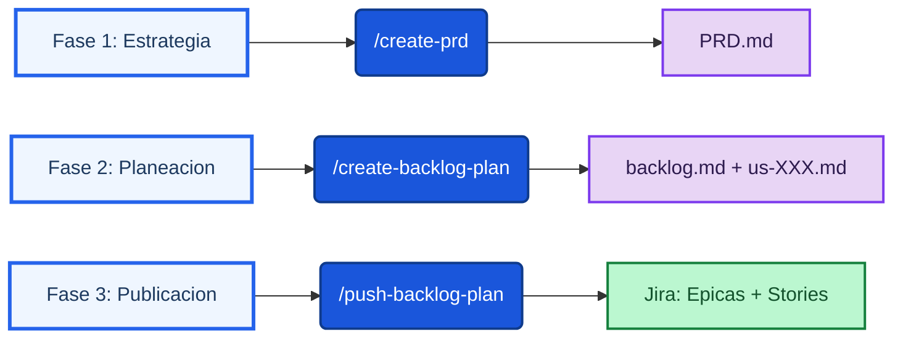

| Fase | Comando | Qué Produce | Tiempo Estimado |
|---|---|---|---|
| **1. Estrategia** | `/create-prd` | `PRD.md` — Documento de requisitos | 1 ejecución |
| **2. Planeación** | `/create-backlog-plan` | `backlog.md` + `us-XXX.md` — Backlog priorizado con BDD | 1 ejecución |
| **2b. (Opcional)** | `/create-diagrams` | `diagrams/*.md` — 5 diagramas visuales | 1 ejecución |
| **3. Publicación** | `/push-backlog-plan jira` | Épicas y Stories en Jira con dependencias | 1 ejecución |
