# Diagrama de Flujo: Pipeline Spec-Driven de Comandos Agente
## Flujo de Trabajo Completo

---

## 1. Vision General del Pipeline

El pipeline completo abarca 17 comandos agente organizados en 7 fases. Transforma una idea de producto en bruto en codigo funcionando y tickets en Jira/GitHub, pasando por PRD, backlog, diagramas, planes de implementacion y control de versiones.

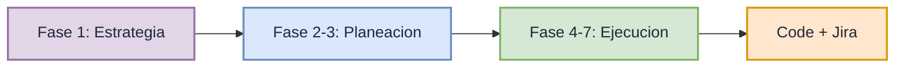

**Las 7 fases del pipeline:**
1. Estrategia de Producto (`/create-prd`)
2. Backlog y Diagramas (`/create-backlog-plan`, `/create-diagrams`)
3. Mantenimiento del Backlog (`/add-us`, `/update-us`, `/delete-us`)
4. Planificacion de Tickets (`/plan-backend-ticket`, `/plan-frontend-ticket`)
5. Implementacion (`/develop-backend`, `/develop-frontend`)
6. Commit y PR (`/commit`)
7. Sincronizacion con Plataforma (`/push-backlog-plan`)

---

## 2. Actores, Comandos y Artefactos

### 2.1 17 Comandos y sus Roles

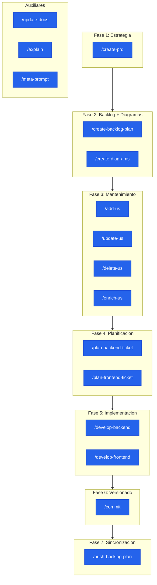

### 2.2 Mapa de Artefactos

| Artefacto | Producido Por | Consumido Por | Descripcion |
|---|---|---|---|
| `ai-specs/specs/PRD.md` | `/create-prd` | `create-backlog-plan`, `create-diagrams`, `add-us`, `update-us`, `delete-us` | Requisitos del producto |
| `ai-specs/backlog/backlog.md` | `/create-backlog-plan` | `push-backlog-plan` | Epicas priorizadas |
| `ai-specs/backlog/us-XXX.md` | `/create-backlog-plan`, `/add-us` | `enrich-us`, `update-us`, `delete-us`, `plan-backend-ticket`, `plan-frontend-ticket` | Historias con BDD |
| `ai-specs/diagrams/*.md` | `/create-diagrams` | `create-backlog-plan`, `push-backlog-plan` | Diagramas visuales |
| `docs/plans/[ID]_backend.md` | `/plan-backend-ticket` | `/develop-backend` | Plan backend DDD |
| `docs/plans/[ID]_frontend.md` | `/plan-frontend-ticket` | `/develop-frontend` | Plan frontend React |
| Git Commit + PR | `/commit` | Code review + merge | Codigo versionado |
| Jira / GitHub Issues | `/push-backlog-plan` | Sprint planning | Items trackeables |

---

## 3. Flujo Completo del Pipeline

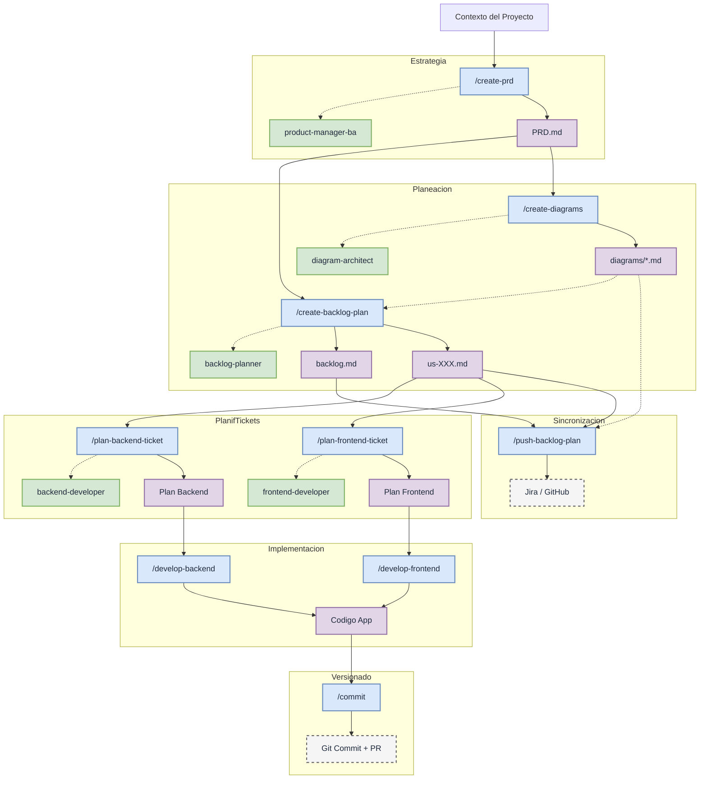

---

## 4. Flujo Detallado por Fase

### Fase 1: Estrategia de Producto

**Comando**: `/create-prd`
**Agente**: `product-manager-ba.md`
**Entrada**: Archivo de contexto del proyecto
**Salida**: `PRD.md`

```mermaid
flowchart LR
    classDef input fill:#fff3cd,stroke:#ffc107,stroke-width:2px,color:#1e293b
    classDef step fill:#f8fafc,stroke:#94a3b8,stroke-width:2px,color:#1e293b
    classDef output fill:#f3e8ff,stroke:#9333ea,stroke-width:2px,color:#1e293b

    IN[("Contexto del proyecto")]:::input
    A[1. Analizar problema]:::step
    B[2. Definir vision]:::step
    C[3. Identificar usuarios]:::step
    D[4. Definir requisitos]:::step
    E[5. Disenar data model]:::step
    F[6. Definir arquitectura]:::step
    OUT[/PRD.md/]:::output

    IN --> A --> B --> C --> D --> E --> F --> OUT
```

---

### Fase 2: Backlog y Diagramas

**Comandos**: `/create-backlog-plan` + `/create-diagrams`
**Agentes**: `backlog-planner.md` + `diagram-architect.md`
**Entrada**: `PRD.md`
**Salida**: `backlog.md` + `us-XXX.md` + `diagrams/*.md`

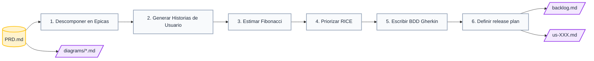

**Contenido de cada Historia de Usuario:**

```mermaid
flowchart LR
    classDef req fill:#f8fafc,stroke:#94a3b8,stroke-width:2px,color:#1e293b
    classDef bdd fill:#dcfce7,stroke:#16a34a,stroke-width:2px,color:#1e293b
    classDef tech fill:#dbeafe,stroke:#2563eb,stroke-width:2px,color:#1e293b

    A["Formato: Como... quiero... para..."]:::req
    B["Estimacion: Fibonacci + T-Shirt"]:::req
    C["Prioridad: RICE + MoSCoW"]:::req
    D["Criterios BDD: 3+ escenarios Gherkin"]:::bdd
    E["Notas Tecnicas: archivos, endpoints"]:::tech
    F["Dependencias: bloqueado por / bloquea"]:::tech
    G["Definition of Done"]:::req

    A --> B --> C --> D --> E --> F --> G
```

---

### Fase 3: Mantenimiento del Backlog

**Comandos**: `/add-us`, `/update-us`, `/delete-us`, `/enrich-us`
**Regla**: Todos sincronizan tanto el archivo `us-XXX.md` como el `PRD.md`

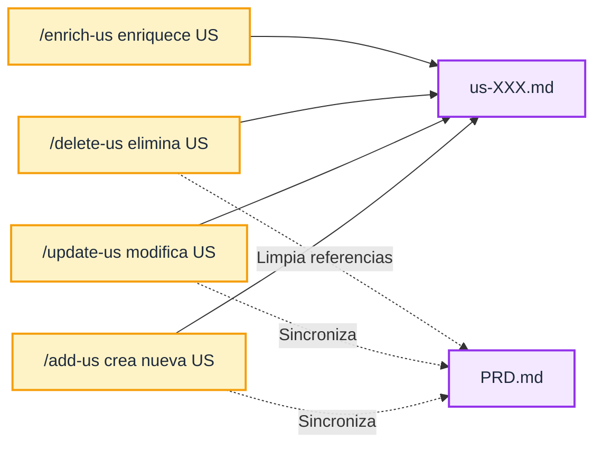

---

### Fase 4: Planificacion de Tickets

**Comandos**: `/plan-backend-ticket` + `/plan-frontend-ticket`
**Agentes**: `backend-developer.md` + `frontend-developer.md`
**Entrada**: Ticket Jira o archivo US local
**Salida**: Plan de implementacion en `docs/plans/`

| Componente | Backend | Frontend |
|---|---|---|
| Stack | Node.js + Express + Prisma + PostgreSQL | React 18 + TypeScript + Bootstrap 5 |
| Arquitectura | DDD (Layered: Presentation - Application - Domain) | Componentes React + Service Layer |
| Salida | `docs/plans/[ID]_backend.md` | `docs/plans/[ID]_frontend.md` |
| Contenido | Branch name, file paths, function signatures, DDD steps, tests | Branch name, componentes, servicios, routing, tests Cypress |

```mermaid
flowchart TD
    classDef input fill:#fff3cd,stroke:#ffc107,stroke-width:2px,color:#1e293b
    classDef plan fill:#dbeafe,stroke:#2563eb,stroke-width:2px,color:#1e293b
    classDef step fill:#f8fafc,stroke:#94a3b8,stroke-width:2px,color:#1e293b

    TICKET[("Ticket Jira o US local")]:::input

    subgraph BackendPlan
        B1[Crear rama: feature/[ID]-backend]:::step
        B2[Implementar validation]:::step
        B3[Implementar service]:::step
        B4[Implementar controller]:::step
        B5[Agregar route]:::step
        B6[Escribir tests unitarios]:::step
        B7[Actualizar docs]:::step
    end

    subgraph FrontendPlan
        F1[Crear rama: feature/[ID]-frontend]:::step
        F2[Crear/actualizar service API]:::step
        F3[Crear/actualizar componentes]:::step
        F4[Actualizar routing]:::step
        F5[Escribir tests Cypress]:::step
        F6[Actualizar docs]:::step
    end

    TICKET -->|plan-backend-ticket| B1
    TICKET -->|plan-frontend-ticket| F1
    B1 --> B2 --> B3 --> B4 --> B5 --> B6 --> B7
    F1 --> F2 --> F3 --> F4 --> F5 --> F6
```

---

### Fase 5: Implementacion

**Comandos**: `/develop-backend` + `/develop-frontend`
**Salida**: Codigo funcionando con tests pasando

```mermaid
flowchart LR
    classDef step fill:#f8fafc,stroke:#94a3b8,stroke-width:2px,color:#1e293b
    classDef result fill:#dcfce7,stroke:#16a34a,stroke-width:2px,color:#1e293b
    classDef check fill:#fef3c7,stroke:#f59e0b,stroke-width:2px,color:#1e293b

    PLAN[("Plan de implementacion")]

    A[1. Crear feature branch]:::step
    B[2. Implementar codigo]:::step
    C[3. Ejecutar linter + typecheck]:::check
    D[4. Escribir tests cobertura 90%]:::step
    E[5. Actualizar documentacion]:::step
    F[6. Stage solo archivos del ticket]:::step

    DONE["Codigo listo para commit"]:::result

    PLAN --> A --> B --> C
    C -.->|Falla| B
    C --> D --> E --> F --> DONE
```

---

### Fase 6: Commit y Pull Request

**Comando**: `/commit [Ticket-ID]`
**Salida**: Git commit + PR en GitHub

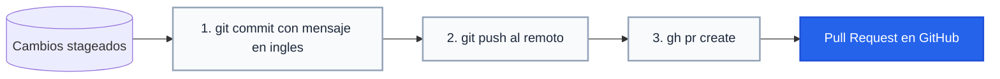

---

### Fase 7: Sincronizacion con Plataforma

**Comando**: `/push-backlog-plan jira|github`
**Salida**: Epicas y Stories en Jira o GitHub Issues

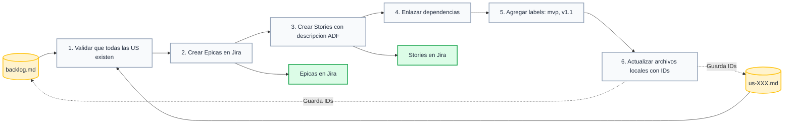

---

## 5. Comandos Auxiliares

| Comando | Proposito |
|---|---|
| `/explain` | Ensenia el concepto detras de una pregunta usando modelos mentales y quiz |
| `/meta-prompt` | Refina y reestructura un prompt aplicando mejores practicas |
| `/update-docs` | Sincroniza documentacion segun documentation-standards.mdc |

---

## 6. Principios de Diseno Clave

1. **Fuente Unica de Verdad**: `PRD.md` es el artefacto raiz. Los comandos de mantenimiento siempre sincronizan de vuelta al PRD.

2. **Enriquecimiento Progresivo**: Cada comando agrega una capa de detalle sin reescribir capas anteriores:
   - `PRD.md` -> requisitos de negocio
   - `backlog/` -> historias con BDD
   - `diagrams/` -> documentacion visual
   - `docs/plans/` -> pasos de implementacion
   - Codigo -> software funcionando

3. **Consistencia Cruzada**: Comandos en fases posteriores leen artefactos de fases anteriores para asegurar alineacion.

4. **Separacion de Preocupaciones**: Backend y frontend tienen comandos independientes con sufijos `-backend` / `-frontend` para trabajo en paralelo.

5. **Documentacion como Entregable**: Cada implementacion debe actualizar la documentacion como paso final.

---

## 7. Resumen para la Demo

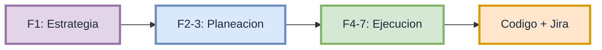

| Fase | Comandos | Entrada | Salida |
|---|---|---|---|
| **1. Estrategia** | `/create-prd` | Contexto del proyecto | `PRD.md` |
| **2. Backlog + Diagramas** | `/create-backlog-plan`, `/create-diagrams` | `PRD.md` | `backlog.md`, `us-XXX.md`, `diagrams/*.md` |
| **3. Mantenimiento** | `/add-us`, `/update-us`, `/delete-us`, `/enrich-us` | `us-XXX.md` + `PRD.md` | `us-XXX.md` actualizado |
| **4. Planificacion Tickets** | `/plan-backend-ticket`, `/plan-frontend-ticket` | Ticket Jira o US local | Plan en `docs/plans/` |
| **5. Implementacion** | `/develop-backend`, `/develop-frontend` | Plan en `docs/plans/` | Codigo + tests |
| **6. Commit + PR** | `/commit` | Cambios stageados | Git commit + PR |
| **7. Sincronizacion** | `/push-backlog-plan` | `backlog.md` + `us-XXX.md` | Epicas + Stories en Jira/GitHub |
