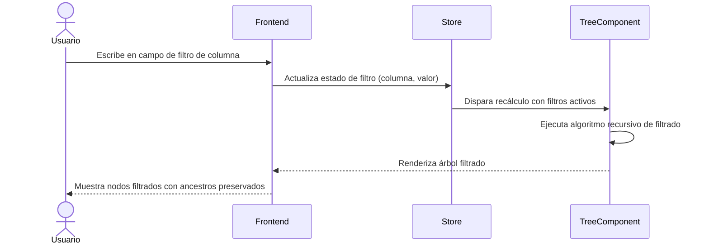

# US-001: Interfaz de filtros por columna en Tree-Table

## Historia
Como **usuario del Tree-Table de Actividades**, quiero **disponer de campos de búsqueda en el encabezado de cada columna**, para **filtrar los datos de la tabla sin perder el contexto jerárquico del árbol**.

## Épica
Épica 1: Optimización y Control Jerárquico en Tree-Table de Actividades

## Prioridad
- **MoSCoW**: Must
- **RICE Score**: Reach: 5 | Impact: 4 | Confidence: 90% | Effort: 5 → Score: 3.60

## Estimación
- **Story Points (Fibonacci)**: 5
- **T-Shirt Size**: M
- **Planning Poker Rationale**: Complejidad media. Requiere agregar inputs de búsqueda en el header del Tree-Table, gestionar estado de filtros por columna y conectar con la lógica de filtrado. El equipo convergería en 5 porque el patrón de filtros por columna ya existe en otros componentes de la plataforma, pero la integración con un Tree-Table agrega complejidad adicional.

## Caso de Uso

### Caso de Uso: Filtrado por columna en estructura jerárquica
- **Actores**: Usuario del Tree-Table
- **Precondiciones**: El Tree-Table está renderizado con datos. El usuario tiene permisos de lectura.
- **Flujo Principal**:
  1. El usuario visualiza el encabezado del Tree-Table con los nombres de columna
  2. El usuario escribe texto en el campo de búsqueda de una columna específica
  3. El sistema captura el valor ingresado y lo almacena en el estado de filtros
  4. El sistema ejecuta el algoritmo de filtrado recursivo (US-002)
  5. El Tree-Table se actualiza mostrando solo los nodos que coinciden con el filtro, preservando los ancestros
- **Flujos Alternativos**: El usuario puede limpiar el filtro manualmente o combinar múltiples filtros en diferentes columnas
- **Postcondiciones**: El Tree-Table muestra un subconjunto filtrado de nodos o todos los nodos si no hay filtros activos

### Diagrama del Caso de Uso



## Criterios de Aceptación (BDD) 

### Feature: Filtros por columna en Tree-Table

#### Escenario 1: Filtrado por texto en una columna — caso feliz
```gherkin
Dado que el Tree-Table muestra 50 nodos distribuidos en 4 niveles jerárquicos
  Y el encabezado muestra campos de búsqueda en cada columna
Cuando el usuario escribe "cimentación" en el campo de búsqueda de la columna "Nombre"
Entonces el Tree-Table muestra únicamente los nodos cuyo nombre contiene "cimentación"
  Y todos los nodos ancestros de los nodos filtrados permanecen visibles
  Y los nodos hermanos que no coinciden con el filtro se ocultan
```

#### Escenario 2: Filtro sin resultados
```gherkin
Dado que el Tree-Table muestra datos de actividades
  Y ningún nodo contiene el texto "zzznodataxyz"
Cuando el usuario escribe "zzznodataxyz" en el campo de búsqueda
Entonces el Tree-Table muestra un mensaje informativo "No se encontraron resultados"
  Y el árbol permanece vacío pero funcional
```

#### Escenario 3: Filtro combinado en múltiples columnas
```gherkin
Dado que el Tree-Table muestra actividades con columnas "Nombre", "Responsable" y "Estado"
  Y el usuario ha escrito "estructura" en el filtro de columna "Nombre"
Cuando el usuario selecciona "En Progreso" en el filtro de columna "Estado"
Entonces el Tree-Table muestra solo los nodos cuyo nombre contiene "estructura" Y su estado es "En Progreso"
  Y los ancestros de los nodos coincidentes permanecen visibles
```

#### Escenario 4: Limpieza de filtros
```gherkin
Dado que el Tree-Table tiene uno o más filtros activos
  Y se muestra un subconjunto filtrado de nodos
Cuando el usuario limpia todos los filtros activos
Entonces el Tree-Table restaura la vista completa con todos los nodos visibles
  Y el estado de expansión previo de los nodos se preserva
```

## Notas Técnicas
- **Archivos/componentes afectados**: Componente `TreeTable.vue` (o equivalente), header renderer, store de filtros
- **Endpoints involucrados**: Ninguno — el filtrado es 100% del lado del cliente
- **Entidades del modelo de datos**: `node.children`, `node.name`, propiedades de columna dinámicas

## Requisitos No Funcionales
- **Rendimiento**: El renderizado post-filtro debe completarse en < 200ms para árboles de hasta 500 nodos. Evaluar debounce de 300ms en la entrada del filtro.
- **Accesibilidad**: Los campos de filtro deben ser navegables por teclado (Tab) y tener etiquetas ARIA descriptivas.
- **Seguridad**: No aplica — operación del lado del cliente sin llamadas a API.

## Dependencias
- **Bloqueado por**: Ninguna
- **Bloquea**: US-002 (Algoritmo recursivo de filtrado)

## Definición de Done
- [ ] Todos los criterios de aceptación cumplidos
- [ ] Pruebas unitarias escritas y pasando (≥90% cobertura)
- [ ] Código revisado y aprobado
- [ ] Documentación actualizada
- [ ] Sin regresiones en funcionalidad existente
