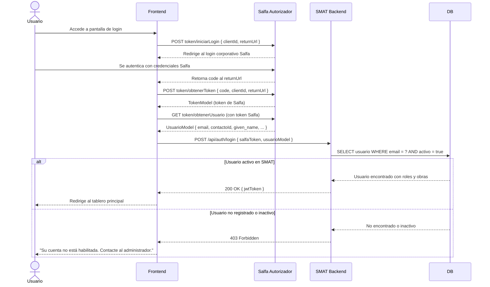

## Tracking
- **Platform**: jira
- **External ID**: SMAT-2
- **URL**: https://syntaxis.atlassian.net/browse/SMAT-2

# US-001: Inicio de Sesión

## 📜 [Original]

## Historia
Como **usuario del sistema**, quiero autenticarme mediante el servicio SSO de Salfa, para acceder de forma segura a las funcionalidades que corresponden a mi rol y obra asignada, sin gestionar credenciales separadas.

## Épica
Autenticación

## Prioridad
- **MoSCoW**: Must Have
- **RICE Score**: Alcance: 100 | Impacto: 3 | Confianza: 100% | Esfuerzo: 1.0 → Puntaje: 300

## Estimación
- **Story Points (Fibonacci)**: 5
- **T-Shirt Size**: M
- **Justificación**: La autenticación delega en el middleware de Salfa (flujo OAuth-like de 4 pasos). Requiere integración con endpoints externos (QA y PROD), manejo del code/token de Salfa, y resolución del usuario SMAT a partir del email/contactoId. Mayor incertidumbre que un JWT propio dado el acoplamiento con un servicio externo.

## Caso de Uso

### Caso de Uso: Autenticación de Usuario vía Salfa SSO
- **Actores**: Todos los usuarios del sistema (Administrador, Analista, Validador, Controlador)
- **Precondiciones**: El usuario tiene una cuenta activa en el sistema SMAT y cuenta con credenciales válidas en el autorizador de Salfa.
- **Flujo Principal**:
  1. El usuario accede a la pantalla de login de SMAT.
  2. El frontend llama a `POST token/iniciarLogin` en el middleware Salfa con `clientId` y `returnUrl`.
  3. Salfa redirige al usuario a su pantalla de autenticación corporativa y, tras el login, retorna un `code` al `returnUrl`.
  4. El frontend llama a `POST token/obtenerToken` con `code`, `clientId` y `returnUrl` para obtener el `TokenModel` de Salfa.
  5. El frontend llama a `GET token/obtenerUsuario` para obtener los datos del usuario autenticado (`email`, `contactoId`, `given_name`, etc.).
  6. El backend SMAT valida que el usuario existe y está activo en la BD, y emite un JWT interno con `userId`, lista de `{ obraId, perfilId }` para RBAC.
  7. El sistema redirige al usuario al tablero principal.
- **Flujos Alternativos**:
  - **Usuario no registrado en SMAT**: el backend retorna 403 con mensaje "Su cuenta no está habilitada en el sistema. Contacte al administrador."
  - **Usuario inactivo en SMAT**: el backend retorna 403 con el mismo mensaje genérico, sin revelar el motivo exacto.
  - **Error en el middleware de Salfa**: el frontend muestra mensaje "Error al conectar con el servicio de autenticación. Intente nuevamente."
  - **Token SMAT expirado**: el frontend detecta 401 en cualquier petición y redirige al flujo de login desde el paso 2.
- **Postcondiciones**: El usuario tiene una sesión activa con token JWT SMAT válido. El frontend almacena el token de forma segura (memory o httpOnly cookie).

### Diagrama



## Criterios de Aceptación (BDD)

### Feature: Autenticación de usuarios mediante SSO de Salfa

#### Escenario 1: Login exitoso con cuenta Salfa y usuario activo en SMAT
```gherkin
Given que soy un usuario activo en SMAT y tengo credenciales válidas en Salfa
When completo el flujo SSO de Salfa (iniciarLogin → obtenerToken → obtenerUsuario)
  And el backend SMAT recibe mi email "user@salfa.cl" y lo encuentra activo en la BD
Then el backend emite un jwtToken con mi userId, rol y obras asignadas
  And soy redirigido al tablero principal
  And el token JWT contiene mi userId, lista de { obraId, perfilId } para RBAC
```

#### Escenario 2: Login con cuenta Salfa válida pero usuario no registrado en SMAT
```gherkin
Given que tengo credenciales válidas en Salfa pero mi email "noregistrado@salfa.cl" no existe en SMAT
When completo el flujo SSO de Salfa exitosamente
  And el backend SMAT no encuentra mi email en la BD
Then el backend retorna HTTP 403
  And se muestra el mensaje "Su cuenta no está habilitada en el sistema. Contacte al administrador."
  And no se emite ningún jwtToken SMAT
```

#### Escenario 3: Login con usuario inactivo en SMAT
```gherkin
Given que tengo credenciales válidas en Salfa pero mi cuenta en SMAT está inactiva
When completo el flujo SSO de Salfa exitosamente
  And el backend SMAT encuentra mi email pero con estado inactivo
Then el backend retorna HTTP 403
  And se muestra el mismo mensaje genérico de cuenta no habilitada
  And no se revela si el usuario existe o el motivo de la restricción
```

#### Escenario 4: Error en el middleware de Salfa durante el login
```gherkin
Given que el servicio de autenticación de Salfa no está disponible o retorna error
When intento iniciar sesión desde SMAT
Then el frontend captura el error del middleware
  And se muestra el mensaje "Error al conectar con el servicio de autenticación. Intente nuevamente."
  And se habilita un botón para reintentar el proceso
```

#### Escenario 5: Cierre de sesión
```gherkin
Given que tengo una sesión activa en SMAT
When ejecuto la acción de cerrar sesión
Then el frontend llama a POST token/cerrarSesion en Salfa con { id_token, logoutUrl }
  And el jwtToken SMAT es invalidado en el cliente
  And soy redirigido a la pantalla de login
```

#### Escenario 6: Token SMAT expirado durante el uso del sistema
```gherkin
Given que tengo una sesión activa con jwtToken SMAT expirado
When realizo cualquier petición autenticada al backend SMAT
Then el backend retorna HTTP 401
  And el frontend redirige automáticamente al flujo de login SSO de Salfa
  And el usuario percibe un mensaje "Tu sesión ha expirado. Por favor inicia sesión nuevamente."
```

## Notas Técnicas
- **Endpoints Salfa Autorizador**:
  - QA: `https://apiautorizadorqa.salfagestion.cl/api/v1.0`
  - PROD: `https://autorizadorapi.salfagestion.cl/api/v1.0`
  - `POST token/iniciarLogin` → recibe `{ clientId, returnUrl }`, retorna `string` (code/redirect)
  - `POST token/obtenerToken` → recibe `{ code, clientId, returnUrl }`, retorna `TokenModel`
  - `GET token/obtenerUsuario` → retorna `UsuarioModel { contactoId, given_name, sub, preferred_username, email, claims }`
  - `POST token/cerrarSesion` → recibe `{ id_token, logoutUrl }`, retorna `string`
- **Endpoints API SMAT involucrados**: `POST /api/auth/login`, `POST /api/auth/logout`
- **Entidades del modelo de datos**: `USUARIOS`, `PERFILES`, `USUARIO_OBRA_PERFIL`
- **Archivos/Componentes afectados**: Auth Controller, Auth Service, JWT middleware, Login page (frontend), SalfaAuthService (cliente HTTP al autorizador)
- El JWT SMAT se emite internamente tras validar el `UsuarioModel` de Salfa contra la BD de SMAT.
- El payload del JWT SMAT debe incluir: `userId`, lista de `{ obraId, perfilId }` para RBAC.
- El JWT SMAT tiene expiración configurable (recomendado 60 min). No se emite refresh token propio; la re-autenticación redirige al SSO de Salfa.
- El `clientId` de SMAT debe ser configurado por ambiente (variable de entorno) y entregado por Salfa.

## Requisitos No Funcionales
- **Rendimiento**: Respuesta total del flujo de login (incluyendo llamadas a Salfa) < 3 segundos (p95).
- **Seguridad**: HTTPS obligatorio. El `clientId` no debe exponerse en el frontend (debe manejarse vía backend o variable de entorno). Rate limiting en `POST /api/auth/login` (máx. 10 intentos por IP en 15 min).
- **Accesibilidad**: Pantalla de login compatible con lectores de pantalla (WCAG 2.1 AA). El botón de inicio de sesión debe tener label descriptivo.
- **Resiliencia**: El frontend debe manejar errores de red al autorizador de Salfa y mostrar mensajes de usuario amigables.

## Dependencias
- **Bloqueado por**: Entrega de `clientId` por parte de Salfa para ambientes QA y PROD.
- **Bloquea**: US-002, US-003, US-004, US-005 (todos requieren autenticación)

## Definition of Done
- [ ] Todos los criterios de aceptación cumplidos
- [ ] Pruebas unitarias escritas y pasando (≥90% cobertura)
- [ ] Código revisado y aprobado
- [ ] Documentación actualizada
- [ ] Sin regresiones en funcionalidad existente

---

## 🚀 [Enhanced - Task Plan]

### 📖 Resumen de la Solución
Flujo SSO de 4 pasos: el Frontend orquesta las llamadas al autorizador Salfa (iniciarLogin → obtenerToken → obtenerUsuario) y el Backend SMAT valida el email contra la BD local para emitir un JWT propio con claims `userId`/`obraId[]`/`perfilId[]` para RBAC multi-obra.

### 🛠️ Lista de Tareas y Subtareas

#### 🟦 BACKEND
- [ ] **Tarea: Implementar Lógica y Persistencia**
  - Subtarea: Crear entidad `Usuario` con VOs `Email` y `SalfaUsuarioModel`; invariante `Activo = true`.
  - Subtarea: Implementar `LoginCommand` + `LoginCommandHandler` (Result Pattern): buscar por email, validar estado, emitir JWT con claims `userId`/`obraId[]`/`perfilId[]`.
  - Subtarea: Definir interfaz `ISalfaAuthService` e implementar `SalfaAuthService` como cliente HTTP (URLs QA/PROD por `IConfiguration`).
  - Subtarea: Crear `UsuarioConfiguration.cs` (Fluent API, índice único `Email`) y generar migración EF Core.
  - Subtarea: Configurar `JwtMiddleware` que puebla `HttpContext.User` con claims SMAT.
- [ ] **Tarea: Exposición de API**
  - Subtarea: Crear endpoints Minimal API: `POST /api/auth/login` y `POST /api/auth/logout`.
  - Subtarea: Implementar rate limiting en `/api/auth/login` (máx. 10 req/IP en 15 min).
  - Subtarea: Agregar logs Serilog: login exitoso `{Email}|{UserId}` y login fallido `{Email}`.

#### 🟨 FRONTEND
- [ ] **Tarea: Desarrollo de UI**
  - Subtarea: Crear pantalla de Login con botón "Iniciar sesión con Salfa" (label WCAG 2.1 AA).
  - Subtarea: Mostrar mensajes de error: 403 → cuenta no habilitada; error de red → mensaje con botón reintentar; 401 → "Tu sesión ha expirado".
  - Subtarea: Redirigir al tablero principal al recibir JWT válido.
- [ ] **Tarea: Integración**
  - Subtarea: Orquestar flujo SSO: `iniciarLogin` → redirect Salfa → `obtenerToken` → `obtenerUsuario` → `POST /api/auth/login`.
  - Subtarea: Almacenar JWT SMAT en memoria o httpOnly cookie (nunca en `localStorage`).
  - Subtarea: Configurar interceptor HTTP global: 401 → limpiar sesión y redirigir al flujo SSO.

#### 🟩 TESTING & QA
- [ ] **Tarea: Pruebas Automatizadas**
  - Subtarea: Unit Tests `LoginCommandHandlerTests`: usuario activo → JWT emitido, no encontrado → 403, inactivo → 403.
  - Subtarea: Unit Tests `LoginCommandValidatorTests`: email inválido, token vacío.
  - Subtarea: Integration Test Testcontainers: `POST /api/auth/login` → verificar JWT con claims correctos y usuario en BD.
- [ ] **Tarea: Validación de Usuario**
  - Subtarea: Verificar Escenario 1: login exitoso → JWT válido y redirect al tablero.
  - Subtarea: Verificar Escenarios 2 y 3: email no registrado o inactivo → 403 con mensaje genérico.
  - Subtarea: Verificar Escenario 4: error del servicio Salfa → mensaje de red con botón reintentar.
  - Subtarea: Verificar Escenarios 5 y 6: cierre de sesión limpia token; 401 activo redirige al SSO.

---
## 📝 NOTAS DE ARQUITECTURA
- **Bloqueante**: Confirmar entrega de `clientId` Salfa para ambientes QA y PROD antes de iniciar desarrollo de esta HU.
- El JWT SMAT NO emite refresh token propio; la re-autenticación siempre redirige al SSO de Salfa.
- Rate limiting debe implementarse en la capa middleware del backend, no en el frontend.
