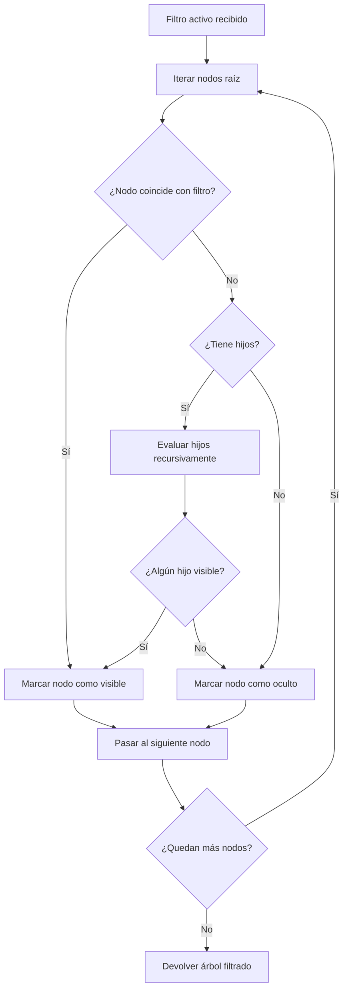

# US-002: Algoritmo recursivo de filtrado con preservación de ancestros

## Historia
Como **usuario del Tree-Table de Actividades**, quiero que **el filtrado por columna sea recursivo preservando los nodos ancestros de los nodos coincidentes**, para **mantener el contexto jerárquico y no perder la trazabilidad dentro del árbol**.

## Épica
Épica 1: Optimización y Control Jerárquico en Tree-Table de Actividades

## Prioridad
- **MoSCoW**: Must
- **RICE Score**: Reach: 5 | Impact: 5 | Confidence: 80% | Effort: 8 → Score: 2.50

## Estimación
- **Story Points (Fibonacci)**: 8
- **T-Shirt Size**: L
- **Planning Poker Rationale**: Complejidad alta. El algoritmo debe recorrer recursivamente la estructura del árbol, evaluar cada nodo contra el filtro activo, y determinar visibilidad basada no solo en el nodo actual sino en sus descendientes. La incertidumbre está en el manejo de árboles profundos (>5 niveles) y en garantizar que el rendimiento se mantenga aceptable. El equipo convergería en 8 después de discutir la complejidad recursiva.

## Caso de Uso

### Caso de Uso: Filtrado recursivo con preservación de ancestros
- **Actores**: Sistema de filtrado del Tree-Table
- **Precondiciones**: Existe uno o más filtros activos por columna (definidos en US-001). El árbol contiene una estructura jerárquica de nodos con propiedad `children`.
- **Flujo Principal**:
  1. El sistema recibe la señal de filtro activo desde la UI
  2. El sistema itera sobre cada nodo raíz del árbol
  3. Para cada nodo, evalúa si el nodo o alguno de sus descendientes cumple el filtro
  4. Si un nodo coincide directamente → se marca como visible
  5. Si un nodo no coincide pero tiene descendientes que sí coinciden → se marca como visible (ancestro preservado)
  6. Si un nodo no coincide y ningún descendiente coincide → se marca como oculto
  7. El sistema devuelve el árbol filtrado con propiedades de visibilidad actualizadas
- **Flujos Alternativos**: Si el filtro se aplica a una columna que no existe en el nodo, se ignora silenciosamente
- **Postcondiciones**: El árbol renderizado contiene únicamente los nodos visibles según el filtro, con todos los ancestros de nodos coincidentes preservados

### Diagrama del Caso de Uso



## Criterios de Aceptación (BDD)

### Feature: Algoritmo recursivo de filtrado con preservación de ancestros

#### Escenario 1: Nodo hoja coincide con filtro — ancestros preservados
```gherkin
Dado un árbol con la estructura:
  - Obra (raíz)
    - Piso 1
      - Habitación 1A
      - Habitación 1B
    - Piso 2
      - Habitación 2A
  Y el filtro activo en columna "Nombre" con valor "Habitación 1B"
Cuando se ejecuta el algoritmo de filtrado recursivo
Entonces el nodo "Habitación 1B" es visible
  Y el nodo "Piso 1" es visible (ancestro preservado)
  Y el nodo "Obra" es visible (ancestro preservado)
  Y el nodo "Habitación 1A" es oculto (hermano no coincidente)
  Y el nodo "Piso 2" es oculto (sin coincidencias en su subárbol)
  Y el nodo "Habitación 2A" es oculto (sin coincidencias)
```

#### Escenario 2: Ningún nodo coincide con el filtro
```gherkin
Dado un árbol con 20 nodos distribuidos en 3 niveles
  Y el filtro activo con un valor que no coincide con ningún nodo
Cuando se ejecuta el algoritmo de filtrado recursivo
Entonces todos los nodos se marcan como ocultos
  Y se muestra el mensaje "No se encontraron resultados"
```

#### Escenario 3: Árbol con profundidad de 6 niveles
```gherkin
Dado un árbol con 200 nodos distribuidos en 6 niveles jerárquicos
  Y el filtro activo coincide con un nodo en el nivel 6
Cuando se ejecuta el algoritmo de filtrado recursivo
Entonces el nodo del nivel 6 es visible
  Y todos sus 5 ancestros directos son visibles
  Y la ejecución completa toma menos de 500ms
```

#### Escenario 4: Filtro sin texto (vacío)
```gherkin
Dado un árbol con cualquier estructura de nodos
  Y no hay filtros activos (valor vacío en todos los campos)
Cuando se ejecuta el algoritmo de filtrado recursivo
Entonces todos los nodos del árbol se marcan como visibles
  Y el estado de expansión de cada nodo no se modifica
```

## Notas Técnicas
- **Archivos/componentes afectados**: `treeFilter.ts` (nuevo), `TreeTable.vue`, store de filtros
- **Endpoints involucrados**: Ninguno — la lógica es 100% frontend
- **Entidades del modelo de datos**: Estructura de nodos con `{ id, name, children: [], [columna]: valor }`

## Requisitos No Funcionales
- **Rendimiento**: La ejecución del algoritmo debe completarse en < 500ms para árboles de hasta 500 nodos con profundidad máxima de 10 niveles. Implementar memoización para evitar recalcular subárboles sin cambios.
- **Seguridad**: No aplica.
- **Accesibilidad**: No aplica directamente.

## Dependencias
- **Bloqueado por**: US-001 (Interfaz de filtros por columna)
- **Bloquea**: Ninguna

## Definición de Done
- [ ] Todos los criterios de aceptación cumplidos
- [ ] Pruebas unitarias escritas y pasando (≥90% cobertura), incluyendo pruebas de árboles profundos
- [ ] Código revisado y aprobado
- [ ] Documentación actualizada
- [ ] Sin regresiones en funcionalidad existente
