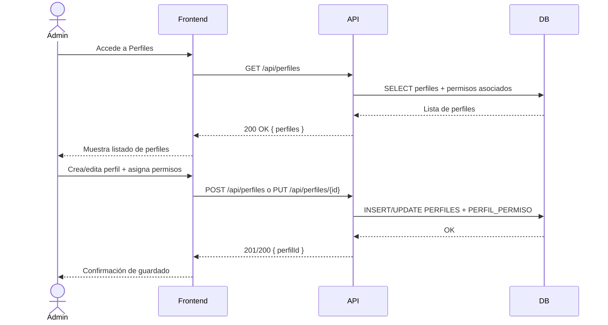

# US-002: Gestión de Perfiles y Permisos

## 📜 [Original]

## Historia
Como **Administrador**, quiero crear y gestionar perfiles con sus permisos asociados, para controlar qué acciones puede realizar cada tipo de usuario en el sistema.

## Épica
Acceso y Seguridad

## Prioridad
- **MoSCoW**: Must Have
- **RICE Score**: Alcance: 10 | Impacto: 3 | Confianza: 90% | Esfuerzo: 1 → Puntaje: 27

## Estimación
- **Story Points (Fibonacci)**: 5
- **T-Shirt Size**: M
- **Justificación**: Requiere CRUD completo de perfiles, listado de permisos del sistema y la relación muchos-a-muchos `PERFIL_PERMISO`. Complejidad media — el modelo de datos es claro pero la UI de asignación de permisos requiere cuidado en UX. El equipo convergiría en 5 puntos tras discutir el diseño de la pantalla de asignación.

## Caso de Uso

### Caso de Uso: Gestión de Perfiles y Permisos
- **Actores**: Administrador
- **Precondiciones**: El Administrador está autenticado. Los permisos del sistema existen como catálogo.
- **Flujo Principal**:
  1. El Administrador accede al módulo de Perfiles.
  2. Visualiza el listado de perfiles existentes.
  3. Crea, edita o elimina un perfil.
  4. Asigna o desasigna permisos al perfil desde el catálogo de permisos del sistema.
  5. Los cambios se reflejan inmediatamente para los usuarios con ese perfil.
- **Flujos Alternativos**:
  - Eliminar un perfil con usuarios asignados: el sistema impide la eliminación y muestra advertencia.
- **Postcondiciones**: El perfil tiene los permisos configurados. Los usuarios con ese perfil heredan los permisos en sus próximas solicitudes.

### Diagrama



## Criterios de Aceptación (BDD)

### Feature: Gestión de perfiles del sistema

#### Escenario 1: Crear un perfil nuevo con permisos asignados
```gherkin
Given que soy Administrador autenticado
When creo un perfil con nombre "Validador" y le asigno los permisos "obras:read" y "control:view"
Then el sistema crea el perfil y lo almacena en PERFILES
  And crea los registros correspondientes en PERFIL_PERMISO
  And el perfil aparece en el listado con sus permisos
```

#### Escenario 2: Intentar eliminar un perfil con usuarios activos asignados
```gherkin
Given que existe el perfil "Controlador" con 3 usuarios activos asignados en obras
When el Administrador intenta eliminar ese perfil
Then el sistema retorna HTTP 409 Conflict
  And muestra el mensaje "No se puede eliminar un perfil con usuarios activos asignados"
  And el perfil permanece sin cambios
```

#### Escenario 3: Visualizar el listado de permisos del sistema
```gherkin
Given que soy Administrador autenticado
When accedo al módulo de Permisos
Then el sistema muestra el listado completo de permisos con su código y los perfiles que los tienen asignados
  And los permisos están agrupados por módulo (ej: obras, usuarios, control, cargas)
```

#### Escenario 4: Editar los permisos de un perfil existente
```gherkin
Given que existe el perfil "Analista" con permiso "cargas:create"
When el Administrador agrega el permiso "obras:read" y elimina "cargas:create"
Then el sistema actualiza los registros en PERFIL_PERMISO
  And los usuarios con perfil "Analista" ya no pueden crear cargas
  And pueden visualizar obras
```

## Notas Técnicas
- **Endpoints API involucrados**: `GET /api/perfiles`, `POST /api/perfiles`, `GET /api/perfiles/{id}`, `PUT /api/perfiles/{id}`, `DELETE /api/perfiles/{id}`, `POST /api/perfiles/{id}/permisos`
- **Entidades del modelo de datos**: `PERFILES`, `PERMISOS`, `PERFIL_PERMISO`
- Los permisos del sistema son un catálogo fijo (semilla de BD); no se crean desde la UI.
- Los cambios en permisos de un perfil deben reflejarse en el JWT en el próximo refresh — no requiere invalidación inmediata de tokens activos.

## Requisitos No Funcionales
- **Seguridad**: Solo el rol Administrador puede acceder a este módulo. Validar en middleware RBAC con permiso `perfiles:manage`.
- **Rendimiento**: Carga del listado de perfiles < 500ms.

## Dependencias
- **Bloqueado por**: US-001 (requiere autenticación)
- **Bloquea**: US-003 (creación de usuarios requiere perfiles disponibles), US-004 (asignación requiere perfiles)

## Definition of Done
- [ ] Todos los criterios de aceptación cumplidos
- [ ] Pruebas unitarias escritas y pasando (≥90% cobertura)
- [ ] Código revisado y aprobado
- [ ] Documentación actualizada
- [ ] Sin regresiones en funcionalidad existente

---

## 🚀 [Enhanced - Task Plan]

### 📖 Resumen de la Solución
CRUD de `Perfil` con gestión de la relación muchos-a-muchos `PERFIL_PERMISO`. Los permisos son catálogo inmutable de semilla; el Administrador solo asigna/desasigna. Los cambios se reflejan en el JWT SMAT en el próximo login/refresh.

### 🛠️ Lista de Tareas y Subtareas

#### 🟦 BACKEND
- [ ] **Tarea: Implementar Lógica y Persistencia**
  - Subtarea: Crear entidades `Perfil` y `Permiso`; invariante en `Perfil`: no eliminar si tiene `UsuarioObraPerfil` activos.
  - Subtarea: Implementar commands `CreatePerfilCommand`, `UpdatePerfilCommand`, `DeletePerfilCommand`, `AsignarPermisosCommand` con handlers (Result Pattern).
  - Subtarea: Crear `PerfilConfiguration.cs`, `PermisoConfiguration.cs` (con `HasData` semilla) y `PerfilPermisoConfiguration.cs`.
  - Subtarea: Implementar `IPerfilRepository` con `GetAllWithPermisosAsync()` y `ExistsWithActiveAssignmentsAsync()`.
  - Subtarea: Generar migración EF Core para `PERFILES`, `PERMISOS`, `PERFIL_PERMISO`.
- [ ] **Tarea: Exposición de API**
  - Subtarea: Crear endpoints Minimal API: `GET/POST /api/perfiles`, `GET/PUT/DELETE /api/perfiles/{id}`, `POST /api/perfiles/{id}/permisos`.
  - Subtarea: Configurar política `perfiles:manage` (solo Administrador) y agregar logs Serilog.

#### 🟨 FRONTEND
- [ ] **Tarea: Desarrollo de UI**
  - Subtarea: Listado de perfiles con columnas Nombre, Descripción, Nro. Permisos y acciones Editar/Eliminar.
  - Subtarea: Formulario create/edit de perfil con campo Nombre y Descripción.
  - Subtarea: Matriz de checkboxes de permisos agrupados por módulo (obras, usuarios, control, cargas).
  - Subtarea: Modal de confirmación al eliminar con advertencia si tiene usuarios activos.
- [ ] **Tarea: Integración**
  - Subtarea: Servicios HTTP para todos los endpoints CRUD de perfiles.
  - Subtarea: Servicio de asignación de permisos: calcular delta (agregar/eliminar) y enviar al endpoint.
  - Subtarea: Manejar error 409 al intentar eliminar perfil con usuarios activos.

#### 🟩 TESTING & QA
- [ ] **Tarea: Pruebas Automatizadas**
  - Subtarea: Unit Test `DeletePerfilCommandHandlerTests`: perfil con usuarios activos → 409, sin usuarios → éxito.
  - Subtarea: Unit Test `AsignarPermisosCommandHandlerTests`: agregar y eliminar permisos delta correctamente.
  - Subtarea: Integration Test Testcontainers: crear perfil → asignar permisos → verificar `PERFIL_PERMISO` en BD.
- [ ] **Tarea: Validación de Usuario**
  - Subtarea: Verificar Escenario 1: crear perfil "Validador" con permisos → aparece en listado.
  - Subtarea: Verificar Escenario 2: eliminar perfil con usuarios activos → 409 con mensaje.
  - Subtarea: Verificar Escenarios 3 y 4: listado de permisos agrupados; editar permisos → cambios en PERFIL_PERMISO.

---
## 📝 NOTAS DE ARQUITECTURA
- Los permisos son catálogo inmutable de semilla; la UI solo asigna/desasigna, no crea permisos nuevos.
- Los cambios en permisos toman efecto en el próximo JWT generado; no se invalidan tokens activos.
- La UI de asignación debe calcular el delta (diff) entre permisos actuales y nuevos para enviar solo los cambios.
