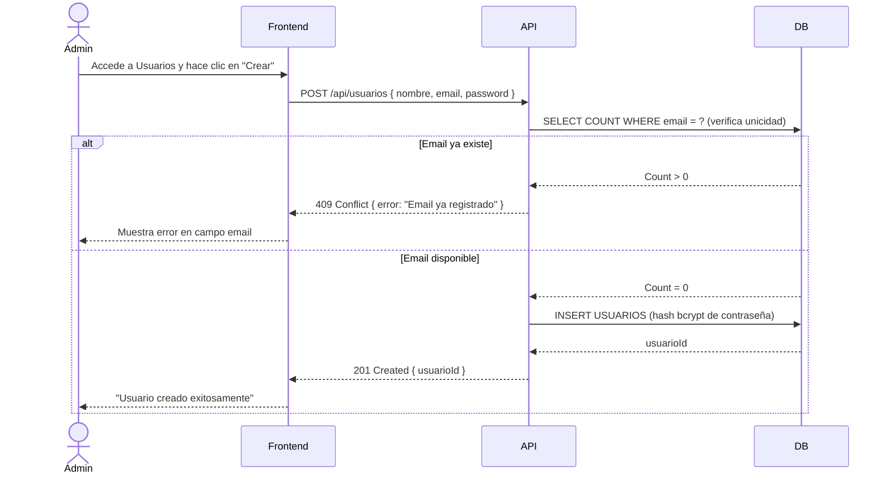

# US-003: Gestión de Usuarios

## 📜 [Original]

## Historia
Como **Administrador**, quiero crear, visualizar, editar y desactivar usuarios del sistema, para mantener el directorio de personas que interactúan con SMAT actualizado y controlado.

## Épica
Acceso y Seguridad

## Prioridad
- **MoSCoW**: Must Have
- **RICE Score**: Alcance: 10 | Impacto: 3 | Confianza: 90% | Esfuerzo: 1 → Puntaje: 27

## Estimación
- **Story Points (Fibonacci)**: 5
- **T-Shirt Size**: M
- **Justificación**: CRUD estándar de usuarios con validaciones (unicidad de email, formato). Incluye gestión de contraseña inicial y estado activo/inactivo. Sin complejidad técnica inusual. El equipo convergería en 5 puntos por la validación y el manejo seguro de contraseñas.

## Caso de Uso

### Caso de Uso: Gestión de Usuarios
- **Actores**: Administrador
- **Precondiciones**: El Administrador está autenticado.
- **Flujo Principal**:
  1. El Administrador accede al módulo de Usuarios.
  2. Visualiza el listado de usuarios (activos e inactivos).
  3. Crea un nuevo usuario con email, nombre y contraseña inicial.
  4. Edita datos de un usuario existente.
  5. Desactiva (soft-delete) un usuario que ya no debe tener acceso.
- **Flujos Alternativos**:
  - Email duplicado: el sistema rechaza la creación con mensaje de error.
  - Desactivar usuario con sesión activa: se invalida su refresh token.
- **Postcondiciones**: El usuario existe en el sistema con el estado configurado. Si se desactiva, no puede iniciar sesión.

### Diagrama



## Criterios de Aceptación (BDD)

### Feature: Administración del directorio de usuarios

#### Escenario 1: Crear un nuevo usuario exitosamente
```gherkin
Given que soy Administrador autenticado
When creo un usuario con nombre "Juan Pérez", email "juan@empresa.cl" y contraseña inicial "TempPass123!"
Then el sistema crea el usuario con estado activo
  And almacena la contraseña con hash bcrypt
  And el usuario aparece en el listado de usuarios activos
  And el usuario puede iniciar sesión con esas credenciales
```

#### Escenario 2: Intentar crear un usuario con email ya registrado
```gherkin
Given que existe un usuario con email "juan@empresa.cl"
When el Administrador intenta crear otro usuario con el mismo email
Then el sistema retorna HTTP 409 Conflict
  And muestra el mensaje "El email ya está registrado en el sistema"
  And no se crea ningún registro nuevo
```

#### Escenario 3: Desactivar un usuario activo
```gherkin
Given que existe el usuario "María González" con estado activo y sesiones vigentes
When el Administrador desactiva a ese usuario
Then el sistema marca al usuario como inactivo (activo = false)
  And se invalidan todos los refresh tokens del usuario
  And el usuario no puede iniciar sesión ni continuar sesiones activas
  And el usuario sigue visible en el listado con estado "Inactivo"
```

#### Escenario 4: Editar datos de un usuario existente
```gherkin
Given que existe el usuario "Carlos Soto" con email "carlos@empresa.cl"
When el Administrador actualiza su nombre a "Carlos Andrés Soto"
Then el sistema actualiza el registro en la base de datos
  And el cambio se refleja inmediatamente en el listado
  And el email permanece sin cambios si no fue modificado
```

## Notas Técnicas
- **Endpoints API involucrados**: `GET /api/usuarios`, `POST /api/usuarios`, `GET /api/usuarios/{id}`, `PUT /api/usuarios/{id}`, `DELETE /api/usuarios/{id}`
- **Entidades del modelo de datos**: `USUARIOS` (entidad implícita en el PRD), `USUARIO_OBRA_PERFIL`
- La desactivación es un **soft-delete** (`activo = false`), no eliminación física.
- Al desactivar un usuario, invalidar todos sus refresh tokens activos.
- El listado debe soportar paginación y filtro por estado (activo/inactivo) y por nombre/email.

## Requisitos No Funcionales
- **Seguridad**: Solo Administrador puede gestionar usuarios. Las contraseñas nunca se retornan en las respuestas de la API. Hash bcrypt con cost ≥ 12.
- **Rendimiento**: Listado de usuarios con paginación < 500ms.

## Dependencias
- **Bloqueado por**: US-001 (autenticación), US-002 (perfiles deben existir para asignación posterior)
- **Bloquea**: US-004 (asignación de usuario a obra requiere usuarios existentes)

## Definition of Done
- [ ] Todos los criterios de aceptación cumplidos
- [ ] Pruebas unitarias escritas y pasando (≥90% cobertura)
- [ ] Código revisado y aprobado
- [ ] Documentación actualizada
- [ ] Sin regresiones en funcionalidad existente

---

## 🚀 [Enhanced - Task Plan]

### 📖 Resumen de la Solución
CRUD de `Usuario` con unicidad de email, hash bcrypt (cost ≥ 12), soft-delete y listado paginado con filtros. Al desactivar, el JWT del usuario queda inválido en su próxima petición (401 → redirect login).

### 🛠️ Lista de Tareas y Subtareas

#### 🟦 BACKEND
- [ ] **Tarea: Implementar Lógica y Persistencia**
  - Subtarea: Actualizar entidad `Usuario` con VOs `Email` y `Rut` (con validación de dígito verificador chileno), métodos `Desactivar()` y `SetPassword(bcrypt, cost ≥ 12)`.
  - Subtarea: Implementar commands `CreateUsuarioCommand`, `UpdateUsuarioCommand`, `DesactivarUsuarioCommand`, `GetUsuariosQuery` (paginado + filtros) con handlers (Result Pattern).
  - Subtarea: Actualizar `UsuarioConfiguration.cs`: índice único `Email`, columnas `Apellido`, `Rut`, `PasswordHash`, `Activo` default `true`.
  - Subtarea: Extender `IUsuarioRepository` con `ExistsByEmailAsync()` y `GetPagedAsync(filtros)`.
  - Subtarea: Generar migración EF Core para nuevas columnas.
- [ ] **Tarea: Exposición de API**
  - Subtarea: Crear endpoints Minimal API: `GET /api/usuarios` (paginado + filtros), `POST`, `GET/PUT /api/usuarios/{id}`, `DELETE` (soft-delete).
  - Subtarea: Configurar política `usuarios:manage` (solo Administrador). Nunca retornar `passwordHash` en respuestas.
  - Subtarea: Agregar logs Serilog: creación y desactivación con `{Email}` y `{AdminId}`.

#### 🟨 FRONTEND
- [ ] **Tarea: Desarrollo de UI**
  - Subtarea: Listado paginado con filtros: búsqueda por nombre/email y toggle Estado activo/inactivo.
  - Subtarea: Formulario de creación con validación inline: unicidad de email, formato Rut (con dígito verificador), password mínimo 8 chars.
  - Subtarea: Formulario de edición (solo Nombre, Apellido — no email) y botón "Desactivar" con modal de confirmación.
- [ ] **Tarea: Integración**
  - Subtarea: Servicios HTTP para todos los endpoints CRUD.
  - Subtarea: Validación de email único con debounce (llamar `GET /api/usuarios?email=` antes de submit).
  - Subtarea: Manejar error 409 (email duplicado) con mensaje en campo específico.

#### 🟩 TESTING & QA
- [ ] **Tarea: Pruebas Automatizadas**
  - Subtarea: Unit Tests `CreateUsuarioCommandHandlerTests`: éxito, email duplicado → 409, Rut inválido → 400, contraseña débil → 400.
  - Subtarea: Unit Tests `DesactivarUsuarioCommandHandlerTests`: usuario activo → éxito, ya inactivo → idempotente.
  - Subtarea: Integration Test Testcontainers: crear usuario → desactivar → verificar que login retorna 403.
- [ ] **Tarea: Validación de Usuario**
  - Subtarea: Verificar Escenario 1: crear usuario → aparece en listado activos y puede iniciar sesión.
  - Subtarea: Verificar Escenario 2: email duplicado → 409 con mensaje en campo.
  - Subtarea: Verificar Escenario 3: desactivar usuario → no puede iniciar sesión.
  - Subtarea: Verificar Escenario 4: editar nombre → cambio inmediato en listado.

---
## 📝 NOTAS DE ARQUITECTURA
- bcrypt cost ≥ 12 obligatorio; no retornar `passwordHash` en ninguna respuesta de la API.
- Soft-delete: marcar `Activo = false`, sin eliminación física del registro.
- Validación de Rut debe ocurrir en dominio (dígito verificador), no solo formato.
