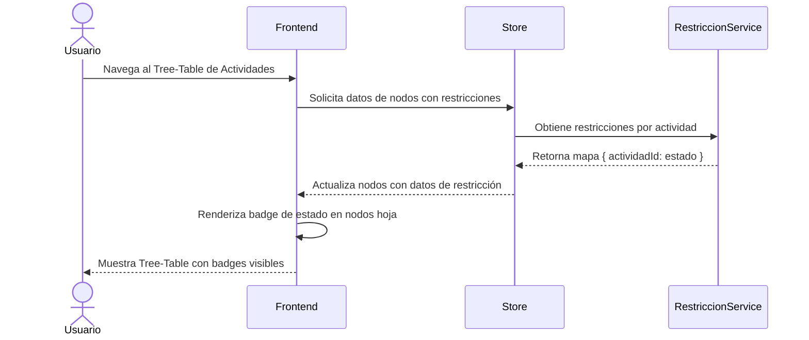

# US-003: Badge de estado de restricción en nodos hoja

## Historia
Como **usuario del Tree-Table de Actividades**, quiero **ver el badge de estado de restricción renderizado directamente en las filas**, para **identificar visualmente qué actividades tienen restricciones activas sin salir de la tabla**.

## Épica
Épica 1: Optimización y Control Jerárquico en Tree-Table de Actividades

## Prioridad
- **MoSCoW**: Should
- **RICE Score**: Reach: 4 | Impact: 3 | Confidence: 90% | Effort: 3 → Score: 3.60

## Estimación
- **Story Points (Fibonacci)**: 3
- **T-Shirt Size**: S
- **Planning Poker Rationale**: Complejidad baja-media. El mapeo de datos de restricción al badge visual ya existe en la vista de tareas tradicionales. Solo se necesita replicar el mismo componente en las filas del Tree-Table. El equipo convergería en 3 porque el patrón ya está resuelto, solo cambia el contenedor.

## Caso de Uso

### Caso de Uso: Visualización de estado de restricción en nodos hoja
- **Actores**: Usuario del Tree-Table
- **Precondiciones**: El Tree-Table muestra actividades. Al menos una actividad (nodo hoja) tiene una restricción asociada.
- **Flujo Principal**:
  1. El usuario visualiza el Tree-Table con actividades
  2. Para cada nodo hoja, el sistema consulta si existen restricciones asociadas
  3. Si existe una restricción, se renderiza un badge con el estado (ej. "Pendiente", "Vencida", "Cerrada")
  4. El badge sigue la misma estética y paleta de colores que en la vista de tareas tradicionales
- **Flujos Alternativos**: Si el nodo no tiene restricciones, no se muestra badge
- **Postcondiciones**: El Tree-Table muestra badges de restricción en los nodos hoja que correspondan

### Diagrama del Caso de Uso



## Criterios de Aceptación (BDD)

### Feature: Badge de estado de restricción en nodos hoja

#### Escenario 1: Nodo hoja con restricción pendiente — badge visible
```gherkin
Dado que el Tree-Table muestra actividades jerárquicas
  Y la actividad "Excavar cimiento" (nodo hoja) tiene una restricción en estado "Pendiente"
Cuando el usuario visualiza la fila de "Excavar cimiento"
Entonces la fila muestra un badge con el texto "Pendiente"
  Y el badge utiliza el color amarillo (#F59E0B) consistente con la vista de tareas
  Y el badge es clickeable y abre el detalle de la restricción
```

#### Escenario 2: Nodo hoja sin restricciones — sin badge
```gherkin
Dado que el Tree-Table muestra actividades jerárquicas
  Y la actividad "Colocar vigas" no tiene restricciones asociadas
Cuando el usuario visualiza la fila de "Colocar vigas"
Entonces la fila no muestra ningún badge de restricción
  Y el espacio de la columna permanece vacío (no se distorsiona el layout)
```

#### Escenario 3: Nodo padre con restricciones en hijos — sin badge propio
```gherkin
Dado que el Tree-Table muestra actividades jerárquicas
  Y el nodo "Piso 1" tiene hijos con restricciones pero él mismo no
Cuando el usuario visualiza la fila de "Piso 1"
Entonces la fila no muestra un badge de restricción individual
  Y el comportamiento de badge resumido se maneja en US-004
```

#### Escenario 4: Badge refleja cambios en tiempo real
```gherkin
Dado que el Tree-Table muestra un badge "Pendiente" para la actividad "Excavar cimiento"
Cuando un usuario cierra la restricción desde otro panel
  Y el Tree-Table recibe la actualización vía WebSocket o polling
Entonces el badge cambia a "Cerrada" con color verde (#10B981)
  Y no es necesario recargar la página para ver el cambio
```

## Notas Técnicas
- **Archivos/componentes afectados**: `ConstraintBadge.vue` (reutilizar), `TreeTableRow.vue`, store de restricciones
- **Endpoints involucrados**: `GET /api/restricciones?actividadId={id}` o equivalente
- **Entidades del modelo de datos**: `Restriccion { id, actividadId, estado, fechaCreacion }`

## Requisitos No Funcionales
- **Rendimiento**: La carga de badges no debe incrementar el tiempo de renderizado inicial del Tree-Table en más de 100ms. Evaluar carga lazy de estados para árboles grandes.
- **Accesibilidad**: Los badges deben tener contraste suficiente (WCAG AA) y texto descriptivo para lectores de pantalla.
- **Seguridad**: No aplica.

## Dependencias
- **Bloqueado por**: Ninguna
- **Bloquea**: US-004 (Estado de restricción resumido en nodos padre)

## Definición de Done
- [ ] Todos los criterios de aceptación cumplidos
- [ ] Pruebas unitarias escritas y pasando (≥90% cobertura)
- [ ] Código revisado y aprobado
- [ ] Documentación actualizada
- [ ] Sin regresiones en funcionalidad existente
