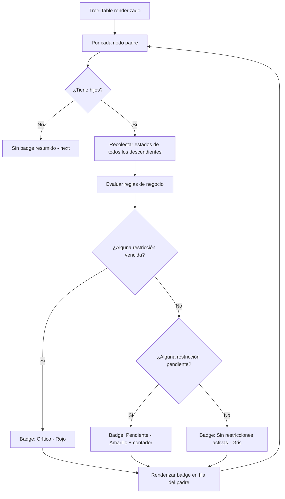

# US-004: Estado de restricción resumido en nodos padre

## Historia
Como **usuario del Tree-Table de Actividades**, quiero **ver un resumen visual del estado de restricciones en los nodos padre que agrupa el estado de sus nodos hijos**, para **identificar rápidamente qué secciones del árbol tienen restricciones sin expandir cada nodo manualmente**.

## Épica
Épica 1: Optimización y Control Jerárquico en Tree-Table de Actividades

## Prioridad
- **MoSCoW**: Could
- **RICE Score**: Reach: 4 | Impact: 3 | Confidence: 80% | Effort: 5 → Score: 1.92

## Estimación
- **Story Points (Fibonacci)**: 5
- **T-Shirt Size**: M
- **Planning Poker Rationale**: Complejidad media. Requiere lógica de agregación: recorrer hijos recursivamente para determinar el estado resumido (ej. "crítico" si algún hijo tiene restricción vencida, "pendiente" si hay alguna abierta, "ok" si todas están cerradas). El equipo convergería en 5 porque la agregación es iterativa pero requiere manejar múltiples reglas de negocio para determinar el estado compuesto.

## Caso de Uso

### Caso de Uso: Visualización de estado resumido de restricciones en nodos padre
- **Actores**: Usuario del Tree-Table
- **Precondiciones**: El Tree-Table muestra una estructura jerárquica. Existen nodos padre con hijos que tienen restricciones.
- **Flujo Principal**:
  1. El usuario visualiza el Tree-Table
  2. Para cada nodo padre, el sistema evalúa recursivamente los estados de restricción de todos sus descendientes
  3. El sistema determina el estado resumido según reglas de negocio (prioridad: vencida > pendiente > cerrada)
  4. Se renderiza un badge compuesto en la fila del nodo padre
  5. El badge muestra un contador de restricciones activas (ej. "3 pendientes")
- **Flujos Alternativos**: Si ningún descendiente tiene restricciones, no se muestra badge en el padre
- **Postcondiciones**: Los nodos padre muestran un badge resumido con el estado agregado de sus descendientes

### Diagrama del Caso de Uso



## Criterios de Aceptación (BDD)

### Feature: Estado resumido de restricciones en nodos padre

#### Escenario 1: Nodo padre con hijos con restricciones variadas
```gherkin
Dado que el nodo "Piso 1" tiene 3 hijos:
  - "Habitación 1A" con restricción "Vencida"
  - "Habitación 1B" con restricción "Pendiente"
  - "Habitación 1C" sin restricciones
Cuando el sistema calcula el estado resumido para "Piso 1"
Entonces el badge muestra estado "Crítico" con color rojo (#EF4444)
  Y el tooltip del badge indica "2 restricciones activas: 1 vencida, 1 pendiente"
```

#### Escenario 2: Nodo padre con todas las restricciones cerradas
```gherkin
Dado que el nodo "Piso 2" tiene 2 hijos, ambos con restricciones en estado "Cerrada"
Cuando el sistema calcula el estado resumido para "Piso 2"
Entonces el badge muestra estado "Completado" con color verde (#10B981)
  Y el tooltip indica "Todas las restricciones resueltas"
```

#### Escenario 3: Nodo padre sin restricciones en su subárbol
```gherkin
Dado que el nodo "Piso 3" tiene 2 hijos sin ninguna restricción asociada
Cuando el sistema calcula el estado resumido para "Piso 3"
Entonces no se muestra ningún badge en la fila de "Piso 3"
  Y el espacio de la columna permanece vacío
```

#### Escenario 4: Nodo padre con profundidad de 4 niveles
```gherkin
Dado un árbol donde "Obra" → "Edificio A" → "Torre 1" → "Piso 5" → "Habitación 501"
  Y "Habitación 501" tiene una restricción "Vencida"
Cuando el sistema calcula el estado resumido para "Obra"
Entonces "Obra" muestra badge "Crítico" (propagación desde 4 niveles abajo)
  Y el cálculo recursivo se completa en < 100ms
```

## Notas Técnicas
- **Archivos/componentes afectados**: `ConstraintBadge.vue`, `ConstraintAggregator.ts` (nuevo), `TreeTableRow.vue`
- **Endpoints involucrados**: Mismos que US-003 — la agregación es del lado del cliente
- **Entidades del modelo de datos**: `Restriccion { id, actividadId, estado, fechaCreacion }`, estructura de árbol

## Requisitos No Funcionales
- **Rendimiento**: El cálculo agregado para todo el árbol debe completarse en < 300ms para 500 nodos. Implementar cache por subárbol que se invalida solo cuando cambian restricciones en ese subárbol.
- **Accesibilidad**: El badge resumido debe tener un tooltip accesible vía teclado y lector de pantalla con el desglose de estados.
- **Seguridad**: No aplica.

## Dependencias
- **Bloqueado por**: US-003 (Badge de estado en nodos hoja)
- **Bloquea**: Ninguna

## Definición de Done
- [ ] Todos los criterios de aceptación cumplidos
- [ ] Pruebas unitarias escritas y pasando (≥90% cobertura)
- [ ] Código revisado y aprobado
- [ ] Documentación actualizada
- [ ] Sin regresiones en funcionalidad existente
