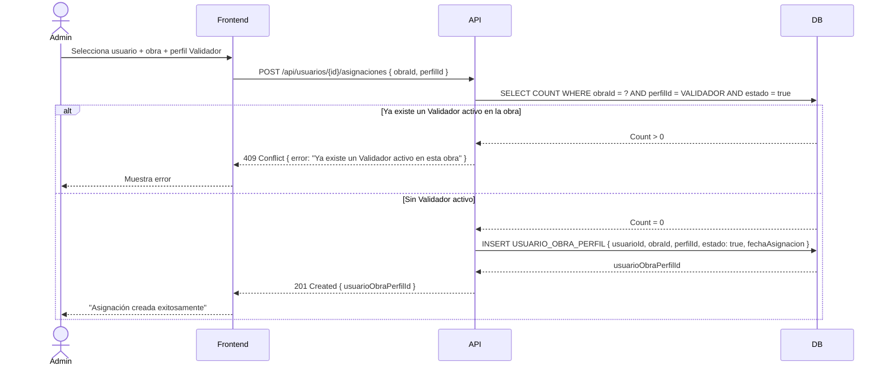

## Tracking
- **Platform**: jira
- **External ID**: SMAT-18
- **URL**: https://syntaxis.atlassian.net/browse/SMAT-18

# US-004: Asignación de Usuario a Obra

## 📜 [Original]

## Historia
Como **Administrador**, quiero asignar usuarios a obras con un perfil específico, para que cada persona tenga acceso y permisos correctos según su rol en ese proyecto.

## Épica
Acceso y Seguridad

## Prioridad
- **MoSCoW**: Must Have
- **RICE Score**: Alcance: 15 | Impacto: 3 | Confianza: 90% | Esfuerzo: 0.6 → Puntaje: 67.5

## Estimación
- **Story Points (Fibonacci)**: 3
- **T-Shirt Size**: S
- **Justificación**: Creación de registros en `USUARIO_OBRA_PERFIL`. La regla de negocio crítica (máximo un Validador activo por obra) agrega algo de lógica de validación. El equipo convergería en 3 puntos — es una operación de asignación con una regla de unicidad importante.

## Caso de Uso

### Caso de Uso: Asignación de Usuario a Obra
- **Actores**: Administrador
- **Precondiciones**: El usuario existe y está activo. La obra existe y está activa. El perfil a asignar existe.
- **Flujo Principal**:
  1. El Administrador accede al módulo de Usuarios o Obras.
  2. Selecciona un usuario y elige "Asignar a Obra".
  3. Selecciona la obra y el perfil para la asignación.
  4. El sistema valida la regla de unicidad del Validador.
  5. El sistema crea el registro en `USUARIO_OBRA_PERFIL` con estado activo.
- **Flujos Alternativos**:
  - Asignar un segundo Validador a la misma obra: el sistema rechaza la operación.
  - Reasignar un usuario que ya tiene asignación activa en esa obra: el sistema actualiza el perfil.
- **Postcondiciones**: El usuario puede operar en esa obra con los permisos del perfil asignado.

### Diagrama



## Criterios de Aceptación (BDD)

### Feature: Asignación de usuarios a obras con perfil específico

#### Escenario 1: Asignar un Controlador a una obra exitosamente
```gherkin
Given que existen el usuario "Felipe Castillo", la obra "Proyecto Norte" y el perfil "Controlador"
  And "Proyecto Norte" no tiene asignado a "Felipe Castillo" con ningún perfil activo
When el Administrador asigna a "Felipe Castillo" como Controlador en "Proyecto Norte"
Then el sistema crea el registro en USUARIO_OBRA_PERFIL con estado activo
  And "Felipe Castillo" puede acceder al módulo de control de avances de "Proyecto Norte"
```

#### Escenario 2: Intentar asignar un segundo Validador a la misma obra
```gherkin
Given que la obra "Proyecto Norte" ya tiene a "Rodrigo Méndez" como Validador activo
When el Administrador intenta asignar a "Ana Torres" también como Validador en "Proyecto Norte"
Then el sistema retorna HTTP 409 Conflict
  And muestra el mensaje "Esta obra ya tiene un Validador activo asignado"
  And no se crea ningún registro nuevo
```

#### Escenario 3: Desactivar una asignación existente
```gherkin
Given que "Felipe Castillo" tiene asignación activa como Controlador en "Proyecto Norte"
When el Administrador desactiva esa asignación
Then el sistema actualiza USUARIO_OBRA_PERFIL SET estado = false
  And "Felipe Castillo" ya no puede registrar avances en "Proyecto Norte"
  And aún puede acceder a otras obras donde tenga asignaciones activas
```

#### Escenario 4: Usuario sin asignación activa intenta registrar avances
```gherkin
Given que "Pedro López" tiene perfil Controlador pero NO tiene asignación activa en "Obra Sur"
When "Pedro López" intenta acceder al módulo de control de avances de "Obra Sur"
Then el sistema retorna HTTP 403 Forbidden
  And muestra el mensaje "No tienes acceso a esta obra"
```

## Notas Técnicas
- **Endpoints API involucrados**: `POST /api/usuarios/{id}/asignaciones`, `GET /api/usuarios/{id}/asignaciones`, `PUT /api/usuarios/{id}/asignaciones/{asignacionId}`
- **Entidades del modelo de datos**: `USUARIO_OBRA_PERFIL`, `USUARIOS`, `OBRAS`, `PERFILES`
- La restricción de unicidad del Validador debe implementarse tanto como constraint de BD como validación en capa de servicio.
- Un usuario puede tener múltiples asignaciones activas en distintas obras.
- La desactivación de una asignación es soft-delete (`estado = false`).

## Requisitos No Funcionales
- **Seguridad**: Solo Administrador puede crear/modificar asignaciones. El middleware RBAC verifica permiso `asignaciones:manage`.
- **Rendimiento**: Creación de asignación < 500ms.

## Dependencias
- **Bloqueado por**: US-003 (usuarios deben existir), US-005 (obras deben existir)
- **Bloquea**: US-008 (la carga XML requiere usuarios asignados), US-010 (el control requiere asignación activa)

## Definition of Done
- [ ] Todos los criterios de aceptación cumplidos
- [ ] Pruebas unitarias escritas y pasando (≥90% cobertura)
- [ ] Código revisado y aprobado
- [ ] Documentación actualizada
- [ ] Sin regresiones en funcionalidad existente

---

## 🚀 [Enhanced - Task Plan]

### 📖 Resumen de la Solución
Gestión de `UsuarioObraPerfil` (asignación). Regla crítica: máximo un Validador activo por obra (constraint en BD + validación en servicio para evitar race conditions). Soft-delete (`Estado = false`). La asignación activa controla el RBAC por obra en toda la plataforma.

### 🛠️ Lista de Tareas y Subtareas

#### 🟦 BACKEND
- [ ] **Tarea: Implementar Lógica y Persistencia**
  - Subtarea: Crear entidad `UsuarioObraPerfil` con invariante `ValidarUnicidadValidador()` y método `Desactivar()`.
  - Subtarea: Implementar `AsignarUsuarioObraCommand`, `DesactivarAsignacionCommand`, `GetAsignacionesByUsuarioQuery` con handlers (Result Pattern).
  - Subtarea: Crear `UsuarioObraPerfilConfiguration.cs` con índice único filtrado `(ObraId, PerfilId) WHERE Estado = true AND PerfilId = VALIDADOR_ID`.
  - Subtarea: Implementar `IUsuarioObraPerfilRepository` con `ExistsValidadorActivoEnObraAsync(obraId)` y `GetByUsuarioIdAsync(usuarioId)`.
  - Subtarea: Generar migración EF Core con el constraint de unicidad filtrado.
- [ ] **Tarea: Exposición de API**
  - Subtarea: Crear endpoints Minimal API: `POST /api/usuarios/{id}/asignaciones`, `GET /api/usuarios/{id}/asignaciones`, `PUT /api/usuarios/{id}/asignaciones/{asignacionId}`.
  - Subtarea: Configurar política `asignaciones:manage` (solo Administrador) y agregar log Serilog de asignación.

#### 🟨 FRONTEND
- [ ] **Tarea: Desarrollo de UI**
  - Subtarea: Selector de obra + perfil en pantalla de detalle de usuario (dropdowns con búsqueda).
  - Subtarea: Listado de asignaciones del usuario: Obra, Perfil, Estado, Fecha y acción Desactivar.
  - Subtarea: Mostrar mensaje claro para error 409 "Ya existe un Validador activo en esta obra".
- [ ] **Tarea: Integración**
  - Subtarea: Servicios HTTP para todos los endpoints de asignaciones.
  - Subtarea: Recargar listado de asignaciones del usuario tras operación exitosa.
  - Subtarea: Manejar error 409 (Validador duplicado) con mensaje en contexto.

#### 🟩 TESTING & QA
- [ ] **Tarea: Pruebas Automatizadas**
  - Subtarea: Unit Test `AsignarUsuarioObraCommandHandlerTests`: Controlador exitoso, segundo Validador → 409, desactivar asignación → éxito.
  - Subtarea: Unit Test del invariante `ValidarUnicidadValidador` en dominio.
  - Subtarea: Integration Test Testcontainers: asignar → verificar RBAC en endpoint protegido → desactivar → verificar 403.
- [ ] **Tarea: Validación de Usuario**
  - Subtarea: Verificar Escenario 1: asignar Controlador → accede al módulo de control de la obra.
  - Subtarea: Verificar Escenario 2: segundo Validador → 409 con mensaje específico.
  - Subtarea: Verificar Escenario 3: desactivar asignación → pérdida de acceso a la obra.
  - Subtarea: Verificar Escenario 4: usuario sin asignación activa → 403 al acceder a control.

---
## 📝 NOTAS DE ARQUITECTURA
- El constraint de unicidad del Validador debe existir tanto en BD (índice filtrado) como en la capa de servicio para evitar race conditions en asignaciones concurrentes.
- Un usuario puede tener asignaciones activas en múltiples obras simultáneamente.
