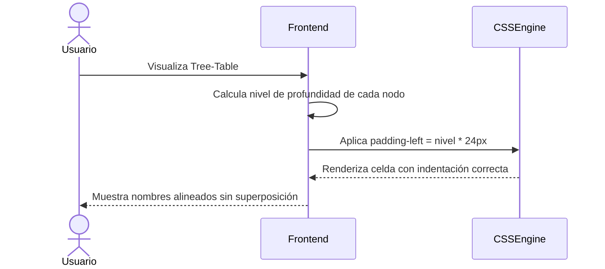

# US-005: Ajuste de alineación de texto en columna "Nombre"

## Historia
Como **usuario del Tree-Table de Actividades**, quiero **que el texto en la columna "Nombre" esté correctamente alineado respetando la indentación del árbol**, para **leer claramente los nombres de las actividades sin que se superpongan con los iconos de expansión**.

## Épica
Épica 1: Optimización y Control Jerárquico en Tree-Table de Actividades

## Prioridad
- **MoSCoW**: Should
- **RICE Score**: Reach: 5 | Impact: 2 | Confidence: 95% | Effort: 3 → Score: 3.17

## Estimación
- **Story Points (Fibonacci)**: 2
- **T-Shirt Size**: XS
- **Planning Poker Rationale**: Complejidad muy baja. Es un ajuste puramente CSS: revisar el `padding-left` dinámico por nivel jerárquico, asegurar que el texto no se solape con el chevron de expansión, y verificar la alineación vertical. El equipo convergería en 2 porque es solo CSS existente por ajustar, sin lógica nueva.

## Caso de Uso

### Caso de Uso: Alineación de texto en columna Nombre
- **Actores**: Usuario del Tree-Table
- **Precondiciones**: El Tree-Table está renderizado con datos jerárquicos. La columna "Nombre" contiene el chevron de expansión/colapso.
- **Flujo Principal**:
  1. El usuario visualiza el Tree-Table
  2. En la columna "Nombre", el sistema aplica `padding-left` incremental por nivel de profundidad
  3. El texto del nombre se alinea verticalmente con el chevron
  4. El texto no se superpone con el chevron ni con los bordes de la celda
- **Flujos Alternativos**: Si el nodo no tiene hijos (hoja), el padding se mantiene pero sin chevron
- **Postcondiciones**: La columna "Nombre" muestra el texto alineado correctamente en todos los niveles del árbol

### Diagrama del Caso de Uso



## Criterios de Aceptación (BDD)

### Feature: Alineación de texto en columna Nombre

#### Escenario 1: Texto alineado correctamente en todos los niveles
```gherkin
Dado un Tree-Table con 4 niveles jerárquicos
  Y la columna "Nombre" contiene el chevron de expansión
Cuando el usuario visualiza la tabla
Entonces el texto del nivel 1 tiene padding-left de 0px
  Y el texto del nivel 2 tiene padding-left de 24px
  Y el texto del nivel 3 tiene padding-left de 48px
  Y el texto del nivel 4 tiene padding-left de 72px
  Y ningún texto se superpone con el chevron de expansión
```

#### Escenario 2: Nodo sin chevron (hoja) — padding consistente
```gherkin
Dado un Tree-Table con nodos hoja (sin hijos)
Cuando el usuario visualiza un nodo hoja en nivel 2
Entonces el padding-left es de 24px (consistente con nodos del mismo nivel que tienen chevron)
  Y no se muestra el icono de chevron
  Y el texto comienza en la misma posición horizontal que los nodos con chevron en el mismo nivel
```

#### Escenario 3: Ventana responsive — sin pérdida de indentación
```gherkin
Dado un Tree-Table visible en una ventana de 768px de ancho
Cuando el usuario reduce la ventana a 480px de ancho
Entonces la indentación por nivel se reduce proporcionalmente (padding: nivel * 16px)
  Y el texto no se trunca injustificadamente
  Y el chevron permanece visible sin superposición
```

#### Escenario 4: Nodo con nombre largo — texto truncado con ellipsis
```gherkin
Dado un nodo en nivel 4 con un nombre de 80 caracteres
  Y el ancho disponible después del padding es de 150px
Cuando el sistema renderiza la celda
Entonces el texto se trunca con ellipsis ("...") al final
  Y el tooltip con el nombre completo aparece al hacer hover
```

## Notas Técnicas
- **Archivos/componentes afectados**: `TreeTable.vue` (estilos CSS), variables de indentación
- **Endpoints involucrados**: Ninguno
- **Entidades del modelo de datos**: Ninguna — solo presentación visual

## Requisitos No Funcionales
- **Rendimiento**: No aplica — es solo CSS.
- **Accesibilidad**: El truncamiento con ellipsis debe incluir `title` o `aria-label` con el nombre completo. La indentación visual debe mantenerse en modo de alto contraste.
- **Seguridad**: No aplica.

## Dependencias
- **Bloqueado por**: Ninguna
- **Bloquea**: Ninguna

## Definición de Done
- [ ] Todos los criterios de aceptación cumplidos
- [ ] Pruebas unitarias escritas y pasando (≥90% cobertura)
- [ ] Código revisado y aprobado
- [ ] Documentación actualizada
- [ ] Sin regresiones en funcionalidad existente
