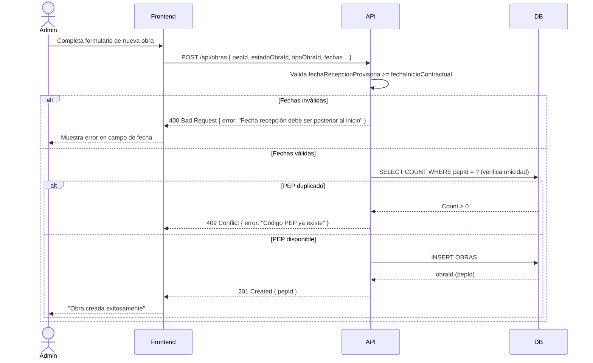

# US-005: Gestión de Obras

## 📜 [Original]

## Historia
Como **Administrador**, quiero crear, visualizar, editar y administrar obras con sus fechas contractuales, tipo y estado, para tener un registro centralizado de todos los proyectos de construcción de la empresa.

## Épica
Obras

## Prioridad
- **MoSCoW**: Must Have
- **RICE Score**: Alcance: 20 | Impacto: 3 | Confianza: 90% | Esfuerzo: 1.6 → Puntaje: 33.75

## Estimación
- **Story Points (Fibonacci)**: 8
- **T-Shirt Size**: L
- **Justificación**: CRUD de obras con múltiples campos de fecha, filtros de estado, relación con tipos/estados de obra y visualización para múltiples roles. El formulario de creación es extenso (fechas contractuales, tipo, estado, configuraciones). El equipo probablemente debatiría entre 5 y 8, convergiendo en 8 por la complejidad del formulario y el filtrado.

## Caso de Uso

### Caso de Uso: Gestión de Obras
- **Actores**: Administrador (CRUD), Analista / Validador / Controlador (solo visualización)
- **Precondiciones**: El Administrador está autenticado. Existen tipos y estados de obra en el catálogo.
- **Flujo Principal**:
  1. El Administrador accede al módulo de Obras.
  2. Visualiza el listado con filtros por estado (Vigente / Futuro / Terminado).
  3. Crea una nueva obra con código PEP, fechas contractuales, tipo y estado.
  4. Edita una obra existente para actualizar sus datos.
  5. Desactiva una obra (`activo = false`) cuando ya no es relevante.
- **Flujos Alternativos**:
  - Código PEP duplicado: el sistema rechaza la creación.
  - `fechaRecepcionProvisoria` anterior a `fechaInicioContractual`: el sistema muestra error de validación.
- **Postcondiciones**: La obra existe en el sistema y es visible para los usuarios con acceso.

### Diagrama



## Criterios de Aceptación (BDD)

### Feature: Administración de obras de construcción

#### Escenario 1: Crear una obra nueva exitosamente
```gherkin
Given que soy Administrador autenticado
  And existen los catálogos de tipos y estados de obra
When creo una obra con PEP "P-2026-001", tipo "Habitacional", estado "Vigente" y fechas válidas
Then el sistema crea la obra con estado activo
  And la obra aparece en el listado filtrado por "Vigente"
  And los usuarios asignados a esa obra pueden visualizarla
```

#### Escenario 2: Validación de fechas contractuales incoherentes
```gherkin
Given que estoy creando una nueva obra
When ingreso una fechaRecepcionProvisoria anterior a la fechaInicioContractual
Then el sistema retorna HTTP 400 Bad Request
  And muestra el mensaje "La fecha de recepción provisoria debe ser posterior al inicio contractual"
  And no se crea ningún registro
```

#### Escenario 3: Filtrar obras por estado
```gherkin
Given que existen obras con estados "Vigente", "Futuro" y "Terminado"
When el usuario selecciona el filtro "Vigente" en el listado de obras
Then el sistema muestra únicamente las obras con estado "Vigente"
  And las obras con otros estados no aparecen en el listado
```

#### Escenario 4: Intento de crear obra con código PEP duplicado
```gherkin
Given que ya existe una obra con PEP "P-2026-001"
When el Administrador intenta crear otra obra con el mismo código PEP
Then el sistema retorna HTTP 409 Conflict
  And muestra el mensaje "El código PEP ya está registrado"
  And no se crea ningún registro nuevo
```

#### Escenario 5: Visualización de obras por roles sin permisos de edición
```gherkin
Given que soy Controlador con asignación activa en "Obra Norte"
When accedo al módulo de Obras
Then puedo visualizar los datos de "Obra Norte"
  And no tengo disponibles los botones de "Crear", "Editar" ni "Desactivar"
```

## Notas Técnicas
- **Endpoints API involucrados**: `GET /api/obras`, `POST /api/obras`, `GET /api/obras/{id}`, `PUT /api/obras/{id}`
- **Entidades del modelo de datos**: `OBRAS`, `ESTADO_OBRA`, `TIPOS_OBRA`
- El campo `activo` implementa soft-delete.
- El listado de obras debe soportar filtro por `estadoObraId` y paginación.
- Los roles no-Administrador solo ven obras donde tienen `USUARIO_OBRA_PERFIL` activo.

## Requisitos No Funcionales
- **Seguridad**: CRUD solo para Administrador. Visualización disponible para todos los roles en sus obras asignadas.
- **Rendimiento**: Listado de obras < 500ms. Formulario de creación con validación en frontend antes de enviar al servidor.

## Dependencias
- **Bloqueado por**: US-001 (autenticación)
- **Bloquea**: US-004 (asignación), US-006 (sub-etapas), US-008 (cargas)

## Definition of Done
- [ ] Todos los criterios de aceptación cumplidos
- [ ] Pruebas unitarias escritas y pasando (≥90% cobertura)
- [ ] Código revisado y aprobado
- [ ] Documentación actualizada
- [ ] Sin regresiones en funcionalidad existente

---

## 🚀 [Enhanced - Task Plan]

### 📖 Resumen de la Solución
CRUD de `Obra` con validación de fechas contractuales, unicidad de PEP y soft-delete. RBAC diferenciado: Admin gestiona todas las obras; otros roles solo visualizan sus obras asignadas vía `USUARIO_OBRA_PERFIL`.

### 🛠️ Lista de Tareas y Subtareas

#### 🟦 BACKEND
- [ ] **Tarea: Implementar Lógica y Persistencia**
  - Subtarea: Crear entidad `Obra` con VO `PepId`, invariante `ValidarFechasContractuales()` (recepción provisoria ≥ inicio contractual) y método `Desactivar()`.
  - Subtarea: Implementar `CreateObraCommand`, `UpdateObraCommand`, `GetObrasQuery` (filtros `EstadoObraId` + RBAC por `UsuarioId`) con handlers (Result Pattern).
  - Subtarea: Crear `ObraConfiguration.cs`: PK string `PepId`, FKs a `TIPOS_OBRA`/`ESTADO_OBRA`, columna `VistaFisicaHabilitada`.
  - Subtarea: Implementar `IObraRepository` con `ExistsByPepIdAsync(pepId)` y `GetPagedWithFiltrosAsync(filtros, usuarioId)`.
  - Subtarea: Generar migración EF Core para tabla `OBRAS` completa.
- [ ] **Tarea: Exposición de API**
  - Subtarea: Crear endpoints Minimal API: `GET /api/obras` (paginado + filtros), `POST /api/obras`, `GET/PUT /api/obras/{id}`.
  - Subtarea: Configurar políticas: `obras:manage` (Admin) y `obras:read` (todos los roles, filtrado por asignación activa).
  - Subtarea: Agregar logs Serilog de creación y actualización con `{PepId}` y `{UserId}`.

#### 🟨 FRONTEND
- [ ] **Tarea: Desarrollo de UI**
  - Subtarea: Listado de obras con chips de filtro por estado (Vigente / Futuro / Terminado) y paginación.
  - Subtarea: Formulario extenso de creación/edición: código PEP, Nombre, Tipo, Estado y 3 campos de fecha con date-picker.
  - Subtarea: Validación de fechas en cliente antes de enviar (recepción provisoria ≥ inicio contractual).
  - Subtarea: Mostrar/ocultar botones Crear/Editar/Desactivar según rol del usuario.
- [ ] **Tarea: Integración**
  - Subtarea: Cargar selectores `TipoObra` y `EstadoObra` desde endpoints de catálogo al abrir formulario.
  - Subtarea: Servicios HTTP para todos los endpoints CRUD de obras.
  - Subtarea: Aplicar filtro RBAC en frontend: usuarios no-Admin solo ven obras de sus asignaciones activas.

#### 🟩 TESTING & QA
- [ ] **Tarea: Pruebas Automatizadas**
  - Subtarea: Unit Tests `CreateObraCommandHandlerTests`: éxito, PEP duplicado → 409, fechas inválidas → 400.
  - Subtarea: Unit Test invariante `ValidarFechasContractuales`: recepción anterior al inicio → excepción de dominio.
  - Subtarea: Integration Test Testcontainers: crear obra → filtrar por estado → verificar que Controlador solo ve su obra asignada.
- [ ] **Tarea: Validación de Usuario**
  - Subtarea: Verificar Escenario 1: crear obra → aparece en listado "Vigente".
  - Subtarea: Verificar Escenario 2: fechas incoherentes → 400 con mensaje de campo.
  - Subtarea: Verificar Escenarios 3 y 4: filtro por estado; PEP duplicado → 409.
  - Subtarea: Verificar Escenario 5: Controlador visualiza obra sin botones de edición.

---
## 📝 NOTAS DE ARQUITECTURA
- La validación de fechas debe ocurrir tanto en frontend (UX inmediata) como en backend (integridad de dominio).
- Soft-delete: campo `activo = false`; los registros no se eliminan físicamente.
- Roles no-Admin ven únicamente obras donde tienen `USUARIO_OBRA_PERFIL` activo.
