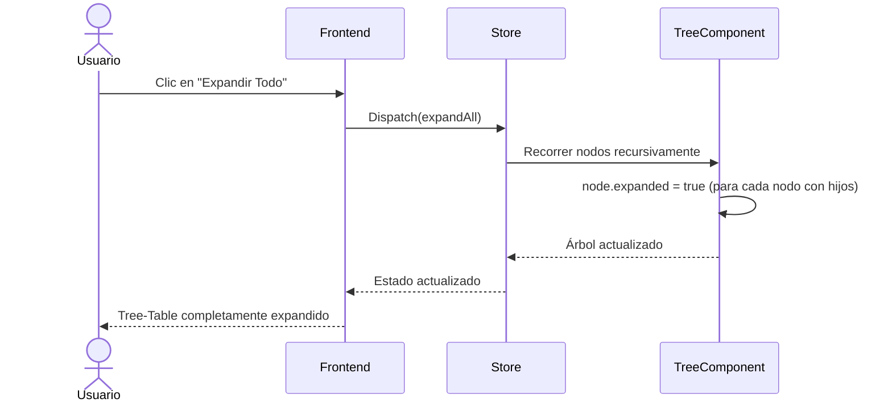

# US-006: Control global de expansión y colapso

## Historia
Como **usuario del Tree-Table de Actividades**, quiero **disponer de botones "Expandir Todo" y "Colapsar Todo" en la parte superior de la tabla**, para **navegar rápidamente entre una vista general y una vista detallada del árbol sin tener que expandir/colapsar nodos uno por uno**.

## Épica
Épica 1: Optimización y Control Jerárquico en Tree-Table de Actividades

## Prioridad
- **MoSCoW**: Must
- **RICE Score**: Reach: 5 | Impact: 3 | Confidence: 95% | Effort: 3 → Score: 4.75

## Estimación
- **Story Points (Fibonacci)**: 3
- **T-Shirt Size**: S
- **Planning Poker Rationale**: Complejidad baja. Requiere implementar un método que recorra recursivamente el arreglo de nodos en memoria y altere la propiedad booleana `expanded`, gatillando la detección de cambios del framework. El equipo convergería en 3 porque el recorrido recursivo es simple pero hay que considerar el rendimiento para evitar congelar la UI en árboles grandes.

## Caso de Uso

### Caso de Uso: Control global de expansión del Tree-Table
- **Actores**: Usuario del Tree-Table
- **Precondiciones**: El Tree-Table está renderizado con múltiples nodos en diferentes estados de expansión.
- **Flujo Principal**:
  1. El usuario visualiza la botonera superior del Tree-Table
  2. El usuario hace clic en "Expandir Todo"
  3. El sistema recorre recursivamente todos los nodos del árbol
  4. Para cada nodo con hijos, establece `node.expanded = true`
  5. El framework detecta los cambios y actualiza la UI
  6. Todos los nodos se muestran expandidos
- **Flujo Alternativo**: El usuario hace clic en "Colapsar Todo" → todos los nodos se establecen como `expanded = false`, mostrando solo el nivel raíz
- **Postcondiciones**: El estado de expansión global se actualiza y persiste en la sesión actual

### Diagrama del Caso de Uso



## Criterios de Aceptación (BDD)

### Feature: Control global de expansión y colapso

#### Escenario 1: Expandir Todo — árbol de 3 niveles
```gherkin
Dado un Tree-Table con 30 nodos distribuidos en 3 niveles
  Y todos los nodos están colapsados inicialmente
Cuando el usuario hace clic en el botón "Expandir Todo"
Entonces todos los nodos con hijos se muestran expandidos
  Y los 30 nodos son visibles en la tabla
  Y el botón "Expandir Todo" se deshabilita momentáneamente durante la operación
  Y la UI no se congela durante la expansión
```

#### Escenario 2: Colapsar Todo desde estado expandido
```gherkin
Dado un Tree-Table con todos los nodos expandidos
  Y el usuario ha navegado a una posición específica del árbol
Cuando el usuario hace clic en el botón "Colapsar Todo"
Entonces todos los nodos se colapsan
  Y solo los nodos raíz son visibles
  Y la posición de scroll permanece en el tope de la tabla
```

#### Escenario 3: Árbol grande (>500 nodos) — sin congelación de UI
```gherkin
Dado un Tree-Table con 500 nodos distribuidos en 6 niveles
  Y todos los nodos están colapsados
Cuando el usuario hace clic en "Expandir Todo"
Entonces la operación de expansión se completa en < 200ms
  Y la UI permanece responsiva durante la operación
  Y todos los nodos se renderizan correctamente
```

#### Escenario 4: Alternar entre expandir y colapsar repetidamente
```gherkin
Dado un Tree-Table con 100 nodos
Cuando el usuario hace clic en "Expandir Todo" 3 veces seguidas
  Y luego hace clic en "Colapsar Todo"
Entonces no se producen errores de doble actualización
  Y el estado final es el esperado (todos colapsados)
  Y no hay fugas de memoria ni listeners duplicados
```

## Notas Técnicas
- **Archivos/componentes afectados**: `TreeTable.vue` (botonera), `treeStore.ts` o equivalente (métodos `expandAll`/`collapseAll`)
- **Endpoints involucrados**: Ninguno — operación 100% frontend sobre estado en memoria
- **Entidades del modelo de datos**: `Node { id, expanded: boolean, children: Node[] }`

## Requisitos No Funcionales
- **Rendimiento**: La operación debe completarse en < 200ms para árboles de hasta 500 nodos. Evaluar el uso de `requestAnimationFrame` o Web Workers para árboles muy grandes. El framework debe usar detección de cambios eficiente (evitar re-renderizados innecesarios).
- **Accesibilidad**: Los botones deben tener etiquetas ARIA descriptivas ("Expandir todos los nodos", "Colapsar todos los nodos") y ser accesibles por teclado (Tab + Enter).
- **Seguridad**: No aplica.

## Dependencias
- **Bloqueado por**: Ninguna
- **Bloquea**: Ninguna

## Definición de Done
- [ ] Todos los criterios de aceptación cumplidos
- [ ] Pruebas unitarias escritas y pasando (≥90% cobertura)
- [ ] Código revisado y aprobado
- [ ] Documentación actualizada
- [ ] Sin regresiones en funcionalidad existente
