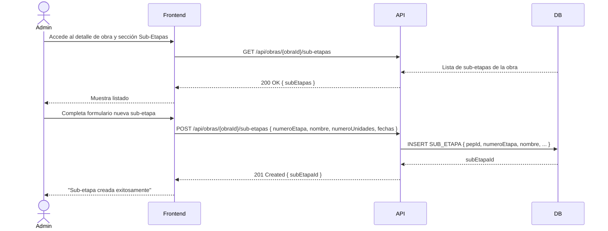

# US-006: Gestión de Sub-Etapas

## 📜 [Original]

## Historia
Como **Administrador**, quiero crear y gestionar sub-etapas dentro de una obra, para organizar el proyecto en unidades menores con sus propias fechas de hitos y número de unidades.

## Épica
Obras

## Prioridad
- **MoSCoW**: Must Have
- **RICE Score**: Alcance: 10 | Impacto: 2 | Confianza: 90% | Esfuerzo: 0.6 → Puntaje: 30

## Estimación
- **Story Points (Fibonacci)**: 3
- **T-Shirt Size**: S
- **Justificación**: CRUD simple de sub-etapas subordinadas a una obra. El formulario tiene pocos campos (número, nombre, unidades, fechas). Sin lógica de negocio compleja más allá de la relación con la obra padre. El equipo convergería en 3 puntos fácilmente.

## Caso de Uso

### Caso de Uso: Gestión de Sub-Etapas de Obra
- **Actores**: Administrador
- **Precondiciones**: La obra padre existe y está activa.
- **Flujo Principal**:
  1. El Administrador accede al detalle de una obra.
  2. Accede a la sección de Sub-Etapas.
  3. Crea una nueva sub-etapa con número, nombre, unidades y fechas de hitos.
  4. Edita o elimina sub-etapas existentes.
- **Flujos Alternativos**:
  - Número de etapa duplicado en la misma obra: el sistema rechaza la creación.
- **Postcondiciones**: La sub-etapa queda asociada a la obra con sus datos de hitos.

### Diagrama



## Criterios de Aceptación (BDD)

### Feature: Gestión de sub-etapas de obras

#### Escenario 1: Crear una sub-etapa exitosamente
```gherkin
Given que soy Administrador autenticado y existe la obra "Proyecto Norte"
When creo la sub-etapa número 1 con nombre "Torre A", 45 unidades y fechas de hitos válidas
Then el sistema crea el registro en SUB_ETAPA asociado a "Proyecto Norte"
  And la sub-etapa aparece en el listado de sub-etapas de esa obra
```

#### Escenario 2: Número de etapa duplicado en la misma obra
```gherkin
Given que la obra "Proyecto Norte" ya tiene una sub-etapa con número 1
When el Administrador intenta crear otra sub-etapa con número 1 en la misma obra
Then el sistema retorna HTTP 409 Conflict
  And muestra el mensaje "Ya existe una sub-etapa con ese número en esta obra"
```

#### Escenario 3: Editar una sub-etapa existente
```gherkin
Given que existe la sub-etapa "Torre A" en "Proyecto Norte"
When el Administrador actualiza el número de unidades de 45 a 50
Then el sistema actualiza el registro correctamente
  And el cambio se refleja en el listado de sub-etapas
```

## Notas Técnicas
- **Endpoints API involucrados**: `GET /api/obras/{id}/sub-etapas`, `POST /api/obras/{id}/sub-etapas`, `PUT /api/obras/{id}/sub-etapas/{subId}`, `DELETE /api/obras/{id}/sub-etapas/{subId}`
- **Entidades del modelo de datos**: `SUB_ETAPA`, `OBRAS`
- `numeroEtapa` debe ser único por obra (constraint compuesto).

## Requisitos No Funcionales
- **Seguridad**: Solo Administrador puede gestionar sub-etapas.

## Dependencias
- **Bloqueado por**: US-005 (la obra debe existir)
- **Bloquea**: Ninguna directamente (sub-etapas son datos de contexto)

## Definition of Done
- [ ] Todos los criterios de aceptación cumplidos
- [ ] Pruebas unitarias escritas y pasando (≥90% cobertura)
- [ ] Código revisado y aprobado
- [ ] Documentación actualizada
- [ ] Sin regresiones en funcionalidad existente

---

## 🚀 [Enhanced - Task Plan]

### 📖 Resumen de la Solución
CRUD de `SubEtapa` subordinada a `Obra`. Restricción compuesta única: `(PepId, NumeroEtapa)` tanto en BD como en capa de servicio. Proporciona datos de contexto de hitos para las vistas de control de avances.

### 🛠️ Lista de Tareas y Subtareas

#### 🟦 BACKEND
- [ ] **Tarea: Implementar Lógica y Persistencia**
  - Subtarea: Crear entidad `SubEtapa` con invariante de unicidad `NumeroEtapa` por obra.
  - Subtarea: Implementar `CreateSubEtapaCommand`, `UpdateSubEtapaCommand`, `DeleteSubEtapaCommand`, `GetSubEtapasByObraQuery` con handlers (Result Pattern).
  - Subtarea: Crear `SubEtapaConfiguration.cs` con FK a `OBRAS` y constraint único compuesto `(PepId, NumeroEtapa)`.
  - Subtarea: Implementar `ISubEtapaRepository` con `ExistsNumeroEtapaEnObraAsync(pepId, numeroEtapa)`.
  - Subtarea: Generar migración EF Core con constraint compuesto.
- [ ] **Tarea: Exposición de API**
  - Subtarea: Crear endpoints anidados: `GET/POST /api/obras/{id}/sub-etapas`, `PUT/DELETE /api/obras/{id}/sub-etapas/{subId}`.
  - Subtarea: Configurar política `sub-etapas:manage` (solo Administrador) y agregar log Serilog.

#### 🟨 FRONTEND
- [ ] **Tarea: Desarrollo de UI**
  - Subtarea: Sección "Sub-Etapas" en página de detalle de obra: tabla con Nro., Nombre, Unidades y Fechas Hito.
  - Subtarea: Formulario inline o panel lateral para crear/editar sub-etapa con botones Editar/Eliminar por fila.
  - Subtarea: Mostrar mensaje amigable para error 409 número de etapa duplicado.
- [ ] **Tarea: Integración**
  - Subtarea: Cargar sub-etapas al abrir detalle de obra: `GET /api/obras/{id}/sub-etapas`.
  - Subtarea: Servicios HTTP para CRUD de sub-etapas con `obraId` en ruta.
  - Subtarea: Actualizar listado automáticamente tras crear/editar/eliminar.

#### 🟩 TESTING & QA
- [ ] **Tarea: Pruebas Automatizadas**
  - Subtarea: Unit Test `CreateSubEtapaCommandHandlerTests`: éxito, número duplicado → 409.
  - Subtarea: Unit Test `UpdateSubEtapaCommandHandlerTests`: actualizar unidades → éxito.
  - Subtarea: Integration Test Testcontainers: crear → verificar constraint compuesto → eliminar → verificar eliminación.
- [ ] **Tarea: Validación de Usuario**
  - Subtarea: Verificar Escenario 1: crear sub-etapa "Torre A" con 45 unidades → aparece en listado.
  - Subtarea: Verificar Escenario 2: número de etapa duplicado → 409 con mensaje.
  - Subtarea: Verificar Escenario 3: editar unidades de 45 a 50 → cambio reflejado.

---
## 📝 NOTAS DE ARQUITECTURA
- La clave compuesta `(PepId, NumeroEtapa)` debe existir como constraint en BD.
- Las sub-etapas son datos de referencia de contexto; no requieren lógica de negocio compleja más allá de la unicidad.
