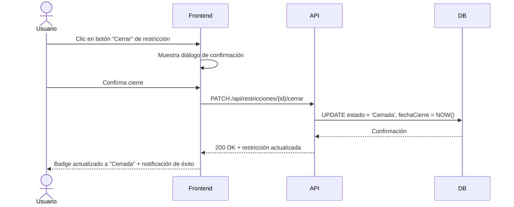

# US-007: Cierre directo de restricciones

## Historia
Como **usuario del panel de Restricciones**, quiero **poder cerrar una restricción directamente desde el listado sin tener que navegar a otra pantalla**, para **agilizar el flujo de trabajo de resolución de restricciones**.

## Épica
Épica 2: Gestión y Flexibilidad de Restricciones

## Prioridad
- **MoSCoW**: Could
- **RICE Score**: Reach: 4 | Impact: 4 | Confidence: 90% | Effort: 5 → Score: 2.88

## Estimación
- **Story Points (Fibonacci)**: 5
- **T-Shirt Size**: M
- **Planning Poker Rationale**: Complejidad media. Requiere un nuevo endpoint o acción en la API para cerrar restricciones, más un botón de acción en la UI del listado. El equipo convergería en 5 porque implica cambios tanto en frontend (nuevo botón + confirmación) como en backend (nueva ruta o actualización de estado).

## Caso de Uso

### Caso de Uso: Cierre directo de restricción
- **Actores**: Usuario con permisos de gestión de restricciones
- **Precondiciones**: Existe al menos una restricción en estado "Pendiente" o "Vencida". El usuario tiene permisos para cerrar restricciones.
- **Flujo Principal**:
  1. El usuario visualiza el listado de restricciones
  2. El usuario identifica una restricción que desea cerrar
  3. El usuario hace clic en el botón "Cerrar" de esa restricción
  4. El sistema muestra un diálogo de confirmación
  5. El usuario confirma el cierre
  6. El sistema envía la solicitud al backend
  7. El backend actualiza el estado de la restricción a "Cerrada"
  8. El listado se actualiza mostrando el nuevo estado
- **Flujos Alternativos**: El usuario cancela el diálogo de confirmación → no se realiza ninguna acción
- **Postcondiciones**: La restricción queda en estado "Cerrada" con fecha de cierre registrada

### Diagrama del Caso de Uso



## Criterios de Aceptación (BDD)

### Feature: Cierre directo de restricciones

#### Escenario 1: Cierre exitoso de restricción pendiente
```gherkin
Dado que existe una restricción en estado "Pendiente" con ID 456
  Y el usuario tiene permisos de "Gestor de Restricciones"
Cuando el usuario hace clic en "Cerrar" para la restricción 456
  Y confirma la acción en el diálogo
Entonces la restricción 456 cambia a estado "Cerrada"
  Y se registra la fecha y hora de cierre
  Y el listado refleja el cambio sin recargar la página
  Y se muestra una notificación "Restricción cerrada exitosamente"
```

#### Escenario 2: Usuario cancela el cierre
```gherkin
Dado que existe una restricción en estado "Pendiente"
Cuando el usuario hace clic en "Cerrar"
  Y luego hace clic en "Cancelar" en el diálogo de confirmación
Entonces la restricción permanece en estado "Pendiente"
  Y no se envía ninguna solicitud al backend
```

#### Escenario 3: Usuario sin permisos intenta cerrar
```gherkin
Dado que existe una restricción en estado "Pendiente"
  Y el usuario tiene rol de "Lector" sin permisos de cierre
Cuando el usuario visualiza la restricción
Entonces el botón "Cerrar" no está visible
  O el botón aparece deshabilitado con tooltip "No tienes permisos para cerrar restricciones"
```

#### Escenario 4: Restricción ya cerrada — acción no disponible
```gherkin
Dado que existe una restricción en estado "Cerrada"
Cuando el usuario visualiza la restricción
Entonces el botón "Cerrar" no está disponible
  Y se muestra un indicador visual de que ya está cerrada
```

## Notas Técnicas
- **Archivos/componentes afectados**: `RestriccionList.vue`, `RestriccionService.ts` (frontend), `restricciones.controller.ts`, `restricciones.service.ts` (backend)
- **Endpoints involucrados**: `PATCH /api/restricciones/{id}/cerrar` (nuevo)
- **Entidades del modelo de datos**: `Restriccion { id, estado, fechaCierre, cerradoPor }`

## Requisitos No Funcionales
- **Rendimiento**: La operación debe completarse en < 500ms (incluyendo latencia de red).
- **Seguridad**: Validar permisos en backend — solo usuarios con rol autorizado pueden cerrar restricciones. Registrar auditoría (quién cerró, cuándo).
- **Accesibilidad**: El diálogo de confirmación debe ser operable por teclado y tener roles ARIA apropiados.

## Dependencias
- **Bloqueado por**: Ninguna
- **Bloquea**: Ninguna

## Definición de Done
- [ ] Todos los criterios de aceptación cumplidos
- [ ] Pruebas unitarias escritas y pasando (≥90% cobertura)
- [ ] Código revisado y aprobado
- [ ] Documentación actualizada
- [ ] Sin regresiones en funcionalidad existente
