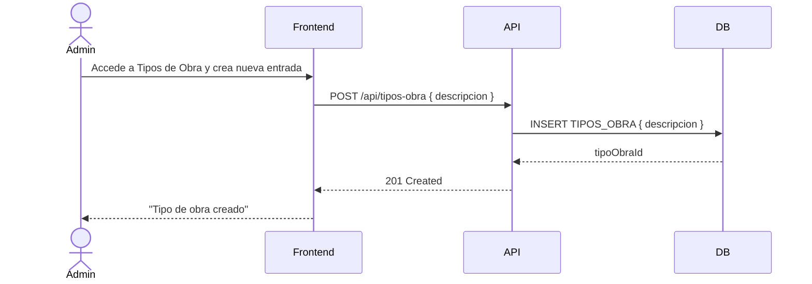

## Tracking
- **Platform**: jira
- **External ID**: SMAT-22
- **URL**: https://syntaxis.atlassian.net/browse/SMAT-22

# US-007: Gestión de Tipos y Estados de Obra

## 📜 [Original]

## Historia
Como **Administrador**, quiero gestionar los catálogos de tipos y estados de obra, para clasificar correctamente los proyectos según su naturaleza y ciclo de vida.

## Épica
Obras

## Prioridad
- **MoSCoW**: Should Have
- **RICE Score**: Alcance: 5 | Impacto: 1 | Confianza: 100% | Esfuerzo: 0.4 → Puntaje: 12.5

## Estimación
- **Story Points (Fibonacci)**: 2
- **T-Shirt Size**: XS
- **Justificación**: Dos CRUDs de catálogos simples (TIPOS_OBRA y ESTADOS_OBRA). Sin lógica de negocio compleja. El equipo convergería en 2 puntos de inmediato — son tablas de configuración estándar.

## Caso de Uso

### Caso de Uso: Gestión de Catálogos
- **Actores**: Administrador
- **Precondiciones**: El Administrador está autenticado.
- **Flujo Principal**:
  1. El Administrador accede a los módulos de Tipo Obra o Estado Obra.
  2. Visualiza, crea, edita o elimina entradas del catálogo.
- **Flujos Alternativos**:
  - Eliminar un tipo/estado en uso por una obra activa: el sistema impide la eliminación.
- **Postcondiciones**: Los catálogos están actualizados y disponibles en los formularios de creación de obras.

### Diagrama



## Criterios de Aceptación (BDD)

### Feature: Gestión de catálogos de tipos y estados de obra

#### Escenario 1: Crear un nuevo tipo de obra
```gherkin
Given que soy Administrador autenticado
When creo el tipo de obra "Infraestructura Vial"
Then el tipo aparece en el listado de tipos de obra
  And está disponible en el selector al crear/editar una obra
```

#### Escenario 2: Intentar eliminar un tipo de obra en uso
```gherkin
Given que el tipo "Habitacional" está asignado a 5 obras activas
When el Administrador intenta eliminar "Habitacional"
Then el sistema retorna HTTP 409 Conflict
  And muestra "No se puede eliminar un tipo de obra en uso"
```

#### Escenario 3: Crear un nuevo estado de obra
```gherkin
Given que soy Administrador autenticado
When creo el estado de obra "Paralizado"
Then el estado aparece en el listado y está disponible en los formularios de obras
```

## Notas Técnicas
- **Endpoints API involucrados**: `GET/POST /api/tipos-obra`, `PUT/DELETE /api/tipos-obra/{id}`, `GET/POST /api/estados-obra`, `PUT/DELETE /api/estados-obra/{id}`
- **Entidades del modelo de datos**: `TIPOS_OBRA`, `ESTADO_OBRA`
- Verificar referencias antes de permitir eliminación (check FK en `OBRAS`).

## Requisitos No Funcionales
- **Seguridad**: Solo Administrador puede gestionar estos catálogos.

## Dependencias
- **Bloqueado por**: US-001 (autenticación)
- **Bloquea**: Ninguna directamente

## Definition of Done
- [ ] Todos los criterios de aceptación cumplidos
- [ ] Pruebas unitarias escritas y pasando (≥90% cobertura)
- [ ] Código revisado y aprobado
- [ ] Documentación actualizada
- [ ] Sin regresiones en funcionalidad existente

---

## 🚀 [Enhanced - Task Plan]

### 📖 Resumen de la Solución
Dos CRUDs de catálogos de configuración: `TipoObra` y `EstadoObra`. Ambos tienen protección de eliminación referencial (no eliminar si está en uso por obras activas). Son datos de semilla que alimentan los selectores del formulario de Obras.

### 🛠️ Lista de Tareas y Subtareas

#### 🟦 BACKEND
- [ ] **Tarea: Implementar Lógica y Persistencia**
  - Subtarea: Crear entidades `TipoObra` y `EstadoObra` con invariante de protección referencial (no eliminar si tiene obras activas).
  - Subtarea: Implementar commands CRUD para ambos catálogos con handlers (Result Pattern) y chequeo de referencias antes de eliminar.
  - Subtarea: Crear `TipoObraConfiguration.cs` y `EstadoObraConfiguration.cs` con índices únicos en `Descripcion` y semilla de datos.
  - Subtarea: Implementar `ITipoObraRepository` e `IEstadoObraRepository` con `IsReferencedByObraAsync(id)`.
  - Subtarea: Generar migraciones EF Core para ambas tablas.
- [ ] **Tarea: Exposición de API**
  - Subtarea: Crear endpoints: `GET/POST /api/tipos-obra`, `PUT/DELETE /api/tipos-obra/{id}`, `GET/POST /api/estados-obra`, `PUT/DELETE /api/estados-obra/{id}`.
  - Subtarea: Configurar política `catalogos:manage` (solo Administrador) y agregar logs Serilog.

#### 🟨 FRONTEND
- [ ] **Tarea: Desarrollo de UI**
  - Subtarea: Dos pantallas de catálogo (o tabs) con tabla de entradas: Descripción + acciones Editar/Eliminar.
  - Subtarea: Formulario modal para crear/editar entrada del catálogo.
  - Subtarea: Mostrar mensaje amigable al intentar eliminar un catálogo en uso.
- [ ] **Tarea: Integración**
  - Subtarea: Servicios HTTP para CRUD de ambos catálogos.
  - Subtarea: Los selectores de Tipo/Estado en el formulario de Obras consumen `GET /api/tipos-obra` y `GET /api/estados-obra`.
  - Subtarea: Manejar error 409 en eliminación con mensaje "No se puede eliminar, está en uso por N obras".

#### 🟩 TESTING & QA
- [ ] **Tarea: Pruebas Automatizadas**
  - Subtarea: Unit Test `DeleteTipoObraCommandHandlerTests`: tipo en uso → 409, tipo libre → éxito.
  - Subtarea: Unit Test `DeleteEstadoObraCommandHandlerTests`: mismo patrón.
  - Subtarea: Integration Test Testcontainers: crear tipo → asignar a obra → eliminar tipo → verificar 409.
- [ ] **Tarea: Validación de Usuario**
  - Subtarea: Verificar Escenario 1: crear "Infraestructura Vial" → disponible en selector de obras.
  - Subtarea: Verificar Escenario 2: eliminar tipo asignado a obras activas → 409.
  - Subtarea: Verificar Escenario 3: crear estado "Paralizado" → disponible en formularios.

---
## 📝 NOTAS DE ARQUITECTURA
- Estos catálogos tienen semilla de BD cargada en migración; la UI los extiende pero no puede modificar entradas en uso activo.
- Los selectores de Tipo y Estado en el formulario de Obras deben reflejar el catálogo en tiempo real.
