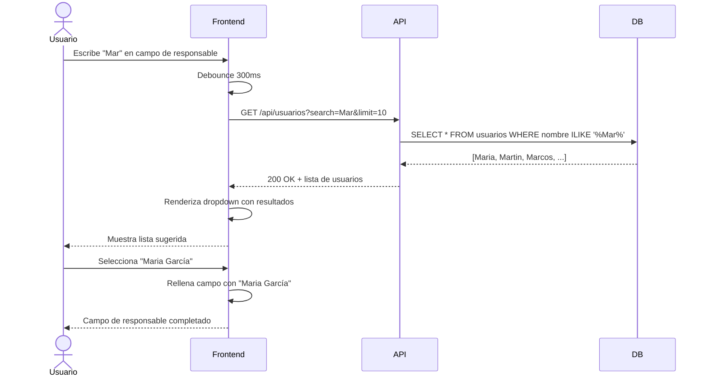

# US-008: Búsqueda predictiva de responsables

## Historia
Como **usuario del panel de Restricciones**, quiero **disponer de un buscador predictivo al asignar un responsable a una restricción**, para **encontrar y seleccionar rápidamente a la persona correcta sin tener que navegar por listas largas**.

## Épica
Épica 2: Gestión y Flexibilidad de Restricciones

## Prioridad
- **MoSCoW**: Could
- **RICE Score**: Reach: 4 | Impact: 3 | Confidence: 85% | Effort: 5 → Score: 2.04

## Estimación
- **Story Points (Fibonacci)**: 5
- **T-Shirt Size**: M
- **Planning Poker Rationale**: Complejidad media. Requiere un componente de autocomplete que consuma un endpoint de búsqueda de usuarios con debounce, manejo de estados de carga y error, y gestión de selección. El equipo convergería en 5 porque el patrón de autocomplete es común pero requiere integración con el backend de búsqueda de usuarios.

## Caso de Uso

### Caso de Uso: Búsqueda predictiva de responsables
- **Actores**: Usuario del panel de Restricciones
- **Precondiciones**: El usuario está creando o editando una restricción. Existe un directorio de usuarios disponible para búsqueda.
- **Flujo Principal**:
  1. El usuario hace clic en el campo "Responsable"
  2. El sistema muestra un dropdown vacío con placeholder "Buscar responsable..."
  3. El usuario comienza a escribir el nombre del responsable
  4. Después de 2 caracteres, el sistema envía una petición al backend con el texto de búsqueda
  5. El backend retorna una lista filtrada de hasta 10 usuarios
  6. El frontend muestra los resultados en un dropdown
  7. El usuario selecciona un responsable de la lista
  8. El campo se rellena con el nombre seleccionado
- **Flujos Alternativos**: La búsqueda no retorna resultados → se muestra mensaje "No se encontraron usuarios". El usuario borra el texto → el dropdown se cierra.
- **Postcondiciones**: El responsable queda asignado a la restricción

### Diagrama del Caso de Uso



## Criterios de Aceptación (BDD)

### Feature: Búsqueda predictiva de responsables

#### Escenario 1: Búsqueda exitosa con selección
```gherkin
Dado que el usuario está editando una restricción en el panel
  Y el campo "Responsable" está vacío
Cuando el usuario escribe "Mar" en el campo de responsable
  Y espera 300ms
Entonces se muestra un dropdown con hasta 10 usuarios que contienen "Mar" en su nombre
Cuando el usuario selecciona "Maria García" del dropdown
Entonces el campo se rellena con "Maria García"
  Y el ID de usuario de Maria García queda asociado a la restricción
```

#### Escenario 2: Búsqueda sin resultados
```gherkin
Dado que el usuario está editando una restricción
Cuando el usuario escribe "zzz" en el campo de responsable
  Y no existen usuarios con "zzz" en su nombre
Entonces el dropdown muestra el mensaje "No se encontraron usuarios"
  Y el campo permanece editable
```

#### Escenario 3: Error de red en la búsqueda
```gherkin
Dado que el usuario está escribiendo en el campo de responsable
Cuando ocurre un error de red al hacer la petición de búsqueda
Entonces el dropdown muestra el mensaje "Error al buscar responsables. Intenta nuevamente."
  Y el campo permanece editable con el texto ingresado
  Y el usuario puede intentar de nuevo escribiendo otro carácter
```

#### Escenario 4: Búsqueda con menos de 2 caracteres
```gherkin
Dado que el usuario está en el campo de responsable
Cuando el usuario escribe "M" (1 carácter)
Entonces no se realiza ninguna petición al backend
  Y el dropdown no se muestra
```

## Notas Técnicas
- **Archivos/componentes afectados**: `PredictiveSearch.vue` (nuevo componente), `ResponsableInput.vue`, `UsuarioService.ts`
- **Endpoints involucrados**: `GET /api/usuarios?search={texto}&limit=10` (existente o nuevo)
- **Entidades del modelo de datos**: `Usuario { id, nombre, email, avatar? }`

## Requisitos No Funcionales
- **Rendimiento**: Debounce de 300ms en la entrada. La respuesta del backend debe retornar en < 200ms. Limitar resultados a 10 usuarios.
- **Seguridad**: La búsqueda debe respetar permisos: solo mostrar usuarios que el usuario actual puede asignar como responsables.
- **Accesibilidad**: El autocomplete debe seguir el patrón ARIA `combobox` con `listbox` de opciones, navegable por teclado (flechas + Enter).

## Dependencias
- **Bloqueado por**: Ninguna
- **Bloquea**: Ninguna

## Definición de Done
- [ ] Todos los criterios de aceptación cumplidos
- [ ] Pruebas unitarias escritas y pasando (≥90% cobertura)
- [ ] Código revisado y aprobado
- [ ] Documentación actualizada
- [ ] Sin regresiones en funcionalidad existente
