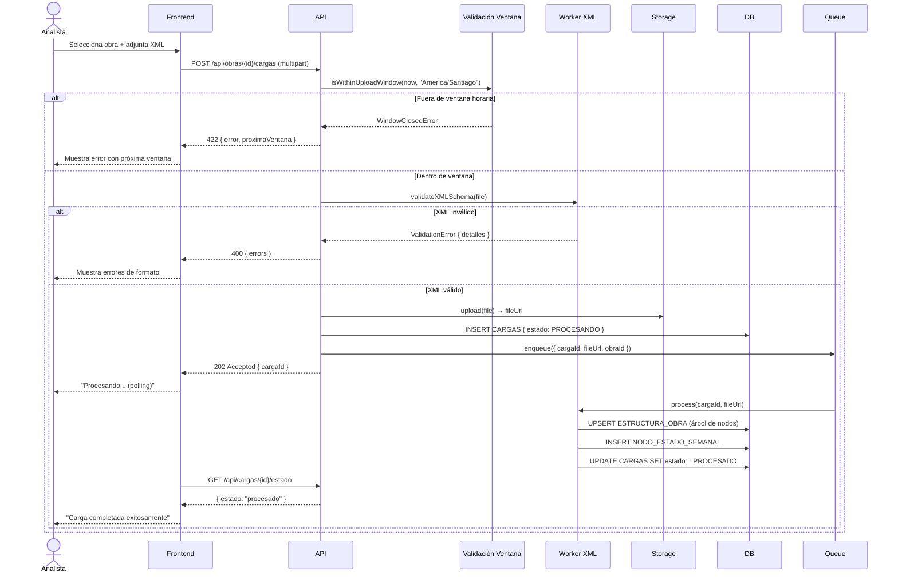

# US-008: Carga Semanal de Archivo XML

## 📜 [Original]

## Historia
Como **Analista**, quiero cargar el archivo XML semanal del programa de obra dentro de la ventana horaria permitida, para que el sistema actualice la estructura del proyecto y habilite el control de avances de la semana.

## Épica
Cargas

## Prioridad
- **MoSCoW**: Must Have
- **RICE Score**: Alcance: 30 | Impacto: 3 | Confianza: 80% | Esfuerzo: 2.6 → Puntaje: 27.7

## Estimación
- **Story Points (Fibonacci)**: 13
- **T-Shirt Size**: XL
- **Justificación**: Esta es la historia más compleja del sistema. Involucra: validación de ventana horaria con timezone (America/Santiago), upload de archivo a almacenamiento (S3/Blob), validación de esquema XML, procesamiento asíncrono (Worker + Queue) para construir el árbol `ESTRUCTURA_OBRA` y `NODO_ESTADO_SEMANAL`, manejo de estados de carga, y feedback en tiempo real al usuario. Alta incertidumbre en el formato exacto del XML. El equipo debatiría entre 8 y 13, convergiendo en 13 por la complejidad del parser XML asíncrono y el manejo de errores.

## Caso de Uso

### Caso de Uso: Carga Semanal de Archivo XML
- **Actores**: Analista, Administrador
- **Precondiciones**: La obra existe y está activa. El usuario tiene asignación activa con perfil Analista o Administrador. La fecha y hora actuales están dentro de la ventana: jueves 08:00 al jueves siguiente 07:59 (America/Santiago).
- **Flujo Principal**:
  1. El Analista accede al módulo de Cargas.
  2. Selecciona la obra para la carga.
  3. Adjunta el archivo XML del programa semanal.
  4. El sistema valida la ventana horaria.
  5. El sistema valida el formato XML contra el esquema esperado.
  6. El sistema sube el archivo al almacenamiento y crea el registro en `CARGAS` con estado "Procesando".
  7. El Worker procesa el archivo: construye/actualiza `ESTRUCTURA_OBRA` y `NODO_ESTADO_SEMANAL`.
  8. El sistema actualiza el estado de la carga a "Procesado".
  9. El Analista recibe confirmación de éxito.
- **Flujos Alternativos**:
  - Carga fuera de ventana horaria: rechazada con mensaje del próximo período disponible.
  - XML inválido: rechazado con detalle del error de validación.
  - Solo se permite información de hasta una semana anterior.
- **Postcondiciones**: La estructura semanal está disponible. Los controladores pueden registrar avances.

### Diagrama



## Criterios de Aceptación (BDD)

### Feature: Carga semanal de archivo XML de programa de obra

#### Escenario 1: Carga exitosa dentro de la ventana horaria
```gherkin
Given que soy Analista autenticado con asignación en "Proyecto Norte"
  And la fecha y hora actual es jueves 14:00 (America/Santiago)
  And el archivo "programa-semana-18.xml" tiene formato válido
When subo el archivo para "Proyecto Norte"
Then el sistema acepta la carga con estado "Procesando"
  And el Worker procesa el archivo y actualiza ESTRUCTURA_OBRA y NODO_ESTADO_SEMANAL
  And el estado final de la carga es "Procesado"
  And los controladores de "Proyecto Norte" pueden acceder a las vistas de control
```

#### Escenario 2: Intento de carga fuera de la ventana horaria
```gherkin
Given que la fecha y hora actual es martes 10:00 (America/Santiago)
  And la próxima ventana de carga abre el jueves a las 08:00
When el Analista intenta subir un archivo XML
Then el sistema retorna HTTP 422 Unprocessable Entity
  And muestra el mensaje "La carga solo está disponible entre jueves 08:00 y el próximo jueves 07:59"
  And indica la fecha y hora de apertura de la próxima ventana
  And no se crea ningún registro en CARGAS
```

#### Escenario 3: Carga con archivo XML de formato inválido
```gherkin
Given que soy Analista autenticado dentro de la ventana horaria
When subo un archivo XML con estructura que no cumple el esquema esperado
Then el sistema retorna HTTP 400 Bad Request
  And muestra los errores específicos de validación (campo y línea del error)
  And no se crea ningún registro en CARGAS
  And no se sube ningún archivo al almacenamiento
```

#### Escenario 4: Intento de cargar información de más de una semana anterior
```gherkin
Given que soy Analista autenticado dentro de la ventana horaria
When subo un archivo XML que corresponde a la semana de hace 2 semanas
Then el sistema retorna HTTP 422 Unprocessable Entity
  And muestra el mensaje "Solo se permite cargar información de hasta una semana anterior"
```

#### Escenario 5: Consultar el estado de procesamiento de una carga
```gherkin
Given que existe una carga con estado "Procesando" para "Proyecto Norte"
When el frontend consulta GET /api/cargas/{cargaId}/estado
Then el sistema retorna el estado actual ("procesando", "procesado", o "error")
  And si el estado es "error", incluye el mensaje de error del Worker
```

## Notas Técnicas
- **Endpoints API involucrados**: `POST /api/obras/{id}/cargas`, `GET /api/obras/{id}/cargas`, `GET /api/cargas/{id}/estado`
- **Entidades del modelo de datos**: `CARGAS`, `TIPOS_CARGA`, `ESTADOS_CARGA`, `ESTRUCTURA_OBRA`, `NODO_ESTADO_SEMANAL`
- La validación de timezone debe usar la zona `America/Santiago` (considera horario de verano).
- El procesamiento asíncrono usa una cola (Redis/RabbitMQ) + Worker separado.
- El campo `NODO_ESTADO_SEMANAL.pts` se determina por la columna PTS del XML; `avance` se inicializa en `false`.
- El frontend hace polling a `/api/cargas/{id}/estado` cada 3-5 segundos durante el procesamiento.
- Tamaño máximo de archivo: 10MB (configurable).

## Requisitos No Funcionales
- **Rendimiento**: El procesamiento del XML debe completarse en < 30 segundos para archivos estándar (< 10MB).
- **Seguridad**: Solo perfiles Analista y Administrador pueden realizar cargas. Los archivos en Storage deben tener URLs con expiración (presigned URLs). Sanitizar el XML para prevenir ataques XXE.
- **Disponibilidad**: La ventana de mantenimiento del sistema NO debe programarse durante la ventana de carga (jueves).

## Dependencias
- **Bloqueado por**: US-004 (asignación de usuarios a obras), US-005 (obras deben existir)
- **Bloquea**: US-009 (habilitar vista Física requiere carga), US-010 (vistas de control requieren carga activa)

## Definition of Done
- [ ] Todos los criterios de aceptación cumplidos
- [ ] Pruebas unitarias escritas y pasando (≥90% cobertura)
- [ ] Código revisado y aprobado
- [ ] Documentación actualizada
- [ ] Sin regresiones en funcionalidad existente

---

## 🚀 [Enhanced - Task Plan]

### 📖 Resumen de la Solución
Flujo asíncrono de 3 fases: (1) validación de `VentanaHoraria` (`America/Santiago`) + validación de esquema XML con sanitización XXE, (2) upload a Storage y creación de registro `CARGA` con estado `PROCESANDO` + encolado en Redis/RabbitMQ, (3) `CargaWorker` (Background Service) que parsea el XML y construye `ESTRUCTURA_OBRA` + `NODO_ESTADO_SEMANAL` mediante UPSERT. Polling desde frontend para seguimiento de estado.

### 🛠️ Lista de Tareas y Subtareas

#### 🟦 BACKEND
- [ ] **Tarea: Implementar Lógica y Persistencia**
  - Subtarea: Crear VO `VentanaHoraria` con `EstaAbierta(DateTimeOffset now, TimeZoneInfo tz)` — jueves 08:00 al siguiente jueves 07:59 `America/Santiago`.
  - Subtarea: Crear entidades `Carga`, `EstructuraObra` (FK auto-referencial) y `NodoEstadoSemanal`; configurar en EF Core con tablas `CARGAS`, `ESTRUCTURA_OBRA`, `NODO_ESTADO_SEMANAL`.
  - Subtarea: Implementar `CrearCargaCommandHandler` (Result Pattern): valida ventana, valida esquema XML, sube archivo, crea `Carga` con estado `PROCESANDO`, encola mensaje.
  - Subtarea: Implementar `ProcesarCargaCommandHandler` en `CargaWorker` (IHostedService): UPSERT `ESTRUCTURA_OBRA` + `NODO_ESTADO_SEMANAL`, actualiza estado a `PROCESADO` o `ERROR`.
  - Subtarea: Implementar `XmlValidatorService` con `XmlResolver = null` y `DtdProcessing = Prohibit` (XXE obligatorio).
  - Subtarea: Generar migraciones EF Core para las 3 tablas + semilla de `TIPOS_CARGA` y `ESTADOS_CARGA`.
- [ ] **Tarea: Exposición de API**
  - Subtarea: Endpoint `POST /api/obras/{id}/cargas` (multipart/form-data) — autorización `cargas:create` (Analista y Administrador); retorna `202 Accepted { cargaId }`.
  - Subtarea: Endpoint `GET /api/cargas/{id}/estado` — retorna `{ estado, errorDetalle? }`; sin restricción de rol (propietario de la obra).
  - Subtarea: Agregar logs Serilog: `"Carga {CargaId} iniciada"`, `"Carga {CargaId} procesada en {ElapsedMs}ms"`, `"Carga {CargaId} fallida: {Error}"`.

#### 🟨 FRONTEND
- [ ] **Tarea: Desarrollo de UI**
  - Subtarea: Componente drag-and-drop para subir XML con validación de tipo `.xml` y tamaño ≤ 10 MB antes del envío.
  - Subtarea: Spinner de progreso + estado textual ("Procesando…") activado tras recibir `202 Accepted`.
  - Subtarea: Panel de errores con detalle campo/línea cuando el API retorna `400` o `422`.
  - Subtarea: Lista de cargas históricas con badges de estado (`PROCESANDO`, `PROCESADO`, `ERROR`).
- [ ] **Tarea: Integración**
  - Subtarea: Polling a `GET /api/cargas/{id}/estado` cada 3–5 s hasta recibir estado final; detener polling y mostrar resultado.
  - Subtarea: Mostrar próxima ventana de apertura cuando el servidor retorna `422` por ventana cerrada.

#### 🟩 TESTING & QA
- [ ] **Tarea: Pruebas Automatizadas**
  - Subtarea: `VentanaHorariaTests` — jueves 10:00 → abierta, martes 10:00 → cerrada, borde jueves 07:59 → cerrada, jueves 08:00 → abierta (incluir DST America/Santiago).
  - Subtarea: `XmlValidatorServiceTests` — XML válido → ok, XML con entidad XXE → rechazado, esquema incorrecto → errores con campo y línea.
  - Subtarea: `ProcesarCargaCommandHandlerTests` — árbol XML de 5 nodos → verificar UPSERT correcto de `ESTRUCTURA_OBRA`.
- [ ] **Tarea: Validación de Usuario**
  - Subtarea: Verificar escenario BDD "Carga fuera de ventana → 422 con próxima apertura".
  - Subtarea: Integration Test con **Testcontainers**: flujo completo upload → polling estado → verificar `NODO_ESTADO_SEMANAL` en BD.

---
## 📝 NOTAS DE ARQUITECTURA
- **Seguridad XXE obligatoria**: `XmlReaderSettings { XmlResolver = null, DtdProcessing = DtdProcessing.Prohibit }` en toda lectura de XML.
- **Worker independiente**: `CargaWorker` corre como `IHostedService` en proceso separado; la API solo encola y retorna `202`.
- **Presigned URLs**: `IFileStorageService.GeneratePresignedUrlAsync(fileUrl, ttlMinutes)` se reutiliza en US-013 para descarga.
