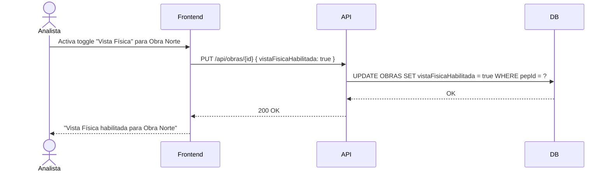

## Tracking
- **Platform**: jira
- **External ID**: SMAT-11
- **URL**: https://syntaxis.atlassian.net/browse/SMAT-11

# US-009: Habilitar Vista Física

## 📜 [Original]

## Historia
Como **Analista**, quiero activar o desactivar la visibilidad de la Vista Física para una obra, para controlar cuándo los controladores pueden acceder a esa vista de control.

## Épica
Cargas

## Prioridad
- **MoSCoW**: Should Have
- **RICE Score**: Alcance: 15 | Impacto: 1 | Confianza: 100% | Esfuerzo: 0.4 → Puntaje: 37.5

## Estimación
- **Story Points (Fibonacci)**: 2
- **T-Shirt Size**: XS
- **Justificación**: Toggle simple de visibilidad por obra. Un campo booleano en la configuración de la obra o en la carga activa. El equipo convergería en 2 puntos de inmediato — es una operación de configuración sin lógica de negocio compleja.

## Caso de Uso

### Caso de Uso: Habilitación de Vista Física
- **Actores**: Analista
- **Precondiciones**: Existe al menos una carga procesada para la obra. El Analista tiene asignación activa en la obra.
- **Flujo Principal**:
  1. El Analista accede a la configuración de la obra o al módulo de Cargas.
  2. Activa o desactiva la Vista Física para esa obra.
  3. El sistema guarda la configuración.
- **Postcondiciones**: Si está activa, los controladores ven la opción "Vista Física" en el módulo de control. Si está desactivada, la opción no aparece.

### Diagrama



## Criterios de Aceptación (BDD)

### Feature: Control de visibilidad de la Vista Física por obra

#### Escenario 1: Habilitar la Vista Física exitosamente
```gherkin
Given que soy Analista con asignación en "Proyecto Norte"
  And la Vista Física está deshabilitada para esa obra
When activo el toggle "Habilitar Vista Física"
Then el sistema actualiza la configuración de la obra
  And los controladores de "Proyecto Norte" ven la opción "Vista Física" en el módulo de control
```

#### Escenario 2: Deshabilitar la Vista Física
```gherkin
Given que la Vista Física está habilitada para "Proyecto Norte"
When el Analista desactiva el toggle
Then los controladores ya no pueden acceder a la Vista Física de "Proyecto Norte"
  And si intentan acceder directamente, reciben HTTP 403
```

#### Escenario 3: Controlador sin vista habilitada intenta acceder
```gherkin
Given que la Vista Física está deshabilitada para "Proyecto Norte"
When un Controlador intenta acceder a GET /api/obras/{id}/control/fisica
Then el sistema retorna HTTP 403 Forbidden
  And muestra "La Vista Física no está habilitada para esta obra"
```

## Notas Técnicas
- **Endpoints API involucrados**: `PUT /api/obras/{id}` (campo `vistaFisicaHabilitada`), `GET /api/obras/{id}/control/fisica`
- **Entidades del modelo de datos**: `OBRAS` (campo de configuración adicional) o `CARGAS` (flag por carga)
- La implementación más simple es un campo booleano en `OBRAS`. Alternativa: flag en la carga activa.

## Requisitos No Funcionales
- **Seguridad**: Solo perfiles Analista y Administrador pueden cambiar esta configuración.

## Dependencias
- **Bloqueado por**: US-008 (debe existir una carga procesada)
- **Bloquea**: US-011 (Vista Física requiere estar habilitada)

## Definition of Done
- [ ] Todos los criterios de aceptación cumplidos
- [ ] Pruebas unitarias escritas y pasando (≥90% cobertura)
- [ ] Código revisado y aprobado
- [ ] Documentación actualizada
- [ ] Sin regresiones en funcionalidad existente

---

## 🚀 [Enhanced - Task Plan]

### 📖 Resumen de la Solución
Toggle del campo booleano `VistaFisicaHabilitada` en la entidad `Obra`. Se agrega el método de dominio `Obra.HabilitarVistaFisica()` / `DeshabilitarVistaFisica()`, un command handler con validación de precondición (carga procesada existente), y verificación en el endpoint `GET /api/obras/{id}/control/fisica` que retorna `403` si el flag está en `false`.

### 🛠️ Lista de Tareas y Subtareas

#### 🟦 BACKEND
- [ ] **Tarea: Implementar Lógica y Persistencia**
  - Subtarea: Agregar campo `VistaFisicaHabilitada` (bool, default `false`) a la entidad `Obra` (si no se hizo en US-005); actualizar `ObraConfiguration.cs` y generar migración EF Core.
  - Subtarea: Implementar métodos de dominio `Obra.HabilitarVistaFisica()` y `Obra.DeshabilitarVistaFisica()`.
  - Subtarea: Implementar `SetVistaFisicaCommandHandler` (Result Pattern): verifica carga procesada para la obra, llama al método de dominio, persiste cambio vía `IObraRepository`.
  - Subtarea: Extender `IObraRepository` con `UpdateVistaFisicaAsync(obraId, habilitada)`.
- [ ] **Tarea: Exposición de API**
  - Subtarea: Endpoint `PUT /api/obras/{id}/vista-fisica { habilitada: bool }` — autorización `vista-fisica:manage` (Analista y Administrador).
  - Subtarea: Agregar guard en `GET /api/obras/{id}/control/fisica`: si `VistaFisicaHabilitada = false` → `Result.Failure(403, "La Vista Física no está habilitada para esta obra")`.
  - Subtarea: Agregar log Serilog: `"Vista Física {Habilitada/Deshabilitada} para Obra {ObraId} por {UserId}"`.

#### 🟨 FRONTEND
- [ ] **Tarea: Desarrollo de UI**
  - Subtarea: Toggle switch en la pantalla de configuración de obra, visible únicamente para Analista y Administrador.
  - Subtarea: Toast de confirmación al habilitar/deshabilitar: "Vista Física habilitada para {NombreObra}".
- [ ] **Tarea: Integración**
  - Subtarea: Mostrar/ocultar el ítem "Vista Física" en el menú de Control según el valor de `vistaFisicaHabilitada` devuelto por `GET /api/obras/{id}`.
  - Subtarea: Manejar respuesta `403` del endpoint de Vista Física mostrando mensaje informativo al usuario.

#### 🟩 TESTING & QA
- [ ] **Tarea: Pruebas Automatizadas**
  - Subtarea: `SetVistaFisicaCommandHandlerTests` — habilitar con carga procesada → éxito; habilitar sin carga procesada → `Result.Failure` con error de precondición.
  - Subtarea: `VistaFisicaAuthorizationTests` — acceder `GET /control/fisica` con flag `false` → 403; con flag `true` → 200.
- [ ] **Tarea: Validación de Usuario**
  - Subtarea: Verificar escenario BDD "Controlador sin vista habilitada intenta acceder → 403 con mensaje".
  - Subtarea: Integration Test con **Testcontainers**: habilitar → verificar acceso Controlador → deshabilitar → verificar 403.

---
## 📝 NOTAS DE ARQUITECTURA
- El flag `VistaFisicaHabilitada` vive en la entidad `Obra`; no se añade tabla nueva.
- La verificación del flag se hace en el `QueryHandler` (no en middleware) para mantener la lógica en Application layer.
- Esta US es requisito previo de US-011 (Vista Física de Control de Avances).
