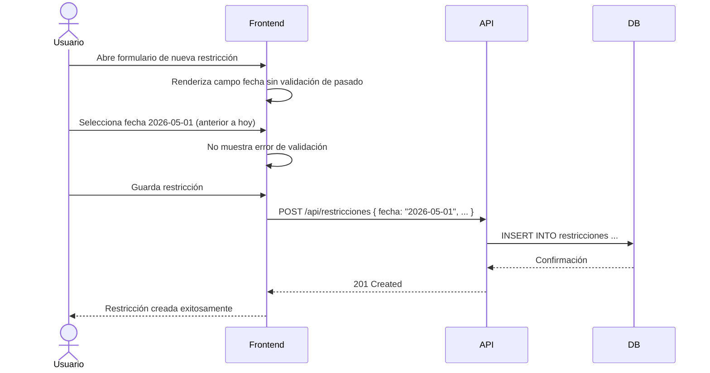

# US-009: Flexibilización de selección de fechas en restricciones

## Historia
Como **usuario del panel de Restricciones**, quiero **poder seleccionar fechas anteriores a la "fecha necesaria" al generar una restricción**, para **registrar restricciones que fueron identificadas con retroactividad sin ser bloqueado por la validación de fechas**.

## Épica
Épica 2: Gestión y Flexibilidad de Restricciones

## Prioridad
- **MoSCoW**: Should
- **RICE Score**: Reach: 3 | Impact: 4 | Confidence: 95% | Effort: 3 → Score: 3.80

## Estimación
- **Story Points (Fibonacci)**: 3
- **T-Shirt Size**: S
- **Planning Poker Rationale**: Complejidad baja. Consiste en modificar o eliminar la validación que impide seleccionar fechas pasadas en el formulario de restricciones. El equipo convergería en 3 porque el cambio es pequeño pero requiere revisar todas las validaciones de fecha asociadas para no romper otras reglas de negocio.

## Caso de Uso

### Caso de Uso: Creación de restricción con fecha retroactiva
- **Actores**: Usuario del panel de Restricciones
- **Precondiciones**: El usuario tiene permisos para crear restricciones. La fecha actual es posterior a la fecha que desea seleccionar.
- **Flujo Principal**:
  1. El usuario abre el formulario de creación de restricción
  2. El usuario selecciona el campo "Fecha de detección"
  3. El calendario permite seleccionar fechas pasadas sin restricción
  4. El usuario selecciona una fecha anterior a la fecha necesaria
  5. El sistema acepta la fecha sin mostrar error de validación
  6. El usuario guarda la restricción
- **Flujos Alternativos**: El usuario selecciona una fecha futura → se permite igualmente (no hay restricción en ninguna dirección)
- **Postcondiciones**: La restricción se crea con la fecha seleccionada, incluso si es anterior a la fecha necesaria o a la fecha actual

### Diagrama del Caso de Uso



## Criterios de Aceptación (BDD)

### Feature: Flexibilización de selección de fechas en restricciones

#### Escenario 1: Selección de fecha anterior a la fecha necesaria
```gherkin
Dado que el usuario está creando una restricción
  Y la fecha necesaria es 2026-06-20
  Y la fecha actual es 2026-06-16
Cuando el usuario selecciona "2026-06-01" como fecha de detección
Entonces el campo acepta la fecha sin mostrar errores de validación
  Y la restricción se guarda exitosamente
  Y la fecha registrada es "2026-06-01"
```

#### Escenario 2: Selección de fecha futura
```gherkin
Dado que el usuario está creando una restricción
  Y la fecha actual es 2026-06-16
Cuando el usuario selecciona "2026-07-01" como fecha de detección
Entonces el campo acepta la fecha sin mostrar errores de validación
  Y la restricción se guarda exitosamente
```

#### Escenario 3: Validación de formato de fecha
```gherkin
Dado que el usuario está creando una restricción
Cuando el usuario ingresa "fecha-invalida" en el campo de fecha
Entonces el campo muestra el error "Formato de fecha inválido"
  Y la restricción no puede guardarse hasta corregir el formato
```

#### Escenario 4: Fecha obligatoria no informada
```gherkin
Dado que el usuario está creando una restricción
  Y el campo de fecha es obligatorio
Cuando el usuario intenta guardar sin seleccionar una fecha
Entonces el campo muestra el error "La fecha de detección es obligatoria"
  Y la restricción no se guarda
```

## Notas Técnicas
- **Archivos/componentes afectados**: `RestriccionForm.vue`, `validators.ts` (regla `fechaNoAnteriorAFechaNecesaria` o similar)
- **Endpoints involucrados**: Ningún cambio en API — solo validación frontend
- **Entidades del modelo de datos**: `Restriccion { id, fechaDeteccion, fechaNecesaria }`

## Requisitos No Funcionales
- **Rendimiento**: No aplica.
- **Seguridad**: La validación de fechas en backend debe mantenerse alineada con frontend para evitar inconsistencias.
- **Accesibilidad**: El selector de fecha debe ser operable por teclado y compatible con lectores de pantalla.

## Dependencias
- **Bloqueado por**: Ninguna
- **Bloquea**: Ninguna

## Definición de Done
- [ ] Todos los criterios de aceptación cumplidos
- [ ] Pruebas unitarias escritas y pasando (≥90% cobertura)
- [ ] Código revisado y aprobado
- [ ] Documentación actualizada
- [ ] Sin regresiones en funcionalidad existente
