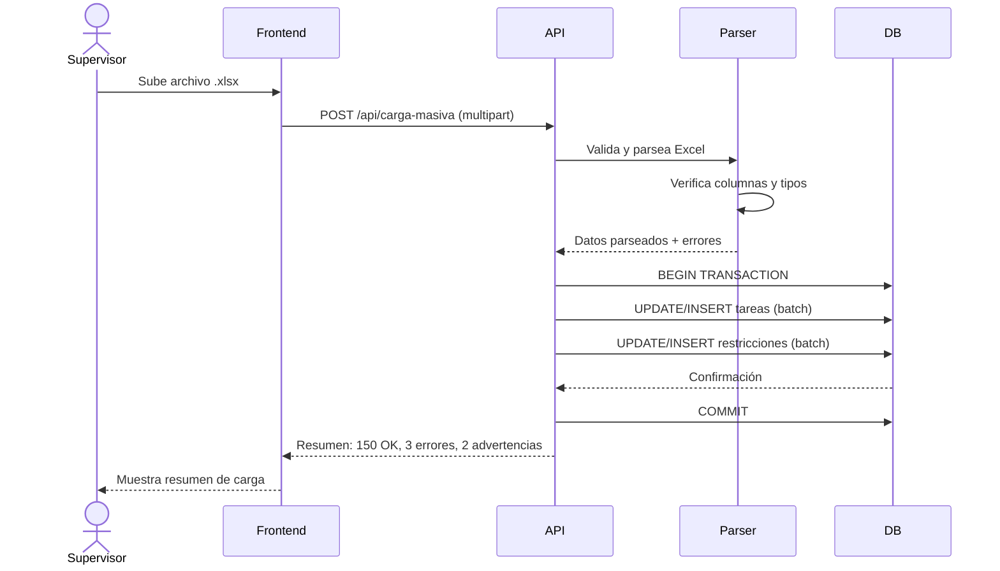

# US-010: Carga de Excel para actualización masiva

## Historia
Como **supervisor de obra**, quiero **cargar un archivo Excel (.xlsx) para actualizar masivamente tareas y restricciones**, para **ahorrar tiempo en actualizaciones repetitivas sin tener que modificar cada actividad individualmente**.

## Épica
Épica 3: ProcesMassive & Data Sync

## Prioridad
- **MoSCoW**: Could
- **RICE Score**: Reach: 3 | Impact: 5 | Confidence: 80% | Effort: 8 → Score: 1.50

## Estimación
- **Story Points (Fibonacci)**: 8
- **T-Shirt Size**: L
- **Planning Poker Rationale**: Complejidad alta. Implica implementar la carga de archivos Excel, parseo con validación de columnas esperadas, mapeo a entidades del dominio, y actualización batch en base de datos. La incertidumbre está en el manejo de errores (filas inválidas, duplicados) y en asegurar que las relaciones jerárquicas no se rompan. El equipo convergería en 8 después de considerar la validación de datos y el manejo de transacciones.

## Caso de Uso

### Caso de Uso: Carga masiva de tareas/restricciones vía Excel
- **Actores**: Supervisor de obra
- **Precondiciones**: El usuario tiene permisos de carga masiva. Existe una plantilla Excel con el formato esperado.
- **Flujo Principal**:
  1. El usuario accede a la sección "Carga Masiva" en la plataforma
  2. El sistema muestra un área de carga con instrucciones y enlace a plantilla
  3. El usuario selecciona un archivo .xlsx y lo sube
  4. El sistema valida el formato del archivo (columnas requeridas, tipos de datos)
  5. El sistema parsea el archivo fila por fila
  6. Para cada fila, el sistema mapea los valores a las entidades correspondientes
  7. El sistema valida las relaciones jerárquicas (cada tarea tiene un padre válido)
  8. El sistema procesa las actualizaciones en una transacción batch
  9. El sistema muestra un resumen: filas procesadas, errores, advertencias
- **Flujos Alternativos**: Errores de validación → se muestran por fila indicando la celda problemática. Archivo con formato incorrecto → mensaje de error claro.
- **Postcondiciones**: Las tareas y restricciones se actualizan en base de datos según el archivo procesado. Quedan registrados los cambios en el log de auditoría.

### Diagrama del Caso de Uso



## Criterios de Aceptación (BDD)

### Feature: Carga masiva de tareas y restricciones mediante Excel

#### Escenario 1: Carga exitosa con todas las filas válidas
```gherkin
Dado que el supervisor tiene un archivo Excel con 100 filas válidas
  Y el archivo sigue la plantilla oficial con columnas: ID, Nombre, PadreID, FechaInicio, FechaFin, Responsable
Cuando el supervisor sube el archivo
Entonces el sistema procesa las 100 filas exitosamente
  Y se muestra un resumen: "100 filas procesadas, 0 errores"
  Y todas las tareas se crean/actualizan en base de datos
  Y las relaciones jerárquicas se mantienen intactas
```

#### Escenario 2: Archivo con filas con errores de validación
```gherkin
Dado que el supervisor sube un archivo Excel con 50 filas
  Y 3 filas tienen errores: 1 con nombre vacío, 1 con fecha inválida, 1 con padre inexistente
Cuando el sistema procesa el archivo
Entonces las 47 filas válidas se procesan exitosamente
  Y las 3 filas con errores se reportan individualmente
  Y el resumen muestra: "47 procesadas, 3 errores" con detalle por fila
  Y las 3 filas erróneas no afectan a las correctas
```

#### Escenario 3: Archivo con formato inválido
```gherkin
Dado que el supervisor sube un archivo que no es .xlsx (ej. .pdf)
Cuando el sistema recibe el archivo
Entonces muestra el error "Formato de archivo no soportado. Use archivos .xlsx"
  Y no se intenta procesar el archivo
```

#### Escenario 4: Archivo con nodos huérfanos
```gherkin
Dado que el supervisor sube un archivo Excel donde una tarea tiene PadreID "ID-999"
  Y "ID-999" no existe en el sistema ni en el archivo
Cuando el sistema procesa el archivo
Entonces la fila con PadreID inválido se marca como error
  Y el mensaje indica "El padre ID-999 no existe en el sistema"
  Y las demás filas se procesan normalmente
```

## Notas Técnicas
- **Archivos/componentes afectados**: `MassUpload.vue` (frontend), `mass-upload.controller.ts`, `mass-upload.service.ts`, `excel-parser.ts` (backend)
- **Endpoints involucrados**: `POST /api/carga-masiva` (nuevo, multipart/form-data)
- **Entidades del modelo de datos**: `Tarea { id, nombre, padreId, fechaInicio, fechaFin, responsable }`, `Restriccion { id, tareaId, ... }`

## Requisitos No Funcionales
- **Rendimiento**: Procesar archivos de hasta 10,000 filas debe completarse en < 60 segundos. Usar procesamiento batch con transacciones.
- **Seguridad**: Validar permisos de carga masiva en backend. Sanitizar todos los inputs del Excel. Límite de tamaño de archivo: 10MB.
- **Accesibilidad**: La página de carga debe tener instrucciones claras y mensajes de error comprensibles para lectores de pantalla.

## Dependencias
- **Bloqueado por**: Ninguna
- **Bloquea**: US-011 (Validación de integridad jerárquica post-carga)

## Definición de Done
- [ ] Todos los criterios de aceptación cumplidos
- [ ] Pruebas unitarias escritas y pasando (≥90% cobertura)
- [ ] Pruebas de integración para el parser de Excel
- [ ] Código revisado y aprobado
- [ ] Documentación actualizada
- [ ] Sin regresiones en funcionalidad existente
