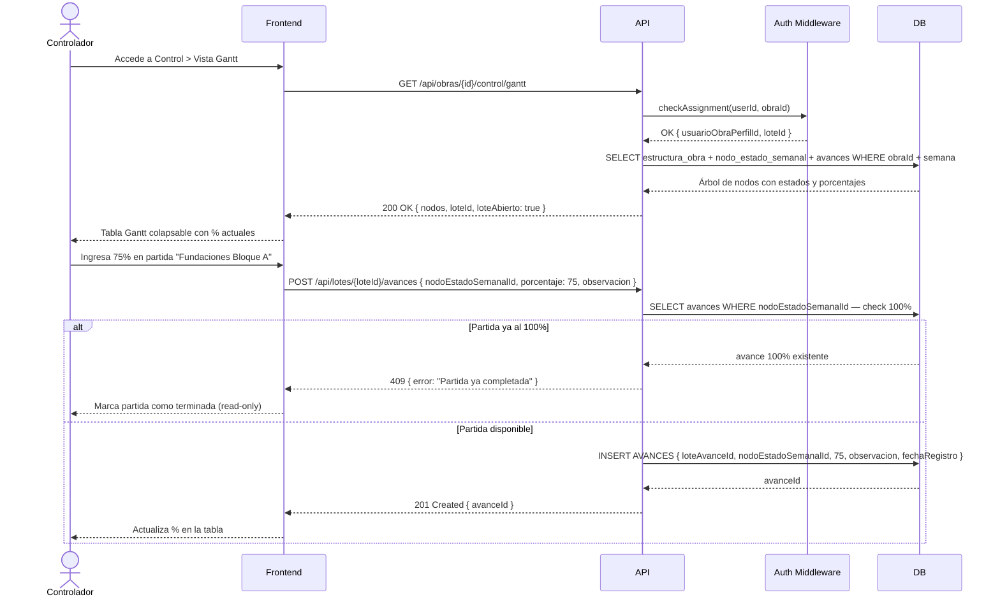

## Tracking
- **Platform**: jira
- **External ID**: SMAT-21
- **URL**: https://syntaxis.atlassian.net/browse/SMAT-21

# US-010: Control de Avances — Vistas Gantt y PTS

## 📜 [Original]

## Historia
Como **Controlador**, quiero visualizar el programa de obra en las vistas Gantt y PTS, y registrar el avance de las partidas que me corresponden, para reportar el progreso real de la semana.

## Épica
Control de Avances

## Prioridad
- **MoSCoW**: Must Have
- **RICE Score**: Alcance: 50 | Impacto: 3 | Confianza: 80% | Esfuerzo: 2.6 → Puntaje: 46.2

## Estimación
- **Story Points (Fibonacci)**: 13
- **T-Shirt Size**: XL
- **Justificación**: Esta es la historia central del sistema. Involucra: construcción de la vista Gantt (tabla jerárquica colapsable con posiblemente cientos de nodos), construcción de la vista PTS (filtro de nodos con `pts=true`, agrupados por proceso), registro de avances con lógica de negocio (partida completada al 100% por primer controlador, verificación de lote abierto), y validación de asignación activa. Alta complejidad de UI (árbol colapsable) + lógica de negocio crítica. El equipo convergería en 13 tras discutir la complejidad del Gantt colapsable.

## Caso de Uso

### Caso de Uso: Registro de Avance en Vistas Gantt y PTS
- **Actores**: Controlador, Validador (también puede registrar avances)
- **Precondiciones**: Existe una carga procesada para la semana en curso. El usuario tiene asignación activa en la obra. El lote de avances del usuario está abierto (`LOTE_AVANCES.fechaCierre IS NULL`).
- **Flujo Principal**:
  1. El Controlador accede al módulo de Control de Avances.
  2. Selecciona la vista Gantt o PTS.
  3. Visualiza la estructura jerárquica del programa con los porcentajes actuales.
  4. Ingresa el porcentaje de avance y una observación opcional para una partida.
  5. El sistema valida que la partida no esté ya completada al 100% por otro controlador.
  6. El sistema guarda el avance en `AVANCES` dentro del `LOTE_AVANCES` del controlador.
  7. La tabla se actualiza en tiempo real con el nuevo porcentaje.
- **Flujos Alternativos**:
  - Partida ya completada al 100%: el sistema la muestra como terminada (solo lectura).
  - Lote cerrado: el sistema no permite ingresar más avances.
- **Postcondiciones**: Los avances quedan registrados en el lote del controlador.

### Diagrama



## Criterios de Aceptación (BDD)

### Feature: Registro de avances en vistas Gantt y PTS

#### Escenario 1: Ver la Vista Gantt con la estructura jerárquica del programa
```gherkin
Given que soy Controlador con asignación activa en "Proyecto Norte"
  And existe una carga procesada para la semana en curso
When accedo a Control de Avances > Vista Gantt
Then el sistema muestra la estructura completa del programa como tabla colapsable
  And cada fila de nodo leaf muestra el porcentaje de avance actual
  And puedo colapsar y expandir niveles del árbol
  And los nodos con avance del 100% aparecen marcados como "Terminado"
```

#### Escenario 2: Registrar avance en una partida disponible
```gherkin
Given que soy Controlador con lote abierto en "Proyecto Norte" semana actual
  And la partida "Fundaciones Bloque A" tiene 0% de avance
When ingreso 60% de avance con observación "Avance según programa"
Then el sistema crea el registro en AVANCES asociado a mi lote
  And la tabla se actualiza mostrando 60% en esa partida
  And puedo seguir ingresando avances en otras partidas
```

#### Escenario 3: Intento de registrar avance en partida ya completada al 100%
```gherkin
Given que la partida "Fundaciones Bloque A" fue marcada al 100% por otro controlador
When intento ingresar cualquier porcentaje en esa partida
Then el sistema retorna HTTP 409 Conflict
  And muestra "Esta partida ya fue completada"
  And la partida aparece en modo solo lectura con el indicador "Terminado"
```

#### Escenario 4: Ver la Vista PTS — solo partidas de la semana siguiente
```gherkin
Given que soy Controlador con lote abierto en "Proyecto Norte"
  And existen nodos con NODO_ESTADO_SEMANAL.pts = true para la semana siguiente
When accedo a Control de Avances > Vista PTS
Then el sistema muestra únicamente los nodos donde pts = true
  And las partidas están agrupadas por proceso
  And no se muestran partidas de otras semanas
```

#### Escenario 5: Controlador con lote ya cerrado intenta ingresar avance
```gherkin
Given que soy Controlador y ya cerré mi control para esta semana (loteAvanceId.fechaCierre != null)
When intento ingresar un avance en cualquier partida
Then el sistema retorna HTTP 403 Forbidden
  And muestra "Tu control de esta semana ya fue cerrado"
  And todas las partidas aparecen en modo solo lectura
```

#### Escenario 6: Usuario sin asignación activa intenta acceder
```gherkin
Given que soy usuario con perfil Controlador pero SIN asignación activa en "Proyecto Norte"
When intento acceder a GET /api/obras/{id}/control/gantt
Then el sistema retorna HTTP 403 Forbidden
  And muestra "No tienes acceso a esta obra"
```

## Notas Técnicas
- **Endpoints API involucrados**: `GET /api/obras/{id}/control/gantt`, `GET /api/obras/{id}/control/pts`, `POST /api/lotes/{id}/avances`
- **Entidades del modelo de datos**: `ESTRUCTURA_OBRA`, `NODO_ESTADO_SEMANAL`, `LOTE_AVANCES`, `AVANCES`, `CARGAS`, `USUARIO_OBRA_PERFIL`
- El `LOTE_AVANCES` del controlador se crea automáticamente la primera vez que accede al control de la semana (si no existe uno abierto).
- La Vista Gantt puede tener muchos nodos — implementar lazy-loading o virtualización de filas para rendimiento.
- Considerar caché Redis para la estructura del árbol (invalidar al procesar nueva carga).
- El campo `NODO_ESTADO_SEMANAL.pts` filtra los nodos visibles en la Vista PTS.

## Requisitos No Funcionales
- **Rendimiento**: Carga de la Vista Gantt < 2 segundos para obras con hasta 1000 nodos. Registro de avance < 500ms.
- **Seguridad**: RBAC verifica asignación activa por obra antes de servir datos. El loteId pertenece al usuario autenticado.
- **Accesibilidad**: La tabla Gantt debe ser navegable con teclado. Los controles de entrada de porcentaje deben tener labels descriptivos.

## Dependencias
- **Bloqueado por**: US-008 (la carga semanal debe estar procesada)
- **Bloquea**: US-011 (Vista Física es extensión de esta funcionalidad), US-012 (cierre de control requiere avances registrados)

## Definition of Done
- [ ] Todos los criterios de aceptación cumplidos
- [ ] Pruebas unitarias escritas y pasando (≥90% cobertura)
- [ ] Código revisado y aprobado
- [ ] Documentación actualizada
- [ ] Sin regresiones en funcionalidad existente

---

## 🚀 [Enhanced - Task Plan]

### 📖 Resumen de la Solución
Historia central del sistema. Se crean entidades `LoteAvances` y `Avance` con invariantes de dominio (lote write-once, porcentaje 0–100, partida al 100% no admite más avances). Dos query handlers (Gantt y PTS) con caché Redis para el árbol jerárquico. El `LoteAvances` se crea automáticamente en el primer acceso. Frontend renderiza tabla colapsable con virtualización de filas para soportar +1000 nodos.

### 🛠️ Lista de Tareas y Subtareas

#### 🟦 BACKEND
- [ ] **Tarea: Implementar Lógica y Persistencia**
  - Subtarea: Crear entidad `LoteAvances` (`Id`, `UsuarioObraPerfilId`, `CargaId`, `FechaApertura`, `FechaCierre` nullable) con método `EstaAbierto()`.
  - Subtarea: Crear entidad `Avance` (`Id`, `LoteAvanceId`, `NodoEstadoSemanalId`, `Porcentaje`, `Observacion`, `FechaRegistro`) con invariante `ValidarPorcentaje()` (0–100).
  - Subtarea: Implementar `GetGanttQueryHandler`: verifica asignación activa, obtiene/crea `LoteAvances` abierto, construye árbol desde `IGanttCacheService` (Redis) o BD.
  - Subtarea: Implementar `GetPtsQueryHandler`: filtra nodos con `Pts = true`, agrupa por proceso.
  - Subtarea: Implementar `RegistrarAvanceCommandHandler` (Result Pattern): verifica lote abierto, verifica porcentaje < 100 en el nodo, inserta `Avance`.
  - Subtarea: Implementar `IGanttCacheService` (Redis): `GetArbolAsync`, `InvalidateAsync`; invalidar al procesar nueva carga.
  - Subtarea: Generar migraciones EF Core para tablas `LOTE_AVANCES` y `AVANCES`.
- [ ] **Tarea: Exposición de API**
  - Subtarea: Endpoints `GET /api/obras/{id}/control/gantt` y `GET /api/obras/{id}/control/pts` — autorización `control:access` (Controlador y Validador con asignación activa).
  - Subtarea: Endpoint `POST /api/lotes/{id}/avances` — retorna `201 Created { avanceId }`; `409` si nodo al 100%, `403` si lote cerrado.
  - Subtarea: Agregar log Serilog: `"Avance registrado: Nodo {NodoId} → {Porcentaje}% por {UserId} en Lote {LoteId}"`.

#### 🟨 FRONTEND
- [ ] **Tarea: Desarrollo de UI**
  - Subtarea: Tabla Gantt colapsable con virtualización de filas (CDK Virtual Scroll) para soportar +1000 nodos sin degradar rendimiento.
  - Subtarea: Input inline de porcentaje por fila con validación 0–100; badge "Terminado" en verde para nodos al 100%.
  - Subtarea: Vista PTS: nodos agrupados por proceso, misma lógica de input de avance.
- [ ] **Tarea: Integración**
  - Subtarea: Al recibir `409` en registro de avance, marcar la fila como solo lectura con badge "Terminado".
  - Subtarea: Actualización optimista del porcentaje en tabla; revertir en caso de error del API.

#### 🟩 TESTING & QA
- [ ] **Tarea: Pruebas Automatizadas**
  - Subtarea: `RegistrarAvanceCommandHandlerTests` — éxito 60%, nodo ya al 100% → 409, lote cerrado → 403.
  - Subtarea: `GetGanttQueryHandlerTests` — verifica jerarquía correcta; nodos al 100% tienen `terminado = true`.
  - Subtarea: `GetPtsQueryHandlerTests` — solo retorna nodos con `Pts = true` agrupados por proceso.
- [ ] **Tarea: Validación de Usuario**
  - Subtarea: Verificar escenario BDD "Controlador sin asignación activa → 403".
  - Subtarea: Integration Test con **Testcontainers**: carga XML → acceder Gantt → registrar avances → verificar persistencia y estado en tiempo real.

---
## 📝 NOTAS DE ARQUITECTURA
- **Caché Redis**: el árbol `ESTRUCTURA_OBRA` se cachea por `(obraId, cargaId)`; se invalida automáticamente al procesar una nueva carga (US-008).
- **Auto-creación de LoteAvances**: el `GetGanttQueryHandler` crea el lote si no existe uno abierto para el par `(usuarioObraPerfilId, cargaId)`.
- **Rendimiento**: meta < 2 s para obras con 1000 nodos; < 500 ms para registro de avance individual.
