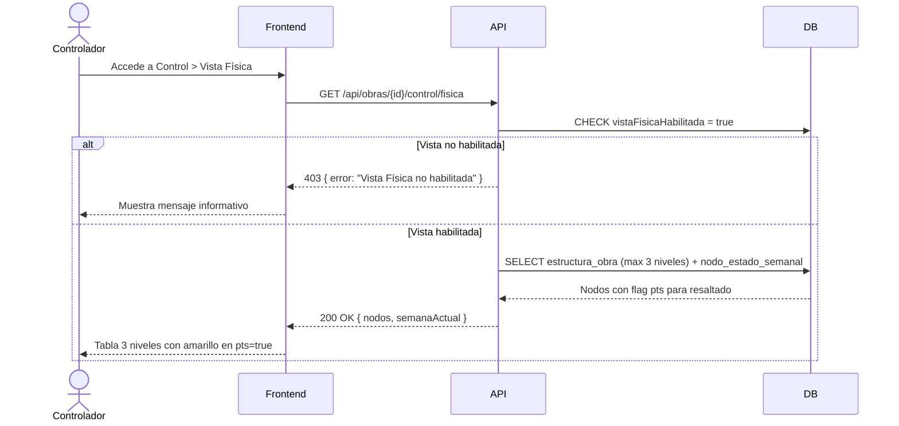

## Tracking
- **Platform**: jira
- **External ID**: SMAT-20
- **URL**: https://syntaxis.atlassian.net/browse/SMAT-20

# US-011: Control de Avances — Vista Física

## 📜 [Original]

## Historia
Como **Controlador**, quiero visualizar el programa completo en la Vista Física con los procesos de la semana actual destacados en amarillo, para tener una referencia visual rápida del estado del programa orientada al avance físico por ubicación.

## Épica
Control de Avances

## Prioridad
- **MoSCoW**: Should Have
- **RICE Score**: Alcance: 30 | Impacto: 2 | Confianza: 90% | Esfuerzo: 1 → Puntaje: 54

## Estimación
- **Story Points (Fibonacci)**: 5
- **T-Shirt Size**: M
- **Justificación**: La Vista Física es similar a la Vista Gantt en cuanto a registro de avances, pero con estructura fija de 3 niveles (Proceso > Actividad > Ubicación) y el resaltado visual de nodos de la semana en curso (`pts = true`). Reutiliza componentes de US-010 con ajustes de presentación. El equipo convergería en 5 puntos considerando la dependencia de US-009 (habilitación) y el resaltado visual.

## Caso de Uso

### Caso de Uso: Vista Física de Control de Avances
- **Actores**: Controlador, Validador, Analista, Administrador
- **Precondiciones**: Vista Física habilitada para la obra (US-009). Existe carga procesada. Usuario tiene asignación activa.
- **Flujo Principal**:
  1. El Controlador accede a Control de Avances > Vista Física.
  2. El sistema muestra el programa completo en exactamente 3 niveles: Proceso > Actividad > Ubicación.
  3. Los procesos correspondientes a la semana en curso (`NODO_ESTADO_SEMANAL.pts = true`) se muestran destacados en amarillo.
  4. El Controlador registra avances en las partidas de la misma forma que en Gantt/PTS.
- **Flujos Alternativos**:
  - Vista Física no habilitada: el sistema retorna 403 con mensaje informativo.
- **Postcondiciones**: Los avances se registran en el lote del controlador, igual que en Gantt/PTS.

### Diagrama



## Criterios de Aceptación (BDD)

### Feature: Vista Física del programa de obra

#### Escenario 1: Visualizar el programa en Vista Física con nodos resaltados
```gherkin
Given que soy Controlador con asignación en "Proyecto Norte"
  And la Vista Física está habilitada y existe carga procesada
When accedo a Control > Vista Física
Then el sistema muestra el programa con exactamente 3 niveles: Proceso > Actividad > Ubicación
  And los nodos donde NODO_ESTADO_SEMANAL.pts = true aparecen destacados en amarillo
  And el resto de los nodos se muestran sin resaltado especial
```

#### Escenario 2: Registrar avance desde Vista Física
```gherkin
Given que estoy en la Vista Física de "Proyecto Norte" con lote abierto
When registro 80% de avance en la partida "Ubicación A - Hormigón"
Then el sistema crea el registro en AVANCES igual que en las otras vistas
  And el porcentaje se actualiza en la Vista Física en tiempo real
```

#### Escenario 3: Acceso a Vista Física no habilitada
```gherkin
Given que la Vista Física está deshabilitada para "Proyecto Norte"
When un Controlador intenta acceder a la Vista Física
Then el sistema retorna HTTP 403 Forbidden
  And muestra el mensaje "La Vista Física no está habilitada para esta obra"
```

## Notas Técnicas
- **Endpoints API involucrados**: `GET /api/obras/{id}/control/fisica`, `POST /api/lotes/{id}/avances` (mismo endpoint que Gantt/PTS)
- **Entidades del modelo de datos**: `ESTRUCTURA_OBRA` (solo niveles 1-3), `NODO_ESTADO_SEMANAL` (flag `pts`), `AVANCES`, `LOTE_AVANCES`
- La Vista Física trunca el árbol en el nivel 3 — no muestra nodos más profundos.
- El resaltado amarillo se basa en `NODO_ESTADO_SEMANAL.pts = true` para los nodos del nivel 3 de la semana en curso.
- Reutilizar el componente de registro de avances de US-010.

## Requisitos No Funcionales
- **Rendimiento**: Carga de la Vista Física < 2 segundos.
- **Seguridad**: Verificar que `vistaFisicaHabilitada = true` para la obra antes de servir datos. Solo usuarios con asignación activa.

## Dependencias
- **Bloqueado por**: US-009 (habilitar Vista Física), US-010 (componentes de registro de avances)
- **Bloquea**: Ninguna

## Definition of Done
- [ ] Todos los criterios de aceptación cumplidos
- [ ] Pruebas unitarias escritas y pasando (≥90% cobertura)
- [ ] Código revisado y aprobado
- [ ] Documentación actualizada
- [ ] Sin regresiones en funcionalidad existente

---

## 🚀 [Enhanced - Task Plan]

### 📖 Resumen de la Solución
Extensión de US-010. `GetVistaFisicaQueryHandler` obtiene el árbol de `ESTRUCTURA_OBRA` truncado a exactamente 3 niveles (Proceso > Actividad > Ubicación) y aplica `Destacado = true` a los nodos de nivel 3 con `NodoEstadoSemanal.Pts = true`. Verifica `VistaFisicaHabilitada` antes de servir datos (`403` si está deshabilitada). El registro de avances reutiliza el endpoint `POST /api/lotes/{id}/avances` de US-010.

### 🛠️ Lista de Tareas y Subtareas

#### 🟦 BACKEND
- [ ] **Tarea: Implementar Lógica y Persistencia**
  - Subtarea: Implementar método de dominio `EstructuraObra.TruncarANiveles(maxNivel: 3)` que filtra el árbol a máximo 3 niveles de profundidad.
  - Subtarea: Implementar `GetVistaFisicaQueryHandler`: verifica `VistaFisicaHabilitada = true`, verifica asignación activa, obtiene árbol truncado vía `IGanttCacheService.GetArbolTruncadoAsync(obraId, cargaId, 3)`, aplica `Destacado = true` a nodos nivel 3 con `Pts = true`.
  - Subtarea: Crear DTO `NodoVistaFisicaResponse { id, nombre, nivel, porcentaje, terminado, destacado, hijos[] }` y configurar mapeo en `MappingProfile`.
  - Subtarea: Extender `IGanttCacheService` con `GetArbolTruncadoAsync(obraId, cargaId, maxNivel)`.
- [ ] **Tarea: Exposición de API**
  - Subtarea: Endpoint `GET /api/obras/{id}/control/fisica` — guard: `VistaFisicaHabilitada = false` → `403`; autorización `control:access` (misma política que US-010).
  - Subtarea: Reutilizar endpoint `POST /api/lotes/{id}/avances` de US-010 para registro de avances desde Vista Física.
  - Subtarea: Agregar log Serilog: `"Vista Física accedida para Obra {ObraId} por {UserId}"`.

#### 🟨 FRONTEND
- [ ] **Tarea: Desarrollo de UI**
  - Subtarea: Tabla fija de 3 niveles (sin colapsar) con resaltado en amarillo (`bg-yellow-100`) para filas con `destacado = true`.
  - Subtarea: Reutilizar el componente de input de avance de US-010 en las filas de nivel 3.
- [ ] **Tarea: Integración**
  - Subtarea: Manejar `403` del endpoint de Vista Física mostrando mensaje "La Vista Física no está habilitada para esta obra".
  - Subtarea: Ocultar la opción "Vista Física" en el menú de navegación cuando `vistaFisicaHabilitada = false` (consumir campo del `GET /api/obras/{id}`).

#### 🟩 TESTING & QA
- [ ] **Tarea: Pruebas Automatizadas**
  - Subtarea: `GetVistaFisicaQueryHandlerTests` — árbol con 5 niveles → retorna solo 3; nodos nivel 3 con `Pts = true` tienen `Destacado = true`; nodos nivel 3 con `Pts = false` tienen `Destacado = false`.
  - Subtarea: Unit test de acceso: `VistaFisicaHabilitada = false` → `Result.Failure(403)`.
- [ ] **Tarea: Validación de Usuario**
  - Subtarea: Verificar escenario BDD "Acceso a Vista Física no habilitada → 403 con mensaje".
  - Subtarea: Integration Test con **Testcontainers**: habilitar Vista Física → acceder endpoint → verificar estructura de 3 niveles y flags de resaltado.

---
## 📝 NOTAS DE ARQUITECTURA
- Esta US no requiere nuevas tablas: reutiliza `ESTRUCTURA_OBRA`, `NODO_ESTADO_SEMANAL`, `LOTE_AVANCES` y `AVANCES` de US-010.
- El truncado a 3 niveles se aplica en el query handler (no en la consulta SQL), usando el árbol ya cacheado en Redis.
- La verificación de `VistaFisicaHabilitada` se delega al `QueryHandler`; no se duplica en middleware.
