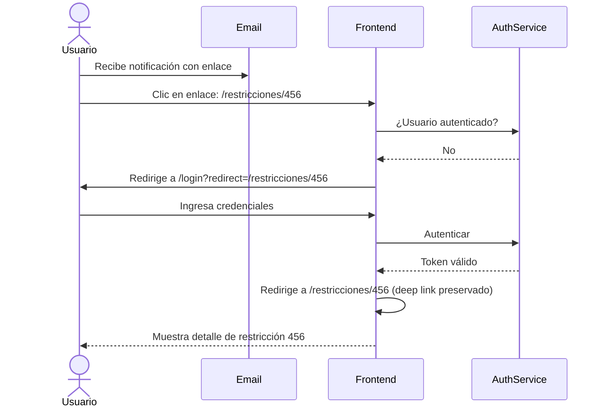

# US-012: Corrección de deep linking en notificaciones por correo

## Historia
Como **usuario de la plataforma**, quiero **poder acceder correctamente a la plataforma desde los enlaces incluidos en las notificaciones por correo electrónico**, para **no encontrar errores de ruteo o autenticación al hacer clic en un enlace de notificación**.

## Épica
Épica 4: Soporte y Estabilidad

## Prioridad
- **MoSCoW**: Must
- **RICE Score**: Reach: 4 | Impact: 5 | Confidence: 95% | Effort: 3 → Score: 6.33

## Estimación
- **Story Points (Fibonacci)**: 3
- **T-Shirt Size**: S
- **Planning Poker Rationale**: Complejidad baja-media. Es un bug de ruteo/autenticación: al hacer clic en un enlace de correo, el usuario debe ser redirigido a la URL correcta después de la autenticación. El equipo convergería en 3 porque el diagnóstico es acotado (flujo de redirect post-login) pero requiere pruebas manuales de todos los tipos de notificaciones.

## Caso de Uso

### Caso de Uso: Acceso profundo desde notificaciones por correo
- **Actores**: Usuario de la plataforma
- **Precondiciones**: El usuario tiene una cuenta activa. El usuario ha recibido un correo de notificación con un enlace. El usuario no está autenticado actualmente en la plataforma.
- **Flujo Principal**:
  1. El usuario recibe un correo de notificación con un enlace (ej. a una restricción específica)
  2. El usuario hace clic en el enlace
  3. El sistema redirige al usuario a la página de login (si no está autenticado)
  4. El usuario inicia sesión exitosamente
  5. El sistema redirige al usuario a la URL original del enlace (deep link)
  6. El usuario visualiza el recurso correcto
- **Flujos Alternativos**: Si el usuario ya está autenticado, se redirige directamente al recurso. Si el token de autenticación expiró, se solicita nuevo inicio de sesión y luego se redirige.
- **Postcondiciones**: El usuario accede al recurso específico indicado en el enlace del correo

### Diagrama del Caso de Uso



## Criterios de Aceptación (BDD)

### Feature: Deep linking desde notificaciones por correo

#### Escenario 1: Usuario no autenticado hace clic en enlace
```gherkin
Dado que el usuario no está autenticado en la plataforma
  Y el usuario recibe un correo con el enlace "https://plataforma/restricciones/456"
Cuando el usuario hace clic en el enlace
Entonces el sistema redirige a /login?redirect=/restricciones/456
  Y después del login exitoso, el usuario es redirigido a /restricciones/456
  Y la página muestra el detalle correcto de la restricción 456
```

#### Escenario 2: Usuario autenticado hace clic en enlace
```gherkin
Dado que el usuario ya está autenticado en la plataforma
  Y el usuario recibe un correo con el enlace "https://plataforma/tareas/789"
Cuando el usuario hace clic en el enlace
Entonces el sistema muestra directamente la tarea 789
  Y no se solicita autenticación adicional
```

#### Escenario 3: Enlace con recurso eliminado o sin permisos
```gherkin
Dado que el usuario recibe un enlace a una restricción que ha sido eliminada
  O el usuario ya no tiene permisos para acceder al recurso
Cuando el usuario hace clic en el enlace (autenticado o después de login)
Entonces el sistema muestra una página con el mensaje "Recurso no encontrado" o "No tienes permisos para acceder a este recurso"
  Y no se produce un error 500 ni una redirección a una página genérica
```

#### Escenario 4: Sesión expirada — redirect preservado
```gherkin
Dado que el usuario tenía una sesión activa pero expiró
  Y hace clic en un enlace "https://plataforma/actividades/123"
Cuando el sistema detecta que la sesión expiró
Entonces redirige a /login?redirect=/actividades/123
  Y después del login exitoso, redirige a /actividades/123
```

## Notas Técnicas
- **Archivos/componentes afectados**: `AuthGuard.ts` (ruteo), `LoginPage.vue`, configuración de router (guard de navegación)
- **Endpoints involucrados**: Depende del patrón de autenticación (probablemente el guard de ruteo que verifica el token)
- **Entidades del modelo de datos**: Ninguna — solo flujo de ruteo

## Requisitos No Funcionales
- **Rendimiento**: No aplica.
- **Seguridad**: Asegurar que el parámetro `redirect` no permita redirección a URLs externas (open redirect). Validar que el destino sea una ruta interna de la plataforma.
- **Accesibilidad**: No aplica.

## Dependencias
- **Bloqueado por**: Ninguna
- **Bloquea**: Ninguna

## Definición de Done
- [ ] Todos los criterios de aceptación cumplidos
- [ ] Pruebas unitarias escritas y pasando (≥90% cobertura)
- [ ] Pruebas de integración del flujo login + redirect
- [ ] Código revisado y aprobado
- [ ] Documentación actualizada
- [ ] Sin regresiones en funcionalidad existente
