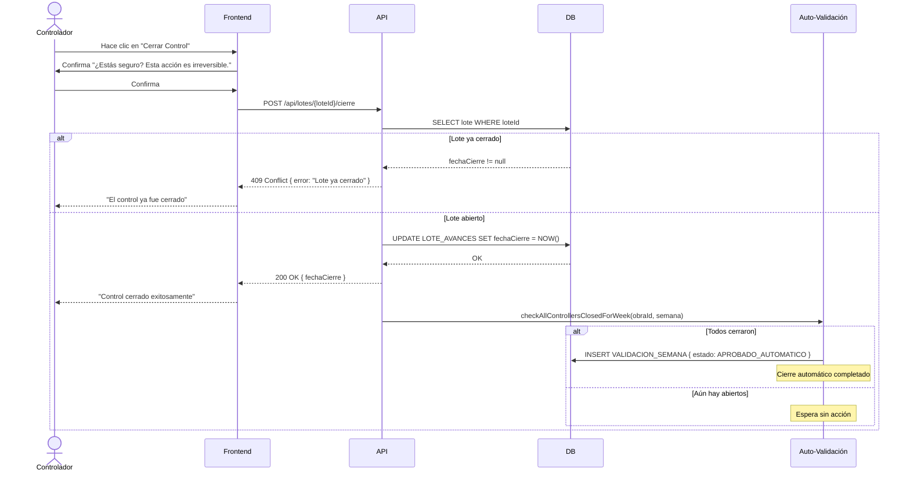

# US-012: Cierre de Control por Controlador

## 📜 [Original]

## Historia
Como **Controlador**, quiero cerrar mi control semanal cuando haya terminado de registrar mis avances, para indicar al sistema y al validador que completé mi reporte de la semana.

## Épica
Control de Avances

## Prioridad
- **MoSCoW**: Must Have
- **RICE Score**: Alcance: 30 | Impacto: 3 | Confianza: 90% | Esfuerzo: 1 → Puntaje: 81

## Estimación
- **Story Points (Fibonacci)**: 5
- **T-Shirt Size**: M
- **Justificación**: Acción de cierre irreversible del lote del controlador. Requiere validación de que el lote esté abierto, confirmación del usuario, escritura en BD, y disparar la verificación de cierre automático de validación (lógica que también se usa en US-013). Complejidad media por la irreversibilidad y el trigger automático. El equipo convergería en 5.

## Caso de Uso

### Caso de Uso: Cierre de Control Semanal
- **Actores**: Controlador
- **Precondiciones**: El Controlador tiene un lote abierto (`LOTE_AVANCES.fechaCierre IS NULL`) para la semana en curso. Ha registrado al menos un avance.
- **Flujo Principal**:
  1. El Controlador hace clic en "Cerrar Control".
  2. El sistema solicita confirmación explícita.
  3. El Controlador confirma.
  4. El sistema establece `LOTE_AVANCES.fechaCierre = NOW()`.
  5. El sistema verifica si todos los controladores de la obra cerraron su control.
  6. Si todos cerraron → dispara cierre automático de validación.
  7. El sistema actualiza la interfaz indicando que el control está cerrado.
- **Flujos Alternativos**:
  - Lote ya cerrado: el sistema informa que ya fue cerrado y no permite repetir la acción.
- **Postcondiciones**: El lote queda cerrado de forma irreversible. El Validador puede ver el estado "Cerrado" del controlador.

### Diagrama



## Criterios de Aceptación (BDD)

### Feature: Cierre de control semanal del controlador

#### Escenario 1: Cierre de control exitoso
```gherkin
Given que soy Controlador con lote abierto en "Proyecto Norte" semana 18
  And he registrado al menos un avance en mi lote
When hago clic en "Cerrar Control" y confirmo la acción
Then el sistema establece LOTE_AVANCES.fechaCierre = fecha y hora actual
  And todas las partidas pasan a modo solo lectura para mí
  And el Validador ve mi estado como "Cerrado" en el panel de validación
  And no puedo ingresar más avances esta semana
```

#### Escenario 2: Intento de cierre de un lote ya cerrado
```gherkin
Given que ya cerré mi control para la semana 18 de "Proyecto Norte"
When intento ejecutar el cierre de control nuevamente
Then el sistema retorna HTTP 409 Conflict
  And muestra "El control de esta semana ya fue cerrado"
  And no se modifica ningún registro
```

#### Escenario 3: Cierre automático de validación cuando todos los controladores cierran
```gherkin
Given que "Proyecto Norte" tiene 2 controladores: "Felipe" y "Pedro"
  And "Felipe" ya cerró su control
When "Pedro" cierra su control
Then el sistema detecta que todos los controladores cerraron
  And crea automáticamente el registro VALIDACION_SEMANA con estado "Aprobado Automático"
  And los archivos de la semana quedan disponibles para descarga
  And el tablero refleja la semana como "Validada"
```

#### Escenario 4: No se dispara cierre automático si quedan controladores abiertos
```gherkin
Given que "Proyecto Norte" tiene 3 controladores y solo 1 cerró su control
When el segundo controlador cierra su control
Then el sistema NO crea registro de validación automática
  And el Validador ve que aún hay 1 controlador pendiente de cierre
```

## Notas Técnicas
- **Endpoints API involucrados**: `POST /api/lotes/{id}/cierre`
- **Entidades del modelo de datos**: `LOTE_AVANCES`, `VALIDACION_SEMANA`, `VALIDACION_LOTE`, `TIPO_ESTADO_VALIDACION`
- El `fechaCierre` es write-once: una vez establecido, no puede actualizarse.
- La verificación de cierre automático debe ejecutarse dentro de la misma transacción o como operación atómica post-commit.
- El servicio de cierre automático cuenta `LOTE_AVANCES` donde `cargaId` corresponde a la semana actual y `fechaCierre IS NULL`. Si el conteo es 0, dispara la validación automática.

## Requisitos No Funcionales
- **Rendimiento**: Cierre de control < 500ms (incluyendo verificación automática).
- **Seguridad**: Solo el propietario del lote (controlador asignado) puede cerrarlo. El rol Validador no puede cerrar el control de un controlador.

## Dependencias
- **Bloqueado por**: US-010 (debe haber registro de avances)
- **Bloquea**: US-013 (el cierre de validación requiere que todos los controladores hayan cerrado)

## Definition of Done
- [ ] Todos los criterios de aceptación cumplidos
- [ ] Pruebas unitarias escritas y pasando (≥90% cobertura)
- [ ] Código revisado y aprobado
- [ ] Documentación actualizada
- [ ] Sin regresiones en funcionalidad existente

---

## 🚀 [Enhanced - Task Plan]

### 📖 Resumen de la Solución
Acción irreversible write-once: `LoteAvances.Cerrar(NOW())` lanza `DomainException` si el lote ya está cerrado. Tras el cierre, `CerrarLoteCommandHandler` verifica atómicamente si todos los lotes de la obra/semana están cerrados; si es así, ejecuta `CrearValidacionAutomaticaCommandHandler` en la misma transacción, creando `ValidacionSemana { estado: APROBADO_AUTOMATICO }` + `ValidacionLote` por cada lote. Frontend muestra modal de confirmación irreversible.

### 🛠️ Lista de Tareas y Subtareas

#### 🟦 BACKEND
- [ ] **Tarea: Implementar Lógica y Persistencia**
  - Subtarea: Agregar método de dominio `LoteAvances.Cerrar(DateTimeOffset fechaCierre)`: establece `FechaCierre`, lanza `DomainException` si ya cerrado (write-once).
  - Subtarea: Crear entidades `ValidacionSemana` (`Id`, `ObraId`, `CargaId`, `TipoEstadoValidacionId`, `FechaValidacion`, `UsuarioValidadorId` nullable, `Observacion`) y `ValidacionLote` (`Id`, `ValidacionSemanaId`, `LoteAvanceId`).
  - Subtarea: Implementar `CerrarLoteCommandHandler` (Result Pattern): verifica propietario → cierra lote → cuenta lotes abiertos → si 0, ejecuta `CrearValidacionAutomaticaCommandHandler` en transacción.
  - Subtarea: Implementar `CrearValidacionAutomaticaCommandHandler`: inserta `ValidacionSemana { TipoEstado: APROBADO_AUTOMATICO, UsuarioValidadorId: null }` + N `ValidacionLote`, todo atómico.
  - Subtarea: Generar migraciones EF Core para `VALIDACION_SEMANA`, `VALIDACION_LOTE`, `TIPO_ESTADO_VALIDACION` + semilla de estados.
- [ ] **Tarea: Exposición de API**
  - Subtarea: Endpoint `POST /api/lotes/{id}/cierre` — solo el propietario del lote (verificar `lote.UsuarioId == currentUserId`); retorna `200 { loteId, fechaCierre, validacionAutomaticaDisparada }`.
  - Subtarea: Agregar logs Serilog: `"Lote {LoteId} cerrado por {UserId} — {N} lotes aún abiertos en Obra {ObraId}"` y `"Validación automática disparada para Obra {ObraId} Carga {CargaId}"`.

#### 🟨 FRONTEND
- [ ] **Tarea: Desarrollo de UI**
  - Subtarea: Botón "Cerrar Control" con modal de confirmación explícita: "Esta acción es irreversible. ¿Deseas continuar?".
  - Subtarea: Al confirmar cierre exitoso, transicionar toda la vista de control a modo solo lectura (deshabilitar todos los inputs de avance).
- [ ] **Tarea: Integración**
  - Subtarea: Si `validacionAutomaticaDisparada = true` en la respuesta, mostrar banner "Todos los controladores han cerrado. Validación automática realizada."
  - Subtarea: Manejar `409` (lote ya cerrado) mostrando mensaje informativo sin mostrar el modal de nuevo.

#### 🟩 TESTING & QA
- [ ] **Tarea: Pruebas Automatizadas**
  - Subtarea: `CerrarLoteCommandHandlerTests` — éxito, lote ya cerrado → `409`, usuario no propietario → `403`.
  - Subtarea: `CrearValidacionAutomaticaCommandHandlerTests` — todos los lotes cerrados → crea `ValidacionSemana APROBADO_AUTOMATICO`; lotes abiertos restantes → no crea validación.
- [ ] **Tarea: Validación de Usuario**
  - Subtarea: Verificar escenario BDD "Cierre automático cuando todos los controladores cierran → VALIDACION_SEMANA con APROBADO_AUTOMATICO".
  - Subtarea: Integration Test con **Testcontainers**: 2 controladores → cerrar ambos en secuencia → verificar `VALIDACION_SEMANA` con `APROBADO_AUTOMATICO` en BD.

---
## 📝 NOTAS DE ARQUITECTURA
- **Atomicidad crítica**: el cierre del lote y la creación de la validación automática deben ocurrir en la misma transacción de BD para evitar estados inconsistentes.
- **Write-once**: `FechaCierre` nunca puede actualizarse una vez establecido; el método de dominio lo garantiza con una excepción.
- Las entidades `ValidacionSemana` y `ValidacionLote` creadas aquí son reutilizadas en US-013 (cierre manual por Validador).
