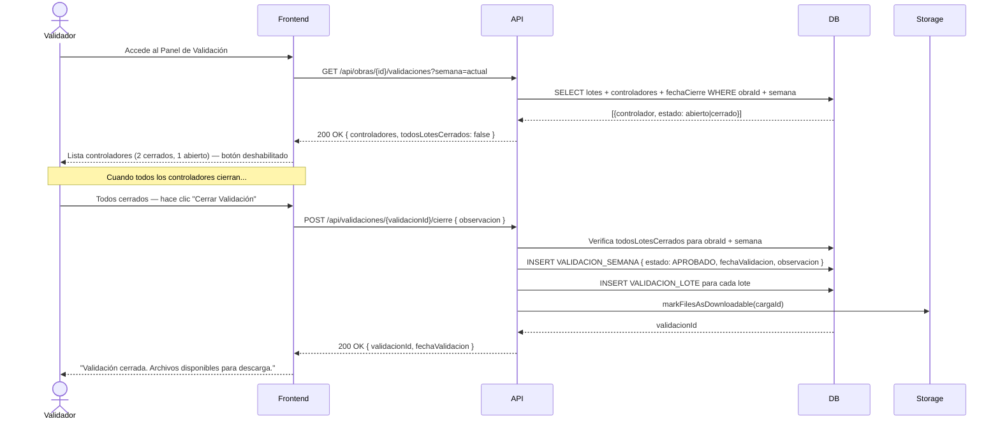

## Tracking
- **Platform**: jira
- **External ID**: SMAT-19
- **URL**: https://syntaxis.atlassian.net/browse/SMAT-19

# US-013: Cierre de Validación (Manual y Automático)

## 📜 [Original]

## Historia
Como **Validador**, quiero revisar los avances registrados por todos los controladores y realizar el cierre de validación semanal, para certificar oficialmente el avance de la obra y habilitar la descarga de los archivos.

## Épica
Control de Avances

## Prioridad
- **MoSCoW**: Must Have
- **RICE Score**: Alcance: 20 | Impacto: 3 | Confianza: 90% | Esfuerzo: 1.6 → Puntaje: 33.75

## Estimación
- **Story Points (Fibonacci)**: 8
- **T-Shirt Size**: L
- **Justificación**: Incluye: panel de estado de controladores, lógica de habilitación del botón de cierre (todos deben haber cerrado), cierre manual por Validador con registro en `VALIDACION_SEMANA` y `VALIDACION_LOTE`, descarga post-validación, y el cierre automático ya parcialmente implementado en US-012. La complejidad es la coordinación entre múltiples lotes y la atomicidad del cierre. El equipo convergería en 8.

## Caso de Uso

### Caso de Uso: Cierre de Validación Semanal
- **Actores**: Validador (manual), Sistema (automático)
- **Precondiciones**: Todos los controladores de la obra han cerrado su control para la semana. El Validador tiene asignación activa en la obra.
- **Flujo Principal**:
  1. El Validador accede al Panel de Validación de la obra.
  2. Visualiza la lista de controladores con su estado (Abierto / Cerrado).
  3. Cuando todos están en "Cerrado", el botón "Cerrar Validación" se habilita.
  4. El Validador revisa los avances y hace clic en "Cerrar Validación".
  5. El sistema crea `VALIDACION_SEMANA` con estado Aprobado, vincula todos los lotes en `VALIDACION_LOTE`, y marca los archivos como descargables.
  6. El Validador recibe confirmación.
- **Flujos Alternativos**:
  - Cierre automático: cuando todos los controladores cierran, el sistema ejecuta la validación automáticamente sin intervención del Validador.
  - Un Controlador intenta realizar el cierre de validación: el sistema lo deniega.
- **Postcondiciones**: La semana queda certificada. Los archivos están disponibles para descarga.

### Diagrama



## Criterios de Aceptación (BDD)

### Feature: Cierre de validación semanal de avances

#### Escenario 1: Panel de validación muestra estado de controladores
```gherkin
Given que soy Validador con asignación en "Proyecto Norte" semana 18
  And la obra tiene 3 controladores: "Felipe" (cerrado), "Pedro" (cerrado), "Luis" (abierto)
When accedo al Panel de Validación
Then el sistema muestra los 3 controladores con su estado actual
  And el botón "Cerrar Validación" está deshabilitado
  And se indica "1 controlador(es) pendiente(s) de cierre"
```

#### Escenario 2: Cierre de validación manual exitoso
```gherkin
Given que todos los controladores de "Proyecto Norte" tienen sus lotes cerrados
  And no existe validación previa para la semana 18
When el Validador hace clic en "Cerrar Validación" y agrega observación "Avance conforme a programa"
Then el sistema crea VALIDACION_SEMANA con estado "Aprobado" y la observación
  And crea VALIDACION_LOTE para cada lote de la semana
  And los archivos de la semana quedan disponibles para descarga
  And el tablero muestra la semana 18 como "Validada"
```

#### Escenario 3: Controlador intenta realizar el cierre de validación
```gherkin
Given que soy Controlador autenticado en "Proyecto Norte"
When intento ejecutar POST /api/validaciones/{id}/cierre
Then el sistema retorna HTTP 403 Forbidden
  And muestra "Solo el Validador de la obra puede realizar el cierre de validación"
```

#### Escenario 4: Cierre automático cuando todos los controladores cierran
```gherkin
Given que "Proyecto Norte" tiene 2 controladores y ambos acaban de cerrar su control
  And no hay Validador disponible para realizar el cierre manual
When el último controlador cierra su lote
Then el sistema detecta que todos los lotes están cerrados
  And crea automáticamente VALIDACION_SEMANA con estado "Aprobado Automático"
  And los archivos quedan disponibles para descarga sin intervención del Validador
```

#### Escenario 5: Descarga de archivos después del cierre de validación
```gherkin
Given que la semana 18 de "Proyecto Norte" tiene validación con estado "Aprobado"
When el Validador hace clic en "Descargar" para esa semana
Then el sistema genera una URL presignada con TTL de 15 minutos
  And la descarga inicia automáticamente
```

#### Escenario 6: Intento de descarga sin validación cerrada
```gherkin
Given que la semana 18 de "Proyecto Norte" NO tiene cierre de validación
When cualquier usuario intenta descargar los archivos de esa semana
Then el sistema retorna HTTP 403 Forbidden
  And muestra "La descarga está disponible solo después del cierre de validación"
```

## Notas Técnicas
- **Endpoints API involucrados**: `GET /api/obras/{id}/validaciones`, `POST /api/validaciones/{id}/cierre`, `GET /api/cargas/{id}/descarga`
- **Entidades del modelo de datos**: `VALIDACION_SEMANA`, `VALIDACION_LOTE`, `TIPO_ESTADO_VALIDACION`, `LOTE_AVANCES`, `CARGAS`
- El `TIPO_ESTADO_VALIDACION` debe tener al menos: `APROBADO`, `APROBADO_AUTOMATICO`.
- El `usuarioValidadorId` en `VALIDACION_SEMANA` es `null` para cierres automáticos.
- La URL presignada de descarga tiene TTL configurable (default 15 min).
- Toda la operación de cierre (INSERT VALIDACION_SEMANA + INSERT VALIDACION_LOTE x N) debe ser atómica (transacción BD).

## Requisitos No Funcionales
- **Rendimiento**: Cierre de validación < 1 segundo (incluyendo marcado de archivos descargables).
- **Seguridad**: Solo el Validador asignado activamente a la obra puede realizar el cierre manual. Los Controladores tienen prohibición explícita (verificada en middleware). Las URLs de descarga expiran en 15 minutos.

## Dependencias
- **Bloqueado por**: US-012 (el cierre de validación requiere que los lotes de control estén cerrados)
- **Bloquea**: Ninguna

## Definition of Done
- [ ] Todos los criterios de aceptación cumplidos
- [ ] Pruebas unitarias escritas y pasando (≥90% cobertura)
- [ ] Código revisado y aprobado
- [ ] Documentación actualizada
- [ ] Sin regresiones en funcionalidad existente

---

## 🚀 [Enhanced - Task Plan]

### 📖 Resumen de la Solución
Panel de validación semanal para el Validador. `CerrarValidacionCommandHandler` ejecuta atómicamente: crea `ValidacionSemana { estado: APROBADO, UsuarioValidadorId }` + N `ValidacionLote` en una sola transacción, con invariante que impide duplicados por `(ObraId, CargaId)`. `GetDescargaUrlQueryHandler` verifica `ValidacionSemana.EsDescargable()` antes de generar presigned URL con TTL 15 min vía `IFileStorageService`.

### 🛠️ Lista de Tareas y Subtareas

#### 🟦 BACKEND
- [ ] **Tarea: Implementar Lógica y Persistencia**
  - Subtarea: Agregar método de dominio `ValidacionSemana.EsDescargable()`: retorna `true` si estado es `APROBADO` o `APROBADO_AUTOMATICO`.
  - Subtarea: Implementar invariante en `ValidacionSemana`: no se puede crear una segunda validación para la misma `(ObraId, CargaId)`.
  - Subtarea: Implementar `CerrarValidacionCommandHandler` (Result Pattern): verifica que todos los lotes estén cerrados → crea `ValidacionSemana { APROBADO }` + N `ValidacionLote` en transacción atómica.
  - Subtarea: Implementar `GetValidacionesByObraQueryHandler`: retorna lista de controladores con estado abierto/cerrado y flag `TodosCerrado`.
  - Subtarea: Implementar `GetDescargaUrlQueryHandler`: verifica `EsDescargable()` → genera presigned URL via `IFileStorageService.GeneratePresignedUrlAsync(fileUrl, 15)`.
  - Subtarea: Extender `IValidacionRepository` con `GetPanelByObraAsync(obraId, cargaId)` y `GetValidacionByCargaAsync(cargaId)`.
  - Subtarea: Extender `IFileStorageService` con `GeneratePresignedUrlAsync(fileUrl, ttlMinutes)` (reutiliza cliente Storage de US-008).
- [ ] **Tarea: Exposición de API**
  - Subtarea: Endpoint `GET /api/obras/{id}/validaciones` — autorización `validacion:read` (todos con asignación activa).
  - Subtarea: Endpoint `POST /api/validaciones/{id}/cierre` — autorización `validacion:close` (solo Validador); `403` para Controlador.
  - Subtarea: Endpoint `GET /api/cargas/{id}/descarga` — solo accesible si `EsDescargable() = true`; retorna `{ url, expiresAt }`.
  - Subtarea: Agregar logs Serilog: `"Validación {ValidacionId} cerrada por Validador {UserId} para Obra {ObraId}"` y `"Descarga solicitada para Carga {CargaId} por {UserId} — URL expira en 15 min"`.

#### 🟨 FRONTEND
- [ ] **Tarea: Desarrollo de UI**
  - Subtarea: Panel de validación con tabla de controladores: columnas Nombre, Estado (badge Abierto/Cerrado), Fecha Cierre.
  - Subtarea: Botón "Cerrar Validación" habilitado solo cuando `todoCerrado = true`; deshabilitar con tooltip "Esperando cierres de controladores" si hay pendientes.
  - Subtarea: Botón "Descargar" visible post-validación; al hacer clic inicia descarga directa desde la presigned URL.
- [ ] **Tarea: Integración**
  - Subtarea: Polling o SSE al panel para actualizar estados de controladores en tiempo real mientras alguno está abierto.
  - Subtarea: Manejar `403` en cierre de validación mostrando "Solo el Validador de la obra puede realizar el cierre".

#### 🟩 TESTING & QA
- [ ] **Tarea: Pruebas Automatizadas**
  - Subtarea: `CerrarValidacionCommandHandlerTests` — todos cerrados → éxito con `APROBADO`; lotes abiertos → `Result.Failure`; Controlador → `403`.
  - Subtarea: `GetDescargaUrlQueryHandlerTests` — validación `APROBADO` → URL con `expiresAt`; sin validación → `403`.
- [ ] **Tarea: Validación de Usuario**
  - Subtarea: Verificar escenario BDD "Controlador intenta cerrar validación → 403".
  - Subtarea: Integration Test con **Testcontainers**: flujo completo → controladores cierran → Validador cierra validación → verificar `VALIDACION_SEMANA` + `VALIDACION_LOTE` en BD → obtener URL de descarga.

---
## 📝 NOTAS DE ARQUITECTURA
- **Atomicidad crítica**: `CerrarValidacionCommandHandler` usa una única transacción EF Core que incluye `ValidacionSemana` + todos los `ValidacionLote`.
- **Presigned URL**: TTL de 15 min configurable en `appsettings.json` como `Storage:DownloadTtlMinutes`; se genera bajo demanda (no se almacena en BD).
- `IFileStorageService` implementado en US-008 se extiende aquí con `GeneratePresignedUrlAsync`; no se crea una nueva abstracción.
