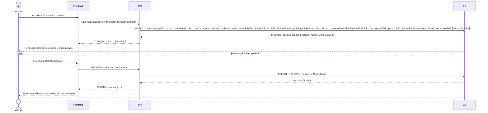

## Tracking
- **Platform**: jira
- **External ID**: SMAT-15
- **URL**: https://syntaxis.atlassian.net/browse/SMAT-15

# US-014: Tablero de Usuarios con Filtros Avanzados

## 📜 [Original]

## Historia
Como **Administrador**, quiero visualizar un tablero con todos los usuarios del sistema mostrando Nombre, Apellido, Rut, Rol, PEP Obra, Nombre Obra y Estado, con filtros por Rol, Nombre, Estado Colaborador y Obra, para gestionar y localizar usuarios de manera eficiente.

## Épica
Acceso y Seguridad

## Prioridad
- **MoSCoW**: Must Have
- **RICE Score**: Alcance: 10 | Impacto: 2 | Confianza: 90% | Esfuerzo: 0.5 → Puntaje: 36

## Estimación
- **Story Points (Fibonacci)**: 3
- **T-Shirt Size**: S
- **Justificación**: Vista de listado enriquecida sobre datos ya existentes (USUARIOS + USUARIO_OBRA_PERFIL + OBRAS + PERFILES). Requiere un endpoint con joins y parámetros de filtro. Sin lógica de escritura ni complejidad técnica inusual. El equipo convergería en 3 puntos.

## Caso de Uso

### Caso de Uso: Visualización del Tablero de Usuarios
- **Actores**: Administrador
- **Precondiciones**: El Administrador está autenticado. Existen usuarios registrados en el sistema.
- **Flujo Principal**:
  1. El Administrador accede al módulo de Usuarios.
  2. El sistema muestra el tablero con todos los usuarios, con columnas: Nombre, Apellido, Rut, Rol, PEP Obra, Nombre Obra y Estado.
  3. El Administrador aplica filtros opcionales: por Rol, Nombre, Estado Colaborador (Activo/Inactivo) y Obra.
  4. El sistema actualiza el tablero mostrando solo los registros que coinciden con los filtros seleccionados.
- **Flujos Alternativos**:
  - Sin resultados: el sistema muestra un mensaje "No se encontraron usuarios con los filtros aplicados".
  - Usuario sin asignación a obra: se muestra con PEP Obra y Nombre Obra en blanco.
- **Postcondiciones**: El Administrador visualiza el directorio de usuarios filtrado según los criterios seleccionados.

### Diagrama



## Criterios de Aceptación (BDD)

### Feature: Tablero de usuarios con filtros avanzados

#### Escenario 1: Visualización del tablero completo
```gherkin
Given que soy Administrador autenticado
  And existen 5 usuarios con distintos roles y obras asignadas
When accedo al módulo de Usuarios sin aplicar filtros
Then el sistema muestra una tabla con todas las columnas: Nombre, Apellido, Rut, Rol, PEP Obra, Nombre Obra, Estado
  And se listan los 5 usuarios
  And los usuarios sin obra asignada muestran PEP Obra y Nombre Obra en blanco
```

#### Escenario 2: Filtrar por Rol
```gherkin
Given que soy Administrador autenticado
  And existen usuarios con roles: "Controlador" (3), "Validador" (1), "Analista" (1)
When selecciono el filtro Rol = "Controlador"
Then el tablero muestra únicamente los 3 usuarios con rol Controlador
  And el resto de columnas (Nombre, Apellido, Rut, PEP Obra, Nombre Obra, Estado) se mantienen visibles
```

#### Escenario 3: Filtrar por Nombre
```gherkin
Given que soy Administrador autenticado
  And existen usuarios "Juan Pérez" y "Juan González" en el sistema
When escribo "Juan" en el filtro de Nombre
Then el tablero muestra únicamente los usuarios cuyo nombre contiene "Juan"
  And la búsqueda es insensible a mayúsculas/minúsculas
```

#### Escenario 4: Filtrar por Estado Colaborador
```gherkin
Given que soy Administrador autenticado
  And existen 4 usuarios activos y 2 usuarios inactivos
When selecciono el filtro Estado Colaborador = "Inactivo"
Then el tablero muestra únicamente los 2 usuarios inactivos
```

#### Escenario 5: Filtrar por Obra
```gherkin
Given que soy Administrador autenticado
  And existen usuarios asignados a "Obra Norte" (PEP: P-001) y "Obra Sur" (PEP: P-002)
When selecciono el filtro Obra = "Obra Norte"
Then el tablero muestra únicamente los usuarios asignados a "Obra Norte"
  And se visualiza el PEP "P-001" y Nombre Obra "Obra Norte" en cada fila
```

#### Escenario 6: Combinación de filtros
```gherkin
Given que soy Administrador autenticado
  And existen usuarios "Controlador activo en Obra Norte", "Controlador inactivo en Obra Norte" y "Validador activo en Obra Norte"
When selecciono Rol = "Controlador" Y Estado = "Activo" Y Obra = "Obra Norte"
Then el tablero muestra únicamente el usuario "Controlador activo en Obra Norte"
```

#### Escenario 7: Sin resultados para los filtros aplicados
```gherkin
Given que soy Administrador autenticado
  And no existen usuarios con Rol = "Gerente" en el sistema
When selecciono el filtro Rol = "Gerente"
Then el tablero muestra el mensaje "No se encontraron usuarios con los filtros aplicados"
  And el total de resultados es 0
```

#### Escenario 8: Acceso denegado para roles no administrador
```gherkin
Given que soy un usuario autenticado con rol "Controlador"
When intento acceder a GET /api/usuarios
Then el sistema retorna HTTP 403 Forbidden
  And muestra "No tiene permisos para acceder al directorio de usuarios"
```

## Notas Técnicas
- **Endpoints API involucrados**: `GET /api/usuarios?rol=&nombre=&estado=activo|inactivo&obraId=` (extensión del endpoint existente)
- **Entidades del modelo de datos**: `USUARIOS`, `USUARIO_OBRA_PERFIL`, `PERFILES`, `OBRAS`
- La entidad `USUARIOS` debe incluir los campos `apellido` y `rut`. Si se utiliza SSO Salfa, estos datos deben sincronizarse desde el `UsuarioModel` de Salfa al crear/actualizar el usuario en SMAT.
- El tablero es accesible **únicamente para el Administrador** (verificado en middleware RBAC).
- El filtro por Nombre aplica búsqueda parcial (`ILIKE '%valor%'`) sobre `USUARIOS.nombre` y `USUARIOS.apellido`.
- El filtro por Rol usa el selector de perfiles (`PERFILES.nombre`).
- El filtro por Obra usa el `obraId` del selector (muestra `OBRAS.nombre` en el selector).
- El resultado debe soportar paginación (`page`, `pageSize`), consistente con otros listados del sistema.
- Un usuario puede aparecer más de una vez si está asignado a múltiples obras; cada fila representa una asignación `USUARIO_OBRA_PERFIL`.

## Requisitos No Funcionales
- **Rendimiento**: El tablero debe cargar en < 500ms para hasta 500 registros.
- **Seguridad**: Solo el Administrador puede acceder a este endpoint. Ningún otro perfil puede visualizar el directorio completo de usuarios.

## Dependencias
- **Bloqueado por**: US-003 (los usuarios deben existir), US-004 (las asignaciones usuario-obra deben existir para mostrar PEP y Nombre Obra)
- **Bloquea**: Ninguna

## Definition of Done
- [ ] Todos los criterios de aceptación cumplidos
- [ ] Pruebas unitarias escritas y pasando (≥90% cobertura)
- [ ] Código revisado y aprobado
- [ ] Documentación actualizada
- [ ] Sin regresiones en funcionalidad existente

---

## 🚀 [Enhanced - Task Plan]

### 📖 Resumen de la Solución
Vista de solo lectura paginada para el Administrador. `GetTableroUsuariosQueryHandler` construye una query EF Core con LEFT JOINs dinámicos (`USUARIOS → USUARIO_OBRA_PERFIL → PERFILES → OBRAS`) usando `.WhereIf()` para filtros combinables (Rol, Nombre parcial, Estado, Obra). Un usuario con múltiples asignaciones aparece en múltiples filas. Paginación estándar `{ page, pageSize, total }`. Acceso exclusivo para Administrador.

### 🛠️ Lista de Tareas y Subtareas

#### 🟦 BACKEND
- [ ] **Tarea: Implementar Lógica y Persistencia**
  - Subtarea: Verificar que `Usuario` incluye `Apellido` y `Rut` (deben existir desde US-003); actualizar `UsuarioConfiguration.cs` si faltan.
  - Subtarea: Implementar `GetTableroUsuariosQueryHandler` (Result Pattern): construye `IQueryable` con LEFT JOINs y filtros dinámicos `.WhereIf()`, ejecuta `.Skip().Take()` para paginación, mapea a `TableroUsuarioResponse`.
  - Subtarea: Crear DTO `TableroUsuarioResponse { nombre, apellido, rut, rol, pepObra, nombreObra, activo }` y `PagedResult<TableroUsuarioResponse> { items, total, page, pageSize }`.
  - Subtarea: Extender `IUsuarioRepository` con `GetTableroPagedAsync(filtros)`.
  - Subtarea: Agregar índice compuesto en `USUARIO_OBRA_PERFIL (UsuarioId, ObraId)` en migración si no existe.
- [ ] **Tarea: Exposición de API**
  - Subtarea: Endpoint `GET /api/usuarios?rol=&nombre=&estado=&obraId=&page=&pageSize=` — extensión del endpoint de US-003; autorización `usuarios:read-all` (solo Administrador).
  - Subtarea: Agregar log Serilog: `"Tablero consultado por Admin {UserId} — filtros: {Filtros}, {Total} resultados"`.

#### 🟨 FRONTEND
- [ ] **Tarea: Desarrollo de UI**
  - Subtarea: Tabla con columnas: Nombre, Apellido, Rut, Rol, PEP Obra, Nombre Obra, Estado (badge Activo/Inactivo); columnas PEP y Nombre Obra vacías para usuarios sin asignación.
  - Subtarea: Barra de filtros: dropdown Rol, input Nombre con debounce 300 ms, dropdown Estado (Activo/Inactivo), dropdown Obra.
  - Subtarea: Paginación con selector de `pageSize` (10/25/50) y contador "Mostrando X de N resultados".
- [ ] **Tarea: Integración**
  - Subtarea: Llamar a `GET /api/usuarios` con parámetros de filtro y paginación cada vez que cambie un filtro (debounce 300 ms para Nombre).
  - Subtarea: Mostrar mensaje "No se encontraron usuarios con los filtros aplicados" cuando `total = 0`.

#### 🟩 TESTING & QA
- [ ] **Tarea: Pruebas Automatizadas**
  - Subtarea: `GetTableroUsuariosQueryHandlerTests` — sin filtros → todos los usuarios; filtro Rol → solo Controladores; filtro Nombre "Juan" → case-insensitive parcial; filtro Estado inactivo; combinación de 3 filtros → intersección correcta.
  - Subtarea: Unit test de acceso: Controlador intentando acceder → `403`.
- [ ] **Tarea: Validación de Usuario**
  - Subtarea: Verificar escenario BDD "Usuario sin asignación aparece con PEP en blanco".
  - Subtarea: Integration Test con **Testcontainers**: semilla de 5 usuarios con distintos roles y obras → verificar paginación, filtro por Obra, usuario sin obra aparece con PEP en blanco.

---
## 📝 NOTAS DE ARQUITECTURA
- No se requieren nuevas entidades ni migraciones: reutiliza `USUARIOS`, `USUARIO_OBRA_PERFIL`, `PERFILES` y `OBRAS`.
- Los filtros dinámicos se implementan con el patrón `.WhereIf(condition, predicate)` sobre `IQueryable` para evitar N+1 y generar SQL eficiente.
- Un usuario sin ningún `USUARIO_OBRA_PERFIL` aparece igualmente en el tablero (LEFT JOIN) con `pepObra` y `nombreObra` nulos → el frontend los renderiza como cadena vacía.
