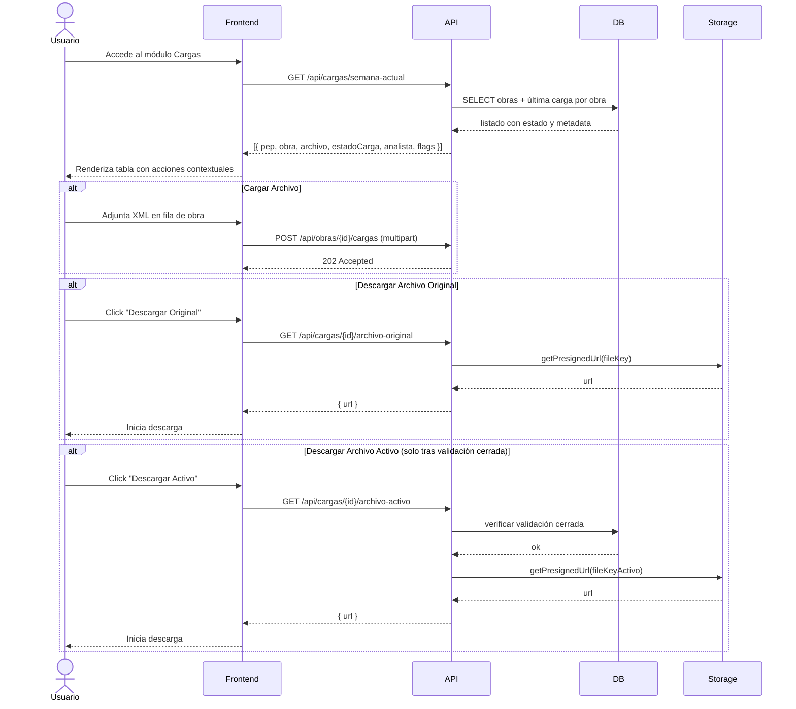

## Tracking
- **Platform**: jira
- **External ID**: SMAT-62
- **URL**: https://syntaxis.atlassian.net/browse/SMAT-62

# US-015: Administración de Cargas Semanales

## Historia
Como **Analista o Administrador**, quiero ver y gestionar el listado de cargas semanales de todas las obras desde un único módulo, para poder monitorear el estado de cada carga, cargar nuevos archivos, controlar la vista física, descargar archivos y bloquear tareas de manera centralizada.

## Épica
Cargas

## Prioridad
- **MoSCoW**: Must Have
- **RICE Score**: Alcance: 30 | Impacto: 3 | Confianza: 80% | Esfuerzo: 2 → Puntaje: 36

## Estimación
- **Story Points (Fibonacci)**: 8
- **T-Shirt Size**: L
- **Justificación**: Involucra una tabla con múltiples columnas y acciones contextuales por fila. Requiere integrar permisos (algunas acciones solo visibles según perfil y estado de la carga), descarga de archivos y lógica de habilitación condicional de botones. Estimación convergente en 8.

## Caso de Uso

### Caso de Uso: Administración de Cargas Semanales
- **Actores**: Analista, Administrador
- **Precondiciones**: El usuario tiene autenticación activa con perfil Analista o Administrador.
- **Flujo Principal**:
  1. El usuario accede al módulo de Cargas.
  2. El sistema muestra el listado de todas las obras con su información de carga semanal más reciente.
  3. El usuario puede realizar acciones por fila según el estado de la carga y su perfil.
- **Columnas del listado**:
  - **PEP**: Código PEP de la obra.
  - **Obra**: Nombre de la obra.
  - **Archivo**: Nombre del archivo XML cargado (o vacío si no hay carga).
  - **Estado Carga**: Estado actual (Pendiente / Procesando / Procesado / Error).
  - **Analista**: Iniciales del usuario que realizó la última carga.
  - **Cargar Archivo**: Botón para subir nuevo archivo XML (activo según ventana horaria).
  - **Desactivar Vista Física**: Botón para deshabilitar la vista física de la obra.
  - **Descargar Archivo Original**: Botón para descargar el XML original cargado.
  - **Descargar Archivo (Activo)**: Botón habilitado únicamente tras cerrar la validación de la semana.
  - **Bloquear Tareas**: Botón para bloquear las tareas de la obra.
- **Postcondiciones**: El usuario puede operar todas las cargas desde esta vista centralizada.

### Diagrama



## Criterios de Aceptación (BDD)

### Feature: Listado y administración de cargas semanales

#### Escenario 1: Visualización del listado de obras con cargas
```gherkin
Given que soy Analista autenticado
When accedo al módulo de Cargas
Then veo un listado con todas las obras activas
  And cada fila muestra PEP, Obra, Archivo, Estado Carga y Analista
  And las obras sin carga en la semana muestran Estado "Pendiente" y campos de archivo vacíos
```

#### Escenario 2: Cargar archivo desde el listado
```gherkin
Given que soy Analista y la ventana horaria está abierta
  And la obra "Proyecto Norte" está en estado "Pendiente"
When hago clic en "Cargar Archivo" para "Proyecto Norte" y adjunto un XML válido
Then el sistema acepta la carga y el Estado pasa a "Procesando"
  And al completarse el procesamiento el Estado pasa a "Procesado"
  And la columna Analista muestra mis iniciales
```

#### Escenario 3: Botón Cargar Archivo deshabilitado fuera de ventana horaria
```gherkin
Given que la fecha y hora actual es martes 10:00 (America/Santiago)
When visualizo el listado de cargas
Then el botón "Cargar Archivo" aparece deshabilitado en todas las filas
  And al posicionar el cursor muestra tooltip con la próxima ventana disponible
```

#### Escenario 4: Descargar archivo original
```gherkin
Given que la obra "Proyecto Norte" tiene Estado Carga "Procesado"
When hago clic en "Descargar Archivo Original"
Then el sistema inicia la descarga del XML original cargado por el Analista
```

#### Escenario 5: Descargar archivo activo solo disponible tras validación cerrada
```gherkin
Given que la validación de la semana para "Proyecto Norte" está cerrada (APROBADO)
When hago clic en "Descargar Archivo (Activo)"
Then el sistema genera una URL presignada y descarga el archivo activo

Given que la validación de la semana para "Proyecto Sur" NO está cerrada
When visualizo su fila en el listado
Then el botón "Descargar Archivo (Activo)" aparece deshabilitado
```

#### Escenario 6: Desactivar vista física desde el listado
```gherkin
Given que la Vista Física de "Proyecto Norte" está habilitada
When hago clic en "Desactivar Vista Física" en su fila
Then el sistema deshabilita la Vista Física para esa obra
  And el botón cambia a "Activar Vista Física"
```

#### Escenario 7: Bloquear tareas desde el listado
```gherkin
Given que soy Administrador
When hago clic en "Bloquear Tareas" para "Proyecto Norte"
Then el sistema bloquea las tareas de la obra
  And el botón cambia a estado "Bloqueado"
  And los Controladores ven las tareas como no editables
```

## Notas Técnicas

### Backend
- Endpoint `GET /api/cargas/semana-actual`: retorna todas las obras con su última `CARGA` de la semana vigente (o null). Incluye flags: `canUpload`, `canDownloadOriginal`, `canDownloadActivo`, `vistaFisicaEnabled`, `tareasBlockeadas`.
- `canUpload`: calculado con la misma lógica de ventana horaria de US-008.
- `canDownloadActivo`: se activa solo cuando existe `VALIDACION_SEMANA` con estado `APROBADO` o `APROBADO_AUTOMATICO` para esa obra y semana.
- Endpoint `GET /api/cargas/{id}/archivo-original`: genera presigned URL con expiración de 10 min.
- Endpoint `GET /api/cargas/{id}/archivo-activo`: ídem, pero verifica validación cerrada antes de generar la URL.
- Endpoint `PATCH /api/obras/{id}/vista-fisica` y `PATCH /api/obras/{id}/bloquear-tareas`: acciones atómicas con guard de perfil (solo Analista/Administrador).

### Frontend
- Tabla con columnas fijas y acciones contextuales por fila.
- Tooltips en botones deshabilitados explicando el motivo (ventana cerrada, validación pendiente, etc.).
- Polling o WebSocket para actualizar el estado "Procesando" → "Procesado" en tiempo real (reutilizar lógica de US-008).
- Columna "Analista" muestra iniciales (máx. 3 caracteres) con tooltip del nombre completo.

### NFRs
- El listado debe cargar en menos de 1 segundo para hasta 200 obras.
- Las URLs presignadas deben expirar en 10 minutos.
- Todas las acciones deben registrar auditoría en tabla `AUDITORIA_ACCIONES`.

## Dependencias
- **US-008**: Lógica de ventana horaria y upload reutilizada.
- **US-009**: Lógica de toggle Vista Física reutilizada en columna "Desactivar Vista Física".
- **US-013**: `canDownloadActivo` depende del cierre de validación.

## Definition of Done
- [ ] Listado muestra todas las obras con datos correctos de última carga.
- [ ] Acciones contextuales habilitadas/deshabilitadas correctamente según estado y perfil.
- [ ] Descarga de archivo original funcional con URL presignada.
- [ ] Descarga de archivo activo solo disponible tras validación cerrada.
- [ ] Toggle Vista Física y Bloquear Tareas operativos desde el listado.
- [ ] Unit tests cubren flags de habilitación de acciones.
- [ ] Integration tests verifican flujo completo de descarga y acciones.
- [ ] Code review aprobado.
- [ ] Desplegado en entorno de staging y validado por PO.

## Enhanced Task Plan

### Backend Tasks
- Implementar `GetCargasSemanaQueryHandler`: consulta obras + última carga + cálculo de flags.
- Implementar endpoints de descarga con presigned URLs (`archivo-original`, `archivo-activo`).
- Implementar `PATCH /obras/{id}/vista-fisica` (reutilizar SetVistaFisicaCommand de US-009).
- Implementar `PATCH /obras/{id}/bloquear-tareas` con guard de perfil.
- Registrar auditoría en todas las acciones de mutación.
- Unit tests: `GetCargasSemanaQueryHandlerTests`, `DescargarArchivoActivoTests` (validación cerrada → URL; no cerrada → 403).

### Frontend Tasks
- Crear componente `CargasTable` con columnas configurables y acciones por fila.
- Implementar lógica de habilitación condicional de botones con tooltips.
- Reutilizar componente de upload de US-008 (polling de estado).
- Gestión de estado con React Query: invalidar lista tras cada acción.
- Tests: renderizado con diferentes flags, click en acciones, tooltip en botón deshabilitado.

### Testing Tasks
- `GetCargasSemanaQueryHandlerTests`: sin cargas → todas Pendiente; con carga procesada → flags correctos; validación cerrada → canDownloadActivo = true.
- Integration Test Testcontainers: semilla de 3 obras con distintos estados → verificar flags y acciones.
- Verificar Escenario 5 BDD: botón activo deshabilitado cuando validación abierta.
- Verificar Escenario 7 BDD: Bloquear Tareas → Controladores ven tareas no editables.
