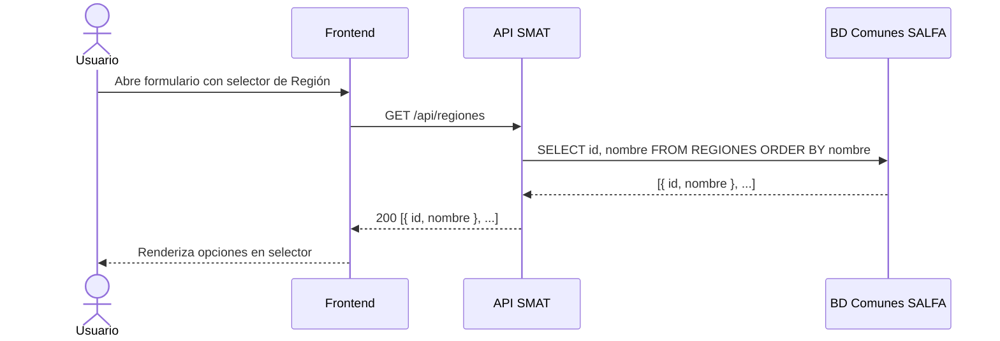

## Tracking
- **Platform**: jira
- **External ID**: SMAT-68
- **URL**: https://syntaxis.atlassian.net/browse/SMAT-68

# US-016: Listado de Regiones

## Historia
Como **usuario del sistema** (Administrador, Analista), quiero consultar el listado de regiones disponibles obtenidas desde la base de datos de comunes de SALFA, para poder seleccionar una región al registrar o filtrar obras y usuarios.

## Épica
Integración Comunas y Regiones

## Prioridad
- **MoSCoW**: Must Have
- **RICE Score**: Alcance: 50 | Impacto: 2 | Confianza: 90% | Esfuerzo: 1.0 → Puntaje: 90

## Estimación
- **Story Points (Fibonacci)**: 3
- **T-Shirt Size**: S
- **Justificación**: Servicio de solo lectura que consulta tablas existentes en la BD de comunes de SALFA. Requiere configurar la conexión a la BD externa, implementar un endpoint de listado y el componente de selector en frontend. Baja incertidumbre.

## Caso de Uso

### Caso de Uso: Listado de Regiones desde BD de Comunes SALFA
- **Actores**: Administrador, Analista
- **Precondiciones**: El usuario está autenticado. La BD de comunes de SALFA es accesible desde la infraestructura del sistema SMAT.
- **Flujo Principal**:
  1. El usuario accede a un formulario que requiere selección de región (ej.: creación/edición de obra).
  2. El frontend llama a `GET /api/regiones`.
  3. El backend consulta la tabla de regiones en la BD de comunes de SALFA.
  4. Retorna el listado ordenado por nombre.
  5. El frontend renderiza las opciones en un selector/dropdown.
- **Flujos Alternativos**:
  - BD de comunes no disponible → retorna 503 con mensaje descriptivo; el formulario muestra el error.
- **Postcondiciones**: El usuario puede seleccionar una región en el formulario.

### Diagrama



## Criterios de Aceptación (BDD)

### Feature: Listado de regiones desde BD de comunes SALFA

#### Escenario 1: Listado exitoso de regiones
```gherkin
Given que soy un usuario autenticado
When llamo a GET /api/regiones
Then el sistema retorna HTTP 200
  And el cuerpo contiene un arreglo de objetos con "id" y "nombre"
  And los resultados vienen ordenados alfabéticamente por nombre
  And la lista no está vacía
```

#### Escenario 2: Selector de región en formulario de obra
```gherkin
Given que soy Administrador y estoy en el formulario de creación de obra
When el formulario carga
Then el campo "Región" muestra un dropdown con las regiones disponibles
  And las opciones provienen de GET /api/regiones
```

#### Escenario 3: BD de comunes no disponible
```gherkin
Given que la BD de comunes de SALFA no está accesible
When llamo a GET /api/regiones
Then el sistema retorna HTTP 503 Service Unavailable
  And el mensaje indica "Servicio de catálogos no disponible temporalmente"
  And el formulario muestra el error sin bloquear la navegación
```

#### Escenario 4: Caché para evitar consultas repetidas
```gherkin
Given que el listado de regiones ya fue consultado en los últimos 60 minutos
When llamo nuevamente a GET /api/regiones
Then el sistema retorna la respuesta desde caché
  And el tiempo de respuesta es inferior a 50ms
```

## Notas Técnicas

### Backend
- Configurar un segundo `DbContext` (`SalfaComunesDbContext`) con connection string apuntando a la BD de comunes de SALFA (lectura).
- Entidad mapeada: `Region { Id, Nombre }` → tabla `REGIONES` en BD comunes.
- Implementar `GetRegionesQueryHandler` con caché en memoria (`IMemoryCache`) con TTL de 60 minutos.
- Endpoint: `GET /api/regiones` → público para usuarios autenticados (sin restricción de perfil).

### Frontend
- Componente reutilizable `<RegionSelector>` basado en `<Select>` del design system.
- Carga lazy en el primer render; resultado cacheado en React Query con `staleTime: 60 * 60 * 1000`.
- Mostrar skeleton loader durante la carga y mensaje de error si falla.

### NFRs
- Tiempo de respuesta < 200ms con caché activo.
- La conexión a BD de comunes debe ser de solo lectura (usuario DB con permisos `SELECT` únicamente).

## Dependencias
- **Bloqueado por**: US-001 (autenticación requerida)
- **Bloquea**: US-017 (Comunas requieren Regiones para filtrado)

## Definition of Done
- [ ] Endpoint GET /api/regiones retorna datos correctos de BD comunes SALFA.
- [ ] Caché en memoria con TTL 60 min operativo.
- [ ] Componente `<RegionSelector>` implementado y reutilizable.
- [ ] Manejo de error 503 visible en formularios.
- [ ] Unit tests con mock de `SalfaComunesDbContext`.
- [ ] Integration test verifica conexión a BD comunes.
- [ ] Code review aprobado.

## Enhanced Task Plan

### Backend Tasks
- Configurar `SalfaComunesDbContext` con connection string de solo lectura a BD comunes SALFA.
- Crear entidad `Region` y mapeo EF Core (tabla existente, sin migraciones).
- Implementar `GetRegionesQueryHandler` con `IMemoryCache` (TTL 60 min).
- Endpoint `GET /api/regiones` con guard de autenticación.
- Manejo de excepción de conexión → `503 ServiceUnavailable`.
- Unit tests: `GetRegionesQueryHandlerTests` (éxito con mock, falla de BD → 503).

### Frontend Tasks
- Componente `<RegionSelector>` usando `<Select>` del design system.
- Integración con React Query: `useRegiones()` hook con `staleTime` de 1h.
- Estado de error con mensaje descriptivo cuando la API retorna 503.
- Skeleton loader durante carga inicial.
- Tests: renderizado con datos, estado de carga, estado de error.

### Testing Tasks
- `GetRegionesQueryHandlerTests`: BD disponible → lista ordenada; BD no disponible → Result.Failure(503).
- Integration Test: verificar que el endpoint retorna datos reales de BD comunes en entorno de staging.
- Verificar Escenario BDD 4: segunda llamada en < 60 min → response desde caché (< 50ms).
