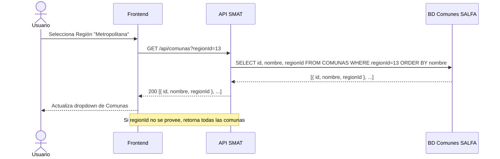

## Tracking
- **Platform**: jira
- **External ID**: SMAT-67
- **URL**: https://syntaxis.atlassian.net/browse/SMAT-67

# US-017: Listado de Comunas

## Historia
Como **usuario del sistema** (Administrador, Analista), quiero consultar el listado de comunas filtradas por región, obtenidas desde la base de datos de comunes de SALFA, para poder seleccionar la comuna correspondiente al registrar o filtrar obras y usuarios.

## Épica
Integración Comunas y Regiones

## Prioridad
- **MoSCoW**: Must Have
- **RICE Score**: Alcance: 50 | Impacto: 2 | Confianza: 90% | Esfuerzo: 1.0 → Puntaje: 90

## Estimación
- **Story Points (Fibonacci)**: 3
- **T-Shirt Size**: S
- **Justificación**: Similar a US-016 en complejidad. Agrega el filtro por región y la relación padre-hijo entre Región y Comuna. Comparte la infraestructura de conexión a BD de comunes ya implementada en US-016.

## Caso de Uso

### Caso de Uso: Listado de Comunas filtradas por Región
- **Actores**: Administrador, Analista
- **Precondiciones**: El usuario está autenticado. US-016 (Regiones) está implementado. La BD de comunes de SALFA es accesible.
- **Flujo Principal**:
  1. El usuario selecciona una región en un formulario.
  2. El frontend llama a `GET /api/comunas?regionId={id}`.
  3. El backend consulta la tabla de comunas en la BD de comunes de SALFA filtrando por `regionId`.
  4. Retorna el listado ordenado por nombre.
  5. El frontend actualiza el dropdown de comunas con las opciones correspondientes.
- **Flujos Alternativos**:
  - `regionId` no proporcionado → retorna todas las comunas (uso en búsquedas globales).
  - BD de comunes no disponible → retorna 503 con mensaje descriptivo.
- **Postcondiciones**: El usuario puede seleccionar una comuna vinculada a la región elegida.

### Diagrama



## Criterios de Aceptación (BDD)

### Feature: Listado de comunas desde BD de comunes SALFA

#### Escenario 1: Listado de comunas filtradas por región
```gherkin
Given que soy un usuario autenticado
When llamo a GET /api/comunas?regionId=13
Then el sistema retorna HTTP 200
  And el cuerpo contiene solo comunas pertenecientes a la región 13
  And los resultados vienen ordenados alfabéticamente por nombre
  And cada objeto tiene "id", "nombre" y "regionId"
```

#### Escenario 2: Listado de todas las comunas sin filtro
```gherkin
Given que soy un usuario autenticado
When llamo a GET /api/comunas (sin parámetro regionId)
Then el sistema retorna HTTP 200
  And el cuerpo contiene todas las comunas de todas las regiones
  And los resultados vienen ordenados alfabéticamente por nombre
```

#### Escenario 3: Selector de comuna en formulario de obra — cascada con Región
```gherkin
Given que soy Administrador en el formulario de creación de obra
  And he seleccionado la región "Región Metropolitana"
When el campo "Región" cambia de valor
Then el campo "Comuna" se actualiza automáticamente con las comunas de esa región
  And el campo "Comuna" se vacía si la región cambia
```

#### Escenario 4: BD de comunes no disponible
```gherkin
Given que la BD de comunes de SALFA no está accesible
When llamo a GET /api/comunas?regionId=13
Then el sistema retorna HTTP 503 Service Unavailable
  And el mensaje indica "Servicio de catálogos no disponible temporalmente"
```

#### Escenario 5: Caché por región para evitar consultas repetidas
```gherkin
Given que el listado de comunas de la región 13 ya fue consultado en los últimos 60 minutos
When llamo nuevamente a GET /api/comunas?regionId=13
Then el sistema retorna la respuesta desde caché
  And el tiempo de respuesta es inferior a 50ms
```

## Notas Técnicas

### Backend
- Reutilizar `SalfaComunesDbContext` configurado en US-016.
- Entidad mapeada: `Comuna { Id, Nombre, RegionId }` → tabla `COMUNAS` en BD comunes.
- Implementar `GetComunasQueryHandler` con parámetro opcional `regionId`. Caché en memoria por clave `comunas:{regionId}` con TTL 60 minutos.
- Endpoint: `GET /api/comunas?regionId={id?}` → público para usuarios autenticados.

### Frontend
- Componente reutilizable `<ComunaSelector>` que recibe `regionId` como prop.
- Al cambiar `regionId`, limpia la selección actual y recarga opciones.
- Integración con React Query: `useComunas(regionId)` hook; cuando `regionId` es undefined carga todas.
- `staleTime: 60 * 60 * 1000` — misma estrategia que US-016.
- Tests: renderizado con `regionId`, cambio de región limpia selector, estado de error.

### NFRs
- Tiempo de respuesta < 200ms con caché activo.
- La conexión a BD de comunes debe ser de solo lectura.
- El caché debe ser por clave `regionId` para granularidad eficiente.

## Dependencias
- **Bloqueado por**: US-016 (infraestructura de conexión a BD comunes + `SalfaComunesDbContext`)
- **Relacionado con**: US-005 (Gestión de Obras usa selector Región/Comuna)

## Definition of Done
- [ ] Endpoint GET /api/comunas retorna datos correctos con y sin filtro por regionId.
- [ ] Caché en memoria por regionId con TTL 60 min operativo.
- [ ] Componente `<ComunaSelector>` implementado con lógica de cascada.
- [ ] Al cambiar región, el selector de comunas se resetea y recarga.
- [ ] Manejo de error 503 visible en formularios.
- [ ] Unit tests con mock de `SalfaComunesDbContext`.
- [ ] Code review aprobado.

## Enhanced Task Plan

### Backend Tasks
- Crear entidad `Comuna { Id, Nombre, RegionId }` en `SalfaComunesDbContext` (tabla existente, sin migraciones).
- Implementar `GetComunasQueryHandler` con filtro opcional `regionId` y caché por clave `comunas:{regionId}` (TTL 60 min).
- Endpoint `GET /api/comunas?regionId={id?}` con guard de autenticación.
- Manejo de excepción de conexión → `503 ServiceUnavailable`.
- Unit tests: `GetComunasQueryHandlerTests` (con regionId, sin regionId, BD no disponible → 503).

### Frontend Tasks
- Componente `<ComunaSelector>` que recibe `regionId` prop y llama `useComunas(regionId)`.
- Lógica de cascada: al cambiar `regionId` → limpiar valor seleccionado + refetch.
- Estado de error con mensaje descriptivo cuando la API retorna 503.
- Skeleton loader durante recarga al cambiar región.
- Tests: cascada al cambiar región, renderizado vacío sin regionId, estado de error.

### Testing Tasks
- `GetComunasQueryHandlerTests`: con regionId → solo comunas de esa región; sin regionId → todas; BD no disponible → Result.Failure(503).
- Integration Test: verificar datos reales de BD comunes en staging con y sin filtro.
- Verificar Escenario BDD 3: cambio de región limpia y recarga comunas.
- Verificar Escenario BDD 5: segunda llamada en < 60 min → response desde caché (< 50ms).
