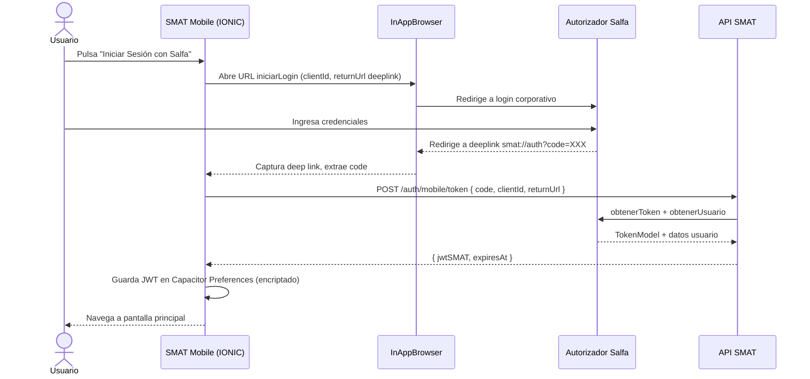

## Tracking
- **Platform**: jira
- **External ID**: SMAT-76
- **URL**: https://syntaxis.atlassian.net/browse/SMAT-76

# US-018: Autenticación Mobile vía SSO Salfa

## Historia
Como **Controlador o Validador**, quiero autenticarme en la aplicación móvil SMAT usando mis credenciales corporativas de Salfa (SSO), para acceder de forma segura a las funcionalidades de mi rol sin gestionar credenciales separadas.

## Épica
Aplicación Móvil

## Prioridad
- **MoSCoW**: Must Have
- **RICE Score**: Alcance: 80 | Impacto: 3 | Confianza: 90% | Esfuerzo: 1.5 → Puntaje: 144

## Estimación
- **Story Points (Fibonacci)**: 5
- **T-Shirt Size**: M
- **Justificación**: Reutiliza el flujo SSO Salfa de US-001 pero adaptado al contexto móvil (IONIC + Angular 20). Requiere InAppBrowser para el redirect OAuth, manejo de deep links, persistencia segura del JWT en Capacitor Preferences, y detección de sesión activa al relanzar la app. Mayor incertidumbre que la web por el manejo de deep links en iOS/Android.

## Caso de Uso

### Caso de Uso: Autenticación Mobile vía SSO Salfa
- **Actores**: Controlador, Validador
- **Precondiciones**: El usuario tiene cuenta activa en SMAT. Dispone de credenciales válidas en el autorizador Salfa. La app está instalada en el dispositivo (iOS o Android).
- **Flujo Principal**:
  1. El usuario abre la app SMAT Mobile.
  2. Si no hay sesión activa, se muestra la pantalla de login.
  3. El usuario pulsa "Iniciar Sesión con Salfa".
  4. La app abre el autorizador Salfa en un InAppBrowser (Capacitor).
  5. El usuario se autentica con sus credenciales corporativas.
  6. Salfa redirige al deep link de la app con el `code`.
  7. La app intercambia el `code` por el token Salfa y luego obtiene el JWT SMAT.
  8. El JWT se persiste de forma segura en Capacitor Preferences.
  9. El usuario accede a la pantalla principal filtrada por su obra y rol.
- **Flujos Alternativos**:
  - Sesión JWT vigente al relanzar la app → skip de login, directo a home.
  - JWT expirado → refresh silencioso o redirección a login.
  - Usuario inactivo en SMAT → 401 con mensaje y regreso a login.
- **Postcondiciones**: El usuario tiene un JWT activo y puede operar la app.

### Diagrama



## Criterios de Aceptación (BDD)

### Feature: Autenticación Mobile vía SSO Salfa

#### Escenario 1: Login exitoso con credenciales válidas
```gherkin
Given que soy Controlador con cuenta activa en SMAT
  And la app está abierta en la pantalla de login
When pulso "Iniciar Sesión con Salfa" e ingreso mis credenciales corporativas
Then el autorizador Salfa me redirige a la app con un code válido
  And la app obtiene el JWT SMAT y lo persiste de forma segura
  And soy redirigido a la pantalla principal con mis obras asignadas
```

#### Escenario 2: Sesión persistida — relanzar app sin relogin
```gherkin
Given que ya inicié sesión y el JWT está vigente
When cierro y vuelvo a abrir la app
Then la app me lleva directamente a la pantalla principal
  And no se muestra la pantalla de login
```

#### Escenario 3: Usuario inactivo en SMAT
```gherkin
Given que mi cuenta en SMAT está desactivada
When completo el flujo SSO de Salfa correctamente
Then la API retorna 401 Unauthorized
  And la app muestra el mensaje "Tu cuenta está desactivada. Contacta al Administrador."
  And permanezco en la pantalla de login
```

#### Escenario 4: JWT expirado — refresh silencioso
```gherkin
Given que el JWT SMAT ha expirado pero el refresh token es válido
When intento navegar a cualquier pantalla protegida
Then la app renueva el JWT de forma silenciosa en background
  And continúo sin interrupciones en la pantalla solicitada
```

## Notas Técnicas

### Mobile (IONIC + Angular 20)
- Plugin `@capacitor/browser` para InAppBrowser (reemplaza a `cordova-plugin-inappbrowser`).
- Deep link configurado en `capacitor.config.ts`: scheme `smat`, host `auth`.
- Interceptor HTTP `JwtInterceptor` que adjunta Bearer token a todas las peticiones a la API SMAT.
- `AuthGuard` en el router IONIC para rutas protegidas.
- JWT almacenado en `@capacitor/preferences` (clave `smat_jwt`) — no usar localStorage en móvil.
- Manejo de biometría opcional para unlock rápido (Fase futura).

### Backend
- Endpoint `POST /auth/mobile/token`: igual que el flujo web pero con `returnUrl` de deep link.
- Validar que el `returnUrl` es un deep link permitido (`smat://auth`).

### NFRs
- El flujo completo de login no debe superar 5 segundos en condiciones normales de red.
- El JWT debe almacenarse cifrado en el dispositivo.

## Dependencias
- **Bloqueado por**: Infraestructura SSO Salfa (mismo que US-001)
- **Bloquea**: US-019, US-020, US-021 (requieren autenticación activa)

## Definition of Done
- [ ] Login con SSO Salfa funcional en iOS y Android.
- [ ] JWT persistido de forma segura en Capacitor Preferences.
- [ ] Deep link configurado y funcional en ambas plataformas.
- [ ] Sesión persistida al relanzar la app.
- [ ] Manejo de usuario inactivo con mensaje claro.
- [ ] Refresh silencioso de JWT implementado.
- [ ] Unit tests del AuthGuard y JwtInterceptor.
- [ ] Code review aprobado.

## Enhanced Task Plan

### Mobile Tasks (IONIC + Angular 20)
- Configurar proyecto IONIC con Angular 20 + Capacitor (iOS + Android).
- Configurar deep link `smat://auth` en `capacitor.config.ts`, `AndroidManifest.xml` e `Info.plist`.
- Implementar `AuthService`: `login()`, `handleCallback(code)`, `refreshToken()`, `logout()`, `isLoggedIn()`.
- Implementar `JwtInterceptor` para adjuntar Bearer token a peticiones HTTP.
- Implementar `AuthGuard` para rutas protegidas del router IONIC.
- Pantalla `LoginPage` con botón SSO + manejo de estados (loading, error).
- Tests: `AuthService` (mock InAppBrowser), `JwtInterceptor`, `AuthGuard`.

### Backend Tasks
- Endpoint `POST /auth/mobile/token` validando returnUrl de deep link.
- Whitelist de returnUrls permitidos para mobile en configuración.

### Testing Tasks
- E2E en emulador iOS/Android: flujo completo login → home.
- Verificar Escenario BDD 2: JWT persistido → relanzar app → no login.
- Verificar Escenario BDD 3: usuario inactivo → mensaje correcto.
- Verificar Escenario BDD 4: refresh silencioso sin interrupción.
