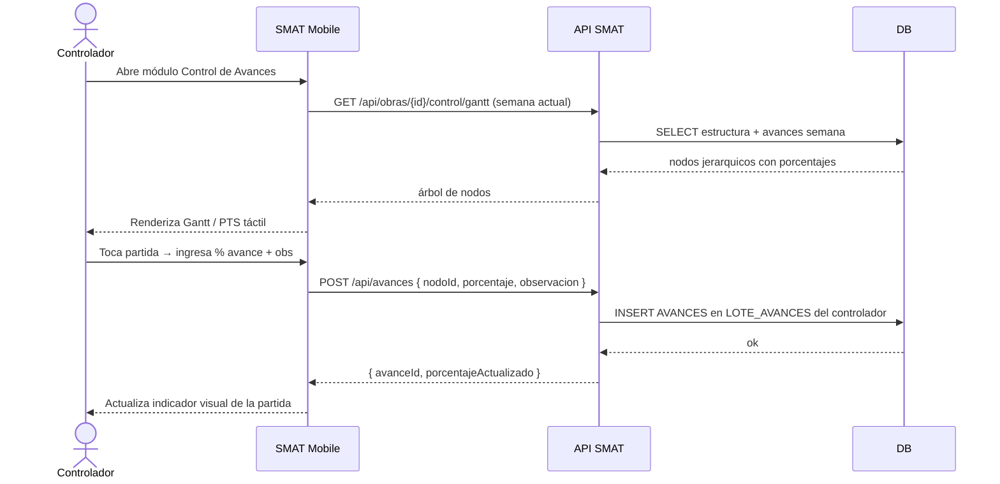

## Tracking
- **Platform**: jira
- **External ID**: SMAT-78
- **URL**: https://syntaxis.atlassian.net/browse/SMAT-78

# US-019: Mobile — Registro de Avances (Controlador)

## Historia
Como **Controlador**, quiero registrar el avance de las partidas de mi obra desde la aplicación móvil, visualizando las vistas Gantt y PTS adaptadas para pantallas táctiles, para reportar el progreso semanal en campo sin necesidad de acceder al sistema web.

## Épica
Aplicación Móvil

## Prioridad
- **MoSCoW**: Must Have
- **RICE Score**: Alcance: 60 | Impacto: 3 | Confianza: 80% | Esfuerzo: 3.0 → Puntaje: 48

## Estimación
- **Story Points (Fibonacci)**: 8
- **T-Shirt Size**: L
- **Justificación**: Es la funcionalidad core de la app. Requiere adaptar las vistas Gantt y PTS al contexto móvil táctil (árboles colapsables, input de porcentaje con teclado numérico, feedback inmediato). Reutiliza los endpoints de US-010 pero la UX móvil es considerablemente diferente a la web. Considerar potencial modo offline con sincronización posterior. El equipo convergería en 8.

## Caso de Uso

### Caso de Uso: Registro de Avances desde Mobile
- **Actores**: Controlador
- **Precondiciones**: El Controlador está autenticado en la app. Tiene asignación activa en la obra. Existe una carga XML procesada para la semana en curso. El lote de avances está abierto.
- **Flujo Principal**:
  1. El Controlador abre la app y selecciona su obra asignada.
  2. Accede al módulo "Control de Avances".
  3. Elige la vista Gantt o PTS.
  4. Navega por la estructura jerárquica del programa.
  5. Toca una partida para ingresar el porcentaje de avance y una observación opcional.
  6. Confirma el registro con un botón de "Guardar".
  7. La app actualiza el estado de la partida en tiempo real (indicador visual de progreso).
  8. Repite el proceso para todas las partidas que corresponden.
- **Flujos Alternativos**:
  - Partida ya al 100%: se muestra como bloqueada (solo lectura).
  - Sin conexión: el avance se guarda localmente y se sincroniza al recuperar la red.
  - Lote cerrado: la app muestra un banner informativo y deshabilita la edición.
- **Postcondiciones**: Los avances quedan registrados en el lote del controlador, visibles también en la versión web.

### Diagrama



## Criterios de Aceptación (BDD)

### Feature: Registro de avances desde la app móvil

#### Escenario 1: Registro exitoso de avance en vista Gantt
```gherkin
Given que soy Controlador autenticado con lote de avances abierto
  And existe una carga procesada para "Proyecto Norte" esta semana
When selecciono la partida "Fundaciones — Torre A" e ingreso 60% de avance
Then el sistema guarda el avance en mi lote
  And la partida muestra 60% con indicador visual actualizado
  And el avance es visible desde la versión web en tiempo real
```

#### Escenario 2: Partida ya completada al 100% es solo lectura
```gherkin
Given que la partida "Estructura — Piso 1" ya fue registrada al 100% por otro controlador
When visualizo esa partida en la vista Gantt
Then aparece como bloqueada con icono de completado
  And no puedo ingresar ni modificar el porcentaje
```

#### Escenario 3: Registro de avance sin conexión (modo offline)
```gherkin
Given que el dispositivo no tiene conexión a internet
When registro el avance de la partida "Revestimientos" al 45%
Then el avance se almacena localmente en el dispositivo
  And se muestra un indicador de "Pendiente de sincronización"
  And al recuperar la conexión el avance se sincroniza automáticamente con la API
```

#### Escenario 4: Lote cerrado — edición deshabilitada
```gherkin
Given que ya cerré mi lote de avances para esta semana
When intento ingresar un nuevo porcentaje en cualquier partida
Then la app muestra "Tu lote de avances está cerrado para esta semana"
  And todos los campos de avance aparecen deshabilitados
```

#### Escenario 5: Visualización en vista PTS
```gherkin
Given que existen nodos con PTS = true en la estructura del programa
When selecciono la vista "PTS"
Then la app muestra solo los nodos con PTS habilitado
  And están agrupados por proceso
  And puedo registrar avances directamente desde esta vista
```

## Notas Técnicas

### Mobile (IONIC + Angular 20)
- Reutilizar endpoints de US-010: `GET /api/obras/{id}/control/gantt` y `POST /api/avances`.
- Componente `<GanttMobileTree>`: árbol colapsable optimizado para táctil (swipe to expand, tap to edit).
- Componente `<PtsMobileList>`: lista agrupada por proceso, acceso rápido a partidas PTS.
- Input de porcentaje: teclado numérico nativo (Capacitor Keyboard), validación 0-100.
- Modo offline: `@capacitor/preferences` para cola de avances pendientes + `Network` plugin para detectar reconexión.
- Sincronización offline: al detectar red → iterar cola y enviar en secuencia; limpiar cola tras éxito.
- Indicador visual de estado por partida: sin avance (gris), en progreso (azul), completado (verde), pendiente sync (naranja).

### NFRs
- El árbol Gantt debe renderizar hasta 500 nodos sin lag perceptible.
- Los avances offline deben sincronizarse en < 10 s al recuperar conexión.
- La app debe funcionar en iOS 16+ y Android 10+.

## Dependencias
- **Bloqueado por**: US-018 (autenticación mobile), US-010 (endpoints de avances ya implementados en web)
- **Bloquea**: US-020 (cierre de control requiere que se hayan registrado avances)

## Definition of Done
- [ ] Vista Gantt táctil con árbol colapsable funcional en iOS y Android.
- [ ] Vista PTS agrupada por proceso funcional.
- [ ] Registro de avances sincronizado con API en tiempo real.
- [ ] Modo offline: avances guardados localmente y sincronizados al recuperar conexión.
- [ ] Indicadores visuales de estado por partida.
- [ ] Lote cerrado → UI deshabilitada con mensaje.
- [ ] Unit tests del servicio de sincronización offline.
- [ ] Code review aprobado y validado en dispositivo físico.

## Enhanced Task Plan

### Mobile Tasks (IONIC + Angular 20)
- Componente `<GanttMobileTree>` con árbol colapsable táctil y paginación virtual (CDK Virtual Scroll).
- Componente `<PtsMobileList>` agrupado por proceso con registro de avance inline.
- `AvancesService`: `registrarAvance()`, `syncOfflineQueue()`, escucha `Network.addListener('networkStatusChange')`.
- Cola offline en `@capacitor/preferences`: `offline_avances_queue` (JSON array).
- Pantalla `ControlAvancesPage` con toggle Gantt/PTS y barra de progreso global de la obra.
- Tests: `AvancesService` (sync online, encolado offline, sync al reconectar).

### Backend Tasks
- Sin cambios en endpoints (reutiliza US-010). Validar que el endpoint acepta peticiones desde mobile (CORS + JWT mobile).

### Testing Tasks
- `AvancesServiceTests`: registro online → persiste; sin red → encola; reconexión → sincroniza y limpia cola.
- Integration Test en emulador: flujo completo Gantt → registrar 3 avances → verificar en web.
- Verificar Escenario BDD 3: modo avión → registrar → activar red → sincronización automática.
- Verificar Escenario BDD 2: partida al 100% → campo bloqueado en UI.
