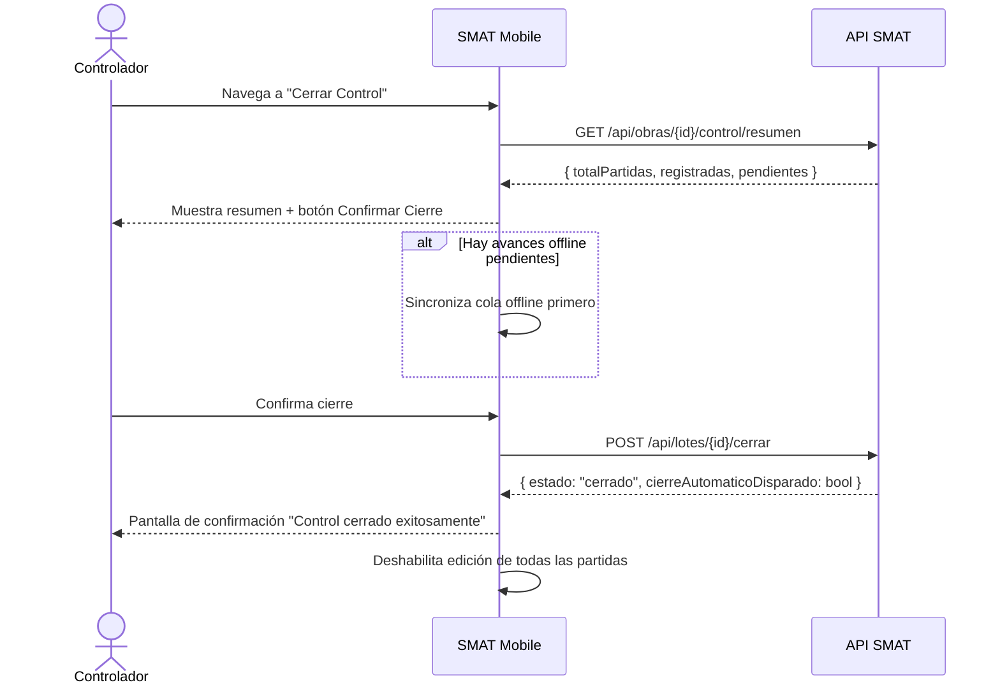

## Tracking
- **Platform**: jira
- **External ID**: SMAT-77
- **URL**: https://syntaxis.atlassian.net/browse/SMAT-77

# US-020: Mobile — Cierre de Control (Controlador)

## Historia
Como **Controlador**, quiero cerrar mi lote de avances semanales desde la aplicación móvil, para indicar que he finalizado el registro de avances de la semana y habilitar el proceso de validación del Validador.

## Épica
Aplicación Móvil

## Prioridad
- **MoSCoW**: Must Have
- **RICE Score**: Alcance: 60 | Impacto: 3 | Confianza: 85% | Esfuerzo: 1.5 → Puntaje: 102

## Estimación
- **Story Points (Fibonacci)**: 5
- **T-Shirt Size**: M
- **Justificación**: Reutiliza la lógica de cierre de US-012. La complejidad es la UX de confirmación en móvil (pantalla de resumen + confirmación explícita), el manejo de avances offline pendientes antes de cerrar, y la actualización del estado en la UI. Estimación convergente en 5.

## Caso de Uso

### Caso de Uso: Cierre de Lote de Avances desde Mobile
- **Actores**: Controlador
- **Precondiciones**: El Controlador está autenticado. El lote de avances está abierto. No hay avances offline pendientes de sincronización.
- **Flujo Principal**:
  1. El Controlador navega a la pantalla "Cerrar Control".
  2. La app muestra un resumen de los avances registrados en la semana.
  3. El Controlador revisa el resumen y confirma el cierre.
  4. La app verifica que no haya avances offline pendientes; si los hay, los sincroniza primero.
  5. La app llama al endpoint de cierre de lote.
  6. El backend cierra el lote y evalúa si todos los controladores de la obra han cerrado (dispara cierre automático si aplica — US-013 lógica).
  7. La app muestra confirmación de cierre exitoso.
  8. Todas las partidas quedan en modo solo lectura.
- **Flujos Alternativos**:
  - Avances offline pendientes: la app sincroniza primero, luego cierra.
  - Sin conexión al momento de cerrar: muestra error "Se requiere conexión para cerrar el control".
- **Postcondiciones**: El lote está cerrado. El Validador puede proceder con la validación.

### Diagrama



## Criterios de Aceptación (BDD)

### Feature: Cierre de control desde la app móvil

#### Escenario 1: Cierre exitoso con todos los avances sincronizados
```gherkin
Given que soy Controlador con lote abierto y sin avances offline pendientes
When navego a "Cerrar Control" y confirmo el cierre
Then el sistema cierra mi lote de avances
  And la app muestra "Control cerrado exitosamente"
  And todas las partidas quedan en modo solo lectura
  And el Validador puede iniciar la validación de la semana
```

#### Escenario 2: Cierre con avances offline pendientes — sincroniza y cierra
```gherkin
Given que tengo 3 avances pendientes de sincronización (offline)
When confirmo el cierre
Then la app sincroniza los 3 avances offline primero
  And luego ejecuta el cierre del lote
  And muestra "Control cerrado exitosamente" tras sincronizar todo
```

#### Escenario 3: Sin conexión al intentar cerrar
```gherkin
Given que el dispositivo no tiene conexión a internet
When intento cerrar el control
Then la app muestra "Se requiere conexión a internet para cerrar el control"
  And el lote permanece abierto
```

#### Escenario 4: Todos los controladores cierran — cierre automático de validación
```gherkin
Given que soy el último Controlador en cerrar mi lote para "Proyecto Norte"
When confirmo el cierre
Then el sistema cierra mi lote
  And dispara automáticamente la creación de VALIDACION_SEMANA con estado APROBADO_AUTOMATICO
  And la app muestra "Todos los controladores han cerrado. Validación aprobada automáticamente."
```

## Notas Técnicas

### Mobile (IONIC + Angular 20)
- Pantalla `CerrarControlPage` con resumen de avances (total partidas, registradas, pendientes).
- Verificar cola offline vacía antes de mostrar el botón "Confirmar Cierre".
- Si hay cola pendiente: mostrar spinner "Sincronizando avances..." y luego proceder.
- `AlertController` de IONIC para confirmación modal antes del cierre (acción irreversible).
- Tras el cierre exitoso: navegar a pantalla de confirmación y marcar el estado del lote como `cerrado` en estado local.

### Backend
- Reutiliza `CerrarLoteCommandHandler` de US-012.
- El endpoint retorna `cierreAutomaticoDisparado: true/false` para que la app muestre el mensaje adecuado.

### NFRs
- El proceso de cierre (sync + POST) no debe superar 10 s en condiciones normales.
- La confirmación debe ser explícita (modal de alerta) — acción irreversible.

## Dependencias
- **Bloqueado por**: US-019 (registro de avances), US-020 requiere lote abierto
- **Relacionado con**: US-012 (misma lógica de negocio, endpoints compartidos)

## Definition of Done
- [ ] Pantalla de resumen de avances funcional antes del cierre.
- [ ] Sync offline previo al cierre implementado.
- [ ] Modal de confirmación (acción irreversible) implementado.
- [ ] Cierre exitoso deshabilita edición en Gantt/PTS.
- [ ] Mensaje de cierre automático de validación cuando corresponde.
- [ ] Error manejado sin conexión.
- [ ] Code review aprobado.

## Enhanced Task Plan

### Mobile Tasks (IONIC + Angular 20)
- Pantalla `CerrarControlPage`: resumen de partidas + botón Confirmar con `AlertController`.
- Lógica pre-cierre: verificar cola offline → sincronizar si hay pendientes → luego cerrar.
- `ControlService.cerrarLote()`: POST al endpoint + manejo de respuesta `cierreAutomaticoDisparado`.
- Actualización de estado local: marcar lote como `cerrado` en Capacitor Preferences.
- Tests: `ControlService.cerrarLote()` (éxito, sin conexión → error, con cola offline → sync primero).

### Backend Tasks
- Sin cambios en lógica. Ajustar respuesta del endpoint para incluir `cierreAutomaticoDisparado: bool`.

### Testing Tasks
- `ControlServiceTests`: cierre exitoso; sin conexión → error explícito; cola offline → sync previo.
- Verificar Escenario BDD 4: último controlador cierra → VALIDACION_SEMANA creada automáticamente.
- E2E en emulador: cerrar con avances offline pendientes → verificar sync + cierre exitoso.
