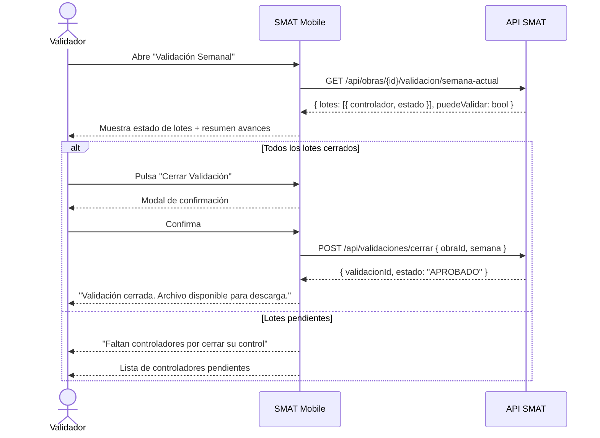

## Tracking
- **Platform**: jira
- **External ID**: SMAT-79
- **URL**: https://syntaxis.atlassian.net/browse/SMAT-79

# US-021: Mobile — Cierre de Validación (Validador)

## Historia
Como **Validador**, quiero revisar el resumen de avances de la semana y cerrar la validación desde la aplicación móvil, para aprobar oficialmente el control semanal de obra y habilitar la descarga del archivo de avances.

## Épica
Aplicación Móvil

## Prioridad
- **MoSCoW**: Must Have
- **RICE Score**: Alcance: 40 | Impacto: 3 | Confianza: 85% | Esfuerzo: 1.5 → Puntaje: 68

## Estimación
- **Story Points (Fibonacci)**: 5
- **T-Shirt Size**: M
- **Justificación**: Reutiliza la lógica de cierre de validación de US-013. La complejidad en mobile es la pantalla de revisión de avances consolidados por controlador, la confirmación explícita, y el manejo de estados (validación manual vs automática). Estimación convergente en 5.

## Caso de Uso

### Caso de Uso: Cierre de Validación desde Mobile
- **Actores**: Validador
- **Precondiciones**: El Validador está autenticado. Todos los controladores de la obra han cerrado sus lotes. No existe ya una validación cerrada para la semana.
- **Flujo Principal**:
  1. El Validador accede a la pantalla "Validación Semanal".
  2. La app muestra el estado de los lotes por controlador (todos deben estar cerrados).
  3. El Validador revisa el resumen consolidado de avances.
  4. Confirma el cierre de la validación.
  5. El backend crea `VALIDACION_SEMANA` con estado `APROBADO` y `VALIDACION_LOTE` por cada lote.
  6. La app muestra confirmación y habilita el botón de descarga del archivo de avances.
- **Flujos Alternativos**:
  - Algún controlador aún no cerró su lote: el Validador ve el estado pendiente y no puede cerrar.
  - Validación ya cerrada automáticamente: la app la muestra como `APROBADO_AUTOMATICO` (solo lectura).
  - Sin conexión: muestra error "Se requiere conexión para cerrar la validación".
- **Postcondiciones**: La validación está cerrada. Se puede descargar el archivo de avances.

### Diagrama



## Criterios de Aceptación (BDD)

### Feature: Cierre de validación desde la app móvil

#### Escenario 1: Cierre de validación exitoso
```gherkin
Given que soy Validador y todos los controladores de "Proyecto Norte" cerraron sus lotes
When accedo a "Validación Semanal" y confirmo el cierre
Then el sistema crea VALIDACION_SEMANA con estado APROBADO
  And la app muestra "Validación cerrada exitosamente"
  And el botón "Descargar Archivo de Avances" queda habilitado
```

#### Escenario 2: Lotes pendientes — no se puede validar
```gherkin
Given que el Controlador "Juan Pérez" aún no ha cerrado su lote
When el Validador accede a "Validación Semanal"
Then la app muestra la lista de lotes con Juan Pérez en estado "Pendiente"
  And el botón "Cerrar Validación" aparece deshabilitado
  And se muestra el mensaje "Faltan controladores por cerrar su control"
```

#### Escenario 3: Validación ya cerrada automáticamente
```gherkin
Given que todos los controladores cerraron y la validación fue aprobada automáticamente
When el Validador accede a "Validación Semanal"
Then la app muestra el estado "Aprobado Automáticamente"
  And el botón "Cerrar Validación" no está disponible (ya procesada)
  And el botón "Descargar Archivo" está habilitado
```

#### Escenario 4: Sin conexión al intentar cerrar
```gherkin
Given que el dispositivo no tiene conexión a internet
When el Validador intenta cerrar la validación
Then la app muestra "Se requiere conexión a internet para cerrar la validación"
  And la validación permanece abierta
```

#### Escenario 5: Controlador intenta acceder a la pantalla de validación
```gherkin
Given que soy Controlador (no Validador)
When intento navegar a "Validación Semanal"
Then la app me redirige a la pantalla principal con el mensaje "No tienes permisos para esta acción"
```

## Notas Técnicas

### Mobile (IONIC + Angular 20)
- Pantalla `ValidacionSemanalPage`: lista de lotes por controlador con íconos de estado (pendiente/cerrado), resumen de avances y botón condicional "Cerrar Validación".
- `ValidacionService.cerrarValidacion()`: POST endpoint US-013 + manejo de respuesta.
- `RoleGuard` en el router: solo Validador puede acceder a esta pantalla.
- `AlertController` para confirmación modal antes del cierre.
- Tras el cierre: mostrar botón "Descargar Archivo" que genera URL presignada (reutiliza endpoint US-013).

### Backend
- Reutiliza `CerrarValidacionCommandHandler` y `GetDescargaUrlQueryHandler` de US-013.
- El endpoint GET de estado de semana ya retorna los lotes con sus estados.

### NFRs
- La pantalla de validación debe cargarse en < 2 s.
- La confirmación de cierre debe ser explícita (modal irreversible).

## Dependencias
- **Bloqueado por**: US-020 (todos los controladores deben cerrar antes de que el Validador pueda cerrar), US-018 (autenticación)
- **Relacionado con**: US-013 (misma lógica de negocio, endpoints compartidos)

## Definition of Done
- [ ] Pantalla de validación muestra estado de lotes por controlador.
- [ ] Cierre de validación funcional con modal de confirmación.
- [ ] Estado "Aprobado Automáticamente" visible y correcto.
- [ ] Botón "Descargar Archivo" habilitado tras validación cerrada.
- [ ] RoleGuard impide acceso a Controladores.
- [ ] Error manejado sin conexión.
- [ ] Code review aprobado.

## Enhanced Task Plan

### Mobile Tasks (IONIC + Angular 20)
- Pantalla `ValidacionSemanalPage`: lista de lotes + resumen + botón condicional.
- `ValidacionService`: `getEstadoSemana()`, `cerrarValidacion()`, `getDescargaUrl()`.
- `RoleGuard` para ruta `/validacion` (solo Validador).
- `AlertController` para confirmación de cierre.
- Botón de descarga con generación de URL presignada y apertura en browser nativo.
- Tests: `ValidacionService` (éxito, lotes pendientes → error, sin conexión → error, control accede → 403).

### Backend Tasks
- Sin cambios en lógica. Reutiliza endpoints de US-013.

### Testing Tasks
- `ValidacionServiceTests`: cierre exitoso; lotes pendientes → error descriptivo; sin conexión → error.
- Verificar Escenario BDD 2: lista de controladores pendientes visible para Validador.
- Verificar Escenario BDD 5: Controlador navega a validación → redirigido con mensaje.
- E2E en emulador: flujo completo Controlador cierra → Validador valida → descarga archivo.
