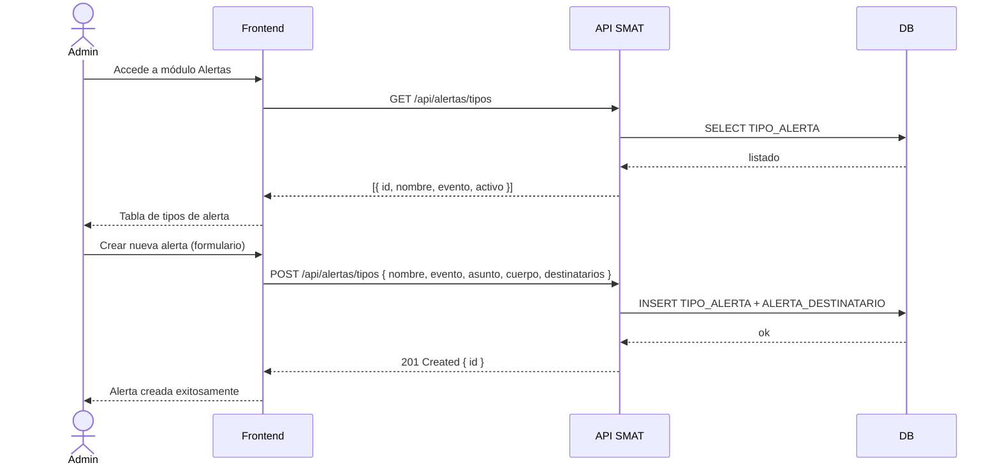

## Tracking
- **Platform**: jira
- **External ID**: SMAT-94
- **URL**: https://syntaxis.atlassian.net/browse/SMAT-94
- **Epic**: SMAT-92
- **Subtareas**: SMAT-96 [Backend], SMAT-99 [Frontend], SMAT-100 [Testing]

# US-022: Administración de Tipos de Alerta

## Historia
Como **Administrador**, quiero gestionar los tipos de alertas del sistema (crear, editar, activar/desactivar), para controlar qué notificaciones por correo electrónico se envían ante cada evento del sistema y a quiénes se dirigen.

## Épica
Alertas y Notificaciones

## Prioridad
- **MoSCoW**: Should Have
- **RICE Score**: Alcance: 20 | Impacto: 2 | Confianza: 85% | Esfuerzo: 1.5 → Puntaje: 22.7

## Estimación
- **Story Points (Fibonacci)**: 5
- **T-Shirt Size**: M
- **Justificación**: CRUD de tipos de alerta con configuración de evento disparador, plantilla de asunto/cuerpo y lista de destinatarios. Complejidad media por el diseño del modelo de datos de alertas y la interfaz de administración.

## Caso de Uso

### Caso de Uso: Gestión de Tipos de Alerta
- **Actores**: Administrador
- **Precondiciones**: El usuario está autenticado con perfil Administrador.
- **Flujo Principal**:
  1. El Administrador accede al módulo "Alertas" en el panel de administración.
  2. Visualiza el listado de tipos de alerta existentes (nombre, evento, estado activo/inactivo).
  3. Crea un nuevo tipo de alerta configurando:
     - **Nombre**: identificador descriptivo (ej.: "Carga XML Procesada").
     - **Evento disparador**: seleccionado desde un catálogo de eventos del sistema.
     - **Asunto del correo**: texto con variables dinámicas (ej.: `{{obra}}`).
     - **Cuerpo del correo**: plantilla HTML con variables dinámicas.
     - **Destinatarios**: Roles/perfiles que recibirán el correo (ej.: Analista de la obra, Validador asignado).
  4. Guarda el tipo de alerta como activo.
  5. Puede editar o activar/desactivar cualquier tipo de alerta existente.
- **Postcondiciones**: El tipo de alerta queda configurado y será evaluado por el motor de alertas ante cada evento.

### Catálogo de Eventos del Sistema
| Código Evento               | Descripción                                              |
|-----------------------------|----------------------------------------------------------|
| `CARGA_PROCESADA`           | Archivo XML procesado exitosamente                       |
| `CARGA_ERROR`               | Error al procesar el archivo XML                         |
| `CARGA_FUERA_VENTANA`       | Intento de carga fuera de la ventana horaria             |
| `LOTE_CERRADO`              | Controlador cerró su lote de avances                     |
| `VALIDACION_CERRADA`        | Validador cerró la validación semanal                    |
| `VALIDACION_AUTOMATICA`     | Validación cerrada automáticamente (todos los lotes)     |
| `USUARIO_CREADO`            | Nuevo usuario creado en el sistema                       |
| `ASIGNACION_OBRA`           | Usuario asignado a una obra                              |

### Diagrama



## Criterios de Aceptación (BDD)

### Feature: Administración de tipos de alerta

#### Escenario 1: Crear tipo de alerta exitosamente
```gherkin
Given que soy Administrador en el módulo de Alertas
When creo un tipo de alerta con nombre "Carga XML Procesada", evento "CARGA_PROCESADA", asunto "Carga completada para {{obra}}" y destinatario "Analista"
Then el tipo de alerta queda guardado con estado Activo
  And aparece en el listado de tipos de alerta
  And el motor de alertas lo evaluará ante el evento CARGA_PROCESADA
```

#### Escenario 2: Desactivar un tipo de alerta
```gherkin
Given que existe el tipo de alerta "Carga XML Procesada" en estado Activo
When el Administrador lo desactiva
Then el tipo de alerta queda en estado Inactivo
  And el motor de alertas ya no envía correos ante ese evento
  And puede reactivarse en cualquier momento
```

#### Escenario 3: Variables dinámicas en plantilla
```gherkin
Given que el Administrador configura el asunto "Carga completada para {{obra}} — semana {{semana}}"
When se dispara el evento CARGA_PROCESADA para "Proyecto Norte" semana 18
Then el correo enviado tiene el asunto "Carga completada para Proyecto Norte — semana 18"
```

#### Escenario 4: Solo el Administrador accede al módulo de alertas
```gherkin
Given que soy Controlador o Analista
When intento acceder al módulo de Alertas
Then el sistema retorna 403 Forbidden
  And no puedo ver ni gestionar tipos de alerta
```

## Notas Técnicas

### Backend
- Entidades: `TipoAlerta { Id, Nombre, CodigoEvento, AsuntoTemplate, CuerpoTemplate, Activo }` y `AlertaDestinatario { TipoAlertaId, TipoDestinatario (enum: rol, usuario_especifico) }`.
- Tabla catálogo `EVENTO_ALERTA` con los códigos de evento del sistema (seed en migración).
- Variables dinámicas: resolver con un motor simple de templates (ej.: `Scriban` o `Handlebars.Net`).
- Endpoints: `GET /api/alertas/tipos`, `POST /api/alertas/tipos`, `PUT /api/alertas/tipos/{id}`, `PATCH /api/alertas/tipos/{id}/estado`.
- Autorización: solo perfil Administrador.

### Frontend
- Módulo `AlertasAdmin` en el panel de administración.
- Tabla con columnas: Nombre, Evento, Destinatarios, Estado (badge activo/inactivo), Acciones.
- Formulario de creación/edición con: selector de evento (dropdown con catálogo), campos de asunto y cuerpo (textarea con hint de variables disponibles), selector de destinatarios (checkboxes de roles).
- Toggle activo/inactivo inline en la tabla.

### NFRs
- Las plantillas no deben permitir inyección de HTML arbitrario (sanitización en servidor).
- El catálogo de eventos debe ser extensible sin cambios de código (tabla en BD).

## Dependencias
- **Bloquea**: US-023 (envío de alertas depende de los tipos configurados)
- **Bloqueado por**: US-001 (autenticación)

## Definition of Done
- [ ] CRUD de tipos de alerta funcional con catálogo de eventos.
- [ ] Variables dinámicas en asunto y cuerpo resueltas correctamente.
- [ ] Toggle activo/inactivo operativo.
- [ ] Solo Administrador puede acceder (403 para otros roles).
- [ ] Unit tests del resolver de templates.
- [ ] Code review aprobado.

## Enhanced Task Plan

### Backend Tasks
- Crear entidades `TipoAlerta`, `AlertaDestinatario`, `EventoAlerta` + migraciones + seed del catálogo de eventos.
- Implementar `CreateTipoAlertaCommandHandler`, `UpdateTipoAlertaCommandHandler`, `ToggleEstadoTipoAlertaCommandHandler`.
- Implementar `GetTiposAlertaQueryHandler`.
- Integrar `Scriban` o `Handlebars.Net` como motor de templates con sanitización.
- Endpoints CRUD con guard de perfil Administrador.
- Unit tests: resolución de variables `{{obra}}`, `{{semana}}`; toggle activo/inactivo; acceso sin admin → 403.

### Frontend Tasks
- Módulo `AlertasAdmin`: tabla de tipos + formulario create/edit.
- Selector de evento con catálogo desde API (`GET /api/alertas/eventos`).
- Textarea de cuerpo con hint de variables disponibles (tooltip o panel lateral).
- Toggle inline activo/inactivo con confirmación.
- Tests: renderizado tabla, crear alerta, toggle estado, acceso sin admin → redirigido.

### Testing Tasks
- `CreateTipoAlertaCommandHandlerTests`: éxito, evento inválido → 400, sin admin → 403.
- Template resolver tests: variables simples, variable desconocida → vacío, HTML inyectado → sanitizado.
- Integration Test: crear tipo → verificar en BD con destinatarios.
- Verificar Escenario BDD 3: variables dinámicas resueltas correctamente en asunto.
