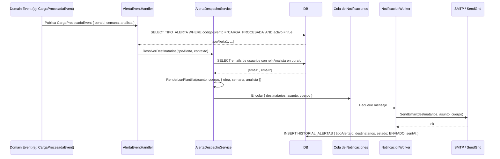

## Tracking
- **Platform**: jira
- **External ID**: SMAT-93
- **URL**: https://syntaxis.atlassian.net/browse/SMAT-93
- **Epic**: SMAT-92
- **Subtareas**: SMAT-95 [Backend], SMAT-97 [Frontend], SMAT-98 [Testing]

# US-023: Envío Automático de Alertas por Correo

## Historia
Como **sistema SMAT**, quiero enviar correos electrónicos automáticamente cuando ocurran eventos clave del sistema (carga procesada, lote cerrado, validación cerrada, etc.), para mantener informados a los usuarios relevantes de cada obra sin que deban revisar el sistema manualmente.

## Épica
Alertas y Notificaciones

## Prioridad
- **MoSCoW**: Should Have
- **RICE Score**: Alcance: 30 | Impacto: 2 | Confianza: 85% | Esfuerzo: 2.0 → Puntaje: 25.5

## Estimación
- **Story Points (Fibonacci)**: 8
- **T-Shirt Size**: L
- **Justificación**: Requiere el motor de despacho de alertas (suscripción a eventos de dominio, resolución de destinatarios, renderizado de plantillas, envío por SMTP/SendGrid). Debe ser asíncrono para no bloquear el flujo principal. Incluye manejo de errores, reintentos y registro de historial de envíos.

## Caso de Uso

### Caso de Uso: Envío Automático de Alertas ante Eventos del Sistema
- **Actores**: Sistema (automático), Administrador (configura), Usuarios receptores (Analista, Validador, Controlador)
- **Precondiciones**: Existe al menos un `TipoAlerta` activo para el evento ocurrido (configurado en US-022).
- **Flujo Principal**:
  1. Ocurre un evento en el sistema (ej.: `CARGA_PROCESADA` para "Proyecto Norte").
  2. El motor de alertas detecta el evento via Domain Events o Integration Events.
  3. Consulta los `TipoAlerta` activos para ese código de evento.
  4. Por cada tipo activo, resuelve los destinatarios (emails de los usuarios con el rol configurado y asignación en la obra correspondiente).
  5. Renderiza el asunto y cuerpo de la plantilla con las variables del contexto del evento.
  6. Encola el envío del correo en el worker de notificaciones.
  7. El worker envía el correo via SMTP/SendGrid y registra el resultado en `HISTORIAL_ALERTAS`.
- **Flujos Alternativos**:
  - No hay tipos de alerta activos para el evento → no se envía nada, sin error.
  - Error de envío SMTP: se reintenta hasta 3 veces con backoff exponencial; si falla, registra en `HISTORIAL_ALERTAS` con estado `ERROR`.
  - Destinatario sin email registrado: se omite y se loguea una advertencia.
- **Postcondiciones**: Los usuarios relevantes reciben el correo. El envío queda registrado en el historial.

### Diagrama



## Criterios de Aceptación (BDD)

### Feature: Envío automático de alertas por correo

#### Escenario 1: Alerta enviada al procesar carga XML exitosamente
```gherkin
Given que existe el tipo de alerta "Carga XML Procesada" activo para evento CARGA_PROCESADA con destinatarios Analista
  And "Proyecto Norte" tiene a "ana@salfa.cl" como Analista asignada
When el sistema procesa exitosamente una carga XML para "Proyecto Norte" semana 18
Then se envía un correo a "ana@salfa.cl"
  And el asunto contiene "Proyecto Norte" y "semana 18" (variables resueltas)
  And el envío queda registrado en HISTORIAL_ALERTAS con estado ENVIADO
```

#### Escenario 2: Sin tipos de alerta activos — no se envía correo
```gherkin
Given que no existe ningún tipo de alerta activo para el evento LOTE_CERRADO
When un Controlador cierra su lote de avances
Then no se envía ningún correo
  And no se genera ningún registro en HISTORIAL_ALERTAS
  And el flujo principal no se ve interrumpido
```

#### Escenario 3: Error de envío SMTP — reintento y registro
```gherkin
Given que el servidor SMTP no está disponible
When el motor de alertas intenta enviar un correo por el evento VALIDACION_CERRADA
Then el sistema reintenta el envío hasta 3 veces con backoff exponencial
  And si los 3 reintentos fallan, registra en HISTORIAL_ALERTAS con estado ERROR
  And el flujo de validación no se ve afectado (envío es asíncrono)
```

#### Escenario 4: Alerta de error en carga XML notifica al Analista
```gherkin
Given que existe el tipo de alerta "Error en Carga XML" activo para evento CARGA_ERROR con destinatario Analista
When el Worker falla al procesar el archivo XML de "Proyecto Sur"
Then se envía un correo al Analista de "Proyecto Sur"
  And el cuerpo del correo incluye el detalle del error de validación
```

#### Escenario 5: Validación cerrada automáticamente notifica al Validador
```gherkin
Given que existe el tipo de alerta "Validación Automática" para evento VALIDACION_AUTOMATICA con destinatario Validador
When todos los controladores de "Proyecto Norte" cierran sus lotes y se genera VALIDACION_SEMANA APROBADO_AUTOMATICO
Then se envía un correo al Validador asignado a "Proyecto Norte"
  And el asunto incluye "Validación aprobada automáticamente para Proyecto Norte"
```

## Notas Técnicas

### Backend
- **Patrón**: Domain Events + MediatR. Cada Command Handler publica un evento de dominio al completar su acción. Un `INotificationHandler<TEvento>` (AlertaEventHandler) suscribe a esos eventos.
- **Eventos de dominio a instrumentar**: `CargaProcesadaEvent`, `CargaErrorEvent`, `LoteCerradoEvent`, `ValidacionCerradaEvent`, `ValidacionAutomaticaEvent`, `UsuarioCreadoEvent`, `AsignacionObraEvent`.
- **Motor de despacho**: `AlertaDespachoService` resuelve destinatarios + renderiza templates + encola.
- **Cola asíncrona**: mismo worker de cargas (Background Service) o worker dedicado `NotificacionWorker`.
- **Reintentos**: Polly con `RetryPolicy(3, exponentialBackoff)`.
- **Proveedor de correo**: `IEmailSender` abstraction → implementación SMTP (`MailKit`) o `SendGrid` según configuración.
- **Tabla historial**: `HISTORIAL_ALERTAS { Id, TipoAlertaId, Destinatarios (JSON), Estado (ENVIADO|ERROR), ErrorDetalle, SentAt }`.

### Frontend
- Módulo `HistorialAlertas` (solo lectura para Administrador): tabla con columnas TipoAlerta, Evento, Destinatarios, Estado, Fecha.
- Filtros: por evento, estado (ENVIADO/ERROR), rango de fechas.
- Badge de estado: verde ENVIADO, rojo ERROR.
- Opción de reenvío manual desde el historial (reintentar un envío fallido).

### NFRs
- El envío de correos NO debe bloquear el flujo principal (siempre asíncrono).
- Los errores de envío no deben propagarse como excepciones al usuario.
- El historial debe conservarse al menos 90 días.
- Soporte para hasta 50 destinatarios por alerta.

## Dependencias
- **Bloqueado por**: US-022 (requiere tipos de alerta configurados)
- **Relacionado con**: US-008 (CARGA_PROCESADA, CARGA_ERROR), US-012 (LOTE_CERRADO), US-013 (VALIDACION_CERRADA, VALIDACION_AUTOMATICA)

## Definition of Done
- [ ] AlertaEventHandler suscrito a todos los eventos del catálogo.
- [ ] Motor de despacho resuelve destinatarios y renderiza plantillas correctamente.
- [ ] Envío asíncrono: no bloquea el flujo principal.
- [ ] Reintentos con Polly (3 intentos, backoff exponencial).
- [ ] Historial de envíos registrado en HISTORIAL_ALERTAS.
- [ ] Vista de historial para Administrador en el frontend.
- [ ] Unit tests del AlertaDespachoService.
- [ ] Integration test: evento → correo enviado → historial registrado.
- [ ] Code review aprobado.

## Enhanced Task Plan

### Backend Tasks
- Crear entidad `HistorialAlerta` + migración.
- Implementar `IEmailSender` con adaptadores `SmtpEmailSender` (MailKit) y `SendGridEmailSender` (switcheable por config).
- Implementar `AlertaDespachoService`: resolución de destinatarios por rol+obra + renderizado de template + encolado.
- Instrumentar Domain Events en handlers existentes: `CargaProcesadaEvent`, `CargaErrorEvent`, `LoteCerradoEvent`, `ValidacionCerradaEvent`, `ValidacionAutomaticaEvent`.
- Implementar `AlertaEventHandler : INotificationHandler<T>` para cada evento.
- `NotificacionWorker` (IHostedService): dequeue → send → registrar historial. Polly retry policy.
- Unit tests: `AlertaDespachoServiceTests` (destinatarios, templates, sin tipos activos → no envío).

### Frontend Tasks
- Módulo `HistorialAlertas`: tabla con filtros (evento, estado, fechas).
- Badge ENVIADO/ERROR + tooltips con detalle de error.
- Botón "Reintentar" para envíos con estado ERROR.
- Tests: renderizado tabla, filtros, estado badge, reintento.

### Testing Tasks
- `AlertaDespachoServiceTests`: evento con tipos activos → encola; sin tipos activos → no encola; destinatario sin email → omitido con log.
- `NotificacionWorkerTests`: envío exitoso → HISTORIAL estado ENVIADO; SMTP falla 3 veces → estado ERROR.
- Integration Test: flujo completo CargaProcesadaEvent → correo enviado → historial ENVIADO.
- Verificar Escenario BDD 3: SMTP no disponible → 3 reintentos → estado ERROR en historial.
- Verificar Escenario BDD 2: sin tipos activos → cero correos, cero registros en historial.
