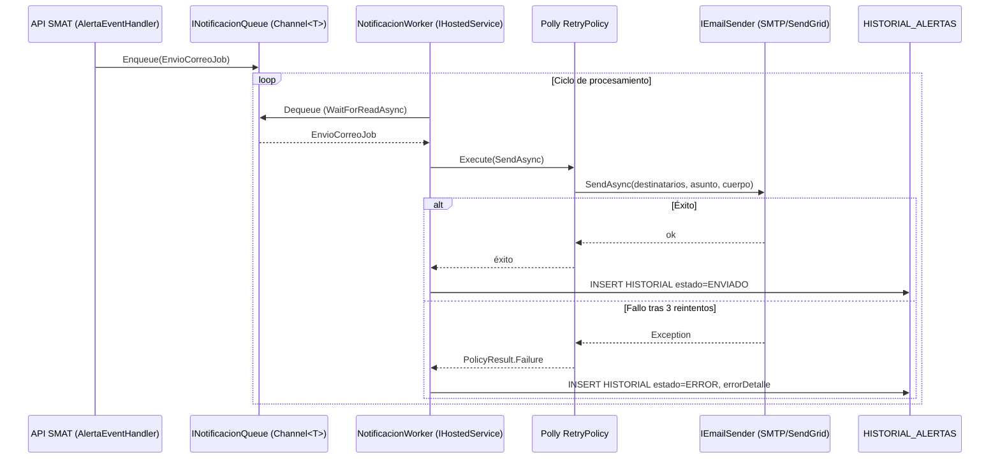

## Tracking
- **Platform**: jira
- **External ID**: SMAT-102
- **URL**: https://syntaxis.atlassian.net/browse/SMAT-102
- **Epic**: SMAT-101
- **Subtareas**: SMAT-103 [Backend], SMAT-105 [Frontend], SMAT-104 [Testing]

# US-024: Worker de Despacho de Correos (.NET Worker Service)

## Historia
Como **sistema SMAT**, quiero contar con un servicio de fondo (.NET Worker Service) dedicado al despacho de correos electrónicos, para procesar la cola de notificaciones de forma asíncrona, con reintentos automáticos y registro de historial, sin afectar el rendimiento de la API principal.

## Épica
Worker de Notificaciones

## Prioridad
- **MoSCoW**: Should Have
- **RICE Score**: Alcance: 30 | Impacto: 2 | Confianza: 90% | Esfuerzo: 2.5 → Puntaje: 21.6

## Estimación
- **Story Points (Fibonacci)**: 8
- **T-Shirt Size**: L
- **Justificación**: Requiere crear el proyecto Worker Service, implementar la cola de trabajos, el ciclo de procesamiento con reintentos (Polly), la abstracción del proveedor de correo (SMTP/SendGrid switcheable), y la integración con el módulo de alertas (TipoAlerta + HistorialAlerta). Incluye configuración de health checks, logging estructurado (Serilog) y circuit breaker.

## Caso de Uso

### Caso de Uso: Procesamiento de Cola de Notificaciones
- **Actores**: Sistema SMAT (API), Worker Service, Proveedor SMTP/SendGrid
- **Precondiciones**: Existe al menos un trabajo pendiente en la cola de notificaciones generado por el módulo de alertas (Épica 8 — US-022/US-023).
- **Flujo Principal**:
  1. El `AlertaEventHandler` (Épica 8) encola un `EnvioCorreoJob { tipoAlertaId, destinatarios, asuntoResuelto, cuerpoResuelto, contexto }` en la cola compartida.
  2. El `NotificacionWorker` ejecuta su loop de procesamiento (IHostedService).
  3. En cada iteración, intenta desencolar un trabajo.
  4. Para cada trabajo, invoca `IEmailSender.SendAsync(destinatarios, asunto, cuerpo)`.
  5. Si el envío es exitoso, registra en `HISTORIAL_ALERTAS` con estado `ENVIADO` y timestamp.
  6. Si falla: aplica Polly `RetryPolicy(3, exponentialBackoff)`. Tras 3 fallos, registra con estado `ERROR` y `ErrorDetalle`.
  7. Emite log estructurado (Serilog) para cada intento y resultado.
  8. Libera el slot de la cola y pasa al siguiente trabajo.
- **Flujos Alternativos**:
  - Cola vacía: el worker espera con `Task.Delay` configurable (default 5 seg) antes de reintentar.
  - Proveedor SMTP no disponible (circuit breaker abierto): el worker no intenta enviar durante el período de enfriamiento (30 seg) y registra todos los trabajos pendientes como `REINTENTO_PENDIENTE`.
  - Shutdown graceful: el worker completa el trabajo actual y cierra la cola limpiamente antes de detenerse.

### Diagrama



## Criterios de Aceptación (BDD)

### Feature: Worker de despacho de correos

#### Escenario 1: Procesamiento exitoso de trabajo en cola
```gherkin
Given que la cola contiene un EnvioCorreoJob para "ana@salfa.cl" con asunto "Carga completada para Proyecto Norte"
When el NotificacionWorker procesa el trabajo
Then se invoca IEmailSender.SendAsync con los datos correctos
  And se registra en HISTORIAL_ALERTAS con estado ENVIADO y sentAt no nulo
  And el trabajo es removido de la cola
```

#### Escenario 2: Reintento ante fallo SMTP — 3 intentos con backoff
```gherkin
Given que IEmailSender.SendAsync lanza una excepción SMTP en los primeros 2 intentos
When el NotificacionWorker procesa el trabajo con Polly RetryPolicy(3)
Then reintenta hasta 3 veces con intervalos exponenciales
  And en el intento 3 (exitoso) registra HISTORIAL estado=ENVIADO
```

#### Escenario 3: Error permanente tras 3 reintentos fallidos
```gherkin
Given que IEmailSender.SendAsync lanza excepción en los 3 intentos
When el NotificacionWorker agota los reintentos de Polly
Then registra en HISTORIAL_ALERTAS con estado ERROR y ErrorDetalle con el mensaje de la excepción
  And el flujo de la API principal no es interrumpido
  And el trabajo es removido de la cola (no queda bloqueado)
```

#### Escenario 4: Circuit breaker — proveedor SMTP no disponible
```gherkin
Given que los últimos 5 intentos de envío fallaron por timeout de SMTP
When el circuit breaker se abre
Then el worker detiene los intentos de envío durante 30 segundos (enfriamiento)
  And loguea "Circuit breaker abierto — SMTP no disponible" con nivel WARNING
  And tras el período de enfriamiento, vuelve a intentar (Half-Open → Closed)
```

#### Escenario 5: Shutdown graceful
```gherkin
Given que el NotificacionWorker está procesando un EnvioCorreoJob
When se solicita la detención del servicio (CancellationToken cancelado)
Then el worker completa el envío en curso
  And cierra la cola limpiamente sin perder trabajos pendientes
  And emite log "NotificacionWorker detenido gracefully"
```

#### Escenario 6: Cola vacía — ciclo de espera
```gherkin
Given que la cola de notificaciones está vacía
When el NotificacionWorker ejecuta su loop
Then espera Task.Delay(5000, cancellationToken) antes del próximo ciclo
  And no genera logs de advertencia ni consume CPU innecesariamente
```

## Notas Técnicas

### Arquitectura del Worker
- **Proyecto**: `SMAT.Worker` — proyecto separado (`Worker Service` template de .NET 8) que comparte la misma solution.
- **Hosting**: desplegado como servicio de Windows / Linux systemd / contenedor Docker independiente de la API.
- **Cola**: `System.Threading.Channels.Channel<EnvioCorreoJob>` (in-memory, bounded capacity 1000) registrado como singleton compartido entre API y Worker via DI. Si se requiere persistencia de cola entre reinicios, migrar a Redis Streams o Azure Service Bus.
- **IEmailSender abstraction**:
  - `SmtpEmailSender` usando `MailKit` (config: `SMTP_HOST`, `SMTP_PORT`, `SMTP_USER`, `SMTP_PASS`, `SMTP_TLS`).
  - `SendGridEmailSender` usando `SendGrid` SDK (config: `SENDGRID_API_KEY`).
  - Switcheable por config: `EmailProvider: "smtp" | "sendgrid"` en `appsettings.json`.
- **Polly**: `Policy.Handle<SmtpException>().Or<HttpRequestException>().WaitAndRetryAsync(3, attempt => TimeSpan.FromSeconds(Math.Pow(2, attempt)))`.
- **Circuit Breaker**: `Policy.Handle<Exception>().CircuitBreakerAsync(exceptionsAllowedBeforeBreaking: 5, durationOfBreak: TimeSpan.FromSeconds(30))`.
- **Logging**: Serilog con sinks Console + File. Structured properties: `{JobId}`, `{Destinatarios}`, `{TipoAlertaId}`, `{Intento}`, `{Estado}`.
- **Health checks**: `AddHealthChecks().AddCheck<SmtpHealthCheck>("smtp")` expuesto en `/health` (puerto dedicado 5001).
- **Graceful shutdown**: `StoppingToken` (CancellationToken) pasado al loop de procesamiento; `WaitForReadAsync(cancellationToken)` termina limpiamente.

### Configuración `appsettings.json`
```json
{
  "EmailProvider": "smtp",
  "Smtp": {
    "Host": "",
    "Port": 587,
    "UseTls": true,
    "Username": "",
    "Password": ""
  },
  "SendGrid": {
    "ApiKey": ""
  },
  "NotificacionWorker": {
    "PollingIntervalMs": 5000,
    "MaxConcurrentJobs": 5,
    "ChannelCapacity": 1000
  }
}
```

### NFRs
- El worker no debe compartir el proceso de la API (despliegue separado).
- Throughput mínimo: 50 correos/minuto en condiciones normales.
- Graceful shutdown: completar el trabajo en curso en un máximo de 30 segundos.
- Logging estructurado: todos los eventos del ciclo de vida deben tener correlación por `JobId`.
- El fallo del worker no debe afectar la disponibilidad de la API principal.

## Dependencias
- **Bloqueado por**: US-022 (modelo TipoAlerta), US-023 (AlertaEventHandler que encola los trabajos)
- **Relacionado con**: US-008 (genera CARGA_PROCESADA y CARGA_ERROR events), US-012 (LOTE_CERRADO), US-013 (VALIDACION_CERRADA)

## Definition of Done
- [ ] Proyecto `SMAT.Worker` creado con Worker Service template.
- [ ] `INotificacionQueue` (Channel<T>) registrado como singleton compartido entre API y Worker.
- [ ] `NotificacionWorker` implementa `IHostedService` con loop de procesamiento.
- [ ] `IEmailSender` con `SmtpEmailSender` y `SendGridEmailSender`, switcheable por config.
- [ ] Polly retry (3 intentos, backoff exponencial) + circuit breaker (5 fallos, 30 seg).
- [ ] `HISTORIAL_ALERTAS` registrado con estado ENVIADO o ERROR tras cada intento.
- [ ] Health check `/health` con estado de SMTP.
- [ ] Graceful shutdown funcional (completa trabajo en curso antes de detenerse).
- [ ] Logging estructurado con Serilog (Console + File sinks).
- [ ] Unit tests: ciclo exitoso, retry, circuit breaker, shutdown graceful.
- [ ] Integration test: API encola → Worker procesa → HISTORIAL registrado.
- [ ] Code review aprobado.

## Enhanced Task Plan

### Backend / Infrastructure Tasks
- Crear proyecto `SMAT.Worker` (Worker Service template, .NET 8) en la solution existente.
- Implementar `EnvioCorreoJob` DTO + `INotificacionQueue` (Channel<EnvioCorreoJob>) + registro DI singleton.
- Implementar `NotificacionWorker : BackgroundService` con loop `WaitForReadAsync` + procesamiento con `StoppingToken`.
- Implementar `IEmailSender` con `SmtpEmailSender` (MailKit) y `SendGridEmailSender` (SendGrid SDK) + factory de selección por config.
- Configurar Polly: `WaitAndRetryAsync(3, exponentialBackoff)` + `CircuitBreakerAsync(5, 30s)`.
- Implementar `HistorialAlertaRepository.RegistrarEnvioAsync(jobId, estado, errorDetalle)`.
- Agregar health check `SmtpHealthCheck` + endpoint `/health`.
- Configurar Serilog con Console + File sinks + enrichers `{JobId}`, `{TipoAlertaId}`.
- Dockerfile para `SMAT.Worker`.

### Testing Tasks
- `NotificacionWorkerTests`: proceso exitoso → HISTORIAL ENVIADO; fallo 1/2 → reintento exitoso; fallo 3/3 → HISTORIAL ERROR.
- `CircuitBreakerTests`: 5 fallos consecutivos → circuit abierto → no intenta envío por 30 seg → half-open → closed.
- `GracefulShutdownTests`: cancelar token → completa trabajo en curso → cierra limpiamente.
- `SmtpEmailSenderTests`: mock MailKit → verifica llamada con parámetros correctos.
- Integration Test: `INotificacionQueue.Writer.TryWrite(job)` → Worker procesa → `HISTORIAL_ALERTAS` tiene registro ENVIADO.
