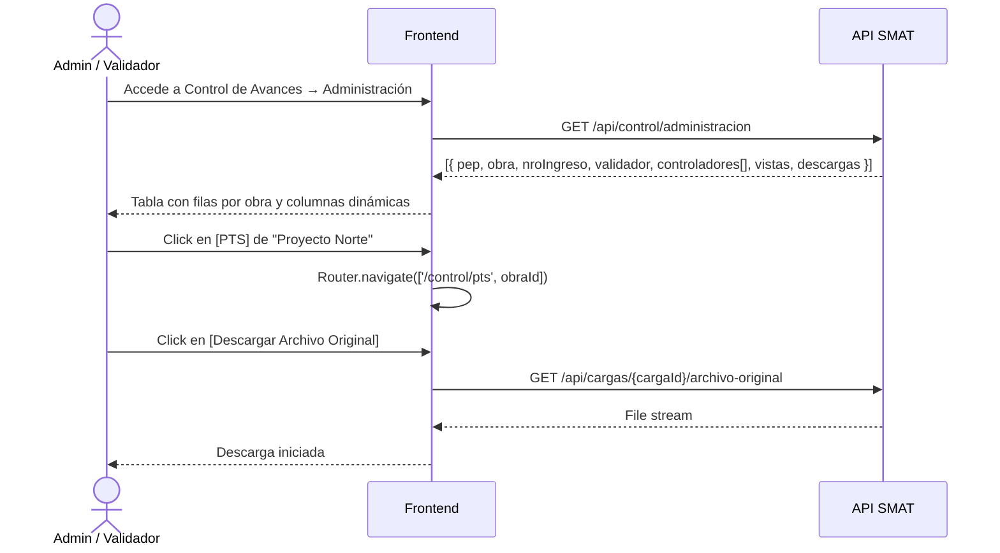

## Tracking
- **Platform**: jira
- **External ID**: SMAT-106
- **URL**: https://syntaxis.atlassian.net/browse/SMAT-106
- **Epic**: SMAT-9
- **Subtareas**: SMAT-109 [Backend], SMAT-107 [Frontend], SMAT-108 [Testing]

# US-025: Administración de Avances — Vista Central de Proyectos

## Historia
Como **Administrador / Validador**, quiero visualizar una lista centralizada de todos los proyectos con sus controladores asignados y accesos directos a las vistas de control, para gestionar y navegar eficientemente el módulo de Control de Avances sin tener que buscar cada proyecto individualmente.

## Épica
Control de Avances

## Prioridad
- **MoSCoW**: Must Have
- **RICE Score**: Alcance: 40 | Impacto: 3 | Confianza: 90% | Esfuerzo: 1.5 → Puntaje: 72.0

## Estimación
- **Story Points (Fibonacci)**: 5
- **T-Shirt Size**: M
- **Justificación**: Tabla dinámica con columnas fijas (Validador, Nro Ingreso) + columnas variables de controladores (C1…Cn según asignación) + columnas de acciones contextuales. Complejidad media por el renderizado dinámico de columnas y la lógica de acceso condicional a vistas según estado de la obra.

## Caso de Uso

### Caso de Uso: Consulta del tablero de administración de avances
- **Actores**: Administrador, Validador
- **Precondiciones**: El usuario está autenticado y tiene perfil Administrador o Validador.
- **Flujo Principal**:
  1. El usuario accede al módulo "Control de Avances → Administración".
  2. El sistema muestra una tabla con una fila por cada obra activa en el sistema.
  3. Las columnas de la tabla son:
     - **PEP / Obra**: código PEP y nombre de la obra.
     - **Nro Ingreso**: número de ingreso del lote semanal activo.
     - **Validador**: nombre o iniciales del Validador asignado a la obra.
     - **C1, C2, C3, … Cn**: iniciales de cada Controlador asignado a la obra (columnas dinámicas según cantidad de controladores por obra).
     - **PTS**: ícono/botón de acceso a la Vista PTS de la obra.
     - **Carta Gantt**: ícono/botón de acceso a la Vista Gantt de la obra.
     - **Vista Física**: ícono/botón de acceso a la Vista Física (visible solo si la vista física está habilitada para la obra).
     - **Descargar Archivo Original**: botón de descarga del archivo XML original cargado.
     - **Descargar Archivo post Validación**: botón de descarga del archivo procesado (activo solo tras cierre de validación).
  4. El usuario puede hacer clic en cualquier acción para navegar a la vista correspondiente o iniciar la descarga.
- **Flujos Alternativos**:
  - Sin obras activas: se muestra estado vacío con mensaje "No hay obras con avances registrados".
  - Vista Física no habilitada para la obra: el botón aparece deshabilitado (tooltip: "Vista Física no disponible para esta obra").
  - Descarga post validación sin validación cerrada: botón deshabilitado (tooltip: "La validación aún no ha sido cerrada").

### Estructura de la tabla

| PEP       | Obra          | Nro Ingreso | Validador | C1   | C2   | …  | PTS | Gantt | Física | Descargar Original | Descargar Post-Val |
|-----------|---------------|-------------|-----------|------|------|----|-----|-------|--------|--------------------|--------------------|
| 1234.001  | Proyecto Norte | 42          | JRV       | MAG  | PRT  | …  | 📊  | 📅    | 🏗️     | ⬇️                 | ⬇️ (gris si locked)|
| 1234.002  | Proyecto Sur   | 38          | CLP       | RMQ  | —    | —  | 📊  | 📅    | —      | ⬇️                 | ⬇️                 |

### Diagrama



## Criterios de Aceptación (BDD)

### Feature: Administración de avances — vista central de proyectos

#### Escenario 1: Visualización del tablero con proyectos activos
```gherkin
Given que soy Administrador o Validador autenticado
  And existen obras activas con controladores asignados
When accedo al módulo "Control de Avances → Administración"
Then veo una tabla con una fila por cada obra activa
  And cada fila muestra: PEP, Obra, Nro Ingreso, Validador, C1...Cn, y botones de acción
  And las columnas de controladores son dinámicas según la cantidad asignada por obra
```

#### Escenario 2: Columnas de controladores dinámicas por obra
```gherkin
Given que "Proyecto Norte" tiene 3 controladores (MAG, PRT, RMQ) asignados
  And "Proyecto Sur" tiene 1 controlador (ABV) asignado
When se renderiza la tabla de administración
Then "Proyecto Norte" muestra columnas C1=MAG, C2=PRT, C3=RMQ
  And "Proyecto Sur" muestra C1=ABV y las columnas C2 y C3 aparecen vacías (guión)
  And la cantidad máxima de columnas Cn se define por la obra con más controladores
```

#### Escenario 3: Acceso a vista PTS desde la tabla
```gherkin
Given que estoy en el tablero de administración de avances
When hago clic en el botón PTS de "Proyecto Norte"
Then el sistema navega a la vista PTS de "Proyecto Norte"
  And el contexto de la obra queda seleccionado correctamente
```

#### Escenario 4: Botón "Descargar Archivo post Validación" deshabilitado si la validación no fue cerrada
```gherkin
Given que la obra "Proyecto Este" no tiene validación cerrada para el periodo actual
When visualizo su fila en el tablero de administración
Then el botón "Descargar Archivo post Validación" aparece deshabilitado (gris)
  And al hacer hover muestra el tooltip "La validación aún no ha sido cerrada"
```

#### Escenario 5: Vista Física no disponible para obra sin vista física habilitada
```gherkin
Given que la obra "Proyecto Oeste" no tiene la vista física habilitada (US-009)
When visualizo su fila en el tablero de administración
Then el botón "Vista Física" aparece deshabilitado
  And al hacer hover muestra el tooltip "Vista Física no disponible para esta obra"
```

#### Escenario 6: Solo Administrador y Validador acceden al módulo
```gherkin
Given que soy Controlador
When intento acceder al módulo "Control de Avances → Administración"
Then el sistema retorna 403 Forbidden
  And soy redirigido a mi vista de trabajo asignada
```

## Notas Técnicas

### Backend
- Endpoint: `GET /api/control/administracion` — devuelve lista de obras con:
  ```json
  {
    "obraId": "...",
    "pep": "1234.001",
    "obra": "Proyecto Norte",
    "nroIngreso": 42,
    "validador": { "id": "...", "iniciales": "JRV" },
    "controladores": [
      { "orden": 1, "id": "...", "iniciales": "MAG" },
      { "orden": 2, "id": "...", "iniciales": "PRT" }
    ],
    "vistas": {
      "pts": true,
      "gantt": true,
      "fisica": false
    },
    "descargas": {
      "archivoOriginalDisponible": true,
      "archivoPostValidacionDisponible": false
    }
  }
  ```
- Query: JOIN entre `OBRA`, `ASIGNACION_USUARIO_OBRA` (filtrando por rol Validador y Controladores), `CARGA_SEMANA` (última activa), `VALIDACION_SEMANA`.
- Autorización: solo perfiles Administrador y Validador.
- Caché opcional: `IMemoryCache` TTL 30 seg (datos cambian frecuentemente durante cierre semanal).

### Frontend
- Componente `AdministracionAvancesComponent` en módulo `ControlAvances`.
- Tabla Angular Material con columnas dinámicas: columnas fijas (`pep`, `obra`, `nroIngreso`, `validador`) + columnas generadas programáticamente `C1`…`Cn` basadas en `maxControladores` calculado del dataset.
- Botones de acción con directivas `[disabled]` y `[matTooltip]` condicionales:
  - PTS, Gantt: siempre habilitados (navegan via `Router.navigate`).
  - Vista Física: habilitado solo si `vistas.fisica === true`.
  - Descargar Post-Validación: habilitado solo si `descargas.archivoPostValidacionDisponible === true`.
- Columnas Cn: renderizadas con `*ngFor` sobre `[displayedColumns]` dinámico.
- Estado vacío: `<mat-placeholder>` con mensaje si array viene vacío.

### NFRs
- La tabla debe soportar hasta 200 obras sin degradación de rendimiento (virtual scroll si supera 50 filas).
- Tiempo de carga del endpoint: < 500ms con 200 obras.
- Accesibilidad: botones de acción con `aria-label` descriptivo por fila.

## Dependencias
- **Bloqueado por**: US-004 (asignaciones de usuario a obra), US-008 (carga semanal — Nro Ingreso), US-010 (vistas PTS/Gantt), US-012 (estado cierre control), US-013 (archivo post validación disponible)
- **Relacionado con**: US-009 (habilita Vista Física), US-011 (Vista Física)

## Definition of Done
- [ ] Endpoint `GET /api/control/administracion` retorna estructura completa con controladores ordenados y flags de acceso.
- [ ] Tabla con columnas dinámicas de controladores (C1…Cn) renderizada correctamente.
- [ ] Botones PTS y Gantt navegan a la vista correcta.
- [ ] Botón Vista Física y Descargar Post-Validación respetan estado condicional (disabled + tooltip).
- [ ] Solo Administrador y Validador acceden (403 para Controlador).
- [ ] Estado vacío visible cuando no hay obras activas.
- [ ] Unit tests del endpoint y del componente Angular.
- [ ] Code review aprobado.

## Enhanced Task Plan

### Backend Tasks
- Implementar `GetAdministracionAvancesQueryHandler`: JOIN OBRA + ASIGNACION_USUARIO_OBRA + CARGA_SEMANA + VALIDACION_SEMANA.
- DTO `AdministracionAvancesItemDto` con campos: pep, obra, nroIngreso, validador, controladores[], vistas{}, descargas{}.
- Endpoint `GET /api/control/administracion` con guard Administrador/Validador.
- Caché IMemoryCache TTL 30 seg (invalidar al producirse nuevas cargas o cierres).
- Unit tests: lista con varias obras y controladores dinámicos; obra sin validación cerrada → `archivoPostValidacionDisponible = false`; obra sin vista física → `vistas.fisica = false`.

### Frontend Tasks
- Componente `AdministracionAvancesComponent`:
  - Columnas dinámicas `C1`…`Cn` con `*ngFor` sobre `displayedColumns`.
  - `maxControladores` calculado como `Math.max(...data.map(o => o.controladores.length))`.
  - Buttons: PTS → `navigate(['/control/pts', obraId])`; Gantt → `navigate(['/control/gantt', obraId])`; Física → disabled si `!vistas.fisica`; Post-Val → disabled si `!descargas.archivoPostValidacionDisponible`.
  - Virtual scroll con `CdkVirtualScrollViewport` si filas > 50.
- Tests: renderizado con 2 obras de distinto nro de controladores; botón Física disabled cuando `fisica=false`; botón Post-Val disabled cuando `archivoPostValidacionDisponible=false`.

### Testing Tasks
- `GetAdministracionAvancesQueryHandlerTests`: 3 obras con 1/2/3 controladores; verificar orden `controladores[].orden`; obra sin validación → `archivoPostValidacionDisponible=false`.
- Controlador accede al endpoint → 403.
- Angular Component tests: columnas dinámicas generadas correctamente; tooltips en botones deshabilitados.
- Integration test: DB con obras y asignaciones → GET → respuesta completa con flags correctos.
