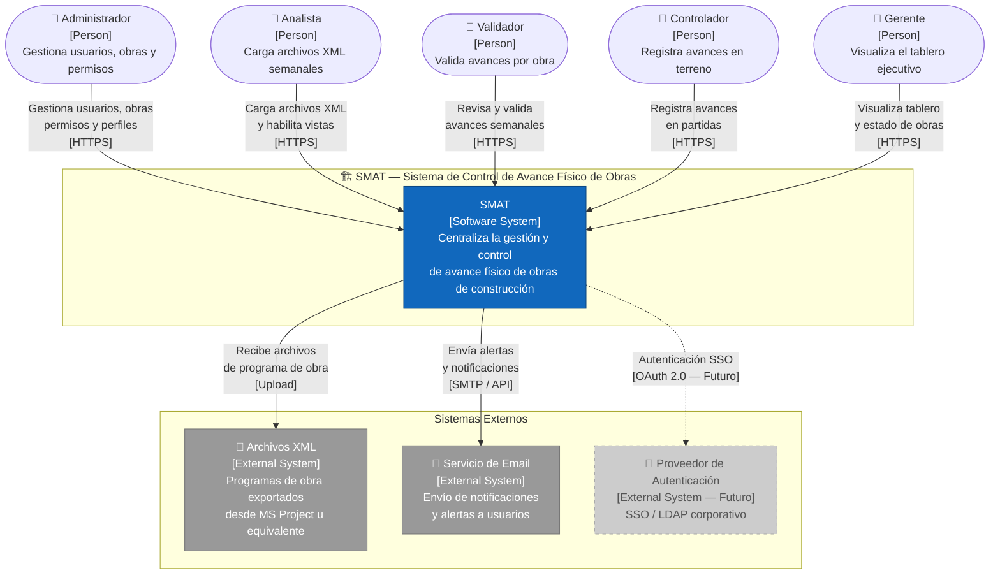
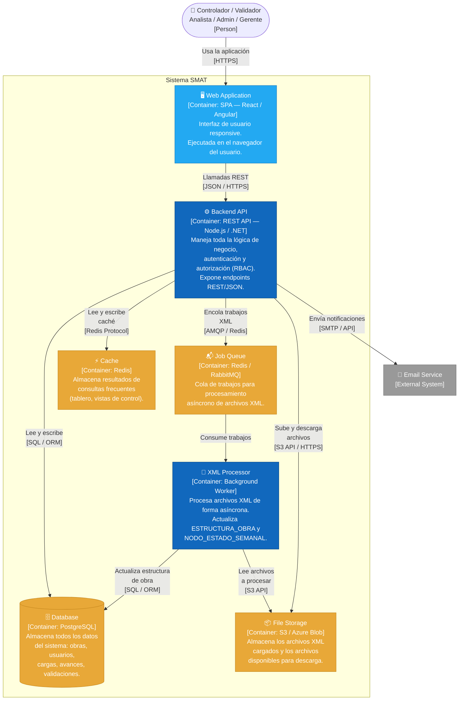
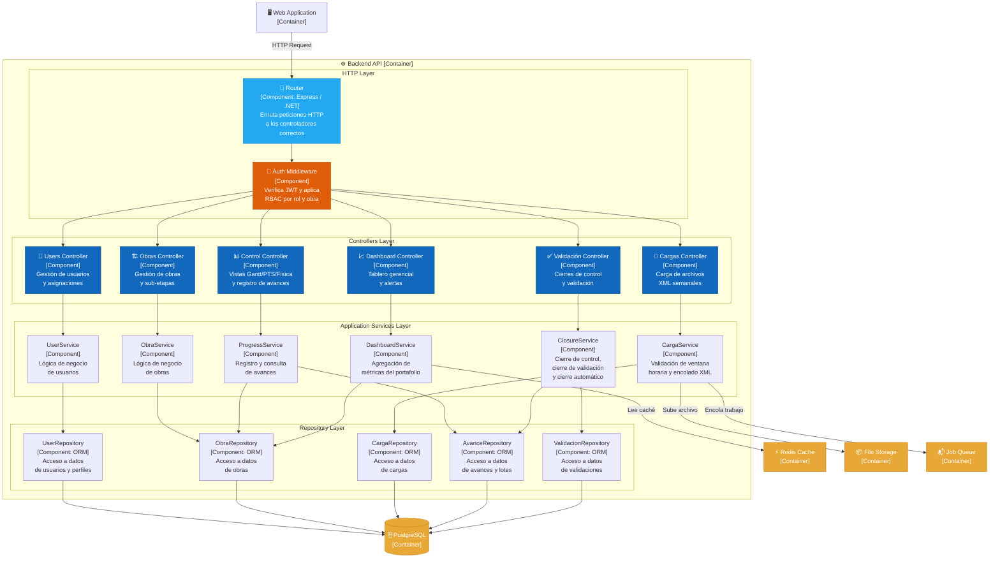

# C4 Architecture Diagrams: SMAT System

This file documents the system architecture at three zoom levels following the C4 model: System Context (who interacts with SMAT), Container (how the system is decomposed into deployable units), and Component (how the backend API is internally structured). These diagrams inform technology decisions and infrastructure planning.

---

## Level 1: System Context

Shows SMAT as a black box, its users (human actors), and the external systems it integrates with. This diagram is intended for non-technical stakeholders and senior management.

---

## Level 2: Container Diagram

Decomposes SMAT into its major deployable units and shows how they communicate. This diagram is intended for architects and senior developers.

---

## Level 3: Component Diagram — Backend API

Shows the internal components of the Backend API container, illustrating the layered architecture and how each component fulfills a specific responsibility.

---

## Notes & Assumptions

- **Technology stack**: The PRD recommends but does not lock in a specific stack. These diagrams use Node.js / .NET for the API and React/Angular for the SPA as representative choices aligned with the PRD's architecture overview.
- **XML Processing**: The async Worker + Queue pattern is a design recommendation to handle large XML files without blocking the API; if file sizes are consistently small (< 1MB), a synchronous approach within the API may suffice.
- **Cache layer**: Used primarily for the Dashboard and Control views, which aggregate data across many entities. Cache invalidation should occur on each new validation closure.
- **SSO / Auth Provider**: Shown as a future integration (dashed line in Context diagram); current implementation assumes local JWT-based authentication.
- **Level 4 (Code)** diagrams are not included in this version; they should be generated once the backend codebase is established, particularly for `ClosureService` (complex business logic) and `XMLParser` (critical processing component).
