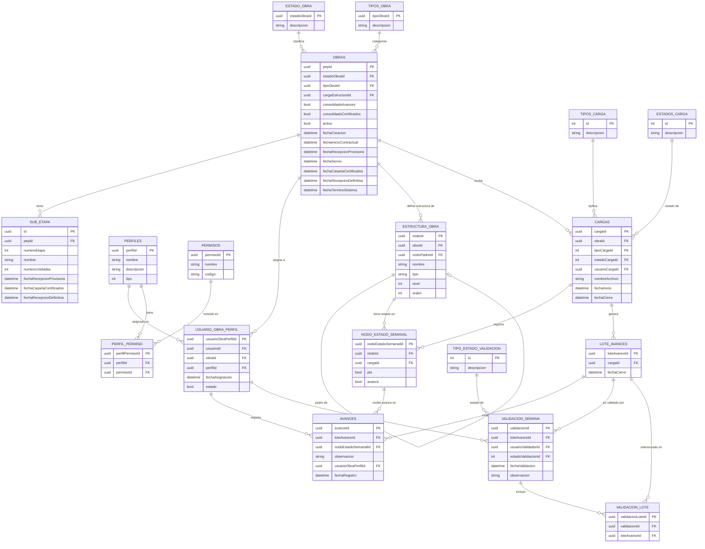

# Entity-Relationship Diagram: SMAT System

## Overview

This diagram documents the complete relational data model for SMAT, derived from the PRD's data model section. It shows all 17 entities, their attributes, primary/foreign keys, and the business relationships between them. This is the authoritative reference for database schema design.

---

## ER Diagram

---

## Entity Descriptions

### OBRAS
- **Description**: Central entity representing a construction project. Identified by its PEP code (project identifier).
- **Key Fields**: `pepId` (PK), `estadoObraId` (FK → lifecycle status), `tipoObraId` (FK → project category), `activo` (soft-delete flag), multiple contractual date fields.
- **Relationships**: Has many sub-stages (`SUB_ETAPA`), user-role assignments (`USUARIO_OBRA_PERFIL`), structural nodes (`ESTRUCTURA_OBRA`), and weekly uploads (`CARGAS`).
- **Constraints**: `fechaRecepcionProvisoria` must be ≥ `fechaInicioContractual`. `activo = false` marks the project as soft-deleted.

### ESTADO_OBRA
- **Description**: Catalogue of lifecycle statuses for a project (e.g., Vigente, Futuro, Terminado).
- **Constraints**: Lookup table — values should not be deleted if referenced by active projects.

### TIPOS_OBRA
- **Description**: Catalogue of project type classifications (e.g., habitacional, infraestructura).
- **Constraints**: Lookup table — values should not be deleted if referenced by active projects.

### SUB_ETAPA
- **Description**: Logical subdivision of a project with its own unit count and milestone dates.
- **Key Fields**: `pepId` (FK → parent project), `numeroEtapa` (sequential within the project), `numeroUnidades`.
- **Constraints**: `numeroEtapa` must be unique within a project.

### PERFILES
- **Description**: Defines a role in the system. The `tipo` field discriminates between global roles (Admin, Analyst) and per-project roles (Validator, Controller, Manager).
- **Key Fields**: `tipo` — 1: Global, 2: Per-project.
- **Constraints**: Profile names must be unique.

### PERMISOS
- **Description**: Granular permission catalogue, identified by a unique `codigo` string used for RBAC checks in the API.
- **Constraints**: `codigo` must be unique and follow a consistent naming convention (e.g., `obras:read`, `cargas:create`).

### PERFIL_PERMISO
- **Description**: Junction table linking profiles to their allowed permissions.
- **Constraints**: `(perfilId, permisoId)` must be unique (no duplicate permission assignments per profile).

### USUARIO_OBRA_PERFIL
- **Description**: The core access-control entity. Links a user to a specific project with a specific profile. A user may have different profiles on different projects.
- **Key Fields**: `estado` (bool) — only active assignments grant access. `fechaAsignacion` for audit purposes.
- **Constraints**: **Only one active Validator-profile assignment may exist per project** (`obraId + perfilId[VALIDADOR]` uniqueness when `estado = true`). Multiple active Controllers per project are allowed (up to ~6).

### ESTRUCTURA_OBRA
- **Description**: Hierarchical tree of nodes representing the construction work breakdown structure (WBS). Loaded from the XML file via `CARGAS`.
- **Key Fields**: `nodoPadreId` (self-referential FK for tree structure), `nivel` (depth in tree), `tipo` (e.g., Proceso, Actividad, Ubicación), `orden` (sort order among siblings).
- **Constraints**: Root nodes have `nodoPadreId = null`. Level 3 nodes (Ubicación) are the leaf nodes where progress is registered.

### CARGAS
- **Description**: Represents a single weekly XML upload event for a project.
- **Key Fields**: `estadoCargaId` (tracks processing state: pending → processing → processed/error), `fechaInicio` (upload timestamp, must be within the Thursday window), `fechaCierre` (set when processing completes).
- **Constraints**: `fechaInicio` must be within the allowed upload window (Thursday–Thursday 08:00 Chile time). Upload is limited to at most one week prior.

### TIPOS_CARGA
- **Description**: Catalogue of upload types (e.g., initial load, weekly update).
- **Constraints**: Lookup table.

### ESTADOS_CARGA
- **Description**: Catalogue of upload processing states (e.g., Pendiente, Procesando, Procesado, Error).
- **Constraints**: Lookup table.

### NODO_ESTADO_SEMANAL
- **Description**: Records the weekly state of each structural node for a specific upload. The `pts` flag indicates whether the node is planned for the following week; `avance` indicates whether progress has been registered.
- **Key Fields**: `pts` (bool) — drives the PTS view filter; `avance` (bool) — drives the Física view yellow highlight.
- **Constraints**: `(nodoId, cargaId)` must be unique.

### LOTE_AVANCES
- **Description**: A batch of progress entries registered by a single controller for a single week's upload. Closing the batch (`fechaCierre` set) is irreversible.
- **Key Fields**: `cargaId` (links to the weekly upload), `fechaCierre` (null = open batch; set = closed).
- **Constraints**: Once `fechaCierre` is set, no new `AVANCES` may be added to this batch.

### AVANCES
- **Description**: An individual progress record for one structural node in one weekly batch.
- **Key Fields**: `observacion` (optional text), `fechaRegistro` (auto-timestamp), `usuarioObraPerfilId` (who registered it).
- **Constraints**: A node is considered complete (100%) when the first `AVANCES` record with full progress is registered — no subsequent progress entries are accepted for that node.

### VALIDACION_SEMANA
- **Description**: The weekly validation record. Created either manually by the Validator or automatically when all controller batches for the week are closed.
- **Key Fields**: `estadoValidacionId` (FK → approval status), `usuarioValidadorId` (null if automatic closure), `observacion` (optional validator comment).
- **Constraints**: Only one `VALIDACION_SEMANA` per `loteAvanceId` with an approved status. A Controller's `USUARIO_OBRA_PERFIL` cannot be the `usuarioValidadorId`.

### VALIDACION_LOTE
- **Description**: Junction table that associates a weekly validation record with each of the controller batches it covers.
- **Constraints**: `(validacionId, loteAvanceId)` must be unique.

### TIPO_ESTADO_VALIDACION
- **Description**: Catalogue of validation states (e.g., Pendiente, Aprobado, Aprobado Automático, Rechazado).
- **Constraints**: Lookup table.

---

## Data Validation Rules

1. `OBRAS.fechaRecepcionProvisoria` ≥ `OBRAS.fechaInicioContractual`.
2. Per project, at most one `USUARIO_OBRA_PERFIL` with `perfilId = VALIDADOR` may have `estado = true` simultaneously.
3. `CARGAS.fechaInicio` must fall within the Thursday–Thursday 08:00 (America/Santiago) upload window.
4. Only uploads dated at most one week prior to the current week are accepted.
5. `LOTE_AVANCES.fechaCierre` is write-once; updates to a closed batch are rejected.
6. A `AVANCES` entry may only be created if the target `NODO_ESTADO_SEMANAL` node does not already have a 100% progress record in any batch for the same week.
7. `AVANCES` may only be inserted when the parent `LOTE_AVANCES.fechaCierre IS NULL` (batch is open).
8. `VALIDACION_SEMANA` can only be created when all `LOTE_AVANCES` records for the given `cargaId` have `fechaCierre IS NOT NULL`.
9. Files (download) are only accessible after a `VALIDACION_SEMANA` record with an approved state exists for the associated `CARGAS` record.

---

## Notes & Assumptions

- **User table**: A `USUARIOS` entity is referenced by `USUARIO_OBRA_PERFIL.usuarioId` and `CARGAS.usuarioCargaId` but is not detailed in the draft PRD (likely managed by an auth/identity module). It should be added to the schema.
- **Self-referential `ESTRUCTURA_OBRA`**: The `nodoPadreId` FK creates an adjacency-list tree. Querying deep trees may benefit from a recursive CTE or a nested-set alternative in PostgreSQL.
- **`VALIDACION_SEMANA.loteAvanceId`**: In the ER diagram, a validation record is linked to `loteAvanceId`; however, a validation covers *multiple* lotes (one per controller). The `VALIDACION_LOTE` junction table handles the many-to-many aspect — the direct FK on `VALIDACION_SEMANA.loteAvanceId` may represent the primary/reference lote only. This needs clarification.
- **Soft deletes**: The `activo` flag on `OBRAS` and `estado` on `USUARIO_OBRA_PERFIL` implement soft deletes. Other entities (e.g., `PERFILES`, `PERMISOS`) do not appear to have soft-delete mechanisms — this should be confirmed.
- **Audit fields**: `fechaCreacion` / `fechaRegistro` fields exist on some entities but not all. A consistent `created_at` / `updated_at` audit pattern across all tables is recommended.
