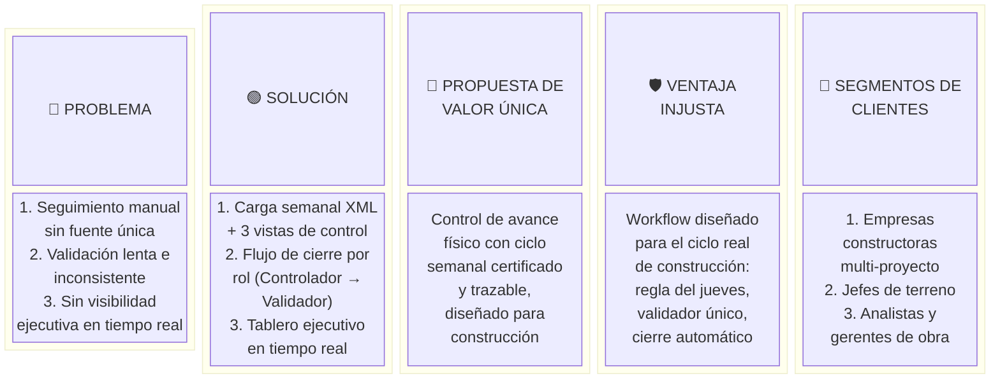

# Lean Canvas: SMAT System

## Overview

The Lean Canvas captures the core business model assumptions for SMAT, translating the product vision and user personas into a concise one-page strategy. It covers the 9 blocks of the Lean Canvas methodology, derived from the PRD's problem statement, personas, and product objectives.

## Lean Canvas (Table)

| **Problem** | **Solution** | **Unique Value Proposition** | **Unfair Advantage** | **Customer Segments** |
|---|---|---|---|---|
| 1. Physical construction progress is tracked manually (spreadsheets, email) with no single source of truth. | 1. Structured weekly XML upload + three complementary progress views (Gantt, PTS, Física). | **The only construction progress control platform that enforces a disciplined weekly cycle with role-based closure and validation, turning field data into certified, auditable records.** | Deep domain fit: workflow is designed around the actual construction control cycle (Thursday cutoff, multi-controller model, single-validator rule). | 1. Construction companies managing multiple simultaneous projects. |
| 2. Progress validation is slow, inconsistent, and relies on manual coordination between field supervisors and office teams. | 2. Role-based closure workflow: Controller → Validator → certified record. | | Configurable role hierarchy (Validador único por obra) reflects real-world construction org structure. | 2. Field supervisors (Controllers) needing a simple progress entry tool accessible from tablet. |
| 3. Managers lack real-time visibility into portfolio status; reports arrive late and are error-prone. | 3. Real-time executive dashboard aggregating all projects. | | Upload time window enforcement (Thursday rule) creates a reliable data rhythm across the organisation. | 3. Project managers and office analysts responsible for weekly reporting. |

| **Key Metrics** | **Channels** |
|---|---|
| 1. % of active projects with on-time validation closure per week. | 1. Direct sales to construction companies (B2B). |
| 2. Average time from last controller closure to validation closure. | 2. Word-of-mouth within the construction sector. |
| 3. Weekly active users per project role. | 3. Integration partnerships with MS Project / ERP vendors. |
| 4. System availability (target ≥ 99.5% monthly). | 4. Industry events and construction technology conferences. |

| **Cost Structure** | **Revenue Streams** |
|---|---|
| 1. Infrastructure (cloud hosting, database, file storage). | 1. SaaS subscription per company (tiered by number of active projects). |
| 2. Development and maintenance (backend, frontend, DevOps). | 2. Onboarding and training services. |
| 3. Customer support and onboarding. | 3. Professional services for custom XML schema integration. |
| 4. Security, compliance, and data backup. | |

## Lean Canvas Diagram

## Notes & Assumptions

- Revenue model is assumed to be SaaS B2B; the PRD does not explicitly define a commercial model — this should be validated with stakeholders.
- "Unfair advantage" is currently based on domain depth and workflow fit; a technical moat (e.g., proprietary XML parser, AI-based predictions) could be developed in future phases.
- The Thursday upload window is treated as a fixed business rule; if this constraint changes, the Key Metrics around "on-time validation closure" would need recalibration.
- Customer segments are inferred from the five personas defined in the PRD; direct market sizing has not been conducted.
