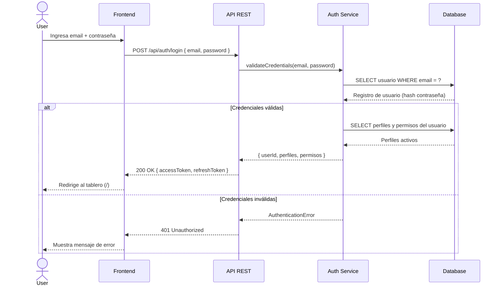
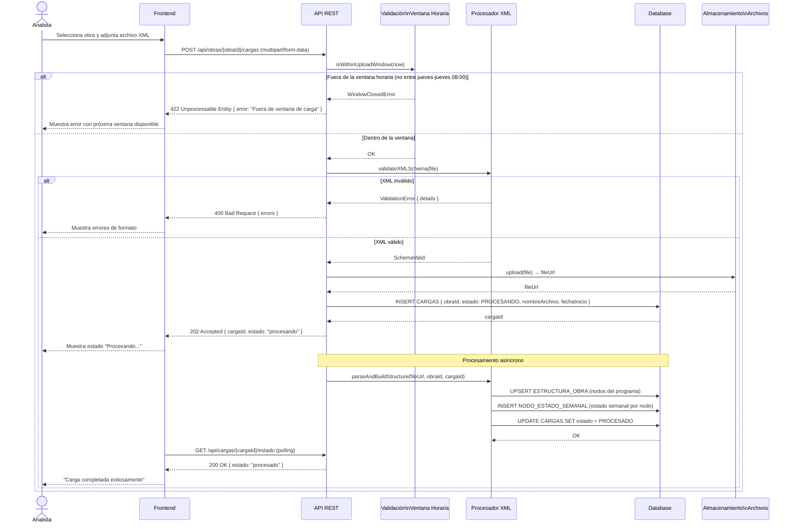
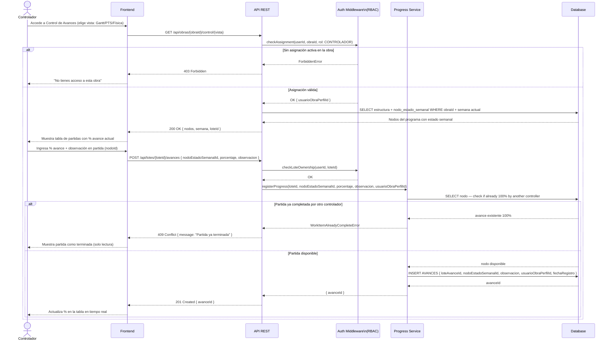
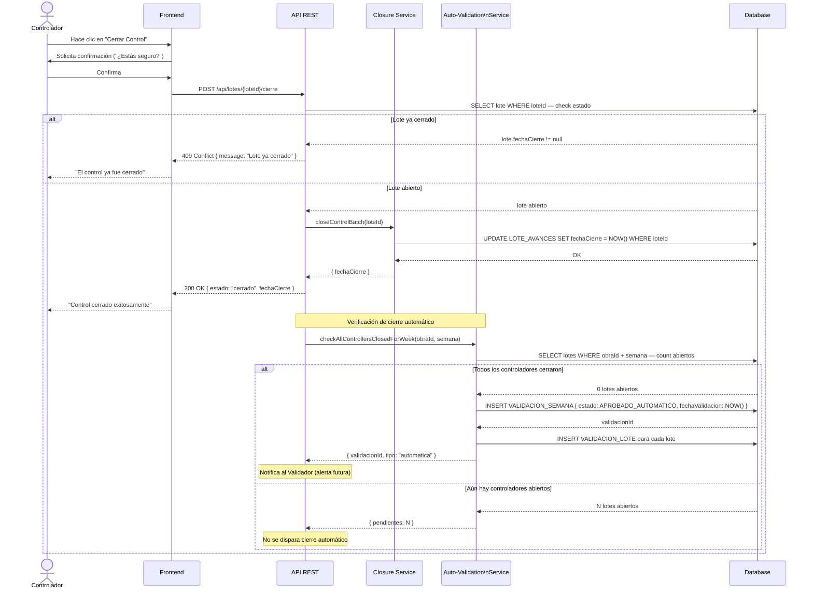
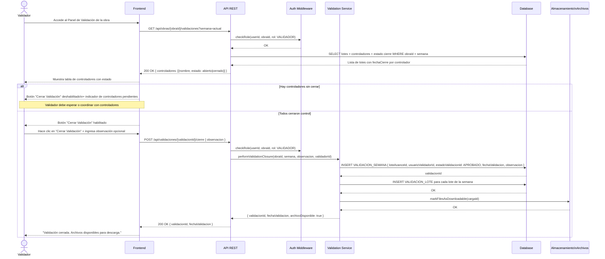
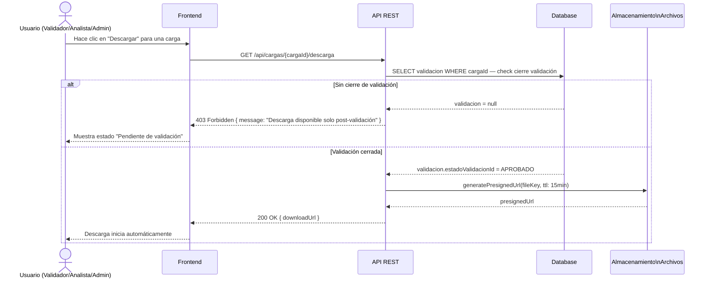

# Sequence Diagrams: SMAT System

This file contains one sequence diagram per major system flow, covering authentication, weekly file upload, progress registration, control closure, and validation closure. These diagrams map directly to the API endpoints defined in the PRD and the use cases in `use-cases.md`.

---

## 1. Authentication Flow

A user enters credentials and receives a JWT token used for all subsequent API calls. Invalid credentials return a 401 without a token.

---

## 2. Weekly File Upload (Analyst)

The Analyst uploads an XML file for a project within the Thursday-to-Thursday 08:00 window. The system validates the time window, validates the file format, and processes the project structure asynchronously.

---

## 3. Progress Registration (Controller)

A Controller selects a view (Gantt / PTS / Física), navigates to a work item node, and registers a progress percentage with an optional observation. The system saves the record to the controller's open batch.

---

## 4. Control Closure (Controller)

A Controller confirms they have finished entering progress for the week. The system closes their batch permanently. This action is irreversible.

---

## 5. Manual Validation Closure (Validator)

The Validator reviews the progress submitted by all controllers for the week, checks that all have closed their control, and manually executes the validation closure. After this, files become available for download.

---

## 6. File Download (Post-Validation)

A user with the appropriate role attempts to download the week's file. The system verifies that the validation closure exists before serving the download URL.

---

## Notes & Assumptions

- All API calls use `Authorization: Bearer {jwt}` headers — this is omitted from diagrams for readability.
- Asynchronous XML processing (Diagram 2) assumes a job queue mechanism; the polling interval from frontend is assumed to be every 3–5 seconds.
- Auto-validation check (Diagram 4) is triggered synchronously after each control closure; in high-load scenarios this could be moved to an event-driven approach.
- `loteId` is created automatically when a Controller first accesses the control module for a given week; this initial creation call is omitted from Diagram 3 for brevity.
- The Validator role restriction (cannot close their own control as a Controller) is enforced at the `Auth Middleware` layer via the `USUARIO_OBRA_PERFIL` record.
- Presigned URLs for file download have a 15-minute TTL — this value should be confirmed with security requirements.
