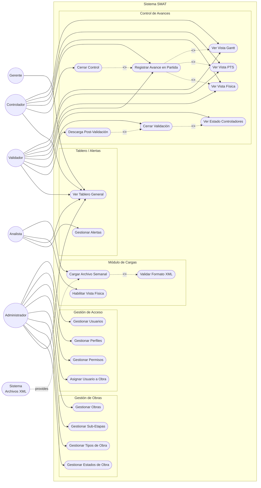

# Use Case Diagram: SMAT System

## Overview

This diagram maps every actor in the SMAT system to their corresponding use cases, showing the system boundary and the `<<include>>` / `<<extend>>` relationships between dependent flows. It provides a high-level picture of who interacts with the system and what each role can do, directly traceable to the functional requirements in the PRD.

## Actors

- **Administrator**: Global scope. Manages users, roles, profiles, projects (obras), project types/statuses, and views progress reports.
- **Analyst**: Global / Office scope. Uploads weekly XML files and enables the Physical (Física) view visibility.
- **Validator**: Per-project scope (only one per project). Reviews progress entries and performs the validation closure.
- **Controller**: Per-project scope (up to ~6 per project). Registers physical progress per work item and performs the control closure.
- **Manager**: Company scope. Read-only visibility of the project portfolio dashboard.
- **XML File System**: External system that provides the weekly construction program files (MS Project–compatible XML).

## Use Case Diagram

## Use Case Descriptions

### UC01: Gestionar Usuarios
- **Actor**: Administrator
- **Preconditions**: Administrator is authenticated.
- **Main Flow**: Create, view, edit, and deactivate user accounts.
- **Postconditions**: User account is persisted with the defined state.
- **Linked User Stories**: HU-01

### UC02: Gestionar Perfiles
- **Actor**: Administrator
- **Preconditions**: Administrator is authenticated.
- **Main Flow**: Create, view, edit, and delete profiles (role definitions).
- **Postconditions**: Profile is available for user assignment.
- **Linked User Stories**: HU-10

### UC03: Gestionar Permisos
- **Actor**: Administrator
- **Preconditions**: Administrator is authenticated.
- **Main Flow**: View system permissions and their role assignments; assign permissions to profiles.
- **Postconditions**: Permission-profile mapping is updated.
- **Linked User Stories**: HU-10

### UC04: Asignar Usuario a Obra
- **Actor**: Administrator
- **Preconditions**: User and project (obra) exist and are active.
- **Main Flow**: Select a user, assign a profile and a project; set the assignment as active.
- **Postconditions**: `USUARIO_OBRA_PERFIL` record is created; user can now act on that project.
- **Linked User Stories**: HU-01
- **Business Rule**: Only one Validator profile may be assigned per project.

### UC05: Gestionar Obras
- **Actor**: Administrator
- **Preconditions**: Administrator is authenticated; project types and statuses exist.
- **Main Flow**: Create, view, edit projects with contractual dates, type, and status.
- **Postconditions**: Project is available in the system and visible to assigned users.
- **Linked User Stories**: HU-02, HU-12

### UC06: Gestionar Sub-Etapas
- **Actor**: Administrator
- **Preconditions**: A parent project exists.
- **Main Flow**: Create and edit sub-stages for a project, defining units and reception dates.
- **Postconditions**: Sub-stages are associated with the project.
- **Linked User Stories**: HU-02

### UC07: Gestionar Tipos de Obra
- **Actor**: Administrator
- **Main Flow**: CRUD for project type catalogue.
- **Linked User Stories**: HU-12

### UC08: Gestionar Estados de Obra
- **Actor**: Administrator
- **Main Flow**: CRUD for project status catalogue (Vigente, Futuro, Terminado, etc.).
- **Linked User Stories**: HU-12

### UC09: Cargar Archivo Semanal
- **Actor**: Analyst (also Admin)
- **Preconditions**: Current date is within the allowed upload window (Thursday–Thursday 08:00). Project exists and is active.
- **Main Flow**: Select project, upload XML file. System validates format (`<<include>> UC11`) and processes the file, updating `ESTRUCTURA_OBRA` and `NODO_ESTADO_SEMANAL`.
- **Postconditions**: Weekly program structure is available for progress tracking.
- **Exception Flow**: Upload outside the time window is rejected.
- **Linked User Stories**: HU-03

### UC10: Habilitar Vista Física
- **Actor**: Analyst
- **Preconditions**: A valid weekly upload exists for the project.
- **Main Flow**: Toggle the Física view visibility on/off for a project.
- **Postconditions**: Controllers can (or cannot) access the Física view.
- **Linked User Stories**: HU-09

### UC11: Validar Formato XML
- **Actor**: System (triggered by UC09)
- **Main Flow**: Parse and validate the uploaded XML against the expected schema. Return errors if invalid.
- **Linked User Stories**: HU-03

### UC12: Ver Vista Gantt
- **Actor**: Controller, Validator, Analyst, Administrator
- **Preconditions**: A valid upload exists for the project. User has project assignment.
- **Main Flow**: Display the complete program as a collapsible table with progress percentages per week.
- **Linked User Stories**: HU-04

### UC13: Ver Vista PTS
- **Actor**: Controller, Validator, Analyst, Administrator
- **Preconditions**: A valid upload exists. User has project assignment.
- **Main Flow**: Display only the work items planned for the following week, grouped by process.
- **Linked User Stories**: HU-04

### UC14: Ver Vista Física
- **Actor**: Controller, Validator, Analyst, Administrator
- **Preconditions**: A valid upload exists. Física view is enabled for the project by Analyst.
- **Main Flow**: Display the full program with the current week's items highlighted in yellow. Only 3 levels: Process > Activity > Location.
- **Linked User Stories**: HU-04, HU-09

### UC15: Registrar Avance en Partida
- **Actor**: Controller, Validator
- **Preconditions**: User has an active project assignment. A weekly upload exists. The user's batch (`LOTE_AVANCES`) is open.
- **Main Flow**: Select a work item node; enter progress percentage and optional observation; save.
- **Postconditions**: `AVANCES` record is created.
- **Business Rule**: A work item is considered complete when the first controller marks it at 100%.
- **Linked User Stories**: HU-04

### UC16: Cerrar Control
- **Actor**: Controller
- **Preconditions**: Controller has registered at least one progress entry for the week. Batch is still open.
- **Main Flow**: Confirm control closure. System sets `LOTE_AVANCES.fechaCierre`. Action is irreversible.
- **Postconditions**: Controller's batch is closed. Validator can see this controller's status as "Closed".
- **Linked User Stories**: HU-05

### UC17: Ver Estado Controladores
- **Actor**: Validator
- **Preconditions**: Validator is assigned to the project.
- **Main Flow**: View a list of all controllers for the project with their control-closure status (Open / Closed).
- **Linked User Stories**: HU-07

### UC18: Cerrar Validación
- **Actor**: Validator (manual) or System (automatic)
- **Preconditions**: ALL controllers for the project have closed their control for the week.
- **Main Flow**: Validator reviews progress; executes validation closure. System records `VALIDACION_SEMANA` with approved status.
- **Automatic Flow**: System detects all batches are closed and triggers closure automatically.
- **Postconditions**: Weekly validation is certified; files become downloadable.
- **Business Rule**: A Controller cannot perform the validation closure.
- **Linked User Stories**: HU-06, HU-11

### UC19: Descarga Post-Validación
- **Actor**: Validator, Analyst, Administrator
- **Preconditions**: Validation closure has been completed for the week.
- **Main Flow**: User downloads the week's progress file.
- **Postconditions**: File is downloaded to user's device.
- **Linked User Stories**: HU-13

### UC20: Ver Tablero General
- **Actor**: All roles
- **Preconditions**: User is authenticated.
- **Main Flow**: View consolidated portfolio dashboard showing project status, last upload, and validation state.
- **Linked User Stories**: HU-08

### UC21: Gestionar Alertas
- **Actor**: Administrator (manage), Analyst (view)
- **Main Flow**: Administrator configures alerts; Analyst views active alerts.
- **Linked User Stories**: F-09

## Notes & Assumptions

- Mermaid does not support native UML use-case notation; `flowchart LR` with rounded actor nodes and stadium-shaped use-case nodes provides the closest approximation.
- The automatic validation closure (UC18 auto-flow) is a system-triggered variant of the same use case, not a separate actor interaction.
- The `<<include>>` relationship between UC15 and the three view use cases (UC12, UC13, UC14) represents that progress registration always happens within the context of one of these views.
- Manager role is read-only across the entire system.
