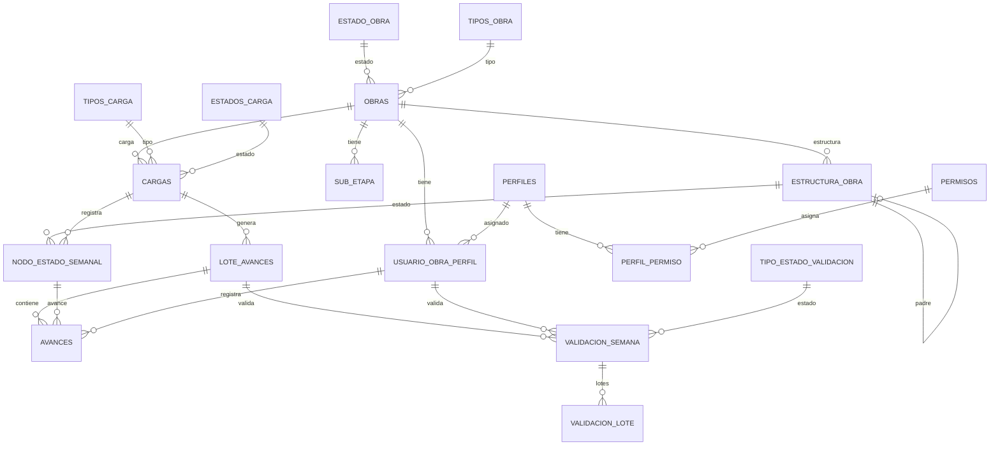

# Documento de Requisitos de Producto: Sistema SMAT

| Campo        | Detalle                                  |
|--------------|------------------------------------------|
| **Versión**  | 1.2                                       |
| **Fecha**    | 2026-04-23                                |
| **Autor**    | Asistido por IA (GitHub Copilot)          |
| **Estado**   | Borrador                                  |

### Historial de Cambios
| Versión | Fecha      | Cambio                                                                                     |
|---------|------------|--------------------------------------------------------------------------------------------|
| 1.0     | 2026-04-23 | Versión inicial.                                                                           |
| 1.1     | 2026-04-23 | Autenticación actualizada a SSO vía middleware Salfa (US-001). Secciones 9, 10, 11 y 13 actualizadas. |
| 1.2     | 2026-04-23 | Agregado HU-14: Tablero de Usuarios con Filtros Avanzados (US-014). Actualizadas secciones 5, 6, 9, 11 y 12. |

---

## 1. Resumen Ejecutivo

El **Sistema SMAT** es una plataforma de gestión y control de avance físico de obras de construcción. Su objetivo principal es centralizar y digitalizar el seguimiento del progreso de proyectos de obra civil, reemplazando procesos manuales o fragmentados con un flujo estructurado de carga, control y validación de avances semanales.

El sistema permite que distintos actores de un proyecto —administradores, analistas, validadores, controladores y gerentes— interactúen de manera coordinada, con roles y permisos claramente delimitados. Cada semana, los analistas cargan archivos XML con la estructura del programa de obra; los controladores registran avances en terreno; los validadores certifican la exactitud de dichos avances; y los gerentes obtienen visibilidad ejecutiva del estado global del portafolio de obras.

SMAT resuelve la necesidad crítica del sector construcción de contar con información de avance confiable, trazable y en tiempo controlado, soportando tres vistas complementarias: Gantt (visión global del programa), PTS (plan de trabajo semanal) y Física (estado porcentual del programa por semana en curso).

---

## 2. Problema y Audiencia Objetivo

### Problema
Las organizaciones de construcción gestionan múltiples obras simultáneamente con equipos de terreno distribuidos. El control de avance físico frecuentemente se realiza con hojas de cálculo, correos electrónicos o sistemas desconectados, generando:
- Falta de visibilidad en tiempo real del estado de las obras.
- Dificultad para consolidar avances de múltiples controladores por obra.
- Ausencia de trazabilidad en el proceso de validación.
- Riesgo de inconsistencias en los datos reportados.

### Audiencia Objetivo
Empresas del sector construcción que gestionan proyectos con múltiples frentes de trabajo y equipos de terreno, donde el control de avance físico semanal es crítico para la toma de decisiones operativas y gerenciales.

---

## 3. Visión y Objetivos del Producto

### Visión
*"Ser la plataforma de referencia para el control de avance físico de obras, brindando a los equipos de construcción visibilidad, trazabilidad y confiabilidad en el reporte de avances semanales."*

### Objetivos de Negocio
| ID   | Objetivo                                                                                      | Métrica de Éxito                                              |
|------|-----------------------------------------------------------------------------------------------|---------------------------------------------------------------|
| OB-1 | Centralizar el control de avance físico de todas las obras de la empresa.                     | 100% de obras activas gestionadas en SMAT.                    |
| OB-2 | Reducir el tiempo de cierre y validación semanal de avances.                                  | Cierre de validación en menos de 24 horas desde el vencimiento del plazo. |
| OB-3 | Garantizar trazabilidad completa de cada avance registrado.                                   | 0 avances sin usuario, fecha o carga asociados.               |
| OB-4 | Proveer visibilidad ejecutiva del portafolio de obras en tiempo real.                         | Tablero disponible con datos actualizados para gerencia.      |
| OB-5 | Controlar el acceso a la información según rol y obra asignada.                               | 0 incidentes de acceso no autorizado a información de avances.|

### KPIs Clave
- Porcentaje de obras con cierre de validación en tiempo.
- Tiempo promedio desde cierre de control hasta cierre de validación.
- Tasa de avances registrados por semana por obra.
- Disponibilidad del sistema (target: 99.5%).

---

## 4. Usuarios y Personas

### Persona 1 – Administrador del Sistema
| Campo            | Detalle                                                                                    |
|------------------|--------------------------------------------------------------------------------------------|
| **Nombre**       | Carlos Rojas                                                                               |
| **Rol**          | Administrador TI / Jefe de Sistemas                                                         |
| **Alcance**      | Global                                                                                     |
| **Objetivos**    | Mantener el sistema operativo, gestionar usuarios y permisos, configurar obras y perfiles. |
| **Frustraciones**| Procesos manuales de asignación de roles, sin trazabilidad de cambios administrativos.     |
| **Alternativas** | Gestión por planillas Excel o sistemas ERP genéricos.                                      |

### Persona 2 – Analista
| Campo            | Detalle                                                                                              |
|------------------|------------------------------------------------------------------------------------------------------|
| **Nombre**       | Valentina Torres                                                                                     |
| **Rol**          | Analista de Planificación / Oficina Técnica                                                           |
| **Alcance**      | Global / Oficina                                                                                     |
| **Objetivos**    | Cargar semanalmente los archivos XML del programa de obra y habilitar la vista Física para el equipo. |
| **Frustraciones**| Plazos estrictos de carga, errores de formato en archivos, falta de retroalimentación en la carga.   |
| **Alternativas** | Envío de archivos por correo, gestión manual de versiones.                                           |

### Persona 3 – Validador
| Campo            | Detalle                                                                                                         |
|------------------|-----------------------------------------------------------------------------------------------------------------|
| **Nombre**       | Rodrigo Méndez                                                                                                  |
| **Rol**          | Jefe de Obra / Validador                                                                                        |
| **Alcance**      | Por Obra (único por obra)                                                                                       |
| **Objetivos**    | Revisar y validar los avances registrados por los controladores; certificar el cierre semanal de validación.    |
| **Frustraciones**| Dependencia de múltiples controladores para completar el cierre; falta de alertas sobre avances pendientes.     |
| **Alternativas** | Revisión manual de reportes, reuniones de coordinación.                                                         |

### Persona 4 – Controlador
| Campo            | Detalle                                                                                              |
|------------------|------------------------------------------------------------------------------------------------------|
| **Nombre**       | Felipe Castillo                                                                                      |
| **Rol**          | Jefe de Terreno / Controlador                                                                        |
| **Alcance**      | Por Obra (múltiples por obra, máx. ~6)                                                               |
| **Objetivos**    | Registrar el avance real de las partidas en terreno; cerrar su control semanal.                      |
| **Frustraciones**| Interfaz compleja para el registro de avances; dificultad para visualizar qué partidas le corresponden.|
| **Alternativas** | Registro en cuadernos, planillas, reportes fotográficos.                                             |

### Persona 5 – Gerente
| Campo            | Detalle                                                                                            |
|------------------|----------------------------------------------------------------------------------------------------|
| **Nombre**       | Ana Gutiérrez                                                                                      |
| **Rol**          | Gerente de Proyectos / Dirección                                                                   |
| **Alcance**      | Empresa                                                                                            |
| **Objetivos**    | Visualizar el estado general del portafolio de obras y los controles de avance realizados.         |
| **Frustraciones**| Reportes tardíos, información inconsistente, falta de visión consolidada del portafolio.           |
| **Alternativas** | Informes manuales, presentaciones periódicas del equipo.                                           |

---

## 5. Casos de Uso y Historias de Usuario

### CU-01: Carga Semanal de Archivo de Obra

**Actor Principal:** Analista  
**Precondiciones:** La obra existe y está activa en el sistema. El analista tiene permisos de carga. La fecha está dentro de la ventana permitida (jueves a jueves hasta las 08:00).  
**Flujo Principal:**
1. El analista accede al módulo de Cargas.
2. Selecciona la obra a la que corresponde la carga.
3. Sube el archivo XML con la estructura del programa semanal.
4. El sistema valida el formato y la semana del archivo.
5. El sistema procesa el archivo y actualiza la estructura de la obra (`ESTRUCTURA_OBRA`, `NODO_ESTADO_SEMANAL`).
6. El sistema confirma la carga exitosa y registra la carga en `CARGAS`.

**Postcondiciones:** La estructura semanal está disponible para el control de avances.  
**Flujo Alternativo:** Si el archivo tiene errores de formato, el sistema notifica al analista con detalle del error y no realiza la carga.  
**Flujo de Excepción:** Si se intenta cargar fuera de la ventana horaria, el sistema rechaza la operación con mensaje de error indicando el plazo disponible.

---

### CU-02: Registro de Avance por Controlador

**Actor Principal:** Controlador  
**Precondiciones:** Existe una carga vigente para la semana en curso. El controlador está asignado a la obra con perfil activo.  
**Flujo Principal:**
1. El controlador accede al módulo de Control de Avances.
2. Selecciona la vista deseada (Gantt / PTS / Física).
3. Visualiza las partidas correspondientes a la semana.
4. Registra el porcentaje de avance por partida con observaciones opcionales.
5. El sistema guarda el avance en `AVANCES` asociado al lote del controlador.
6. Al completar, el controlador realiza el cierre de control.

**Postcondiciones:** Los avances quedan registrados y el lote del controlador queda cerrado.  
**Flujo Alternativo:** Si una partida ya fue completada por otro controlador, el sistema la marca como terminada y no permite nuevos avances.  
**Flujo de Excepción:** Si el controlador no tiene asignación activa en la obra, el sistema deniega el acceso al módulo de avances.

---

### CU-03: Cierre de Validación

**Actor Principal:** Validador  
**Precondiciones:** Todos los controladores de la obra han cerrado su control para la semana.  
**Flujo Principal:**
1. El validador accede al módulo de Control.
2. Revisa los avances registrados por todos los controladores.
3. Si está conforme, ejecuta el **Cierre de Validación**.
4. El sistema registra la validación en `VALIDACION_SEMANA` con estado aprobado.
5. Los archivos de la semana quedan disponibles para descarga.

**Postcondiciones:** La semana queda validada y los archivos son descargables.  
**Flujo Alternativo (cierre automático):** Si todos los controladores cierran su control, el sistema realiza automáticamente el cierre de validación sin intervención del validador.  
**Flujo de Excepción:** Si aún hay controladores sin cerrar control, el botón "Cierre Validación" permanece deshabilitado y se muestra el estado de cada controlador.

---

### Historias de Usuario Principales

| ID    | Historia                                                                                                           | Prioridad   | Criterios de Aceptación |
|-------|--------------------------------------------------------------------------------------------------------------------|-------------|-------------------------|
| HU-01 | Como **Administrador**, quiero crear y gestionar usuarios con roles y asignaciones a obras, para controlar el acceso al sistema. | Must Have   | El admin puede crear, editar, desactivar usuarios y asignarles perfiles por obra. Los cambios se reflejan inmediatamente. |
| HU-02 | Como **Administrador**, quiero crear y configurar obras con sus fechas y sub-etapas, para estructurar el programa de trabajo. | Must Have   | Se pueden crear obras con todos sus campos obligatorios, sub-etapas con fechas y estado inicial configurado. |
| HU-03 | Como **Analista**, quiero cargar el archivo XML semanal dentro de la ventana horaria permitida, para actualizar el programa de la obra. | Must Have   | La carga solo se permite entre jueves y jueves hasta las 08:00. El sistema valida el formato del archivo antes de procesar. |
| HU-04 | Como **Controlador**, quiero registrar avances en las vistas Gantt, PTS y Física, para reportar el progreso real de las partidas. | Must Have   | El controlador puede ingresar avances por partida con observaciones. Los avances se guardan en tiempo real. |
| HU-05 | Como **Controlador**, quiero realizar el cierre de mi control semanal, para indicar que completé el reporte de avances. | Must Have   | El cierre solo se permite cuando el controlador ha ingresado al menos un avance. No se puede revertir el cierre. |
| HU-06 | Como **Validador**, quiero revisar los avances de todos los controladores y realizar el cierre de validación, para certificar el avance semanal de la obra. | Must Have   | El cierre de validación solo está disponible cuando todos los controladores cerraron su control. Los archivos se habilitan para descarga post-cierre. |
| HU-07 | Como **Validador**, quiero visualizar el estado de cierre de cada controlador, para saber cuántos faltan por cerrar antes de poder validar. | Must Have   | Se muestra una lista de controladores con su estado: abierto / cerrado. |
| HU-09 | Como **Analista**, quiero habilitar la visibilidad de la vista Física, para que los controladores puedan usarla. | Should Have | La vista Física se activa/desactiva por obra. Solo el analista puede cambiar esta configuración. |
| HU-10 | Como **Administrador**, quiero gestionar permisos y perfiles, para controlar qué acciones puede realizar cada tipo de usuario. | Must Have   | Los permisos se asocian a perfiles. Los perfiles se asignan a usuarios por obra. Los permisos se aplican en tiempo real. |
| HU-11 | Como **Usuario**, quiero que el sistema realice el cierre de validación automáticamente cuando todos los controladores cierren, para evitar cuellos de botella cuando el validador no está disponible. | Should Have | El sistema detecta cuando todos los lotes de controladores están cerrados y ejecuta el cierre de validación automáticamente. |
| HU-12 | Como **Administrador**, quiero gestionar tipos y estados de obra, para categorizar y filtrar las obras según su ciclo de vida. | Should Have | Se pueden crear, editar y eliminar tipos y estados de obra. Las obras se filtran por estado en el listado. |
| HU-13 | Como **Usuario**, quiero descargar los archivos de avance solo después del cierre de validación, para garantizar la integridad de la información descargada. | Must Have   | El botón de descarga solo está habilitado para cargas con cierre de validación registrado. |
| HU-14 | Como **Administrador**, quiero visualizar un tablero con todos los usuarios mostrando Nombre, Apellido, Rut, Rol, PEP Obra, Nombre Obra y Estado, con filtros por Rol, Nombre, Estado y Obra, para gestionar y localizar usuarios de manera eficiente. | Must Have   | El tablero es visible únicamente para el Administrador. Los filtros combinables actualizan el listado en tiempo real. Usuarios sin obra muestran PEP y Nombre Obra en blanco. |

---

## 6. Funcionalidades y Requisitos Funcionales

### F-01: Módulo de Usuarios
| Campo              | Detalle                                                                                     |
|--------------------|---------------------------------------------------------------------------------------------|
| **ID**             | F-01                                                                                        |
| **Nombre**         | Gestión de Usuarios                                                                         |
| **Descripción**    | Permite al administrador crear, visualizar, editar, desactivar usuarios y asignarles perfiles y obras. Incluye un tablero enriquecido con columnas Nombre, Apellido, Rut, Rol, PEP Obra, Nombre Obra y Estado, con filtros combinables por Rol, Nombre, Estado Colaborador y Obra. |
| **HU Asociadas**   | HU-01, HU-14                                                                                |
| **Criterios**      | CRUD completo. Asignación de perfil+obra en una sola operación. Validación de unicidad de email. Tablero con columnas enriquecidas (Nombre, Apellido, Rut, Rol, PEP Obra, Nombre Obra, Estado). Filtros combinables: Rol (selector de perfiles), Nombre (input parcial), Estado Colaborador (Activo/Inactivo), Obra (selector). Solo el Administrador puede acceder al listado completo. |
| **Dependencias**   | F-04 (Perfiles), F-02 (Obras)                                                               |
| **Prioridad**      | Must Have                                                                                   |

### F-02: Módulo de Obras
| Campo              | Detalle                                                                                     |
|--------------------|---------------------------------------------------------------------------------------------|
| **ID**             | F-02                                                                                        |
| **Nombre**         | Gestión de Obras                                                                            |
| **Descripción**    | Permite crear y administrar obras con todas sus propiedades, sub-etapas y filtros de estado. |
| **HU Asociadas**   | HU-02, HU-12                                                                                |
| **Criterios**      | Filtros por estado (Vigente / Futuro / Terminado). CRUD de obras y sub-etapas. Fechas contractuales obligatorias. |
| **Dependencias**   | F-06 (Tipos de Obra), F-07 (Estados de Obra)                                                |
| **Prioridad**      | Must Have                                                                                   |

### F-03: Módulo de Cargas
| Campo              | Detalle                                                                                     |
|--------------------|---------------------------------------------------------------------------------------------|
| **ID**             | F-03                                                                                        |
| **Nombre**         | Carga Semanal de Archivos                                                                   |
| **Descripción**    | Permite a analistas y administradores subir archivos XML semanales con la estructura del programa de obra. |
| **HU Asociadas**   | HU-03, HU-09                                                                                |
| **Criterios**      | Validación de ventana horaria (jueves a jueves hasta 08:00). Validación de formato XML. Máximo una semana anterior permitida. Estado de carga rastreable. |
| **Dependencias**   | F-02 (Obras)                                                                                |
| **Prioridad**      | Must Have                                                                                   |

### F-04: Módulo de Control de Avances
| Campo              | Detalle                                                                                     |
|--------------------|---------------------------------------------------------------------------------------------|
| **ID**             | F-04                                                                                        |
| **Nombre**         | Control de Avances (vistas Gantt / PTS / Física)                                            |
| **Descripción**    | Permite a controladores registrar avances en tres vistas complementarias; al validador revisar y cerrar la validación semanal. |
| **HU Asociadas**   | HU-04, HU-05, HU-06, HU-07, HU-11, HU-13                                                  |
| **Criterios**      | Tres vistas operativas. Avance por partida con observación. Cierre de control por controlador. Cierre de validación (manual o automático). Descarga habilitada post-validación. |
| **Dependencias**   | F-03 (Cargas), F-01 (Usuarios/Asignaciones)                                                 |
| **Prioridad**      | Must Have                                                                                   |

**Detalle de Vistas:**
- **Gantt:** Vista completa del programa en formato tabla colapsable, equivalente a la visualización natural de MS Project. Es la vista principal.
- **PTS (Plan de Trabajo Semanal):** Muestra únicamente las partidas planificadas para la semana siguiente, agrupadas por proceso. Depende del archivo cargado.
- **Física:** Muestra todo el programa destacando en amarillo los procesos de la semana en curso (guiada por la columna PTS del XML). Presenta únicamente 3 niveles: Proceso > Actividad > Ubicación.

### F-05: Módulo de Permisos y Perfiles
| Campo              | Detalle                                                                                     |
|--------------------|---------------------------------------------------------------------------------------------|
| **ID**             | F-05                                                                                        |
| **Nombre**         | Gestión de Permisos y Perfiles                                                              |
| **Descripción**    | Permite visualizar y gestionar los permisos del sistema y su asignación a perfiles.         |
| **HU Asociadas**   | HU-10                                                                                       |
| **Criterios**      | Listado de permisos con roles asignados. Creación y edición de perfiles. Asignación de permisos a perfiles. |
| **Prioridad**      | Must Have                                                                                   |

### F-06: Tipos de Obra
| Campo              | Detalle                                                   |
|--------------------|-----------------------------------------------------------|
| **ID**             | F-06                                                      |
| **Nombre**         | Gestión de Tipos de Obra                                  |
| **Descripción**    | CRUD de los diferentes tipos de obra del sistema.         |
| **Prioridad**      | Should Have                                               |

### F-07: Estados de Obra
| Campo              | Detalle                                                   |
|--------------------|-----------------------------------------------------------|
| **ID**             | F-07                                                      |
| **Nombre**         | Gestión de Estados de Obra                                |
| **Descripción**    | CRUD de los diferentes estados del ciclo de vida de una obra. |
| **Prioridad**      | Should Have                                               |

### F-08: Tablero Gerencial
| Campo              | Detalle                                                                                     |
|--------------------|---------------------------------------------------------------------------------------------|
| **ID**             | F-08                                                                                        |
| **Nombre**         | Tablero / Panel de Control                                                                  |
| **Descripción**    | Vista consolidada del portafolio de obras con indicadores de avance y estado para gerencia y otros roles. |
| **HU Asociadas**   | HU-08                                                                                       |
| **Criterios**      | Visible para todos los roles. Muestra estado de obras, última carga y estado de validación. |
| **Prioridad**      | Must Have                                                                                   |

### F-09: Alertas
| Campo              | Detalle                                                                                     |
|--------------------|---------------------------------------------------------------------------------------------|
| **ID**             | F-09                                                                                        |
| **Nombre**         | Gestión de Alertas                                                                          |
| **Descripción**    | Permite al administrador gestionar alertas y al analista visualizarlas.                     |
| **Prioridad**      | Could Have                                                                                  |

---

## 7. Modelo de Datos

### Entidades Principales

| Entidad                 | Descripción                                                                                  |
|-------------------------|----------------------------------------------------------------------------------------------|
| `OBRAS`                 | Representa un proyecto de obra. Contiene fechas contractuales, tipo, estado y configuración. |
| `SUB_ETAPA`             | Sub-divisiones de una obra con sus propias fechas de recepción y unidades.                   |
| `ESTADO_OBRA`           | Catálogo de estados del ciclo de vida de una obra (Vigente, Futuro, Terminado, etc.).        |
| `TIPOS_OBRA`            | Catálogo de tipos de obra (habitacional, infraestructura, etc.).                             |
| `USUARIO_OBRA_PERFIL`   | Tabla de asignación: relaciona un usuario con una obra y un perfil específico.               |
| `PERFILES`              | Define los roles del sistema con su tipo y descripción.                                      |
| `PERMISOS`              | Catálogo de permisos del sistema identificados por código.                                   |
| `PERFIL_PERMISO`        | Tabla de asignación: relaciona perfiles con sus permisos habilitados.                        |
| `CARGAS`                | Registro de cada archivo XML cargado, con estado, tipo y fechas de inicio y cierre.          |
| `TIPOS_CARGA`           | Catálogo de tipos de carga (e.g., carga inicial, carga semanal).                             |
| `ESTADOS_CARGA`         | Catálogo de estados de una carga (pendiente, procesado, error).                              |
| `ESTRUCTURA_OBRA`       | Árbol jerárquico de nodos del programa de obra (proceso > actividad > ubicación).            |
| `NODO_ESTADO_SEMANAL`   | Estado semanal de cada nodo de la estructura, vinculado a una carga específica.              |
| `LOTE_AVANCES`          | Agrupación de avances de un controlador en una semana; tiene fecha de cierre.                |
| `AVANCES`               | Registro individual de avance por nodo, con observación y fecha.                             |
| `VALIDACION_SEMANA`     | Registro del proceso de validación semanal con estado y observaciones del validador.         |
| `VALIDACION_LOTE`       | Relación entre una validación semanal y los lotes de avance incluidos.                       |
| `TIPO_ESTADO_VALIDACION`| Catálogo de estados de validación (pendiente, aprobado, rechazado).                         |

### Diagrama Entidad-Relación (Mermaid)



### Reglas de Validación de Datos
- `OBRAS.fechaRecepcionProvisoria` no puede ser anterior a `OBRAS.fechaInicioContractual`.
- `USUARIO_OBRA_PERFIL`: Solo puede existir un registro activo con `perfilId` correspondiente a "Validador" por obra.
- `CARGAS.fechaInicio` debe estar dentro de la ventana jueves-jueves hasta las 08:00.
- `AVANCES` solo se pueden registrar si existe un `NODO_ESTADO_SEMANAL` activo para la semana en curso.
- Una partida (`ESTRUCTURA_OBRA`) se considera terminada cuando el primer `AVANCE` con 100% es registrado.
- `LOTE_AVANCES.fechaCierre` solo se puede establecer; no se puede revertir.

### Consideraciones de Privacidad y Retención
- Los datos de usuarios deben ser tratados conforme a la legislación de protección de datos aplicable.
- Los registros de avances son datos operativos con retención indefinida mientras la obra esté activa.
- Las cargas archivadas (post-validación) deben mantenerse para auditoría.

---

## 8. Arquitectura del Sistema (Alto Nivel)

### Componentes Principales
```
┌─────────────────────────────────────────────────────────┐
│                    Clientes Web                         │
│         (Navegador — SPA React/Angular/Vue)             │
└──────────────────────┬──────────────────────────────────┘
                       │ HTTPS
┌──────────────────────▼──────────────────────────────────┐
│                   API REST / Backend                     │
│              (Node.js / .NET / Django)                   │
│   ┌─────────────┐  ┌──────────────┐  ┌──────────────┐  │
│   │   Auth /    │  │  Módulos de  │  │  Procesador  │  │
│   │  Permisos   │  │   Negocio    │  │   de XML     │  │
│   └─────────────┘  └──────────────┘  └──────────────┘  │
└──────────────────────┬──────────────────────────────────┘
                       │
┌──────────────────────▼──────────────────────────────────┐
│               Base de Datos Relacional                   │
│                 (PostgreSQL / SQL Server)                 │
└─────────────────────────────────────────────────────────┘
                       │
┌──────────────────────▼──────────────────────────────────┐
│              Almacenamiento de Archivos                  │
│           (S3 / Azure Blob / File System)                │
└─────────────────────────────────────────────────────────┘
```

### Consideraciones de Escalabilidad
- El sistema debe soportar múltiples obras simultáneas con hasta 6 controladores por obra.
- El procesamiento de archivos XML puede ser asíncrono (cola de trabajos) para no bloquear la interfaz.
- El tablero gerencial puede utilizar vistas materializadas o caché para consultas de alto volumen.

---

## 9. Especificación de API (Alto Nivel)

### Recursos y Endpoints Principales

#### Autenticación SMAT
| Método | Endpoint             | Descripción                                                                 |
|--------|----------------------|-----------------------------------------------------------------------------|
| POST   | `/api/auth/login`    | Recibe el token y datos de usuario de Salfa, valida en BD y retorna JWT SMAT. |
| POST   | `/api/auth/logout`   | Invalida la sesión SMAT en el cliente.                                      |

#### Autenticación – Middleware Salfa (Servicio Externo)
El proceso de autenticación delega la verificación de identidad al **Autorizador Salfa** mediante un flujo OAuth-like de 4 pasos. Las URLs base son:
- **QA**: `https://apiautorizadorqa.salfagestion.cl/api/v1.0`
- **PROD**: `https://autorizadorapi.salfagestion.cl/api/v1.0`

| Paso | Método | Endpoint Salfa             | Descripción                                                                 |
|------|--------|----------------------------|-----------------------------------------------------------------------------|
| 1    | POST   | `token/iniciarLogin`       | Inicia el flujo SSO. Recibe `{ clientId, returnUrl }`, retorna `code`.      |
| 2    | POST   | `token/obtenerToken`       | Intercambia `{ code, clientId, returnUrl }` por un `TokenModel` de Salfa.  |
| 3    | GET    | `token/obtenerUsuario`     | Retorna `UsuarioModel` con email, contactoId, given_name, sub, claims.     |
| 4    | POST   | `token/cerrarSesion`       | Cierra la sesión en Salfa. Recibe `{ id_token, logoutUrl }`.               |

#### Usuarios
| Método | Endpoint                        | Descripción                         |
|--------|---------------------------------|-------------------------------------|
| GET    | `/api/usuarios`                 | Listar usuarios (paginado). Soporta filtros: `rol`, `nombre`, `estado` (activo\|inactivo), `obraId`. Retorna columnas: nombre, apellido, rut, rol, pepObra, nombreObra, activo. Solo accesible para Administrador. |
| POST   | `/api/usuarios`                 | Crear usuario.                      |
| GET    | `/api/usuarios/{id}`            | Obtener detalle de usuario.         |
| PUT    | `/api/usuarios/{id}`            | Actualizar usuario.                 |
| DELETE | `/api/usuarios/{id}`            | Desactivar usuario.                 |
| POST   | `/api/usuarios/{id}/asignaciones` | Asignar perfil y obra a usuario.  |

#### Obras
| Método | Endpoint                        | Descripción                         |
|--------|---------------------------------|-------------------------------------|
| GET    | `/api/obras`                    | Listar obras con filtros de estado. |
| POST   | `/api/obras`                    | Crear obra.                         |
| GET    | `/api/obras/{id}`               | Obtener detalle de obra.            |
| PUT    | `/api/obras/{id}`               | Actualizar obra.                    |
| POST   | `/api/obras/{id}/sub-etapas`    | Crear sub-etapa de obra.            |

#### Cargas
| Método | Endpoint                        | Descripción                         |
|--------|---------------------------------|-------------------------------------|
| POST   | `/api/obras/{id}/cargas`        | Subir archivo XML de carga semanal. |
| GET    | `/api/obras/{id}/cargas`        | Listar cargas de una obra.          |
| GET    | `/api/cargas/{id}/estado`       | Consultar estado de procesamiento.  |

#### Control de Avances
| Método | Endpoint                                   | Descripción                                    |
|--------|--------------------------------------------|------------------------------------------------|
| GET    | `/api/obras/{id}/control/gantt`            | Obtener vista Gantt de la obra.                |
| GET    | `/api/obras/{id}/control/pts`              | Obtener vista PTS de la semana.                |
| GET    | `/api/obras/{id}/control/fisica`           | Obtener vista Física de la semana.             |
| POST   | `/api/lotes/{id}/avances`                  | Registrar avance en una partida.               |
| POST   | `/api/lotes/{id}/cierre`                   | Cerrar lote de control del controlador.        |
| POST   | `/api/validaciones/{id}/cierre`            | Ejecutar cierre de validación semanal.         |
| GET    | `/api/obras/{id}/validaciones`             | Listar validaciones de una obra.               |

**Autenticación:** Todos los endpoints requieren token JWT SMAT en cabecera `Authorization: Bearer {token}`. El JWT SMAT se emite tras completar el flujo SSO con el Autorizador Salfa.

---

## 10. Requisitos No Funcionales

### Rendimiento
- Tiempo de respuesta de la API: < 500ms para el 95% de las solicitudes.
- Carga de archivos XML: proceso completado en < 30 segundos para archivos de tamaño estándar (< 10MB).
- Carga del tablero gerencial: < 2 segundos.

### Seguridad
- Autenticación mediante SSO con el **Autorizador Salfa** (flujo OAuth-like de 4 pasos). SMAT no gestiona contraseñas directamente.
- JWT SMAT emitido internamente tras validar la identidad de Salfa contra la BD de SMAT; incluye `userId` y lista de `{ obraId, perfilId }` para RBAC.
- Autorización basada en roles y permisos (RBAC) aplicada en capa de API.
- Validación de que el usuario tenga asignación activa a la obra antes de permitir operaciones sobre ella.
- HTTPS obligatorio en todos los entornos.
- Sanitización de archivos XML cargados para prevenir ataques de tipo XXE.
- El `clientId` de SMAT ante el autorizador Salfa debe gestionarse como variable de entorno (nunca expuesto en el cliente).
- Rate limiting en `POST /api/auth/login` (máx. 10 intentos por IP en 15 min).

### Escalabilidad
- Soporte para al menos 50 obras activas simultáneas.
- Soporte para al menos 200 usuarios concurrentes.

### Disponibilidad
- Disponibilidad objetivo: 99.5% mensual.
- Ventana de mantenimiento planificada fuera de la ventana crítica de carga (jueves).

### Accesibilidad
- Cumplimiento WCAG 2.1 Nivel AA.
- Interfaz responsive para uso en tablet desde terreno.

### Internacionalización
- Idioma principal: Español (Chile).
- Formato de fechas: DD/MM/YYYY.
- Zona horaria: America/Santiago.

---

## 11. Lineamientos UX/UI

### Principios de Diseño
1. **Claridad sobre densidad:** Las vistas de control deben priorizar la legibilidad sobre la cantidad de información visible simultáneamente.
2. **Acción guiada:** Los flujos críticos (cierre de control, cierre de validación) deben tener pasos claros con confirmación explícita.
3. **Estado siempre visible:** El estado de la semana actual (abierta / cerrada / validada) debe ser visible en todo momento en el módulo de control.

### Pantallas Clave
- **Login:** Pantalla de inicio que redirige al SSO corporativo de Salfa. No se ingresan credenciales directamente en SMAT.
- **Listado de Obras:** Tabla con filtros de estado (Vigente / Futuro / Terminado) y acceso rápido a detalle.
- **Vista Gantt:** Tabla jerárquica colapsable con columnas de porcentaje de avance por semana.
- **Vista PTS:** Tabla agrupada por proceso, mostrando solo partidas de la semana siguiente.
- **Vista Física:** Tabla con 3 niveles (Proceso > Actividad > Ubicación), con resaltado amarillo para la semana en curso.
- **Panel de Validación:** Listado de controladores con estado de cierre y botón de cierre de validación.
- **Tablero de Usuarios:** Tabla enriquecida con columnas Nombre, Apellido, Rut, Rol, PEP Obra, Nombre Obra y Estado. Incluye filtros combinables: Rol (selector), Nombre (input), Estado Colaborador (selector Activo/Inactivo), Obra (selector). Visible únicamente para el Administrador.
- **Gestión de Usuarios/Obras:** Formularios CRUD estándar con validaciones en línea.

### Diseño Responsive
- La interfaz debe ser funcional en resoluciones desde 768px de ancho (tablet).
- Las vistas de control (Gantt, PTS, Física) pueden requerir scroll horizontal en dispositivos pequeños.

---

## 12. Backlog del Producto

### Metodología de Priorización: MoSCoW

#### Must Have (MVP)
| ID    | Historia / Funcionalidad                         | Complejidad | Dependencias |
|-------|--------------------------------------------------|-------------|--------------|
| HU-01 | Gestión completa de usuarios y asignaciones       | Alta        | HU-02, HU-10 |
| HU-02 | Gestión de obras y sub-etapas                     | Media       | -            |
| HU-10 | Gestión de perfiles y permisos                    | Media       | -            |
| HU-03 | Carga semanal de archivos XML                     | Alta        | HU-02        |
| HU-04 | Registro de avances (Gantt / PTS / Física)        | Muy Alta    | HU-03        |
| HU-05 | Cierre de control por controlador                 | Media       | HU-04        |
| HU-06 | Cierre de validación por validador                | Media       | HU-05        |
| HU-07 | Visualización de estado de controladores          | Baja        | HU-05        |
| HU-13 | Descarga de archivos post-validación              | Baja        | HU-06        |
| HU-14 | Tablero de Usuarios con Filtros Avanzados         | Baja        | HU-01        |

#### Should Have
| ID    | Historia / Funcionalidad                         | Complejidad |
|-------|--------------------------------------------------|-------------|
| HU-09 | Habilitación de vista Física por analista         | Baja        |
| HU-11 | Cierre de validación automático                  | Media       |
| HU-12 | Gestión de tipos y estados de obra               | Baja        |

#### Could Have
| ID    | Historia / Funcionalidad                         | Complejidad |
|-------|--------------------------------------------------|-------------|
| F-09  | Módulo de alertas                                | Media       |

#### Won't Have (primera versión)
- Integración con sistemas ERP externos.
- App móvil nativa.
- Reportes PDF automatizados.
- Gestión de fotografías de avance.

### Fases de Lanzamiento

**Fase 1 – MVP Core:**
Autenticación, gestión de usuarios/obras/perfiles, módulo de cargas, control de avances (3 vistas), cierre de control, cierre de validación, tablero básico, descarga de archivos.

**Fase 2 – Funcionalidades Complementarias:**
Cierre de validación automático, habilitación de vista Física, gestión de tipos/estados de obra, alertas básicas.

**Fase 3 – Mejoras y Escala:**
Tablero avanzado con KPIs, exportación de reportes, notificaciones por correo, optimizaciones de rendimiento.

---

## 13. Riesgos y Supuestos

### Riesgos Identificados

| ID   | Riesgo                                                                            | Probabilidad | Impacto | Mitigación                                                                       |
|------|-----------------------------------------------------------------------------------|--------------|---------|----------------------------------------------------------------------------------|
| R-01 | Variación en el formato de archivos XML entre proyectos.                          | Alta         | Alto    | Definir y validar esquema XSD estricto. Proporcionar plantilla estándar.         |
| R-02 | Resistencia al cambio por parte de controladores habituados a métodos manuales.   | Media        | Alto    | Interfaz intuitiva, capacitación y soporte en los primeros sprints de uso real.  |
| R-03 | Incumplimiento de la ventana de carga afectando la disponibilidad de datos.       | Media        | Alto    | Alertas automáticas previas al cierre de ventana. Documentación del proceso.     |
| R-04 | Rendimiento degradado al procesar archivos XML de gran tamaño.                    | Baja         | Medio   | Procesamiento asíncrono con cola de trabajos. Límite de tamaño de archivo.       |
| R-06 | Indisponibilidad del Autorizador Salfa impide el acceso de todos los usuarios al sistema. | Media | Muy Alto | Manejo de errores con mensajes claros al usuario. Monitoreo del servicio externo. Evaluar mecanismo de sesión persistente por ventana de tiempo. |

### Supuestos Clave
- Los archivos XML siguen un esquema definido y consistente (formato MS Project u equivalente).
- Existe un máximo de 6 controladores activos por obra en simultáneo.
- Solo existe un validador activo por obra.
- La ventana de carga (jueves a jueves hasta las 08:00) es un requisito de negocio fijo.
- Los usuarios acceden al sistema desde redes internas o VPN corporativa.

### Preguntas Abiertas
- ~~¿El sistema debe soportar autenticación SSO (LDAP/Active Directory)?~~ **Resuelto (v1.1):** La autenticación se realiza mediante el Autorizador Salfa (SSO corporativo). Ver US-001.
- ¿Cuál es el esquema XSD exacto del archivo XML esperado?
- ¿Se requiere historial de auditoría para cambios administrativos (creación/edición de usuarios, obras)?
- ¿El tablero gerencial debe soportar comparación entre semanas o solo visualización del estado actual?
- ¿Existe un límite máximo de obras activas por empresa?
- ¿Las sub-etapas tienen su propia estructura de avance o dependen de la estructura de la obra principal?

---

## 14. Glosario

| Término                   | Definición                                                                                             |
|---------------------------|--------------------------------------------------------------------------------------------------------|
| **Obra**                  | Proyecto de construcción gestionado en SMAT, identificado por su PEP (código de proyecto).            |
| **Sub-etapa**             | División de una obra en unidades menores con sus propias fechas y número de unidades.                  |
| **Carga**                 | Proceso de subida del archivo XML semanal que actualiza la estructura del programa de obra.            |
| **Estructura de Obra**    | Árbol jerárquico de nodos que representan el programa de trabajo (procesos, actividades, ubicaciones). |
| **Partida**               | Nodo hoja de la estructura de obra; unidad mínima de avance a registrar.                              |
| **Lote de Avances**       | Conjunto de avances registrados por un controlador en una semana específica.                           |
| **Cierre de Control**     | Acción del controlador que indica que completó el registro de sus avances para la semana.              |
| **Cierre de Validación**  | Acción del validador (o automática) que certifica los avances de la semana y habilita la descarga.    |
| **Vista Gantt**           | Representación tabular colapsable del programa completo de la obra.                                   |
| **Vista PTS**             | Plan de Trabajo Semanal: muestra solo las partidas planificadas para la próxima semana, por proceso.   |
| **Vista Física**          | Muestra el programa completo con marcado visual de las partidas de la semana en curso.                 |
| **Perfil**                | Conjunto de permisos que define el rol de un usuario en el sistema (Administrador, Analista, etc.).    |
| **Validador**             | Rol de obra único que certifica los avances registrados por los controladores.                         |
| **Controlador**           | Rol de obra que registra avances en terreno; puede haber hasta ~6 por obra.                           |
| **NODO_ESTADO_SEMANAL**   | Registro que vincula un nodo del programa con una carga específica, indicando si está en PTS o tiene avance. |
| **Salfa Autorizador**     | Servicio externo de autenticación SSO de Salfa. Provee el flujo OAuth-like para verificar la identidad de los usuarios corporativos antes de que SMAT emita su propio JWT. |
| **XML**                   | Formato de archivo utilizado para cargar la estructura del programa de obra (compatible con MS Project). |
| **PEP**                   | Código de Proyecto (identificador de la obra en sistemas de gestión empresarial).                      |

---

## 15. Apéndice

### Documentos Relacionados
- `docs/drafts/prd-draft.md` — Borrador inicial con contexto del sistema, roles, módulos y modelo ER.
- `docs/documentation-standards.mdc` — Estándares de documentación técnica del proyecto.

### Matriz de Permisos por Módulo

| Módulo       | Administrador    | Analista          | Validador           | Controlador   | Gerente       |
|--------------|------------------|-------------------|---------------------|---------------|---------------|
| Permisos     | Gestión completa | Sin acceso        | Sin acceso          | Sin acceso    | Sin acceso    |
| Perfiles     | Gestión completa | Sin acceso        | Sin acceso          | Sin acceso    | Sin acceso    |
| Usuarios     | Gestión completa | Sin acceso        | Sin acceso          | Sin acceso    | Sin acceso    |
| Obras        | Gestión completa | Visualización     | Visualización       | Visualización | Visualización |
| Tipo Obra    | Gestión completa | Sin acceso        | Sin acceso          | Sin acceso    | Sin acceso    |
| Estado Obra  | Gestión completa | Sin acceso        | Sin acceso          | Sin acceso    | Sin acceso    |
| Alertas      | Gestión          | Visualización     | Sin acceso          | Sin acceso    | Sin acceso    |
| Carga        | Crear / gestionar| Crear / gestionar | Sin acceso          | Sin acceso    | Sin acceso    |
| Control      | Visualización    | Visualización     | Avance / validación | Avance        | Sin acceso    |
| Tablero      | Visualización    | Visualización     | Visualización       | Visualización | Visualización |

### Restricciones del Sistema (Resumen)
1. Las cargas solo pueden realizarse entre jueves y jueves hasta las 08:00.
2. Solo se permite cargar información hasta una semana anterior.
3. Los archivos solo pueden descargarse después del cierre de validación.
4. Una partida se considera terminada cuando el primer controlador la completa al 100%.
5. Un controlador no puede realizar el cierre de validación.
6. Usuarios con perfil asignado pero sin asignación activa a la obra no pueden registrar avances.
7. Por obra solo puede existir un usuario con perfil Validador asignado activamente.
