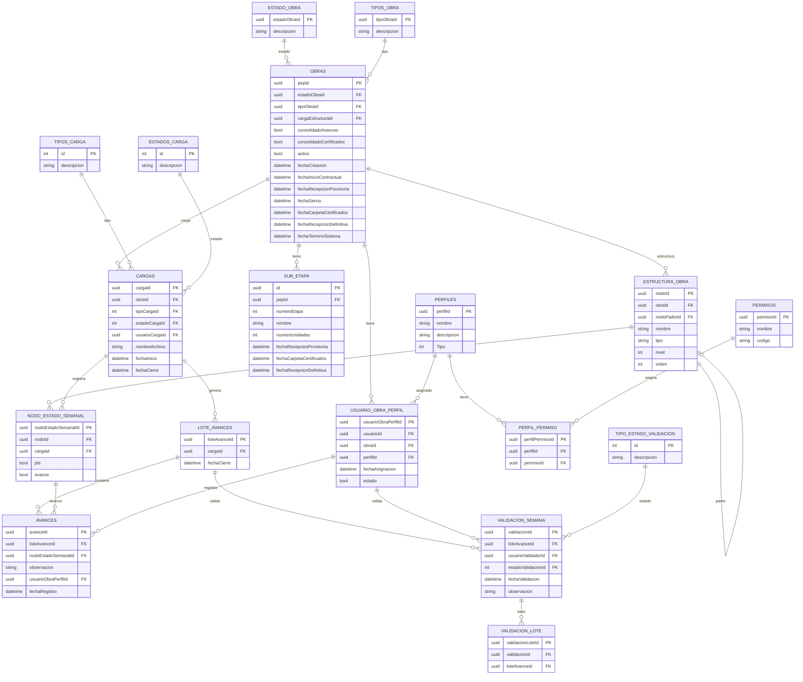

# SISTEMA SMAT

## Contexto Sistema
El sistema tiene como objetivo controlar el avance físico de obras mediante la carga y el avance de archivos realizado por los usuarios del sistema. Permite tener una gestión de los usuarios / permisos / perfiles / obras / controles de avances  y control en diferentes tipos de vistas (Gantt / PTS / Física).

## Perfiles 

| **Rol**           | **Alcance**      | **Responsabilidad Principal**                                                                                                                                                                                   |
| ----------------- | ---------------- | --------------------------------------------------------------------------------------------------------------------------------------------------------------------------------------------------------------- |
| **Administrador** | Global           | Creacion y administracion de permisos / perfiles  Creación de usuarios y administración de usuarios Creacion de obras / subetapas y administracion de estas Asignación de usuarios perfiles con obras. |
| **Analista**      | Global / Oficina | Carga de archivos semanales y Habilitar control de la visibilidad (Vista Física).                                                                                                                               |
| **Validador**     | Por Obra (1)     | Validar avances de controladores y realizar el **Cierre de Validación**.                                                                                                                                        |
| **Controlador**   | Por Obra (N)     | Registrar avances en las partidas (PTS, Gantt, Física). y realizar cierres de control                                                                                                                           |
| Gerente           | Empresa          | Visualizar controles de avances realizados y estados de la obra                                                                                                                                                 |
#  Matriz de Permisos por Rol

| Módulo      | Administrador     | Analista          | Validador           | Controlador   |
| ----------- | ----------------- | ----------------- | ------------------- | ------------- |
| Permisos    | Gestión completa  | Sin acceso        | Sin acceso          | Sin acceso    |
| Perfiles    | Gestión completa  | Sin acceso        | Sin acceso          | Sin acceso    |
| Usuarios    | Gestión completa  | Sin acceso        | Sin acceso          | Sin acceso    |
| Obras       | Gestión completa  | Visualización     | Visualización       | Visualización |
| Tipo Obra   | Gestión completa  | Sin acceso        | Sin acceso          | Sin acceso    |
| Estado Obra | Gestión completa  | Sin acceso        | Sin acceso          | Sin acceso    |
| Alertas     | Gestión           | Visualización     | Sin acceso          | Sin acceso    |
| Carga       | Crear / gestionar | Crear / gestionar | Sin acceso          | Sin acceso    |
| Control     | Visualización     | Visualización     | Avance / validación | Avance        |
| Tablero     | Visualización     | Visualización     | Visualización       | Visualización |

## Funcionalidades
Administrador 
	- Administrar Usuario (Crear - Ver - Editar - Eliminar)
	- Administrar Obras (Crear - Ver - Editar -Eliminar)	
	- Administrar Permisos (Crear - Ver - Editar  - Eliminar)
	- Administrar Perfiles (Crear - Ver - Editar - Eliminar)
	- Administrar Estado Obra / Tipo Obra (Crear - Ver - Editar  - Eliminar)
	- Administrar Regiones / Comunas (Ver)
	- Visualizar Tablero
	- Visualizar Control de avances
Analista 
	- Cargas (Realizar Cargas Semanales)
Validador (Rol Obra)
    - Control (Cerrar Control - Cerrar Validación - Dar Avances)
Controlador (Rol Obra)
	- Control (Cerrar Control - Dar avances)
Gerente 
	- Panel de Control

![[Pasted image 20260422095928.png|638]]
## Restricciones del Sistema
- Las cargas solo pueden realizarse entre jueves y jueves hasta las 08:00.
- Solo se permite cargar información hasta una semana anterior.
- Los archivos solo pueden descargarse después del cierre de validación.
- Una partida se considera terminada cuando el primer controlador la completa.
- Un Controlador no puede realizar el cierre de validación
- Usuarios con perfiles pero sin asignación a la obra no pueden realizar avances en obra.
- Por obra solo puede existir un usaurio con perfil Validador asigando

## Modulos
- Usuarios
	- Listar Usuarios
	- Editar Usuario
	- Crear Usuario
	- Asignar Rol Usuario
	- Asignar Obra Usuario
- Obras
	- Listar obras
	- Filtrar Obras por estado (Vigente - Futuro - Terminado)
	- Editar Obras
	- Crear SubEtapas
- Control de avances
	- Tipos de vistas :  En todas las vistas se le puede dar avance. depende el proceso el tipo de vista que quieres utilizar. estas vistas son tablas las cuales se presentan de diferentes maneras.
		- PTS
			- Depende de un archivo que se carga.  este te muestra el plan de la semana te muestra solamente las partidas que hay que ejecutar la semana siguiente. no te muestra todo el programa, esta agrupada por proceso. 
		- GANTT - Mas importante
			- Vista natural del proyect en tablas con items que se colapsa
		- FISICA
			 - es  parecida a la PTS. pero con diferencia que te muestra todo el programa y te señala en amarillo los procesos que son de la semana en curso. se guía por la columna PTS del xml
			-  Esta vista te muestra únicamente 3 niveles. 
				- Proceso > Actividad > Ubicación
- Control : Se visualiza los avances que se han ingresado los xml que se han cargado. Existe el caso donde el validador cierra el control. pero en caso de que todos los controladores (jefes de terreno) cierren el control se hace de manera automática el cierre validación.
	- Validadores :
		- Solo es 1. es únicamente un administrador - validador por obra.
		- No existe mas que un validador por obra.
	- Controladores :
		- Hasta 6 controladores (max que ha tocado)
	- Caso hipotético de cierre de control : 
		- Existen 3 controladores y solo 2 cerraron control.  Al validador le figurará  ` Cierre Control ` . es decir necesita la validación de todos para poder hacer el ` Cierre Validador `
-  Tipo Obra: Se visualizan los diferentes tipos de obra existentes
	- Listar Tipos de Obra
	- Crear Tipo de obra
	- Editar Tipo Obra
	- Eliminar Tipo Obra
- Estado Obra : Administrar los diferentes estados de obra
	- Listar Estado de obra
	- Crear Estado de obra
	- Editar Estado de obra
	- Eliminar Estado de obra
- Permisos : Visualizar los permisos del sitio
	- Listar Permisos y roles asignados

## Modelo ER

